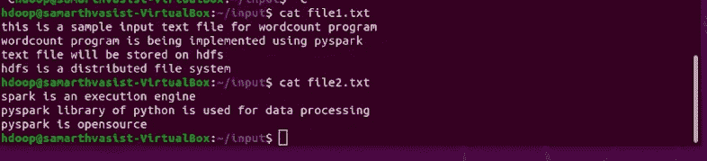
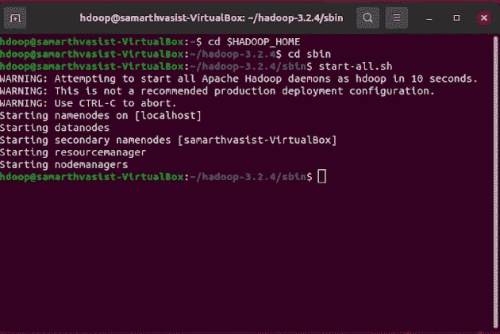
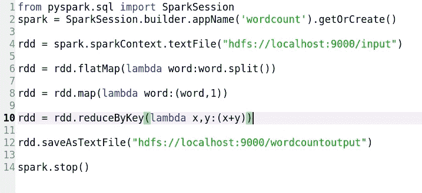
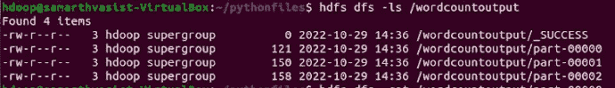
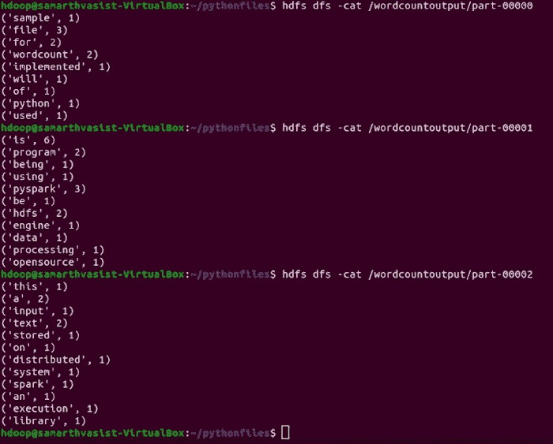
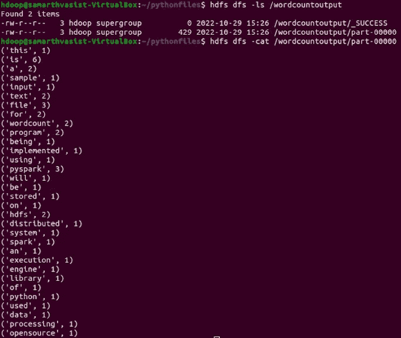
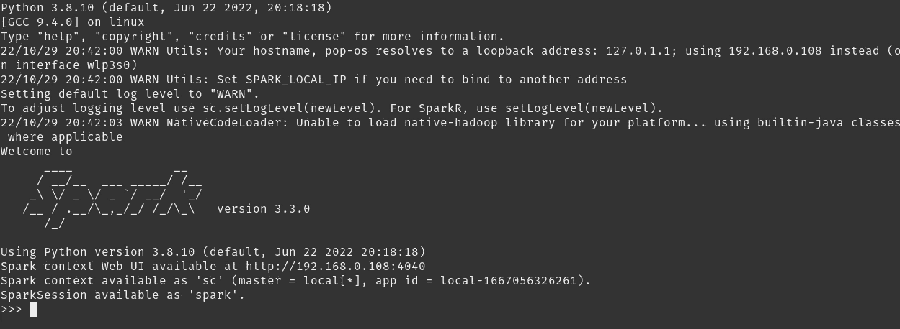

# 使用 PySpark 和 HDFS 的字数统计

> 原文：<https://blog.devgenius.io/wordcount-using-pyspark-and-hdfs-2567367beb63?source=collection_archive---------8----------------------->


## 介绍

这些年来，由于*社交媒体应用*、*在线交易*和*物联网*的*开发*，生成的*数据*的*量*和生成的*各种* *格式*出现了急剧的*增长。这种被称为“*”的*巨量**数据*使得*传统数据库系统*几乎不可能在有限的时间内处理它，从而产生了*分布式数据存储*和*实时分布式处理*。****

****Apache Hadoop*** 是一个*开源，* *分布式框架*用于*存储*和*处理*的*大数据应用*和 ***Spark*** 是一个*开源执行引擎，计算框架*用于*分布式数据处理*。 ***Pyspark*** 是与 *Apache Spark* 合作的 *python 库/API* 。*

**

*资料来源:Databricks*

## *履行*

*在本文中我们将了解如何使用 ***PySpark*** 执行一个简单的*字数* *程序*。我们将对其执行*字数统计*的*输入文件*将存储在 ***Hadoop 分布式文件系统(HDFS)上。****

*让我们对文本文件进行*预览*，我们将在这些文本文件上运行我们的*字数统计*程序。这些文本文件目前在我们的本地文件系统中。*

*文件 1.txt*

```
*this is a sample input text file for wordcount program
wordcount program is being implemented using pyspark
text file will be stored on hdfs
hdfs is a distributed file system*
```

*文件 2.txt*

```
*spark is an execution engine
pyspark library of python is used for data processing
pyspark is opensource*
```

**

*这里我们将在一个*单节点集群*上运行 ***Hadoop*** 。上面的设置包括在*虚拟箱*上设置 *ubuntu 20.04* 和*安装单节点 Hadoop 集群*。Hadoop 生态系统由 ***Hadoop 分布式文件系统(HDFS)*** 组成，它基本上是一个*分布式文件系统*。*

*格式化配置好的 HDFS 后，我们需要通过命令 *start-dfs.sh* 启动分布式文件系统，该命令启动*NameNode*和*datanode*，或者我们也可以通过执行以下命令一次启动所有 *Hadoop 守护进程*:*

```
*$ start-all.sh*
```

**

*打开 *hadoop 集群*，为了将输入文件从*本地文件系统*转移到 *Hadoop 文件系统*，我们执行命令:*

```
*$ hdfs dfs -put <path of file in local file system> <path in hdfs>*
```

**

*通过*列出 HDFS* 的文件，我们可以看到*输入文件*已经*成功插入*/输入*目录 ***Hadoop 文件系统*** 。**

```
*$ hdfs dfs -ls /input*
```

*让我们看一下 ***pyspark*** 为 *wordcount* 程序逐行处理文件的代码。*

```
*spark = SparkSession.builder.appName('wordcount').getOrCreate()*
```

*作为 *PySpark 应用程序*的*入口点*的 ***SparkSession*** 是使用*构建器设计模式*创建的，该模式又具有一个***spark context***(spark 功能的入口点)，它代表了到 *spark 集群*的*连接*。*

*接下来我们使用 *SparkContext 对象*的 *textFile()* 函数从*数据源*中*读取*数据*。它可以是一个*本地文件系统*、 *HDFS* (就像在我们的例子中一样)、*亚马逊 s3* 或任何*数据存储*。**

```
*rdd = spark.sparkContext.textFile("hdfs://localhost:9000/input")*
```

*从文本文件加载的数据将以***【RDD】(弹性分布式数据集)*** 的形式存在。因为我们需要每一行的所有单词，所以我们使用了一个*平面映射转换*，它在一个 RDD 中按照空格分割每个记录，最后*将*展平成一个*单个列表*。*

> *RDD 代表弹性分布式数据集，是跨集群中的节点分区的数据元素的分布式集合。它们用于执行内存中的计算。它们是不可变的，即一旦创建就不能改变，但是可以对它们执行不同的操作，例如转换和动作。*

```
*rdd = rdd.flatMap(lambda word:word.split())*
```

*接下来我们使用*映射转换*，我们将*每个单词*映射到它的*出现处*。这导致了 ***对的创建，其中*键*是*字*，而*值*是*出现(整数 1)* 。****

```
*rdd = rdd.map(lambda word:(word,1))*
```

*最后，我们使用*关联归约函数*对*值*进行到*的* *值*组合，在我们的例子中，关联归约函数对具有*相同关键字*的*值*应用*求和函数*。*

```
*rdd = rdd.reduceByKey(lambda x,y:(x+y))*
```

*接下来，我们将*结果 RDD* 保存到*目的地*。这里的目的地可以是一个*本地文件系统*、 *HDFS* (在我们的例子中是/word count out 目录)、 *Amazon s3* 或任何*数据存储。**

```
*rdd.saveAsTextFile("hdfs://localhost:9000/wordcountoutput")*
```

*接下来，我们使用命令停止*火花会话**

```
*spark.stop()*
```

*包括以上所有步骤，让我们最后看一下我们的 wordcount.py*

**

*为了*执行*我们的 *python 脚本*，我们运行命令*

```
*$ spark-submit wordcount.py*
```

*当*成功执行*火花任务*的*后，我们可以在我们的*输出目录*中找到*结果*。我们可以观察到有 3 个*输出文件*，基本上取决于映射器/缩减器任务的*数量，而映射器/缩减器任务*又取决于*RDD*的*分区*数量。每个任务在单个分区上运行，如果没有明确指定，RDD 的分区数量取决于底层的*默认并行级别*。*

****

*我们还可以通过在我们的***reduceByKey()****转换*中显式地提及***num partitions***来配置输出，使其呈现在一个文件中。如果未指定，输出将使用*默认并行度进行分区。**

```
*#rdd=rdd.reduceByKey(function,number of partitions)
rdd=rdd.reduceByKey(lambda x,y:(x+y),1)*
```

**

*由于我们已经在 reduceByKey()转换中将 numPartitions 指定为 1，我们可以观察到*最终输出*出现在*单个文件*中。*

## *结论*

****Spark*** 还为我们提供了一个与 *python* 交互的*shell*称为 ***Pyspark shell*** 可以直接从*命令行*启动，与默认的 *SparkContext* 作为 *sc* 和 *SparkSession* 作为*进行交互**

**

*Pyspark 外壳*

*所以现在我们知道如何使用 *PySpark 来统计独特单词的*出现次数*。*这是一个简单的程序，供初学者了解 ***Spark*** 和 ***Hadoop*** 的基础知识，作为进入 ***数据工程的*踏脚石！！*****