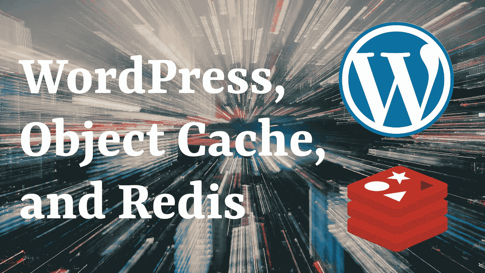
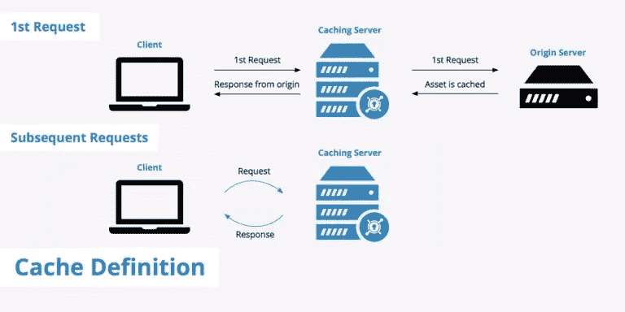
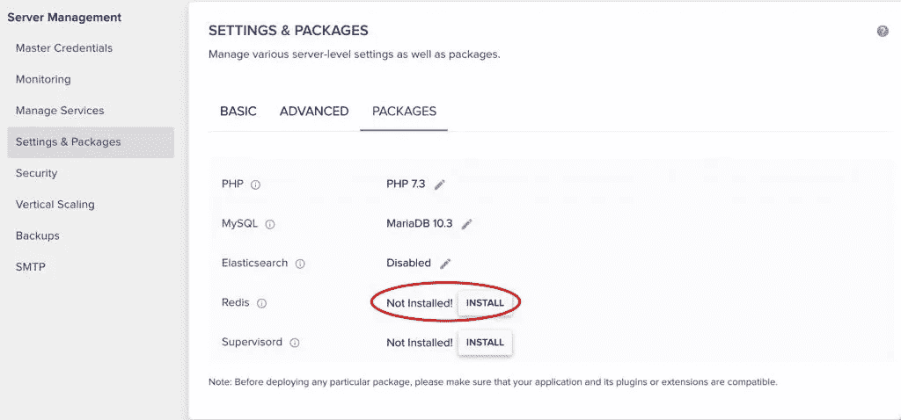
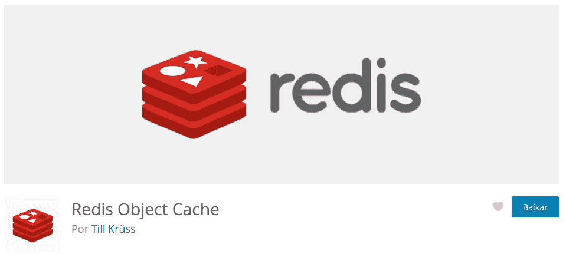

# WordPress、对象缓存和 Redis

> 原文：<https://blog.devgenius.io/wordpress-object-cache-and-redis-f5d665f01115?source=collection_archive---------12----------------------->

你想在提升你的 WP 编程技能的同时让你的 WordPress 网站更快吗？对象缓存可能是你的答案！



在[什么是 API](https://felipeelia.dev/what-is-an-api/) 的帖子中，我简要提到了 WordPress 对象缓存以及我如何在博客中使用 Redis。在这篇文章中，我们将对这两个问题进行更深入的探讨。

# 在我们进入对象缓存之前…什么是缓存？

在我们开始讨论 Redis 之前，我们需要讨论一下对象缓存。在我们谈论对象缓存之前——您已经看到了它的到来——我们需要从总体上谈论缓存。

在互联网上寻找什么是缓存的定义，常识似乎是这样的:

> *缓存是一个具有快速访问* *的* ***中间存储，放置在消费者和主存储之间，潜在地节省了更长的行程。***

看看下面的例子。在第一个请求中，我们一直通过原始服务器，但是服务器缓存保存了响应的副本。在第二个请求中，提供副本，**通过不去原始服务器**来节省时间。



图片致谢:[key dn 博客](https://www.keycdn.com/support/cache-definition-explanation)。

考虑到这一点，我们可以开始考虑访问一个网站所需的所有几次旅行，以及我们可以插入以节省时间的所有中间步骤:

**浏览器缓存:**在你的浏览器和站点服务器之间，如果你的电脑上有**页面的有效副本**，我们就省了一趟。事实上，在这种情况下，我们节省了整个行程。

**CDN:** 如果你在网站上使用 Cloudflare 之类的 CDN，并且**CDN**中有内容的有效副本，就没有理由要求新的副本。只发送副本就足够了，我们省去了一趟。

**WP 的缓存:**在你的 WordPress 网站中，如果一篇文章已经从数据库中带来，并且**如果这篇文章在内存中的版本仍然有效**，为什么还要再去数据库？

还有许多其他中间位置，我们可以保存信息的版本，这些只是一些例子。

# WordPress 对象缓存

> WordPress 对象缓存*很简单，理解它的工作原理会在你下一次工作面试中产生影响；——)*

正如我在[什么是 API](https://felipeelia.dev/what-is-an-api/) 一文中所说，内存访问总是比磁盘访问快。记住这一点，**如果我们从数据库中取出一个帖子，并把它放在内存中，我们就不需要再去数据库取回它了**。


问题是，在 WordPress 的默认实现中，**只会在请求**结束之前一直在内存中。如果用户刷新页面，我们将需要再次访问数据库。

MySQL 足够智能，可以注意到最近是否有信息被请求，并以更快的方式使其可用(基本上是将其存储在自己的内存部分)。**虽然更快，但不会像完全不上 MySQL 那么快。**

默认情况下，在执行开始时请求的这个 post(或任何其他信息)是使用一个名为[**WP _ Object _ Cache**](https://developer.wordpress.org/reference/classes/wp_object_cache)的类**存储的。它的主要目标是节省到数据库的行程，它基本上使用键-值对工作。问题是，就像我说的，只有一个要求。下一次，我们必须从头再来。**

# 如何在内存中“储存”东西？Redis 或 Memcached

**像**[**Redis**](https://redis.io/)**或者**[**Memcached**](https://memcached.org/)**这样的软件都是内存数据库。他们能做的不止这些——尤其是 Redis——但是对于 WordPress 的问题，它的密钥对值内存存储是我们所需要的一切。**

在这篇文章中，我将使用 Redis 作为例子，但是 Memcached 的安装和使用非常相似。

# 在 Redis 中使用 WordPress 对象缓存需要什么？

在 Redis 中使用 WordPress 对象缓存的要求非常简单:

*   WordPress 网站
*   Redis 在您的基础架构中运行
*   一个连接 WP 和 Redis 的插件

完成第二步的最好方法是联系你的主机提供商。例如，在 Cloudways 上，你需要点击仪表板上的一个按钮来安装 Redis。



# Redis 对象缓存插件

正如我在另一篇文章中所说，我使用的插件是 [Redis 对象缓存](https://wordpress.org/plugins/redis-cache/)。安装和配置它并不难。开箱即用，它将尝试使用 Redis 数据库号`0`在端口`6379`上连接到同一服务器(`127.0.0.1`)中的 Redis 实例。



为了让插件工作，它需要把它的`object-cache.php`文件从它自己的 *includes* 文件夹复制到你的 WordPress 安装的 *wp-content* 文件夹。如果由于目录权限等原因，无法自动复制文件，则需要手动复制。

# 同一服务器上不同站点的相同 Redis

我有另一个博客运行在同一台服务器上，共享相同的 Redis 安装。为了避免每个站点存储信息之间的冲突，我必须在一个站点上定义`define( 'WP_REDIS_DATABASE', 0 );`,在另一个站点上定义`define( 'WP_REDIS_DATABASE', 1 );`。

为了调整配置，你需要在你的*wp-config.php*文件中放置一些常量。设置的完整列表可在[插件 wiki](https://github.com/rhubarbgroup/redis-cache/wiki/Connection-Parameters) 上获得。

# 对象缓存插件如何工作

在 WordPress 加载流开始时执行的[wp _ start _ object _ cache()](https://developer.wordpress.org/reference/functions/wp_start_object_cache/)函数内部(见下)，WP 会检测是否有`object-cache.php`插件。如果该文件可用，则加载该文件，否则使用默认实现。之后，缓存被启动。

```
function wp_start_object_cache() {
	...
		if ( file_exists( WP_CONTENT_DIR . '/object-cache.php' ) ) {
			**require_once WP_CONTENT_DIR . '/object-cache.php';**
			...
		}
	... 	**// If there is no external cache, loads WP's.**
	if ( ! wp_using_ext_object_cache() ) {
		require_once ABSPATH . WPINC . '/cache.php';
 	}

	require_once ABSPATH . WPINC . '/cache-compat.php';

	...
	**wp_cache_init();**
	...
}
```

*Redis 对象缓存*的`object-cache.php`内容可以在这里看到[。它由`WP_Object_Cache`类(文件的最后一部分)和几个使用它的函数(如`wp_cache_add`、`wp_cache_get`和`wp_cache_delete`)的实现构成。](https://plugins.trac.wordpress.org/browser/redis-cache/trunk/includes/object-cache.php)


# 让我们来看看一些代码

如果你需要一些代码来更好地理解事情，那没关系，我也是其中之一。下面是你在 WordPress 6.0.1 中调用`get_post( 123 );`时执行的一部分代码。

代码从 [wp-includes/post.php](https://github.com/WordPress/WordPress/blob/6.0.1/wp-includes/post.php#L990) 开始，其中 get_post 调用`WP_Post::get_instance( $post )`。

然后，在[WP-includes/class-WP-post . PHP](https://github.com/WordPress/WordPress/blob/6.0.1/wp-includes/class-wp-post.php#L231)中:

```
final class WP_Post {
	...
	public static function get_instance( $post_id ) {
		**$_post = wp_cache_get( $post_id, 'posts' );** if ( ! $_post ) {
			...
			**wp_cache_add( $_post->ID, $_post, 'posts' );**
		} 
		...
	}
}
```

首先，它检查缓存的值是否存在(`wp_cache_get`)。如果它存在，就使用它，否则，获取帖子，然后缓存(`wp_cache_add`)。

如果我们看一下`wp_cache_add`函数代码，我们可以看到它只不过是存储在全局变量`$wp_object_cache`中的`WP_Object_Cache`实例的`add`方法的简单包装。

```
function wp_cache_add( $key, $data, $group = '', $expire = 0 ) {
    global $wp_object_cache;

    return $wp_object_cache->add( $key, $data, $group, (int) $expire );
}
```

# WordPress 中可用的缓存功能

官方文档列出了一些最重要的缓存函数，我在这里抄录下来。WordPress 的核心本身在几个地方使用它们，但是你也可以在你的主题或者插件中调用它们。

```
wp_cache_add( $key, $data, $group = '', $expire = 0 ) // If exists, do not overwrite
wp_cache_set( $key, $data, $group = '', $expire = 0 ) // If exists, overwrite
wp_cache_replace( $key, $data, $group, $expire ) // If does not exist, do nothing
wp_cache_get( $key, $group = '', $force = false, $found = null )
wp_cache_delete( $key, $group = '' )
wp_cache_flush()
```

# 密钥、值、组和到期

大多数`wp_cache_*`功能使用四个参数:

*   **关键字:**存储在缓存中的对象的标识符。例如，文章 ID。
*   **值:**缓存中存储的对象。在我们的例子中，邮报。
*   **分组(可选):**可以对值进行分组。以前，它只是用来整理东西，但在 WordPress 6.1 中，将有一个新的[功能](https://core.trac.wordpress.org/ticket/4476) `[wp_cache_flush_group](https://core.trac.wordpress.org/ticket/4476)` [来刷新某个组的所有对象。例如，你可以删除某个插件的密钥。](https://core.trac.wordpress.org/ticket/4476)
*   **Expiration(可选):**缓存的值在多长时间内有效。现在让我们仔细看看。

# 呼气

当我们谈论缓存时，最重要的概念之一是过期。我们掌握的信息仍然有效吗？这是任何缓存实现的关键部分，包括 WordPress 对象缓存。

那么，我们如何决定一个缓存的对象在多长时间内应该被认为是有效的呢？

## 事件驱动的

假设您正在缓存最大内容的帖子列表。你得到所有的文章，在所有的文章中应用`the_content`过滤器，并检查它们有多少字符。相当密集，对吧？这值得缓存。

什么可以改变这个过程的结果？只有在文章被创建、删除或编辑的情况下，对吗？

在这种情况下，我们的缓存不需要过期。**使用一个相关的** [**钩子**](https://felipeelia.com.br/o-que-sao-hooks/) 就足以使结果无效。

## 时间驱动的

如果你缓存的东西来自于外部，比如 API，**使缓存无效的事件不在我们的控制之下**。在这种情况下，我们需要**不时地在外部 API 中**检查结果，并更新我们已经存储的值。

# 瞬态 API 和对象缓存

如果你读过这篇文章或者看过 YouTube 上关于 [WordPress Transients API](https://felipeelia.com.br/cache-facil-no-wordpress-transients-api/) 的视频，这里的中心思想并不新鲜:**避免长时间过程的键值对是这两件事情背后的基本思想**。其实从某个方面来说，确实是一回事。看看`get_transient`函数的实现:

```
function get_transient( $transient ) {
    if ( wp_using_ext_object_cache() || wp_installing() ) {
        $value = **wp_cache_get( $transient, 'transient' )**;
    } else {
		...
    }
	...
}
```

基本上，如果您使用外部机制进行对象缓存，瞬态将存储在那里。否则，将使用常规数据库。有趣吧。一定要检查内容！