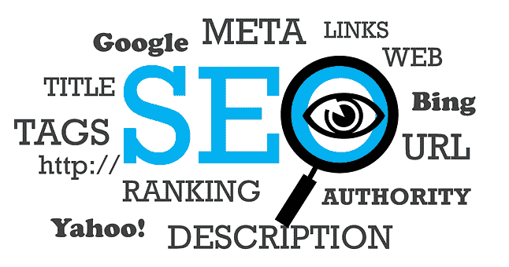

# WordPress SEO 清单:提高排名的 7 个制胜策略

> 原文：<https://blog.devgenius.io/wordpress-seo-checklist-7-winning-strategies-to-improve-your-rankings-d1957b5f3f42?source=collection_archive---------4----------------------->

Souvik Banerjee 在 [Unsplash](https://unsplash.com?utm_source=medium&utm_medium=referral) 上拍摄的照片

WordPress 是一个非常受欢迎的平台，[目前拥有全世界超过 39%的网站](https://kinsta.com/blog/wordpress-statistics/)。它有一个用户友好的界面，所以你不需要成为专家来使用它。您有许多定制选项，允许更大的灵活性。开源社区是信息和更新的重要资源。

精明的营销人员也使用一些内置的搜索引擎优化功能来提高排名。但是，推广最佳 SEO 实践的责任仍然在营销人员身上。它有助于提高知名度，从而提高知名度。你必须有正确的策略。否则，即使有了 WordPress，你的排名还是会很差。

我们将提供一个 WordPress SEO 清单，看看 7 个获胜策略，以帮助提高排名。让我们深入研究一下。

## 1.选择合适的网络主机提供商

你选择的虚拟主机提供商将决定你的网站运行的好坏。市场上有许多低成本的托管服务可供选择。然而，把寻找最好的视为一种投资。您需要注意的一些关键因素包括:

*   正常运行时间和可靠性——您不能因为任何原因让您的网站停机。网络主机提供商必须至少承诺 99.9%的正常运行时间。此外，寻找那些提供某种形式的补偿或报销任何停机时间。
*   充足的存储和带宽将决定网站处理高流量的能力。当运行促销时，您可能会有流量激增。如果带宽和存储空间不足，页面加载速度将会降低。糟糕的用户体验会让你失去客户。
*   web 主机提供商还必须灵活，并允许可伸缩性。
*   检查提供商是否有 24/7 的客户支持。你应该能够在白天或晚上的任何时候解决你的网站上的任何问题。

## 2.投资一个好的网站设计

高度重视网站设计。看下面的[统计。](https://www.sweor.com/firstimpressions)

*   如果布局和内容没有吸引力，88%的观众会离开。
*   如果用户体验很差，98%的人不太可能回来。
*   如果页面加载速度慢，39%的人会离开。
*   75%会根据网站设计来决定你的可信度

我们建议投资雇佣一名网页设计师。它有助于确保架构或结构对用户和网络爬虫来说很容易。它们将包括像网站地图这样的元素，帮助搜索机器人建立索引。

[移动优化对 SEO 也很关键](https://www.mooveagency.com/wordpress/preparing-website-for-mobile-seo/)。设计师将确保用户在移动设备上拥有与在桌面设备上相同的奇妙体验。如果手机上的设计很差，高达 57%的互联网用户不会推荐你的企业。

## 3.注意分析

跟踪 WordPress 网站上发生的事情是很重要的。分析提供了跟踪和监控网站性能的最佳方式。你得到了关于你的观众如何行为或如何与内容互动的信息。WordPress 有一个内置的分析系统，但是你也可以使用谷歌分析。

[合适的插件](https://www.mooveagency.com/wordpress/user-activity-tracking-plugin/)还能给你网站访问者的相关信息，不管他们是否在线。拥有这样的数据是至关重要的，因为它允许你纠正或改进你正在做的事情。

## 4.留意竞争对手

密切关注竞争对手的动向是标准做法。在这样做的时候，你必须看看你和你的竞争对手正在做的相似的策略。分析*他们做对了什么*使得他们保持目前的排名。

还有，看他们做的方法。你不一定需要复制他们的策略。相反，看看为什么这些对他们有用，你应该发现对你有用的策略。

这里是如何去做。

*   使用与行业相关的关键词来查看你的竞争对手的排名。对于那些职位比你高的人，注意他们正在做的事情，因为他们正在工作。
*   关注标题、单词长度、产品描述符或任何其他可能影响 SEO 的东西。有了这些信息，你就有机会提高你的技术。

## 5.你的 WordPress 主题必须是 SEO 友好的

SEO 对于在搜索引擎上获得好的排名很重要。你可能想把默认的 WordPress 主题改成一个 SEO 友好的主题。WordPress 有[吨的插件](https://blog.hubspot.com/website/best-wordpress-seo-plugins)可以用来提升你的 SEO。请考虑以下事项。

*   避免有太多脚本或不必要插件的主题。你可能会减慢你的网站，这会影响你的排名。
*   利用 web.dev 等在线工具来测试你喜欢的主题对搜索引擎优化的友好程度。
*   你有免费和付费两种选择。其中包括 Yoast、Google XML Sitemaps、SEO ultimate 和 Rank math。插件的好处是你可以访问功能，使你的工作变得更加容易。

既然已经存在，为什么还要重新发明轮子呢？WordPress 有相关的插件和扩展来指导你。因此，请充分利用该平台所提供的优势。

## 6.确保正确内容的可见性

从检查你的[网站对搜索引擎的可见性](https://www.wordstream.com/blog/ws/2020/11/17/website-visibility)开始。你可能会在你不知情的情况下阻止他们索引你的网站。通过转到以下位置检查您是否可见

*设置>阅读>搜索引擎可见性。*确保方框内没有打勾。

另一个关键因素是拥有正确的内容。在构思内容时，请使用以下提示。

*   从了解你的听众开始
*   确保内容是相关的，并响应确定的需求。研究您的回答以确保准确性
*   制作引人入胜、发人深省的内容
*   使用项目符号和标题使其可浏览

现在，利用搜索引擎优化策略，如链接建设。注意你链接的网站的类型。如果你不知道如何做好，你可以寻求专家的帮助来处理这项工作，如 [blogger outreach services](https://www.linkdoctor.io/blogger-outreach-services/) 他们可以为你提供高质量的链接，因为糟糕的链接会给你带来麻烦。

## 7.改进你的其他搜索引擎优化技术

[来源](https://pixabay.com/illustrations/search/seo/)

SEO 将永远是拥有和维护网站的一部分。如果你不优化你的网站，其他网站的排名会一直领先于你。注意搜索引擎优化技术，例如:

*   根据你的品牌进行相关的关键词研究
*   在 URL、标题、元描述和产品描述符中包含关键字
*   有吸引人的标题、页眉和元描述。
*   优化图像文件名，并使用替代文本(alt-text)进行描述。如果您的图像没有加载，替代文本仍然会出现。
*   自定义您的 URL，这样您就不会使用默认的 URL。它允许你有策略地包含相关的关键词。
*   在你的 URL 中启用 WordPress 永久链接，这样你就可以使用描述性的文字。它让你的 WordPress 站点更容易被网络爬虫看到。
*   使用内部链接来帮助导航。它还有助于建立不同页面之间的相关性。

# 最后的想法

WordPress 是一个优秀的 SEO 平台。然而，它确实需要你在利用它的功能时扮演更积极的角色。我们的 WordPress SEO 清单:提高排名的 9 个成功策略将会让你走上正确的道路。