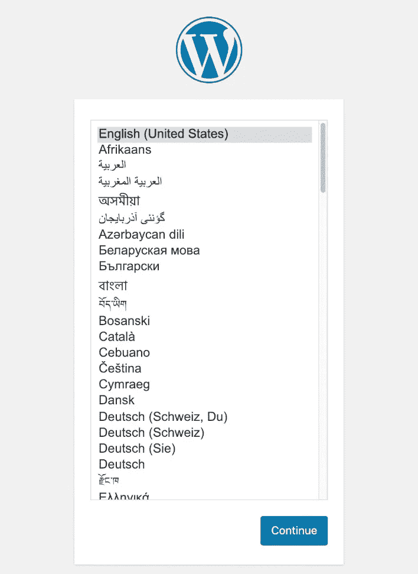

# 12 岁以下的€网站

> 原文：<https://blog.devgenius.io/wordpress-site-under-12-year-with-docker-2628fcb51e79?source=collection_archive---------3----------------------->


马库斯·温克勒在 [Unsplash](https://unsplash.com?utm_source=medium&utm_medium=referral) 上的照片

要用 WordPress 创建一个站点，你通常需要依赖一个服务，它会给你一个完整的 domino 包。这种解决方案通常每年花费超过 50€。最常见的是从第二年开始价格上涨。

在这篇文章中，我将向你展示如何使用免费的虚拟机来托管你的 WordPress 站点，只需支付域名(12€)，这样你就节省了一大笔钱。

首先，如果你没有域名，你需要购买一个域名。我用 https://domains.google.com 的[购买域名。](https://domains.google.com)

买了域名之后，你需要在 google cloud 或者 oracle cloud 或者别的什么上面创建一个虚拟机。我推荐这两种服务中的一种，因为基本虚拟机是免费的。

使用 google cloud，标准的免费虚拟机只有 600 MB 内存、一个共享内核和 30GB 内存。另一方面，如果您使用 Oracle Cloud，则有 1 GB 的内存、两个内核和 50 GB 内存。

关于 Oracle 云的所有信息都在此处，您可以注册并创建一个虚拟机(免费层)。

如果你想使用谷歌云，你可以看看这个[指南](https://medium.com/@hbmy289/how-to-set-up-a-free-micro-vps-on-google-cloud-platform-bddee893ac09)。

就我个人而言，我使用 Ubuntu 作为虚拟机的操作系统。

如果使用 oracle cloud，则必须打开端口 443 和 80([https://Oracle-base . com/articles/VM/Oracle-cloud-infra structure-OCI-amend-firewall-rules](https://oracle-base.com/articles/vm/oracle-cloud-infrastructure-oci-amend-firewall-rules))。

## 现在经过初步设置后，我们在 Docker 上设置了 WordPress，带有 phpMyAdmin、SSL(通过 Traefik)和自动更新。

*   Docker，一种强大的标准化应用部署方式
*   来自 Let's Encrypt 的免费 SSL 证书(通过 Traefik)
*   phpMyAdmin 轻松管理您的数据库
*   自动容器更新(通过瞭望塔)

在 ssh 中连接到虚拟机并更新虚拟机后:

```
sudo apt update
sudo apt upgrade
sudo reboot
```

在您更新虚拟机之后，我建议使用以下命令添加一个交换文件(因为我们没有太多的 RAM，这样在我们用完 RAM 的情况下会使用部分硬盘):

```
sudo fallocate -l 4G /swapfile
sudo chmod 600 /swapfile
sudo mkswap /swapfile
sudo swapon /swapfile
```

现在我们使交换文件持久化，所以您必须在这个文件中添加这个字符串" **/swapfile none swap sw 0 0** ":

```
sudo nano /etc/fstab
```

重新启动虚拟机以保持持久性:

```
sudo reboot
```

安装 Docker:

```
curl [https://get.docker.com](https://get.docker.com/) > install-docker.sh
chmod +x install-docker.sh
./install-docker.sh
```

你必须有代理权限，因为如果你不这样做，你必须运行 Docker 与 sudo:

```
sudo usermod -aG docker your_user
```

安装 Docker compose，你可以使用这个指南为 Linux([https://docs.docker.com/compose/install/](https://docs.docker.com/compose/install/))

如果用 ARM 基的机器(【https://github.com/docker/compose/issues/6831】T2

```
# for ARM Machine
git clone https://github.com/BytemarkHosting/docker-smtp.git

cd docker-smtp/stretch
docker build -t bytemark/smtp .
```

现在我们可以为你的站点配置 WordPress 和其他容器了。

首先，您必须克隆这个存储库:

[](https://github.com/pietrocolombo/wordpress-docker) [## pietrocolombo/wordpress-docker

### Docker，一个强大的标准化方法来部署应用程序免费的 SSL 证书从让我们加密(通过 Traefik)…

github.com](https://github.com/pietrocolombo/wordpress-docker) 

```
git clone [https://github.com/pietrocolombo/wordpress-docker.git](https://github.com/pietrocolombo/wordpress-docker.git)cd wordpress-docker
```

Traefik 需要一个文件来存储 SSL 密钥和证书，因此运行以下命令:

```
touch acme.json
chmod 0600 acme.json
```

现在你必须编辑。env 文件并添加所有信息(BASIC_AUTH，ACME_EMAIL，TRAEFIK_DOMAINS，WORDPRESS_DOMAINS，WORDPRESS_DB_ROOT_PASSWORD，WORDPRESS_DB_PASSWORD)。

```
nano .env
```

现在，您需要为您的域提供虚拟机的 IP 地址:

要运行您的新站点，您可以运行以下命令:

```
docker-compose up -d
```

现在如果你去 [https://Your-Domain](https://Your-Domain) 你可以配置 WordPress:



*作者图片*

如果您需要停止集装箱:

```
docker-compose down
```

要解决插件安装需要 ftp 访问的问题，请执行以下操作:

```
sudo chown -R www-data  /var/lib/docker/volumes/[wordpress-docker](https://github.com/pietrocolombo/wordpress-docker)_vol-wp-content/
```

这样，你唯一的成本就是域名的成本。而且，比起许多导游来，HTTPS 身边允许**的**协议。

我希望我的文章对你有用，如果你有任何问题，请写在评论里。

感谢阅读！

为了获得无限的故事，你也可以考虑只花 5 美元注册成为媒体会员。如果你用我的 [*链接*](https://pietrocolombo.medium.com/membership) *注册，我会收到一小笔佣金。*