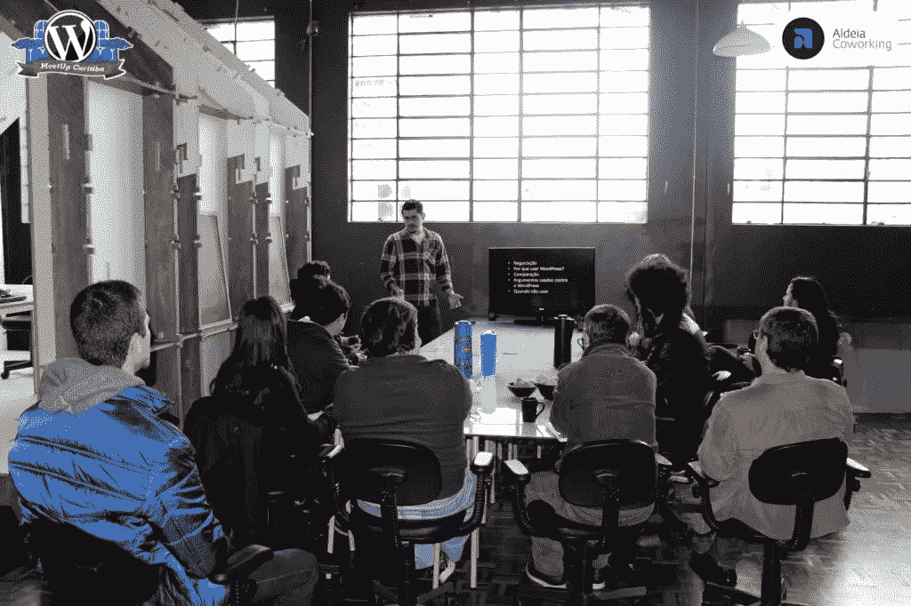

# “大写 p 的 WordPress”有关系吗？

> 原文：<https://blog.devgenius.io/wordpress-with-capital-p-does-it-matter-eb2fd8297e85?source=collection_archive---------10----------------------->

如果你想在 WordPress 生态系统中找份工作，或者经营一家专门从事 WP 的公司，一封信能有所不同吗？简单的回答是肯定的，这个字母可以帮助(或不帮助)显示知识和对细节的关注。

> ***找 WordPress 相关的工作？*** *检查你的简历，确保你的 WordPress 拼写正确。*

# 为什么会有所不同？

不同的社区对他们的特性有不同程度的关注。对于 WordPress 社区来说，名字拼写的重要性有时似乎不相称。

反正事实是 ***WordPress* 才是唯一正确的写法**。所有其他的都是错误的，尽管在大多数情况下被忽视，但在招聘过程中，这可能表明缺乏知识或注意力。

这到底有多大影响，差别很大。它可能是必不可少的，可能是决定性的，也可能根本不重要。尽管如此，如果你知道正确的写法，使用它总是更好。

# 那不是太多了吗？

有可能。事实是，有一个正确的方法，WordPress core 甚至有一个功能来做出改变。功能描述可以让你了解一些人认为 WordPress 名字拼写有多重要:

> *从这个星球上永远消灭“Wordpress”(或者至少是我们能影响的一点点)。*

很严重，对吧？

# 一个专家永远不会写 Word press 或者 Wordpress

声称自己是 WordPress 专家的人或公司应该已经发现了这些信息。综上所述，以下是最重要的几点:

*   写对了不会让任何人成为专家
*   写错了确实会让人不那么专业；
*   有些人写错了，他们比写对的人更了解 WP；
*   在 slack 消息之类的非正式交流中，写 w *或 press* (全小写)、 *wp、*或 *WP* 都是可以的。*按字*和*按字*是比较明显的错误。

第一印象很重要，在某些场合，我们需要确保有人知道或不知道 WordPress。如果写对了不能给出完全的确定性，写错了当然也没有帮助。

最后，想象这个卷积:

嘿，你喜欢电子游戏吗？你最喜欢哪些角色？我喜欢它！我喜欢绿色的塞尔达，绿色的马里奥，黄色的零度以下！哦，你是说林克、路易吉和蝎子，对吗？耶，耶！

这是否意味着这个人是一个糟糕的玩家？绝对不行！不过，这确实意味着他们不太了解这个话题。

# 我第一次接触这个

我想告诉你我是如何第一次被告知这种差异的:

> 【2016 年 5 月在库里蒂巴这里与 WordPress 社区见面后， [*我问我是否能在下个月做一个讲座*](https://www.meetup.com/pt-BR/wpcuritiba/events/231889574/) *。当我发送我的幻灯片时，* [*丹尼尔·科斯曼*](https://danielkossmann.com/) *要求修改:WordPress 有一个大写的 P.*

那时我已经使用 WP 很多年了，但是和社区没有任何联系。那天之后，我再也没写错过。

那次谈话的照片！🙂

事实上，**对于** [**任何在 WordCamps**](https://make.wordpress.org/community/handbook/wordcamp-organizer/planning-details/speakers/speaking-at-a-wordcamp/#preparing-your-talk) **的谈话，WordPress docs 都要求使用大写的 P**。显然，这条规则也适用于聚会或任何官方的社区活动。

# 写 Wordpress 可以表明“仅仅”缺乏关注

我想写一篇关于*软技能*和个人特征的帖子，这些不一定与技术相关，但有一点是肯定的:没有人喜欢不注意的人。

也就是说，**总是回顾并小心你的简历和官方交流。**

# 我是客户，或者我有工作要提供。这有多重要？

可以想象，这要看情况。如果你有别人的推荐信，那应该比名字中的一个字母更重要。如果这家公司或这个人对你来说是完全陌生的，那可能表明他们对 WordPress 的了解不是很好。

如果那是一个领导角色或者对你的公司很重要的东西，我建议你去看看其他的竞争对手。如果这个细节没有被注意到，其他东西也可能被注意到。

# 好吧，接下来是什么？

既然你知道了，那就把话传出去。不要评判那些还没有看到这个细节的人，而是解释这可以产生影响。不过要友善，没有人有义务知道这件事:)

缩略图是使用[https://www.thewordfinder.com/simpsons-chalkboard/](https://www.thewordfinder.com/simpsons-chalkboard/)制作的