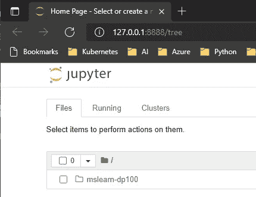
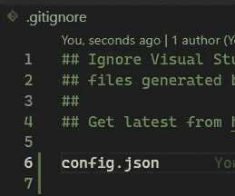

# 从 docker 图像使用 Azure 机器学习在本地工作

> 原文：<https://blog.devgenius.io/work-locally-with-azure-machine-learning-from-docker-image-2c2e6884a3e8?source=collection_archive---------6----------------------->

当您使用 Azure 机器学习时，您不需要使用 Azure 机器学习门户。由于 Azure 机器学习库支持通过官方库与您的工作区连接，您可以受益于容器来创建整个开发容器，以开发您的代码并将其部署到 Azure 机器学习服务中。

我将使用官方实验室进行 [DP-100](https://docs.microsoft.com/en-us/learn/certifications/exams/dp-100) 考试(*DP-100:在 Azure* 上设计和实现数据科学解决方案)。如果你正在准备这次考试，你可以做的最好的事情之一就是在本地工作，玩一个混合的 *onprem/cloud* 策略。这不仅会对你准备考试有很大帮助，也会帮助你为现实世界做准备:)

在这篇文章中，我将介绍如何部署 [mslearn-dp100](https://github.com/MicrosoftLearning/mslearn-dp100) 资源库，以及如何在笔记本电脑的容器中使用 AzureML。

# 派生官方的 DP-100 git 存储库(可选)

因为我们将使用 git 子模块来跟踪官方的 dp-100 库，所以你真的不需要把它放到你自己的 GitHub 账户上。那为什么呢？因为将子模块从主存储库中分离出来将有助于避免破坏主存储库的变更。

> 公开克隆 [mslearn-dp100](https://github.com/MicrosoftLearning/mslearn-dp100) 以避免在您这边中断更改


# 创建自己的 git 存储库

现在是准备回购的时候了。就我个人而言，我总是喜欢在正式的库名后面加上“ *-practice* ”后缀，但这取决于您。


您可以将此回购设为私有，因为我们将使用指向正式回购的子模块

现在是时候将新的回购克隆到您自己的机器上了。


# 为分叉的 mslearn-dp-100 创建一个子模块

既然我们想和官方实验室一起玩和学习，我们当然会修改和破坏一些东西。隔离我们的更改并且仍然能够添加我们自己的工件的最好方法之一是从我们的 fork 中获得一个*子模块* **。这样，我们将能够删除/创建/修改文件，并且仍然能够从官方存储库中推送更改并获得最新版本(如果需要的话)**

为此，您可以简单地调用`git submodule`命令:

```
*git submodule add* [*https://github.com/enriquecatala/mslearn-dp100*](https://github.com/enriquecatala/mslearn-dp100) *mslearn-dp100*
```

这样做之后，你会发现文件夹 **mslearn-dp100** 已经添加到你的项目中，里面有你分叉的官方回购的内容。


mslearn-dp100 现在是存储库中的一个子模块

提交时间:)

此时，您将在一个文件夹中拥有一个到分叉的 mslearn-dp100 存储库的链接。


存储库中的 mslearn-dp100

很好，但是…为什么？嗯，这样做有一个很好的理由…不仅是为了分离主存储库，也是为了分离我们的 docker 映像:)

# 创建容器以使用 AzureML

容器是你必须知道的一个非常强大的资源。如果你不知道什么是容器以及如何使用/部署它们，请学习并努力掌握这项技术，以便成为你应该成为的专业人士。

> 注意:不管你在计算机方面走的是哪条路(工程、科学……)，去掌握[容器](https://www.docker.com/resources/what-container)

现在，我们将创建一个 docker 映像，其中包含使用 AzureML 所需的所有软件和库。为什么？因为我们不想把所有东西都装在我们的机器里，就这么简单。

> **先决条件:**这里唯一的先决条件是一个容器守护进程来创建和部署我们在这里工作的映像。有几个，但是最容易上手玩的是 [Docker 桌面](https://www.docker.com/products/docker-desktop)

在这篇文章中，我不想深入讨论如何创建一个容器，所以请复制/粘贴这个文件的内容并命名为 **azureml.dockerfile，docker-compose.yml** 和 **requirements.txt**

> 注意:如果你不明白我们在这里做什么，请去学习容器。这是你应得的

**azureml.dockerfile** 和 **docker-compose.yml** 执行以下操作:

*   创建一个名为 *mslearn-dp100-practice* 的非根容器
*   安装所有的 [azureml python 库](https://docs.microsoft.com/en-us/python/api/overview/azure/ml/?view=azure-ml-py)以及其他库
*   部署 conda
*   在端口 8888 部署 jupyter 笔记本电脑
*   在容器内安装 mslearn-dp100 子模块(这将允许您在容器内从本地 jupyter 笔记本工作)

**requirements.txt** 包含与 mslearn-dp100 解决方案中的所有实验室合作所需的 python 库

这时，你的项目会是这样的:


# 编译图像

现在您已经准备好了 docker-compose，是时候构建容器了:

```
docker compose build
```


构建映像可能需要几分钟时间，具体取决于您的计算机

> 注意:请记住我们不会在本地安装任何东西。我们正在使用容器:)


如果一切顺利，这就是你应该看到的

# 连接到您的 jupyter 笔记本并开始游戏

一旦构建了映像，就可以启动容器并连接到它了:

```
docker compose up
# go to the line showed in the output of the command [http://127.0.0.1:8888?token=](http://127.0.0.1:8888?token=)XXXXXXXX
```

> **注意**:我们配置了 8888 端口。如果您想更改该端口，请转到 docker-compose.yml 并更改“port”标签


要连接的 url 是最后一条消息上的 URL

导航到 url:



所以你现在基本上连接到你的容器内的一个 jupyter 笔记本。

> 现在您已经拥有了在本地使用 AzureML 所需的所有 python 库和软件

# 将 AzureML 工作区添加到 repo

一旦尝试执行任何实验，您将发现由于您的工作空间没有实例化，您将遇到以下错误:


找不到 config.json

当您想要使用 AzureML 并使用 Azure 资源时，您需要包含工作区属性:

*   订阅 id
*   资源 _ 组
*   工作区名称

这些属性可以在你的 Azure 机器学习资源中找到


这三个参数可以在这里找到

> **注**:欲了解更多信息，请查看[本](https://azure.github.io/azureml-cheatsheets/docs/cheatsheets/python/v1/workspace/)

然后，要连接到你的 azure 机器学习工作空间，你只需要包含一个像这样的 *config.json* 文件

```
{
  "subscription_id": "YOUR SUBSCRIPTION ID",
  "resource_group": "dp-100",
  "workspace_name": "dp100"
}
```

这是可选的，但建议这样做:请确保将 *config.json* 文件包含到您的*中。出于安全原因，gitignore* 文件



将 config.json 包含到。gitignore

最后，由于您配置了工作空间，下次您想要实例化工作空间时，您将能够直接从您的容器内连接到您的 Azure 机器学习服务:


最终将你的容器和你的 azure 机器学习服务集成在一起

# 删除子模块

如果您不小心将错误的子模块 URL 添加到 repo 中，以下操作将帮助您从 repo 中清除子模块:

```
1\. git submodule deinit -f -- a/submodule
2\. rm -rf .git/modules/a/submodule
3\. git rm -f a/submodule
```

> 更多信息请点击[此处](https://git.wiki.kernel.org/index.php/GitSubmoduleTutorial#Removal)

# 这篇文章的知识库

这个帖子的回复可以在[这里](https://github.com/enriquecatala/mslearn-dp100-practice)找到

他的一切都是为了现在。如果你对这篇文章有任何问题，请随时评论或与我联系。此外，让我知道你的意见或反馈。

感谢阅读:)