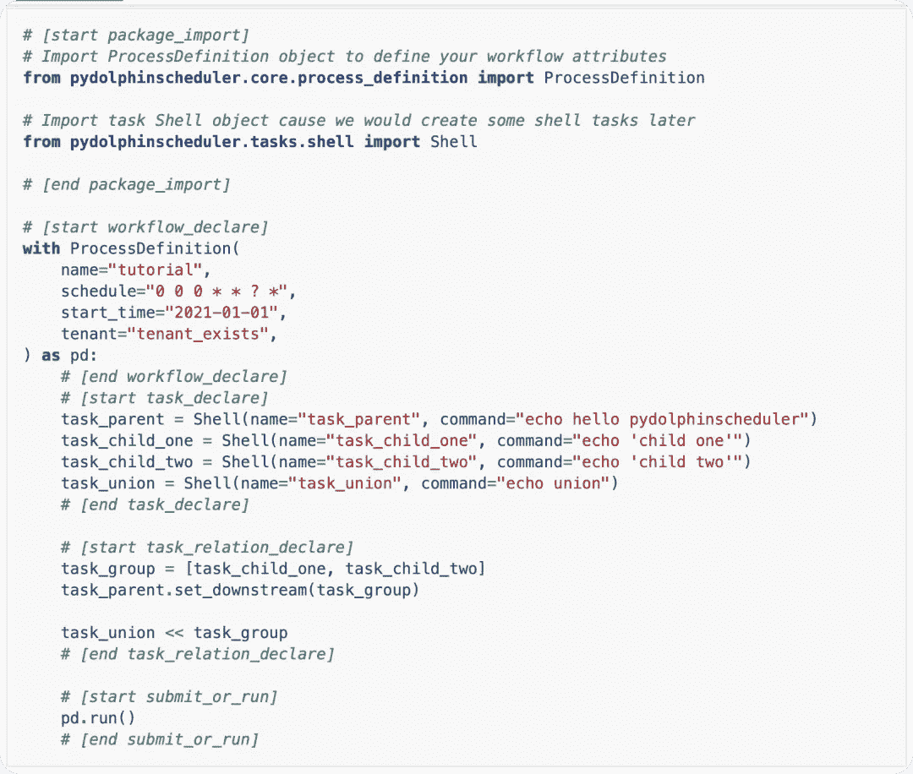
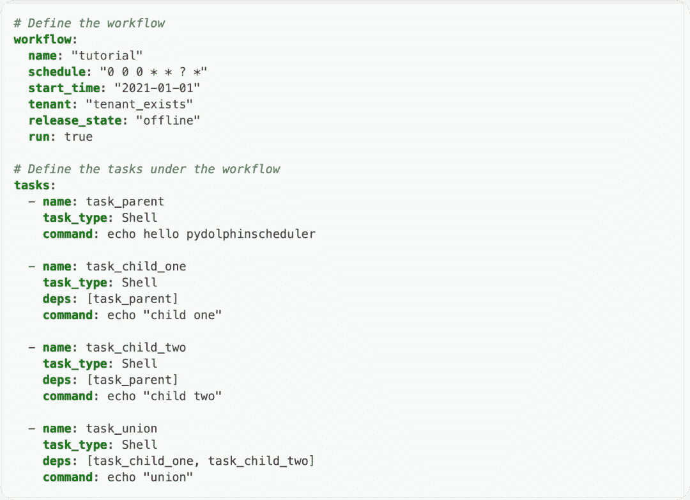
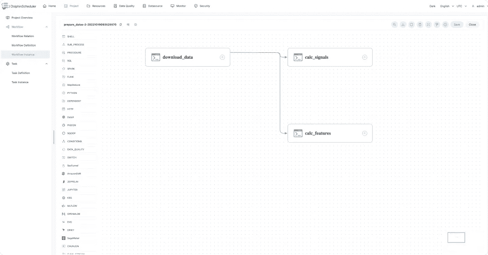
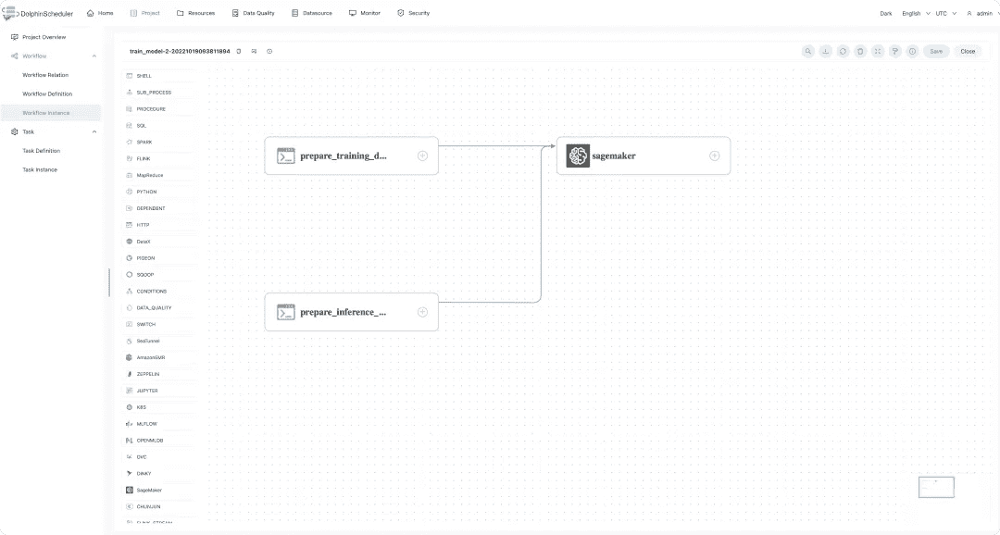
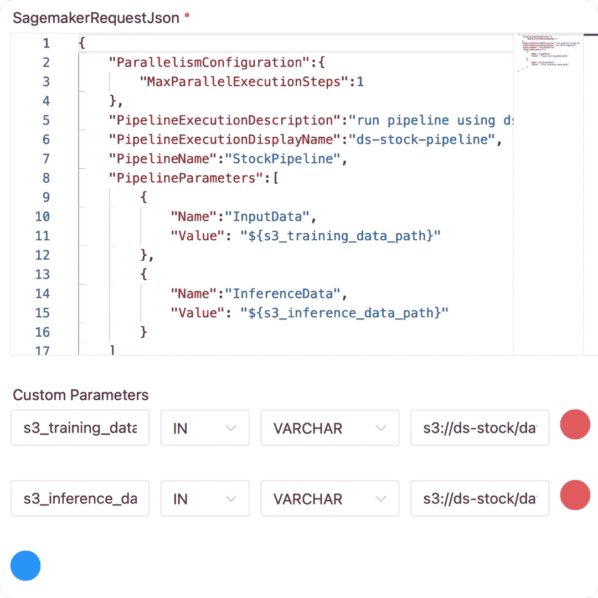
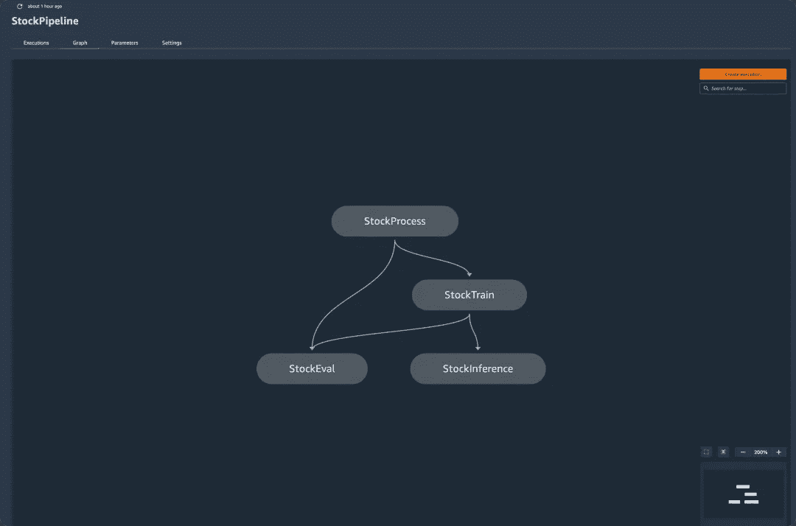
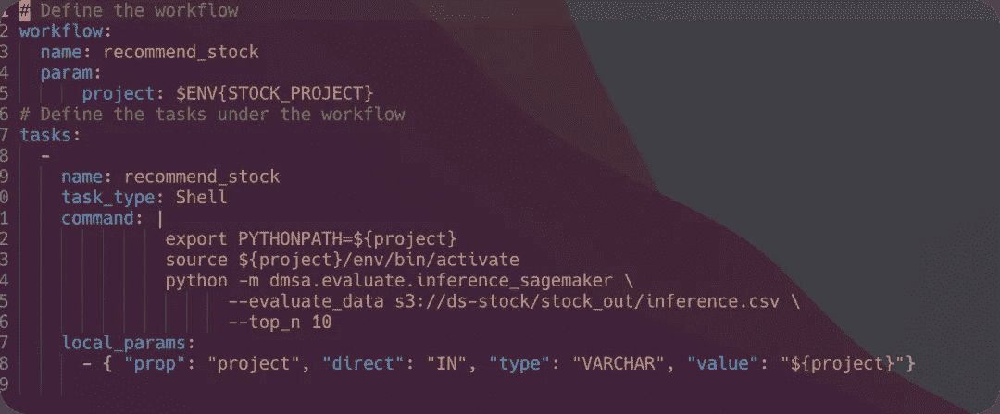
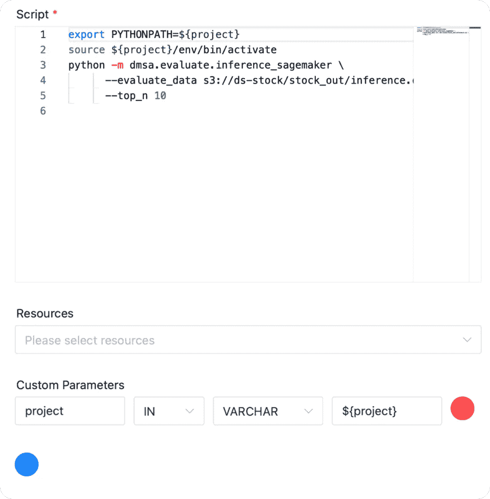
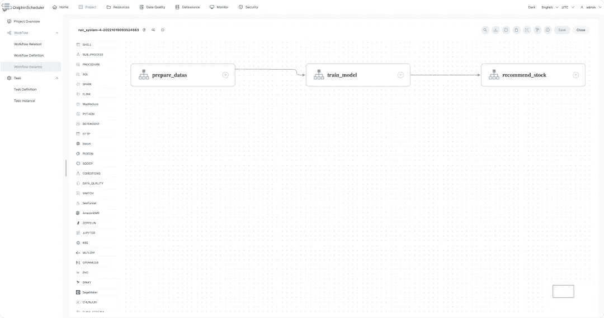
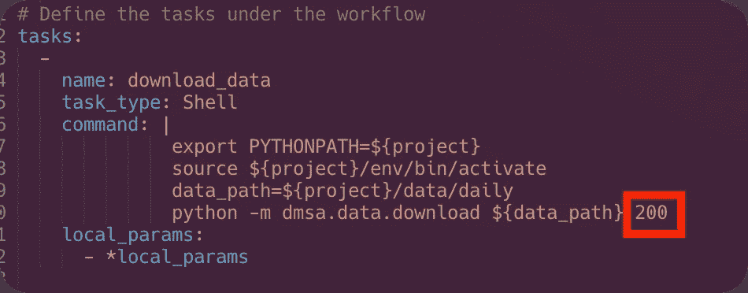

# 工作流 as code+SageMaker，新玩法搭配 DolphinScheduler 的机器学习选股系统

> 原文：<https://blog.devgenius.io/workflow-as-code-sagemaker-new-gameplay-with-dolphinschedulers-machine-learning-stock-selection-ad0422e8aae5?source=collection_archive---------7----------------------->


> 作者:Apache DolphinScheduler 委员会委员周杰光

**总结**

Apache DolphinScheduler 在 DataOps 中提供了强大的分布式和可视化工作流调度功能。最新版本 3.1.0 引入了机器学习任务调度能力，并逐渐支持主流的 MLOps 项目/服务提供商。MLflow、DVC、Jupyter、OpenMLDB、SageMaker 和其他任务组件已经允许用户低成本、更高效地开发机器学习系统。

这次我们介绍基于 YAML 文件的机器学习工作流的创建。我们还使用 DolphinScheduler 调用 Amazon SageMaker 进行股票训练和预测系统。

# PyDolphinScheduler 3.1.0

PyDolphinScheduler 3 . 1 . 0 版本发布后，用户现在可以使用 YAML 文件和 Python 脚本来定义工作流。

# 计算机编程语言

执行 python tutorial.py 将工作流传输到 DolphinScheduler。



# YAML



执行 pydolphinscheduler YAML-f tutorial . YAML 将工作流转移到 dolphinscheduler。

对于希望以代码形式使用工作流的用户，可以直接使用上述两种方法来定义管理工作流。或者，您可以使用 git 来管理工作流，执行 CICD 等。

# 系统介绍

回顾: [***选股模型自动更新，实时监控，基于 Apache DolphinScheduler 的机器学习智能选股系统。***](https://medium.com/@ApacheDolphinScheduler/how-to-build-a-machine-learning-intelligent-stock-selection-system-based-on-apache-dolphinschedule-55260edaf42a)

这个机器学习选股系统主要有两种新的使用方法:

1.  使用 PyDolphinScheduler 以代码形式构建工作流。您可以快速创建和运行工作流，而无需单击页面并运行一行命令。
2.  在下载和处理股票数据之后，将数据发送到 Amazon SageMaker，并使用 SageMaker 管道来执行数据集处理、训练、评估和批量推断。

# 系统概况

关于系统前后台更详细的介绍，可以参考前面介绍的 **A** [***自动更新选股模型，*实时监控，构建基于 Apache DolphinSchedule 的机器学习智能选股系统。**](https://medium.com/@ApacheDolphinScheduler/how-to-build-a-machine-learning-intelligent-stock-selection-system-based-on-apache-dolphinschedule-55260edaf42a)

我们现在将简要回顾一下这个系统，并关注如何通过配置文件创建一个工作流，并在 DS 上调用 SageMaker。

1.  系统显示
2.  这个系统是如何运作的

*   选股逻辑计算整个市场中符合 5 日均线高于 10 日均线信号的所有股票作为目标池。然后为上述股票池中的每只股票创建以下特征来训练模型。

1.  股价与布林线三轨的相对价值。
2.  股价与多条移动平均线的相对值。各种均线的多个区间的倾斜。
3.  talib 模式计算当前 k 线的形状。如果是三只乌鸦如果是道吉烛台等等。详情请参考(https://www.jianshu.com/p/fd5c7f49db33)的 k 线形态识别

注意:您可以添加任何您认为有用的信息作为附加功能。

模特培训

第二个分类是基于第二天的倾斜是否被执行。如果使用 SageMaker 管道中的训练节点进行训练。最后，如果每天构建一个 120 天的数据集，则最后七天用于评估。

任务调度

DolphinScheduler 完成所有的任务调度。DolphinScheduler 可以每天晚上自动更新模型，并上线进行预测。当模型当天表现不佳时，您可以调整参数和功能来重新训练新模型并在线评估它。它还具有任务容错机制，确保了系统的稳定性。

前端显示器

前端接口是使用 Observable 实现的。由于其笔记本丰富且易于使用的可视化数据分析功能，它构建了有效的实时股票选择监控系统。

*项目地址*

这个项目中工作流任务的实现可以在这里找到 GitHub—[dolphin scheduler—MLOps—Stock—Analysis](https://github.com/jieguangzhou/DolphinScheduler-MLOps-Stock-Analysis/tree/sagemaker)，切换到 SageMaker 分支。

```
git clone https://github.com/jieguangzhou/DolphinScheduler-MLOps-Stock-Analysis
cd DolphinScheduler-MLOps-Stock-Analysis
git checkout sagemaker
```

由于前端界面还是和以前一样方便，所以主要介绍选股系统的工作流程。

# 介绍选股系统的工作流程

它主要包括三个子工作流:

prepare_datas:下载每日数据、信号计算、特征(定量交易中的因子)计算

train_model:生成训练数据，调用 SageMaker Pipeline 来更新模型，评估模型，并对批处理数据进行推理

recommend_stock:下载 SageMaker Pipeline 推断的数据，输入数据库进行股票推荐。

以下是对各个子工作流的介绍:

*准备数据*

下图展示了数据准备工作流程 prepare_datas，该流程下载股票数据并执行信号和特征计算。

`download_data`:下载整个市场的每日股票数据

*   `calc_signals:`用于进行信号计算(计算每天哪些股票满足信号条件，如 5 日均线和 10 日均线或金叉的股票)
*   `calc_features:`特征计算(在量化交易中称为因子)。要计算每只股票每天的特征值，比如收盘价和 5 日均线的相对值，股票是否是 doji 形态等。



上面的 prepare_datas 工作流包含三个任务。

*培训 _ 模式*

下图显示了执行这些任务的工作流`training_model`的每个任务的 DAG 图:

`prepare_training_data:`准备模型训练数据，并上传到亚马逊 S3(亚马逊 S3 将把它交给 SageMaker，将数据转换成训练集、验证集和测试集)

`prepare_inference_data`:准备好要预测的股票数据，上传到亚马逊 S3

`sagemaker`:执行 SageMaker 管道



*SageMaker*

SageMaker 组件任务定义如下。JSON 数据与 AWS SageMaker 管道启动数据的格式相同，包括管道名称和所有输入参数。



这个任务执行一个 SageMaker 管道，执行过程被持续监控，直到完成。

您可以在[**dolphin scheduler SageMaker 组件文档**](https://dolphinscheduler.apache.org/zh-cn/docs/dev/user_doc/guide/task/sagemaker.html) **中找到更多信息。**

每个管道有四个主要步骤:

StrockProcess:将数据集处理成适合 SageMaker 内置算法的格式。然后将其分为训练集、验证集和测试集

StockTrain:训练模型

StockEval:模型评估

股票推断:使用模型进行批量股票预测

Pipeline 定义的笔记本可以在 sage maker[**的 dolphin scheduler-MLOps-Stock-Analysis/Pipeline _ Stock . ipynb 中看到**](https://github.com/jieguangzhou/DolphinScheduler-MLOps-Stock-Analysis/blob/sagemaker/pipeline_stock.ipynb)

可以在亚马逊 SageMaker 工作室看到:



*推荐 _ 股票*

YAML 文件定义如下:



工作流目前只有一个任务，在 DS 中显示如下:



*运行 _ 系统*

我们现在将这三个工作流合并成一个名为 run_system 的工作流。例如，我们展示了:



定义 YAML 文件:

$ENV{STOCK_PROJECT}语法表示将填充环境变量 STOCK_PROJECT

＄WORKFLOW { " prepare_datas.yaml " }语法在 prepare _ datas . YAML 中创建工作流，引用其名称并将其作为子工作流填充。

*创建和执行工作流程*

我们如下创建一个 sh 文件`pydolphin_init.sh` :

```
*# /bin/bash*

*# init config*
user=Stock-Analysis
password=123456
tenant=$USER
project_name=pydolphin
api_address=127.0.0.1
api_port=25333

pydolphinscheduler config --set java_gateway.address $api_address
pydolphinscheduler config --set java_gateway.port $api_port

pydolphinscheduler config --set default.user.name $user
pydolphinscheduler config --set default.user.password $password
pydolphinscheduler config --set default.user.tenant $tenant

pydolphinscheduler config --set default.workflow.user $user
pydolphinscheduler config --set default.workflow.tenant $tenant
pydolphinscheduler config --set default.workflow.project $project_name
pydolphinscheduler config --set default.workflow.queue default

# The above is the related configuration for pydolphinscheduler, including ds address, port configuration, creation of the tenant, the user, and project (if it does not exist)# The following is the command to create the workflow# Configure the environment variables, which will be referenced in yamlexport STOCK_PROJECT=$(pwd)# Creating the workflow
pydolphinscheduler yaml -f pyds/run_system.yaml
```

然后，我们可以运行脚本来启动选股系统。

# 项目实践

**DolphinScheduler 安装和启动**

*   安装 dolphinscheduler

下载 [**安装包**](apache-dolphinscheduler-3.1.0-bin.tar.gz%EF%BC%88https://www.apache.org/dyn/closer.lua/dolphinscheduler/3.1.0/apache-dolphinscheduler-3.1.0-bin.tar.gz%EF%BC%89)

单机启动 [**详情可参见**](https://dolphinscheduler.apache.org/zh-cn/docs/latest/user_doc/guide/installation/standalone.html) 。

解压缩:

```
tar -zxvf apache-dolphinscheduler-3.1.0-bin.tar.gz
cd apache-dolphinscheduler-3.1.0-bin
```

调整配置`standalone-server/conf/common.properties` 中的以下字段，以添加用于 SageMaker 组件认证的 aws 密钥

```
*# The AWS access key. if resource.storage.type=S3 or use EMR-Task, This configuration is required* 
resource.aws.access.key.id=<YOUR AWS ACCESS KEY> 
*# The AWS secret access key. if resource.storage.type=S3 or use EMR-Task, This configuration is required* 
resource.aws.secret.access.key=<YOUR AWS SECRET KEY>
*# The AWS Region to use. if resource.storage.type=S3 or use EMR-Task, This configuration is required* 
resource.aws.region=<AWS REGION>
```

*   启动海豚调度程序

```
bash bin/dolphinscheduler-daemon.sh start standalone-server
```

*   登录 DolphinScheduler

浏览器网址[http://localhost:12345/dolphin scheduler/ui。](http://localhost:12345/dolphinscheduler/ui.)您可以登录系统界面。默认的**用户名和密码是 admin/dolphinscheduler123**

**海豚调度-MLOps-股票-分析**

现在我们拉选股系统的代码，换到 sagemaker 分支。

```
git clone https://github.com/jieguangzhou/DolphinScheduler-MLOps-Stock-Analysis
cd DolphinScheduler-MLOps-Stock-Analysis
git checkout sagemaker
```

在`dmsa/db.py` 中修改 MySQL 配置，保存信号特征和股票推荐结果。

```
class CONFIG:
    MYSQL_USER = 'root'
    MYSQL_PASSWORD = '123456'
    MYSQL_HOST = 'xxxxxxxxxxxxxxxx'
    MYSQL_PORT = 3306
    MYSQL_DATABASE = 'dolphinscheduler_mlops_stock'
```

因为您需要将数据上传到 AWS S3，所以您必须配置文件`~/.aws/config`

```
[default]
aws_access_key_id = <YOUR AWS ACCESS KEY> 
aws_secret_access_key = <YOUR AWS SECRET KEY>
region = <YOUR AWS SECRET KEY>
```

**准备 Python 环境**

```
virtualenv -p /usr/bin/python3 env
source env/bin/activate
pip install -r requirements.txt
```

**安装 PyDolphinScheduler:**

`Python -m pip install apache-dolphinscheduler`可以安装在任何 python 环境中。实际的任务执行不需要 pydolphinscheduler。pydolphinscheduler 用于快速传递代码形式的工作流。

然后执行命令`bash pydolphin_init.sh`。

如果你想让它运行得更快，你可以在`pyds/prepare_datas.yaml`中的`python -m dmsa.data.download ${data_path}` 后加 200，这意味着只有 200 只股票会被用于流水线执行



# 摘要

本文展示了如何使用 YAML 配置文件在 DolphinScheduler 中构建和执行工作流。然后调用亚马逊 SageMaker 管道提供机器学习能力，建立机器学习选股系统。

希望这能给你带来以下好处:

1.  学习如何使用 DolphinScheduler 建立一个选股系统。
2.  学习如何使用 DolphinScheduler 连接到 MLOps 系统及其上游和下游任务。
3.  了解 DolphinScheduler SageMaker 组件的使用。
4.  理解 DolphinScheduler 通过配置文件管理工作流的实践。

*   广告:
*   如果你对用 DolphinScheduler 构建机器学习系统感兴趣，可以加入社区，参与讨论。
*   如果你有 DolphinScheduler，欢迎有构建机器学习系统或调度机器学习任务经验的学生投稿。

# 加入社区

参与 DolphinScheduler 社区并为其做出贡献的方式有很多，包括:

文件、翻译、问答、测试、代码、文章、主题演讲等。

我们假设第一个 PR(文档、代码)是简单的，应该用来熟悉提交过程和社区协作风格。

所以社区整理了以下适合新手的问题列表:【https://github.com/apache/dolphinscheduler/issues/5689

https://github.com/apache/dolphinscheduler/issues?**非新手问题列表:** [q = is % 3A open+is % 3A issue+label % 3A % 22 volunteer+wanted % 22](https://github.com/apache/dolphinscheduler/issues?q=is%3Aopen+is%3Aissue+label%3A%22volunteer+wanted%22)

**如何投稿:**

[https://dolphin scheduler . Apache . org/en-us/docs/dev/user _ doc/contribute/join/contribute . html](https://dolphinscheduler.apache.org/en-us/docs/dev/user_doc/contribute/join/contribute.html)

**GitHub 代码库:**[https://github.com/apache/dolphinscheduler](https://github.com/apache/dolphinscheduler)

**官方网站:**https://dolphinscheduler.apache.org/

邮件列表:dev@dolphinscheduler@apache.org

**推特:**@海豚时间表

https://www.youtube.com/channel/UCmrPmeE7dVqo8DYhSLHa0vA

**懈怠:**https://s.apache.org/dolphinscheduler-slack

**投稿指南:**https://dolphin scheduler . Apache . org/en-us/community/index . html

你的项目之星很重要，不要犹豫，点亮阿帕奇海豚调度❤️之星