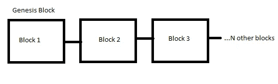

# 2022 年区块链的工作

> 原文：<https://blog.devgenius.io/working-of-blockchain-in-2022-b8e64663a8ae?source=collection_archive---------17----------------------->

## 用简单的话理解区块链


沃伦·王在 [Unsplash](https://unsplash.com?utm_source=medium&utm_medium=referral) 上的照片

我们都知道什么是链表，基本上链表是由存储数据的节点和下一个节点的地址组成的。但是你可以改变链表中的数据，这使得它是可变的。

假设一旦数据被添加到节点，就不能改变链表中的数据，因此该链表变得不可变，这可以非常类似于想象中的区块链。

显而易见，链表不是区块链，而是一种数据结构，这里我们引用链表来给出区块链的基本概念。

Satoshi 在 2009 年创造了一个创新的想法，使数据一旦添加就很难更改。它催生了区块链。

## 区块链

区块链是包含信息的区块链，由于其安全性，篡改这些信息几乎是不可能的。

区块链是由 Satoshi 实现的，以确保比特币的交易安全可靠。让比特币成为分散的货币，让人们了解区块链。因此，区块链也被称为分布式账本。

区块链的街区包含三个主要部分

*   数据
*   混杂
*   前一个块的哈希

一旦数据被插入到块中，就很难改变信息。块中的数据可以是任何类型，例如在加密货币中，数据可以是发送方 id、接收方 id 和金额。这是有史以来最安全的交易存储方式。

一旦创建了一个块，它就会生成自己的哈希(哈希是一种独特的身份，就像人的指纹一样)。当一个数据块中的数据发生变化时，哈希也会发生变化，使其成为一个与之前完全不同的数据块，换句话说，它无法被黑客攻击。

前一个块的散列用于创建该块的链。它比其他任何存储交易的方式都更安全。

```
Block 1 
Hash = 1001
Previous Hash= 0000Block 2
Hash=10X3
Previous Hash = 1001Block 3
Hash=92Z3
Previous Hash=10X3
```



图片来自[作者](http://aniketz.medium.com)

第一个块称为起源块，第二个块存储块 1 的散列，第三个块存储块 2 的散列。

如果黑客试图改变块 2 中的数据(交易),那么块 2 的散列也将被改变。但是，第三个块已经存储了该块的先前散列，因此区块链变得无效。

更准确地说，这一连串的障碍已经被根除了。这个区块链是怎么根除的？这个区块链的数据会怎么样呢？数据会被销毁吗？如果丢失了一些有价值的数据(例如比特币交易),某人可能会损失数百万美元，该怎么办？

区块链技术是个失败的技术，不是吗？你所有问题的答案是，区块链是不可破解的，是人类发明的最强大的技术。

让我们假设一台超级计算机再次为黑客重新计算所有的散列，并使区块链再次有效。这种情况下黑客会赢吗？号码

## 工作证明

简而言之，工作证明是一种旨在减缓哈希和块创建速度的机制。比如比特币，单块要 10 分钟才能算出工作证明。

假设在一个区块链中有数百万个块，并且为了改变每个散列和数据以保持区块链有效，黑客需要在每个块上花费 10 分钟。

调整一个块会变得非常困难，因为调整一个块会改变它的散列，并使整个块链无效。如果有人试图改变所有块的每一个散列，他将需要几十年才能做到。

即使需要几十年，它还能被黑客攻击吗？黑客用超级计算机计算哈希更快怎么办？答案还是一样——*区块链无法被黑。*

## 分布式网络

除了哈希和工作证明，区块链还使用分布式网络技术。

区块链使用点对点网络，一旦有人加入点对点网络，这个人就会得到整个区块链的副本。这是一个非常强大的方法，因为大多数用户将拥有有效的区块链副本，即使其他副本被篡改。

当有人创建一个新的块时，对等网络中的每个用户都会收到这个新的块，并将其添加到区块链的副本中。每个节点都经过验证，如果一切都正确，那么它就会得到对等网络中每个用户的一致同意。

## 更改数据

现在，要改变区块链的数据，黑客需要改变相应块的数据，并重新计算每个块的散列值。黑客还必须为每个区块做工作证明。不仅如此，这位黑客还必须在对等网络中复制 50%以上的区块链。

完成所有这些后，回火块变得有效。但是，事实是，任何人都不可能同时执行所有步骤来保持 tempered 块有效。因此，区块链是存储数据(交易)最安全的形式。

区块链无疑是人类发明的最强大的技术之一。即使通过了所有的安全检查，而且不可能被黑客入侵，区块链也在不断地自我进化。目前，智能合同也包括在内，使区块链更加安全。

就这样，这是文章的结尾。希望它对你有价值。[如果你喜欢这篇文章，点击这里订阅我的邮件列表。我会通过电子邮件给您发送技术相关的文章。](https://aniketz.medium.com/subscribe)

[**通过邮件获取此类文章点击这里**](https://aniketz.medium.com/subscribe) **|** [**购买 5 美元中等会员**](https://aniketz.medium.com/membership)

[如果你觉得这篇文章很有价值，那么点击这里阅读更多的技术文章](https://aniketz.medium.com/)