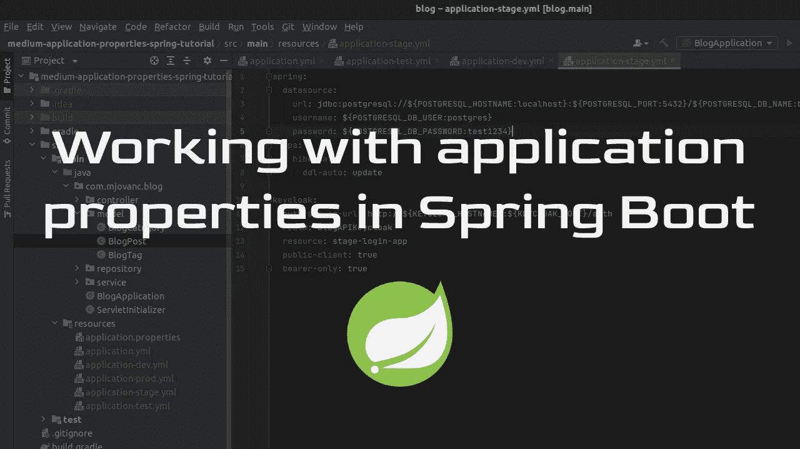
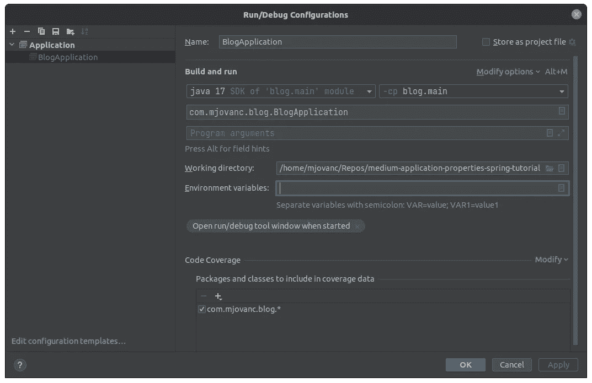
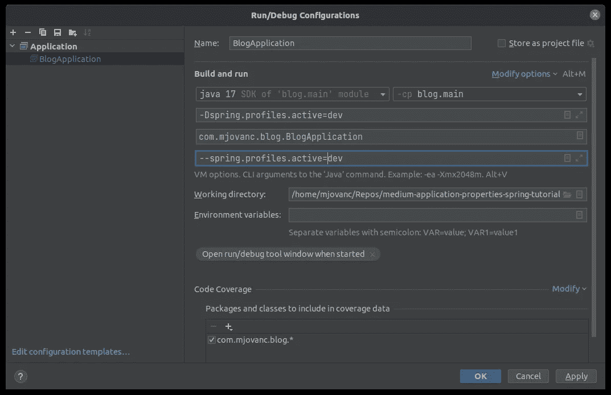

# 在 Spring Boot 使用应用程序属性

> 原文：<https://blog.devgenius.io/working-with-application-properties-in-spring-boot-79e72630bba0?source=collection_archive---------2----------------------->



因此，在 Spring Boot 中，我们可以定义一些静态应用程序属性，这些属性将在运行时加载一次。我们可以通过各种方式做到这一点，我将介绍我知道哪些是可能的，以及我在开发和生产中使用的方法。

我还将简要介绍如何设置一个测试环境以及一个测试属性文件，这样我们就可以为我们的应用程序进行一些自定义设置。

当初始化一个新的 Spring Boot 项目时，我们会自动得到一个标准的 **application.properties** 文件。我将不会讲述如何做到这一点，因为我已经在之前的教程中介绍过了。如果你想知道怎么做，可以查看[https://medium . com/@ mjovanc/spring-boot-with-PostgreSQL-and-hibernate-26 DC 00 de 27 e](https://medium.com/@mjovanc/spring-boot-with-postgresql-and-hibernate-26dc00de27e)。

标准的 **application.properties** 最初通常只是一个空文件。在上一个教程中，我们在其中添加了以下内容:

```
spring.datasource.url=jdbc:postgresql://localhost:5432/blog
spring.datasource.username=<db username>
spring.datasource.password=<your password here>
spring.jpa.hibernate.ddl-auto=update
```

另一种方法是现在用 YAML 编写一个应用程序属性文件，这样我们可以在一个名为 **application.yml** 的新文件中定义我们的设置:

```
spring:
  datasource:
    url: jdbc:postgresql://${POSTGRESQL_HOSTNAME}:${POSTGRESQL_PORT}/${POSTGRESQL_DB_NAME}
    username: ${POSTGRESQL_DB_USER}
    password: ${POSTGRESQL_DB_PASSWORD}
  jpa:
    hibernate:
      ddl-auto: update
```

我们可以添加**环境变量**，而不是在属性文件中硬编码我们的值，这样它将从系统中加载，而不是在我们的存储库中保密，这不是一种安全的工作方式。然而，在开发中这并不重要，但无论如何这都是一个很好的实践。如果您在 IntelliJ 中工作，您可以将这些环境变量放在我们的应用程序运行/调试配置中:



在您看到*环境变量*的地方，您可以创建一个**键-值对**，在这里用分号分隔变量，它将在运行应用程序时被加载。非常整洁。

我们也可以这样定义我们的 **application.yml** 文件:

```
spring:
  datasource:
    url: jdbc:postgresql://${POSTGRESQL_HOSTNAME:localhost}:${POSTGRESQL_PORT:5432}/${POSTGRESQL_DB_NAME:blogdb_dev}
    username: ${POSTGRESQL_DB_USER:postgres}
    password: ${POSTGRESQL_DB_PASSWORD:test1234}
  jpa:
    hibernate:
      ddl-auto: update
```

我们设置了环境变量，但是如果没有设置环境变量，我们还设置了一个*回退*值。因此，如果我们不能从环境变量中获取值，这不会产生任何问题。

这就是 YAML 和 T21 使用应用程序属性的基本方式。但是如何共享不同设置的应用程序属性呢？例如，如果我们希望根据目标平台加载不同的应用程序属性，我们可以创建这些文件:

*   应用程序. yml
*   应用程序开发人员
*   应用测试. yml
*   应用阶段. yml
*   应用产品 yml

**application.yml** 将是存储应该在不同文件之间共享的所有内容的地方。这些其他文件被称为**概要文件**。因此，我们可以在启动我们的 *Spring Boot* 应用程序时使用一个标志来指定应该使用什么配置文件。我们可以在 IntelliJ 中这样做:



我们可以指定 **VM 选项**，您可以在 *java 17 SDK* 定义下看到，或者我们可以指定**程序参数**。显然我们不需要两者。当使用以下命名约定时，Spring Boot 将知道这些文件是概要文件:

```
application-<profile>.yml
```

也可以设置一个**环境变量**来指定应该使用什么配置文件:

```
SPRING_PROFILES_ACTIVE=dev
```

因此，我们可以将它放在*应用运行/调试配置*中，就像我们之前看到的那样。如果我们在构建应用程序或构建 Docker 映像时有 CI 管道，我们还可以使用其他方法。

因此，让我们来看一个例子，如何利用使用*配置文件*来分割它们。首先让我们看看我们的**应用程序:**

```
server:
  error:
    whitelabel:
      enabled: false

spring:
  application:
    name: Blog
  main:
    allow-bean-definition-overriding: true

springdoc:
  api-docs:
    enabled: true
    path: /v1/docs
  swagger-ui:
    enabled: true
    path: /v1/docs/index.html
    operationsSorter: method
    syntaxHighlight:
      theme: obsidian
    disable-swagger-default-url: true
    supported-submit-methods: []
```

这里我们定义了一些基本的东西，比如我们不想显示白标错误页面，因为我们将使用*百里香叶*来呈现我们自己的定制 HTML 文档，用于不同的错误，如 *400* 、 *404* 或 *500* 。但我们不会在这里深入讨论百里香叶，这只是为了说明这将在每个配置文件中使用。我们还定义了应用程序名称和 *springdoc* (Swagger UI)配置。

因此，这将包括在每个配置文件中，以便我们可以开始查看其他配置文件。

**应用开发 yml:**

```
spring:
  datasource:
    url: jdbc:postgresql://${POSTGRESQL_HOSTNAME:localhost}:${POSTGRESQL_PORT:5432}/${POSTGRESQL_DB_NAME:blogdb_dev}
    username: ${POSTGRESQL_DB_USER:postgres}
    password: ${POSTGRESQL_DB_PASSWORD:test1234}
  jpa:
    hibernate:
      ddl-auto: update

keycloak:
  auth-server-url: http://${KEYCLOAK_HOSTNAME}:${KEYCLOAK_PORT}/auth
  realm: BlogAPIKeycloak
  resource: dev-login-app
  public-client: true
  bearer-only: true
```

这里我们定义了 Spring datasource 和 *Keycloak* 配置，我们将在其他文件中使用相同的配置，但是使用不同的资源名，所以我们需要在每个概要文件中再次指定。

**申请-测试. yml:**

```
spring:
  datasource:
    driver-class-name: org.h2.Driver
    url: jdbc:h2:mem:db;DB_CLOSE_DELAY=-1
    username: h2
    password: test1234
```

注意，这里我们使用不同的数据源，因为当运行我们的单元测试时，我们不需要使用我们的关系数据库，所以我们利用 H2，它基本上是一个内存数据库，非常适合测试目的。例如，当使用 CI/CD 管道时，这非常好，因为我们不需要连接到关系数据库来测试 API 端点。

**申请阶段. yml:**

```
spring:
  datasource:
    url: jdbc:postgresql://${POSTGRESQL_HOSTNAME:localhost}:${POSTGRESQL_PORT:5432}/${POSTGRESQL_DB_NAME:blogdb_dev}
    username: ${POSTGRESQL_DB_USER:postgres}
    password: ${POSTGRESQL_DB_PASSWORD:test1234}
  jpa:
    hibernate:
      ddl-auto: update

keycloak:
  auth-server-url: http://${KEYCLOAK_HOSTNAME}:${KEYCLOAK_PORT}/auth
  realm: BlogAPIKeycloak
  resource: stage-login-app
  public-client: true
  bearer-only: true
```

**应用产品名称:**

```
spring:
  datasource:
    url: jdbc:postgresql://${POSTGRESQL_HOSTNAME:localhost}:${POSTGRESQL_PORT:5432}/${POSTGRESQL_DB_NAME:blogdb_dev}
    username: ${POSTGRESQL_DB_USER:postgres}
    password: ${POSTGRESQL_DB_PASSWORD:test1234}
  jpa:
    hibernate:
      ddl-auto: update

keycloak:
  auth-server-url: http://${KEYCLOAK_HOSTNAME}:${KEYCLOAK_PORT}/auth
  realm: BlogAPIKeycloak
  resource: prod-login-app
  public-client: true
  bearer-only: true
```

因此，这基本上是当使用 **YAML** 文件与应用程序属性。但是也有一种方法来使用它。属性文件，我将展示如何用它来做同样的事情。我个人更喜欢用 **YAML** ，但是知道我们如何以不同的方式做到这一点也很好。

同**。属性**文件类似的做法是:

*   应用程序.属性
*   应用程序开发属性
*   应用程序测试属性
*   应用程序阶段.属性
*   应用产品属性

因此，我们只需像以前一样添加一个自定义配置文件名称，Spring 就会知道这是一个配置文件:

```
application-<profile>.properties
```

所以我们不需要深入细节并展示如何放置代码，因为它与教程如何编写**开头的例子非常相似。属性**文件。

好了，我们现在知道如何编写应用程序属性文件了。如何装饰一些应该只用于特定概要文件的特定代码呢？

我们可以通过在一个类上添加装饰器**配置文件**来做到这一点，在这个例子中，我们将使用一个仅用于配置文件 **dev** 的播种器:

```
@Profile("dev")
@Component
public class Seeder implements ApplicationRunner {

    @Autowired
    private BlogPostRepository blogPostRepository;

    public void seed() {
        // Creating BlogPost objects
        BlogPost blogPost1 = new BlogPost("Blog Title 1", "Some text.",
                "2017-07-01T14:59:55.711'+0000'", "2017-07-01T14:59:55.711'+0000'");

        BlogPost blogPost2 = new BlogPost("Blog Title 2", "Some text 2.",
                "2017-07-01T14:59:55.711'+0000'", "2017-07-01T14:59:55.711'+0000'");

        // Saving BlogPost objects to database
        blogPostRepository.save(blogPost1);
        blogPostRepository.save(blogPost2);
    }

    @Override
    public void run(ApplicationArguments args) {
        if (blogPostRepository.count() == 0) {
            seed();
        }
    }
}
```

很明显，我们可以用它做更多的事情。在他们的官方 Spring 文档中查看:[https://docs . Spring . io/Spring-boot/docs/current/reference/html/application-properties . html # appendix . application-properties . core](https://docs.spring.io/spring-boot/docs/current/reference/html/application-properties.html#appendix.application-properties.core)

差不多就是这样。:)