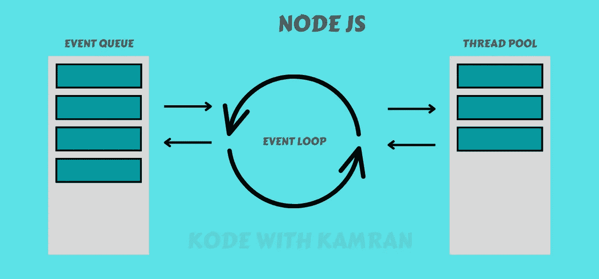
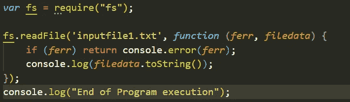
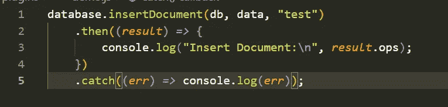
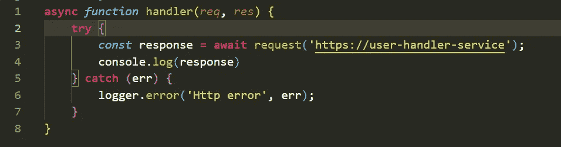

# 初学者指南:使用异步节点

> 原文：<https://blog.devgenius.io/working-with-async-nodejs-1f2a8c9a52d3?source=collection_archive---------10----------------------->

Node JS 可能会让任何初学者或来自任何其他编程语言的人感到困惑。大多数开发人员发现很难理解 node js 脚本中的代码流。在这篇文章中，我将让理解一段代码如何在 Node JS 脚本中运行变得非常简单。

NodeJS 是一个异步事件驱动的 JavaScript 运行时环境，旨在构建可伸缩的网络应用程序。在这里，我们将讨论异步，什么是异步以及为什么它很重要。用一个术语来说，异步可以定义为非阻塞的，也就是说，你在 Node js 脚本中写的任何东西都是非阻塞的。说得更细一点，这意味着如果你的脚本中有 5 行代码并运行它。即使第一行需要时间来执行，节点 js 将移动到第二行而不会被阻塞，这就是节点 js 如此快速和著名的原因。所以基本上 node js 就像 Rajnikant 爵士一样势不可挡😉。

这种非阻塞行为背后的原因是 Node JS 中运行在幕后的漂亮的事件循环。不需要太多的细节，事件循环可以被解释为一个监视者，它监视着给予 node js 的每一个命令并将其付诸实施。这里命令是每行代码。事件将所有代码行付诸行动，即使前一行尚未完成

事件循环

有些情况下，我们不想要这种“异步”行为，最好的例子是当我们进行 api 调用时，在这种情况下，我们希望从 api 调用中获得结果，然后我们希望转到下一行来进一步处理响应。我们有多种选择来处理 node js 或 js 中的这些情况。

第一种方法:第一种也是最古老的方法是回调，回调是我们在完成第一个函数后触发的函数。简单地说，假设您有两行代码，并且您想在第一行完成后才执行第二行。第一行需要时间，因为它依赖于其他一些函数，你可以做的是将第二行包装在一个函数中，并将这个函数传递给第一行函数本身。

复试

如果我想进行一个 api 调用，然后使用响应，我想在那个响应上构建一个 json。因此，我创建了一个 json 创建过程的函数，并将该函数传递给 api，并要求 api 在您完成后调用该函数。我做了一个[视频](https://youtu.be/VVTwRCthMso)解释和编码相同，你可以检查相同的更好的理解

**第二种方法:**处理任何异步情况的更酷更漂亮的方法是一种承诺。用最简单的话来说，我可以解释，承诺是一个对象，你可以告诉你做什么后，你完成了你的工作。在主函数成功和失败的情况下，我们可以告诉 promise 两个不同的输出。

承诺可以处于以下状态之一:

*   待定:初始状态，既未完成也未拒绝。
*   已完成:表示操作成功完成。
*   拒绝:表示操作失败。

承诺

例如，如果你正在调用一个 api，在这种情况下，你的 api 应该是一个承诺，你可以告诉这个承诺，如果你的 api 成功运行，你想做什么或者如果它失败，你想做什么。我制作了一个视频来解释和编码相同的内容，你可以查看以便更好的理解

**第三种方法:**处理异步节点 js 最干净的方式是“异步等待”。在这个方法中，你只是在当前函数完成后不传递你想做的，你在给定的行上停止编译器，等待它完成。这种等待是在一个函数中完成的，而这个函数应该是显式异步的，这就是为什么这个名字叫做“异步等待”。虽然，在 node js 的最新版本中，不要求“异步”功能在特定行上等待。

异步等待

现在用一个例子来解释:如果你正在调用一个 api，在这种情况下，你的 api 应该是一个承诺，你可以告诉这个调用在这一行等待，直到你得到响应，然后转到下一行，在那里你可以处理响应。我已经做了一个[视频](https://youtu.be/mliu_aT64v0)解释和编码相同，你可以检查相同的更好的理解。

希望你明白如何通过这篇博客来处理异步节点 js。请关注我以获取更多内容，并查看我的 [YT 频道](https://www.youtube.com/channel/UClAF60JODGbZKoyREtl6S5A)