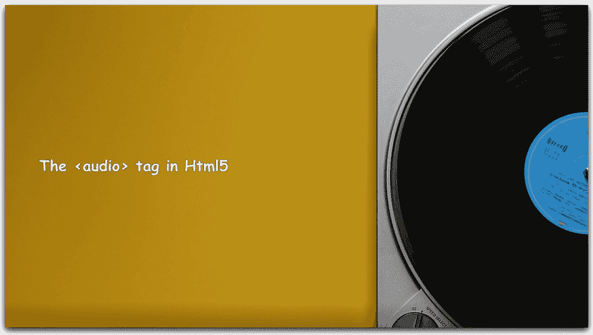
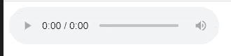
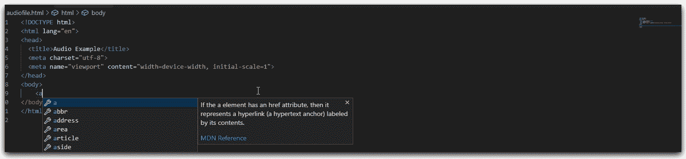
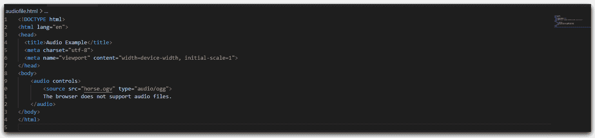
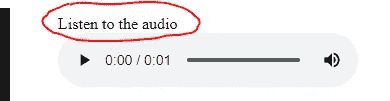

# 使用音频文件— Html5

> 原文：<https://blog.devgenius.io/working-with-audio-files-html5-496e183cfc60?source=collection_archive---------7----------------------->

## HTML5 和 CSS3

## 如何在 Html5 中配置音频文件和各种属性？



来自[像素](https://www.pexels.com/photo/a-vinyl-record-played-on-a-turntable-4380097/?utm_content=attributionCopyText&utm_medium=referral&utm_source=pexels)的 [Stas Knop](https://www.pexels.com/@stasknop?utm_content=attributionCopyText&utm_medium=referral&utm_source=pexels) 的视频

HTML 网页通常包含不同类型和格式的多媒体元素。

> HTML `*<audio>*`元素用于播放网页上的音频文件。

## 基本用法

基本音频标签示例及其在“**谷歌浏览器”中的相关输出**



```
<audio controls></audio>
```



# 将音频文件添加到标签中

标签增加了音频控制，比如播放、暂停和音量。

标签使我们能够指定可供互联网浏览器选择的替代音频文件。

> 浏览器使用第一种支持的格式。

在不支持`<audio>`元素的浏览器中显示的`<audio>`和`</audio>`标签之间的文本。

## 音频标签修改如下:

当浏览器不支持特定的音频类型文件时，音频标签之间指定的文本充当"**后备内容"**。

```
<audio controls>
    <source src="horse.ogv" type="audio/ogg">
    The browser does not support audio files.
</audio>
```

## 多源属性

```
<audio controls>
    <source src="horse.ogv" type="audio/ogg">
    <source src="horse.mp3" type="audio/mp3">    
    The browser does not support audio files.
</audio>
```

## 输出

它增加了音频控制，如播放、暂停和音量。



# 附加属性

## 自动播放

向音频标记添加 autoplay 属性，以自动播放源标记中提供的音频。

```
<audio controls autoplay> <source src="horse.ogv" type="audio/ogg">
    The browser does not support audio files.</audio>
```

当用户不希望访问网站时，手动播放音频是非常有利的。

## 环

当音频文件到达末尾时，会自动再次播放。

```
<audio controls loop> <source src="horse.ogv" type="audio/ogg">
    The browser does not support audio files.</audio>
```

## 柔和的

现在另一个属性是静音，将音量静音到无。

```
<audio controls muted> <source src="horse.ogv" type="audio/ogg">
    The browser does not support audio files.</audio>
```

除非你有充分的理由，否则我建议你不要使用这个属性。

## 事先装好

一个额外的属性，那就是属性 preload，也可以想象成" **Buffering "**现在预载有三个不同的值。不能随便设定。

预加载采用三个值之一，即自动、元数据和无。

我更喜欢使用元数据；但是，auto 会保留预加载到浏览器中的内容。我这里的元数据会要求浏览器至少预加载元数据，包括数据属性，如实际音频的持续时间长度。

```
<audio controls preload="metadata"> <source src="horse.ogv" type="audio/ogg">
    The browser does not support audio files.</audio>
```

上述示例中使用的音频文件不适合测试 preload 属性。请尝试使用一些持续时间较长的音频文件。

## 如何给音频文件添加标题？

在多媒体控件上使用`<figure>`标签到`<figcaption>`，如下图所示:



```
<figure><figcaption>Listen to the audio</figcaption>
   <audio controls>
       <source src="horse.ogv" type="audio/ogg">
       The browser does not support audio files.
   </audio></figure>
```

## Github 示例

[](https://github.com/ssukhpinder/AudiofilesHtml) [## ssukhpinder/AudiofilesHtml

### html 中的音频标签。在 GitHub 上创建一个帐户，为 ssukhpinder/AudiofilesHtml 开发做贡献。

github.com](https://github.com/ssukhpinder/AudiofilesHtml) 

> 感谢您的阅读。我希望你喜欢这篇文章..！！