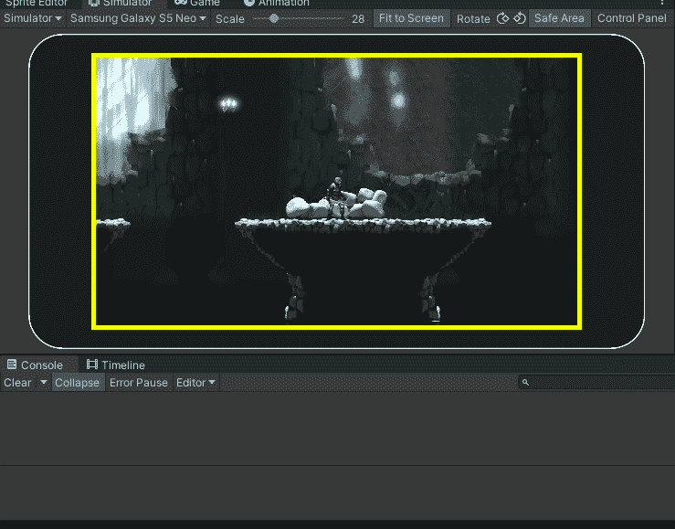
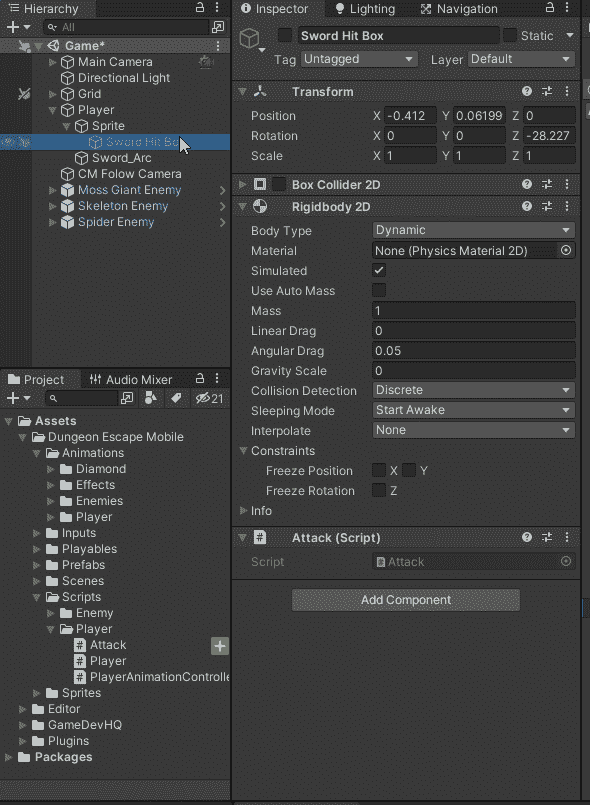
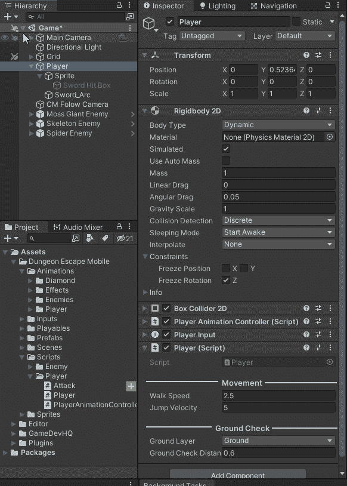
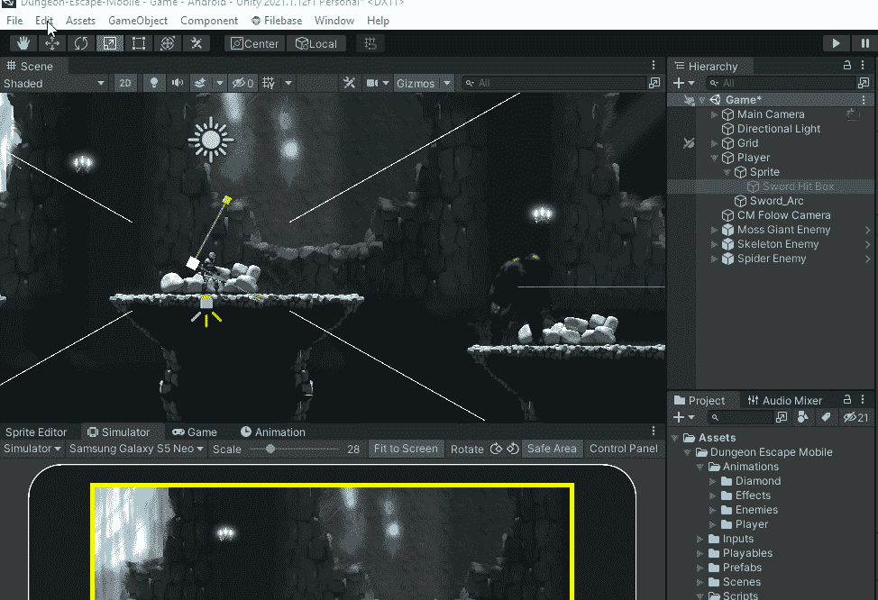
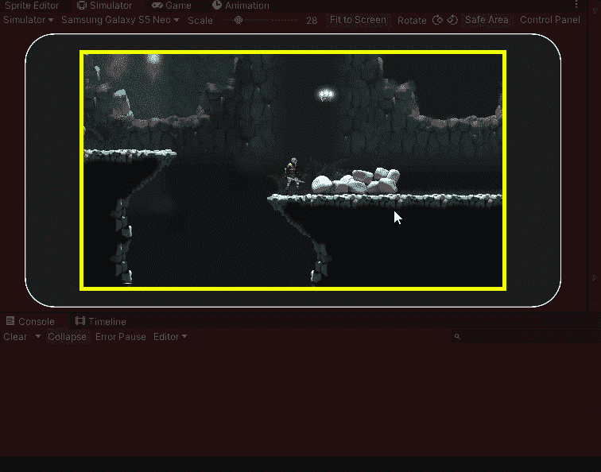

# 在 Unity 中使用碰撞层

> 原文：<https://blog.devgenius.io/working-with-collision-layers-in-unity-8ab897903d08?source=collection_archive---------4----------------------->

## 防止玩家打自己

我能打东西，但事实证明我也打我自己。为了防止这一点，我需要使用物理层。我将增加 2 层，玩家剑层和玩家层。我将把玩家放在玩家层，把剑击框放在玩家剑层。

现在我需要告诉玩家层忽略玩家剑层。

编辑->项目设置->物理 2D 和编辑层碰撞矩阵我使球员剑层不检测与球员或本身的碰撞。

任何带有复选标记的内容都将启用冲突检测。要禁用冲突检测，请从矩阵中删除复选标记。

现在我可以打东西而不打自己了。

