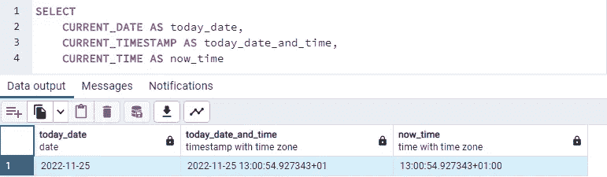
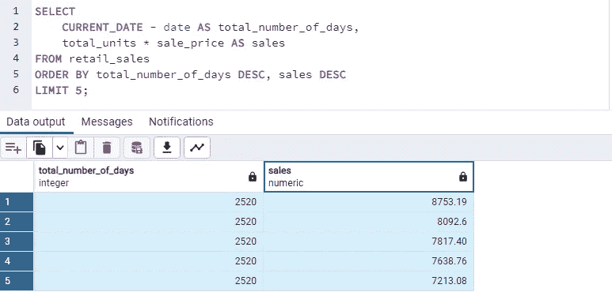

# 在 PostgreSQL 中使用日期和时间戳

> 原文：<https://blog.devgenius.io/working-with-dates-and-timestamps-in-postgresql-e9a4d489ea2?source=collection_archive---------12----------------------->

如何操作数据分析的日期和时间戳

卢克·切瑟的照片

来自不同来源的数据通常具有不同的日期和时间戳格式。我们经常格式化日期和时间，以实现数据分析项目的目标。

在这篇博文中，我讨论了操纵日期和时间进行分析的各种方法。

**时区转换**

PostgreSQL 数据库有一个默认时区设置，即操作系统的时区。

下面的 SQL 查询确认了本地 PostgreSQL 引擎的时区设置。

对于与不同时区的团队一起工作的数据分析师，建议将您正在使用的数据库的默认时区更改为协调世界时(UTC)。

下面的 SQL 查询将时区转换为 UTC 时区:

要确认您已成功将时区更改为 UTC 时区，请执行以下操作:

可以使用 AT TIME ZONE 命令在 SELECT 语句中将列更改为指定的时区。

您可以参考 [PostgreSQL](https://www.postgresql.org/docs/7.2/timezones.html) 文档，了解可识别的时区及其代码。

**系统时间**

在分析过程中生成当前日期和时间是很常见的。生成当前日期和时间的 SELECT 语句:

我们可以使用 CURRENT_DATE()函数来计算未结贷方余额的总天数。

**日期 _TRUNC 函数**

函数的作用是降低时间戳的粒度。数据粒度衡量数据结构的详细程度。在时序分析中，粒度可以是年、季度、月、周、天或小时。

在下面的 SELECT 语句中，DATE_TRUNC 函数将每个日期的精度降低到一个月，这样我们就可以很容易地计算出一个月的租赁总数。

在下面的 SELECT 语句中，DATE_TRUNC 函数将每个日期的精度降低到一年，这样我们就可以很容易地计算出每年记录的总销售额。

**日期 _ 零件功能**

函数的作用是:从日期或时间值中提取一个子字段。DATE_TRUNC 返回日期或时间戳，而 DATE_PART 返回日期或时间戳的子字段。

下面的 SELECT 语句从租赁表的 date_renting 列中提取月份。

下面的 SELECT 语句提取每个 date_renting 所在的季度，并合计每个季度的租赁总数。

**TO_CHAR 函数**

TO_CHAR()函数将时间戳、时间间隔、整数、双精度或数值转换为字符串。
就像 DATE_PART 一样，它提取时间戳的一部分，但作为一个字符串。

SELECT 语句从 date_renting 列中提取月份作为字符串。

SELECT 语句从 date_renting 列中以字符串形式提取日期。

TO_CHAR 函数在报表中非常有用。根据函数中第二个参数的指定格式，可以将日期格式化为更容易显示的格式。

下面的 SELECT 语句将日期转换为字符串格式。

[PostgreSQL](https://www.postgresql.org/docs/current/functions-formatting.html) 文档提供了一个日期格式列表。

**制作日期和截止日期功能**

MAKE_DATE 和 TO_DATE 函数从单独的年、月和日列中创建日期。

下面的 SELECT 语句创建日期列。

**日期和时间运算**

在分析中，可能需要知道两天之间的时间间隔，或者通过添加时间间隔来计算未来的日期。SQL 日期和时间戳数据类型允许这样的计算。

在下面的 SELECT 语句中，从 date_created 中减去 date_completed 以创建一个新列 time_interval。

在下面的 SELECT 语句中，我们使用购买日期来计算付款日期，使用一个月或三十天的贸易信用。
请注意，关键字 INTERVAL 必须在您想要添加的时间范围之前。时间范围也应该是一个字符串。

**结论**

这篇博文解释了在数据分析过程中，出于不同的目的，可以操纵日期和时间戳的各种方式

您可以从我的 [GitHub](https://github.com/amos-adewuni/working_with_dates_postgresql) 资源库下载数据集和 SQL 脚本供您练习。

关注我的 [Twitter](https://twitter.com/acube_yinka) 以获取更多数据相关信息。