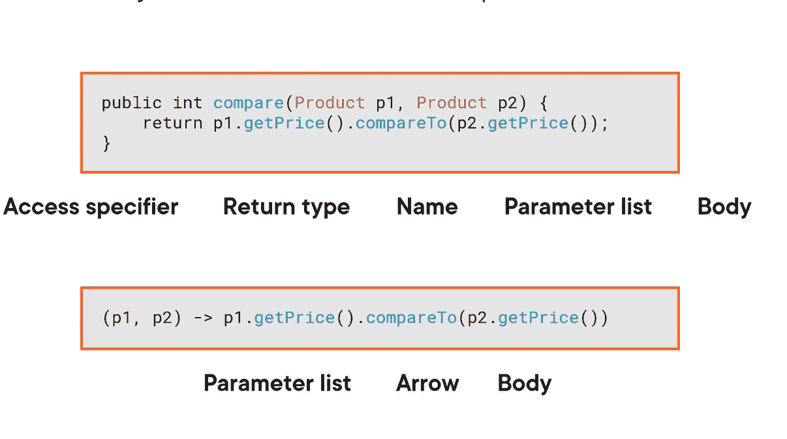

# 在 Java 中使用 Lambda 表达式

> 原文：<https://blog.devgenius.io/working-with-lambda-expressions-in-java-acde58231520?source=collection_archive---------1----------------------->


这难道不更符合用户的需求吗？我将在接下来的文章中介绍:)

让我们先了解什么是**功能接口**:

在这个例子中，我们用 Lambda 表达式替换了一个实现接口比较器的匿名类

```
products.sort(new Comparator<Product>() {@Override
public int compare(Product p1, Product p2) { 
return p1.getPrice().compareTo(p2.getPrice());
}});
```

去…

```
products.sort((p1, p2) -> p1.getPrice().compareTo(p2.getPrice()));
```

这是一个**单一的抽象方法:**比较方法。

```
@FunctionalInterface
public interface Comparator<T> {
int compare(T o1, T o2);
}
```

java 中有很多这样的接口，您可能已经熟悉了。例如，在处理威胁时，有一个可运行的界面**。您将实现 run 方法，该方法在您正在创建的线程中执行。另一个是界面**文件过滤器**:可以用来从目录列表中过滤文件列表。这个接口定义了一个 accept 方法，用于确定是否在列表中包含一个文件。还有一个来自 Swing UI 工具包的界面 **ActionListener** 。**

****

****单个抽象方法接口**也称为函数接口，它们在λ表达式方面起着重要的作用。**λ表达式总是实现一个功能接口**。**每当您在 Java 代码中遇到 lambda 表达式时，总是会有一个函数接口，lambda 表达式会实现这个接口**。**

**除了我刚才提到的比较器和其他功能接口之外，在 java 的标准库中还有一个包，java.util.function，里面有一组常用的功能接口。**

**我们将仔细研究标准的功能接口。现在，您只需要知道函数接口是一个具有单个抽象方法的接口，您可以用 lambda 表达式来实现它。**

# ****Lambda 表达式语法****

****

**λ表达式由**参数列表、箭头符号**和正文组成。**

**由于 lambda 表达式是一个匿名方法，它显然也没有名称。您不需要显式指定 lambda 表达式的返回类型，也不需要指定参数的类型。**

**编译器已经知道参数和返回类型，因为它们是由 lambda 表达式实现的函数接口指定的。例如，这个 lambda 表达式实现了接口 Comparator，其 compare 方法采用两个乘积并返回一个 int。如果您真的想这样做，您可以指定参数的类型，但这通常不是必需的。如果是这样，它们显然必须与函数接口指定的参数类型相匹配；否则，您会得到一个编译错误。**

**当 lambda 表达式没有参数时，可以在箭头前使用一对空括号。**

****

**例如，如果你用 lambda 表达式实现了 Runnable 接口，你就会这样做。干预的运行方法合理地不带任何参数。最后，当 lambda 表达式只有一个参数时，你可以省去括号，但前提是你没有明确指定参数的类型。对于单参数 lambda 表达式来说，这是一个特例规则，可以使语法更加简洁。lambda 表达式的主体有两种可能的形式。要么是单个表达式，要么是花括号之间的块。**

# ****捕捉 Lambda 表达式中的变量****

**一些需要理解的限制和一个你应该避免的坏习惯。**

```
public class LambdasExample {interface ProductFilter {
boolean accept(Product product);
}// Print the products that cost less than the price limit.
static void printProducts(List<Product> products, BigDecimal priceLimit) {for (Product product : products) {if (product.getPrice().compareTo(priceLimit) < 0) {
System.*out*.println(product);}
}
}public static void main(String[] args) {List<Product> products = ExampleData.*getProducts*();BigDecimal priceLimit = new BigDecimal(“5.00”);ProductFilter filter = product -> product.getPrice().compareTo(priceLimit) < 0;*printProducts*(products, priceLimit);}}
```

**“上面的代码可以很好地工作，但是有一个规则你必须非常非常清楚。**捕获的局部变量必须是有效的最终变量”。**这意味着“限价”应该是最终价格或“有效最终价格”:这意味着“限价”应该表现得就像是最终价格一样。现在你明白了，在上面的代码中，这必须在 Lambda 表达式之前声明。如果被重新分配，变量不是**有效最终变量**。**

```
BigDecimal priceLimit= new BigDecimal(“5.00”);ProductFilter filter = product -> product.getPrice().compareTo(priceLimit) < 0;BigDecimal priceLimit = new BigDecimal(“6.00”);
```

**这个代码真的可以用吗？没有怎么了？？“限价”也更新了。而且这还不是**现在有效的最终**。所以我们可以说，Java 编程语言的设计者选择要求捕获的局部变量实际上是最终变量。**

> **让我们再清楚一次:**

```
List<Product> products = ExampleData.*getProducts*();BigDecimal priceLimit = new BigDecimal(“5.00”);int numberOfCheapProducts = 0;Because local variables are effectively final, you cannot modify them inside a lambda expression.products.forEach(product -> {if (product.getPrice().compareTo(priceLimit) < 0) {numberOfCheapProducts++; // Error: Variable must be effectively final}});
```

> **但是…..**

```
List<Product> products = ExampleData.*getProducts*();BigDecimal priceLimit = new BigDecimal(“5.00”);List<Product> cheapProducts = new ArrayList<>();// BAD PRACTICE! Modifying cheapProducts inside the body of the lambda expression.// In general, avoid side effects such as modifying objects from captured variables in lambda expressions.products.forEach(product -> {if (product.getPrice().compareTo(priceLimit) < 0) {cheapProducts.add(product);}});// Print the cheap products.cheapProducts.forEach(product -> System.*out*.println(product));
```

**答说了所有的事情之后**你不能修改被捕获的局部变量****

**但是……现在我在这里更新一些东西**

```
cheapProducts.add(product);
```

> **为什么没有错误？？？**

**那是因为我们没有修改变量。我们正在修改它引用的一个**对象。**不可变对象如数组列表在上述情况下仍然可以修改该对象的状态。**

****处理 Lambda 表达式中的异常****

```
List<Product> products = ExampleData.*getProducts*();
try (FileWriter writer = new FileWriter(“products.txt”)) {products.forEach(product -> {writer.write(product.toString() + “\n”);});
} catch (IOException | RuntimeException e) {
     System.*err*.println(“An exception occurred: “ + e.getMessage());
}
}
```

**FileWriter 的构造函数及其大多数方法可能会引发 IOException。因为这是一个检查过的异常，我们像上面一样处理 try-catch。**

**但是，**

****

**为了处理“java.io.IOException ”,我们必须捕捉并处理 lambda 表达式内部的异常。是的，这很不幸，因为这会使代码变得更大。**

```
products.forEach(product -> {
try {writer.write(product.toString() + “\n”);
} catch (IOException e) {
throw new RuntimeException(e);
}
});
} catch (IOException | RuntimeException e) {
System.*err*.println(“An exception occurred: “ + e.getMessage());
}
```

**希望你理解我们在这里所做的一切。**包装异常，处理异常。****

**是的，Lambda 对许多解决方案来说可能更好，但有时一个简单的 for 循环可能是更好的解决方案。:)**

# ****总结****

*   **让我们总结一下你学到的最重要的话题。我们从λ表达式开始。考虑 lambda 表达式的最佳方式是，它是一个匿名方法，你可以将它传递给其他方法，传递给你传递 lambda 表达式的方法，它看起来像一个实现函数接口的对象。**
*   **lambda 表达式实现了一个函数接口，但不是 lambda 表达式本身决定了它实现哪个接口。接收 lambda 表达式的方法指定它应该匹配哪个接口。**
*   **函数接口是具有单一抽象方法的接口。函数接口可能有其他方法，例如，默认方法，但是它们必须总是有且只有一个抽象方法。具有零个或多个抽象方法的接口不是函数接口。**
*   **lambda 表达式的语法由三部分组成:参数、箭头符号和主体。**
*   **有一些语法快捷方式可以帮助您保持代码的简洁和可读性。指定 lambda 表达式的参数类型是可选的。如果主体由单个表达式组成，那么可以省略花括号和 return 语句。如果它没有参数，那么使用一组空的括号，如果它只有一个参数，那么可以省略括号。lambda 表达式可以从其周围的代码中捕获变量。**
*   **lambda 表达式捕获的局部变量实际上必须是 final，这意味着您不能在 lambda 表达式内部或外部修改这样的变量。最好避免 lambda 表达式中的副作用，比如修改来自 lambda 表达式之外的对象的状态。这样做会导致混乱的代码和难以发现的 bug。**
*   **如果 lambda 表达式匹配的函数接口在其包含异常的抽象方法上没有 throws 子句，则不允许抛出检查过的异常。**