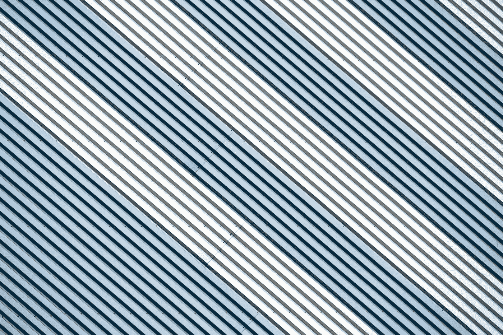
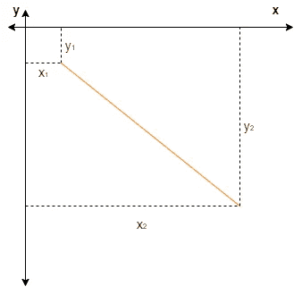
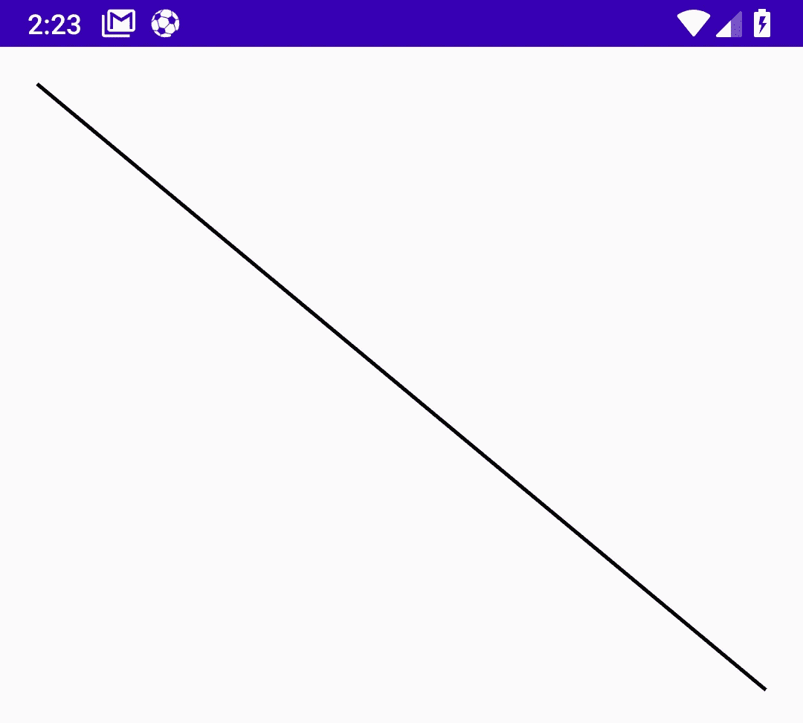
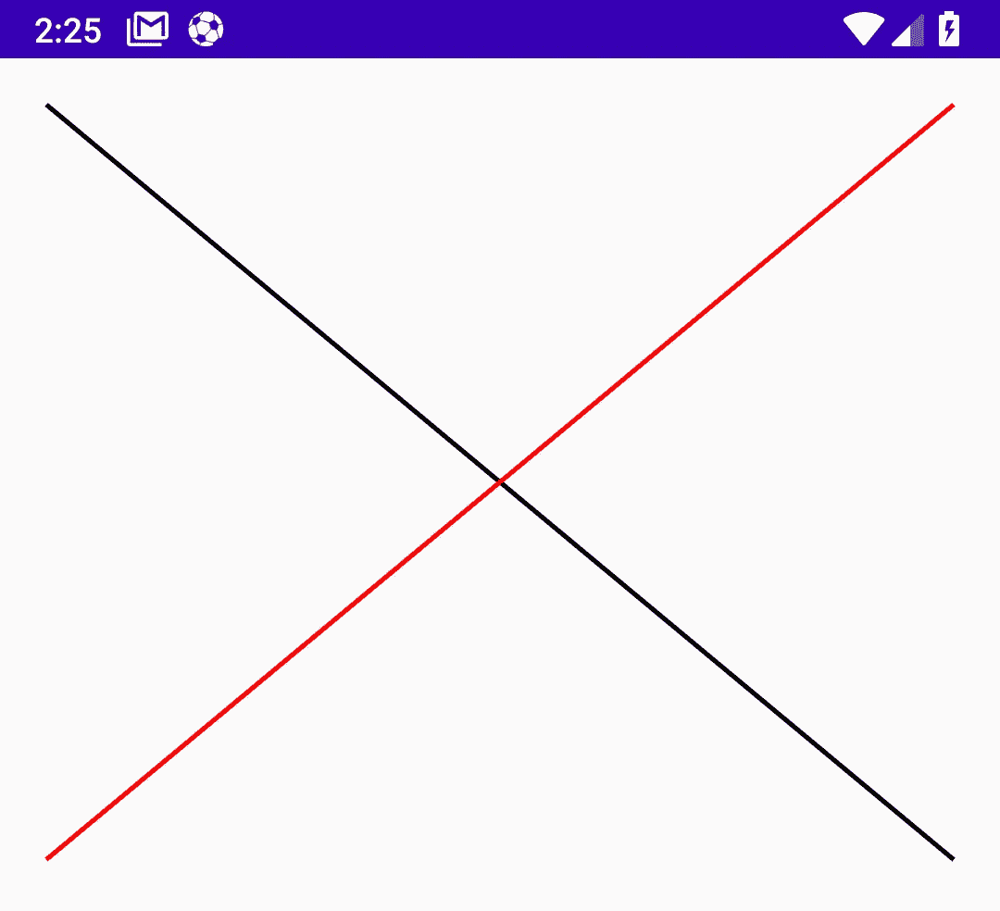
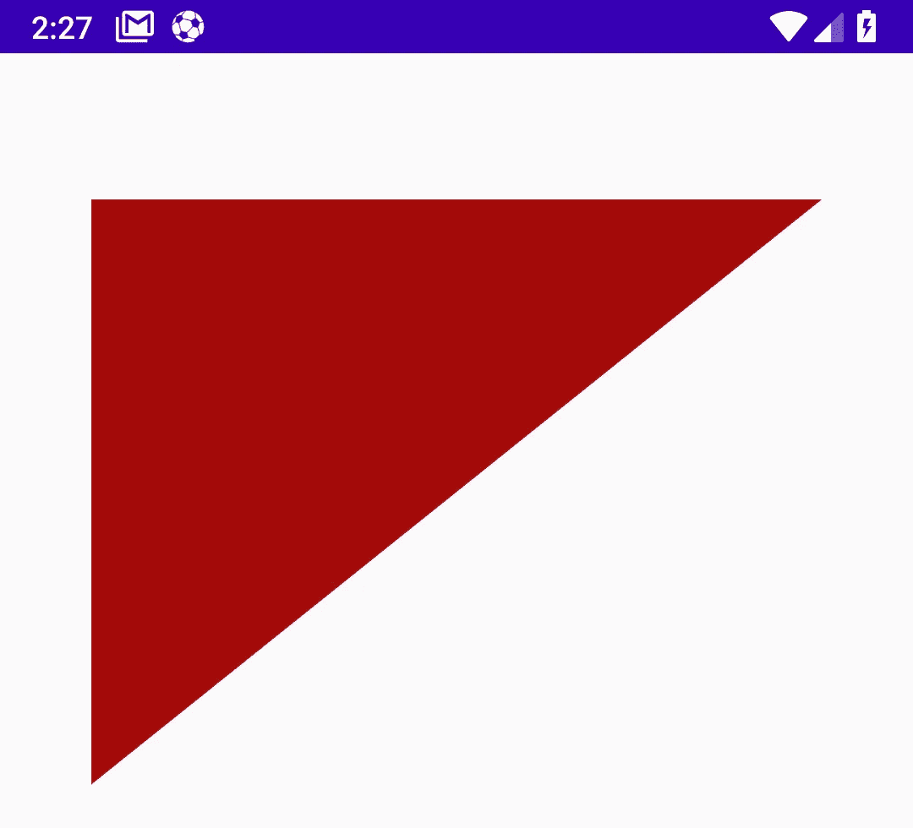
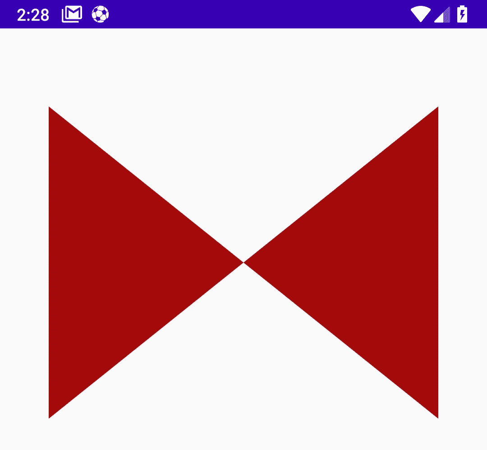
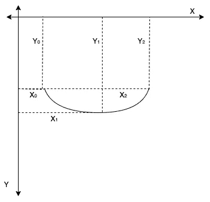
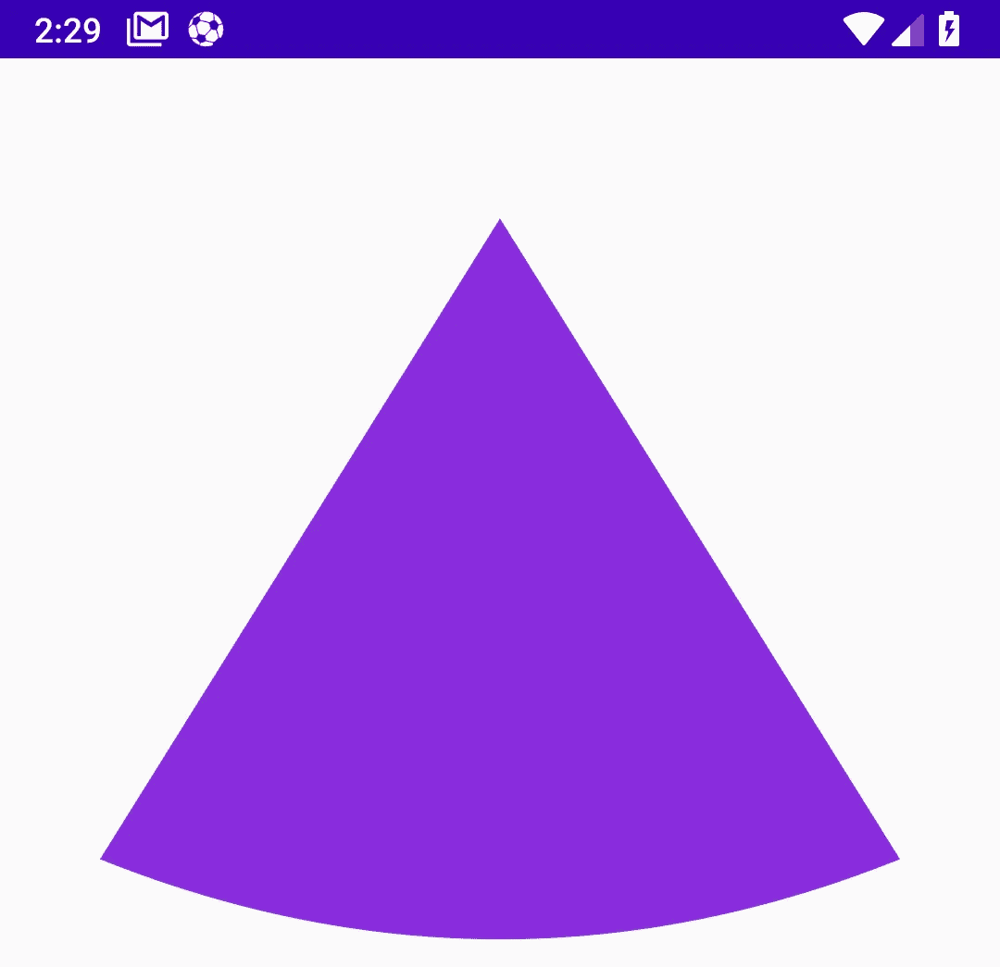

# 使用线条和路径 Android 上的自定义视图——第 3 部分

> 原文：<https://blog.devgenius.io/working-with-lines-and-paths-custom-views-on-android-part-3-80aba21a82e1?source=collection_archive---------5----------------------->



图片来源:Pixabay via Pexels。

*欢迎来到 Android 自定义视图系列的这一部分。在前面的文章中，我们将* [*引入到自定义视图*](/an-introduction-to-custom-views-on-android-part-1-4972a10fb133?source=your_stories_page----------------------------------------) *中，并在这方面建立了一个演示项目。我们还学习了* [*如何转换画布原点以减少逐点计算*](/canvas-translation-and-state-management-custom-views-on-android-part-2-1428171b4eef) *并使我们的自定义视图对变化做出反应。如果这些对你来说听起来陌生，你可能想在深入研究之前重温一下这些文章。*

在这篇文章中，我们将学习如何使用线条和路径。首先，这个系列所有文章的代码都可以在[这里](https://github.com/OlaoreFouad/blog-posts/tree/master/android/custom-views)找到，具体这一篇的代码可以在[这里](https://github.com/OlaoreFouad/blog-posts/tree/master/android/LinesPathsAndArcs)找到。既然我们现在意见一致，那就开始吧！

# 画一条线

在以前的文章中，我们讨论了在屏幕上绘制形状的条件，在这个过程中最重要的元素是 Canvas 类。现在我们已经提醒了自己这一点，让我们试着理解一条线是如何工作的。

你可能听说过一条线通常被描述为任意两点之间的最短距离。没错，因为我们在这个练习中将会用到它。要在 android 画布上画一条线，我们需要在画布上定位两个点，一个起点和一个终点。下图提供了更多背景信息:



Android 画布上线条的表示

从上图可以看出，一个点是 x 轴和 y 轴的交点(两个轴相交的地方)。第一个点`p1`是值`x1`和`y1`相交的点，对于具有其相应的`x`和`y`值的点 `p2`也是如此。至此，让我们继续检查 Canvas 类的 drawLine 方法的结构。

```
drawLine(float startX, float startY, float stopX, float stopY, Paint paint);
```

`drawLine`方法的签名需要五个参数。起点的`x`和`y`值，终点的`x`和`y`值，以及用于绘制线条本身的绘制对象。

我们首先通过扩展 View 类创建 LinesView 类，传入必要的初始化参数，并使用`@JvmOverloads`注释在 transpiled Java 版本中提供构造函数重载。(如果这些内容很奇怪，或者在这一点上还没有让您满意，您可能希望[阅读本系列的第一篇文章](/an-introduction-to-custom-views-on-android-part-1-4972a10fb133)以获得更多信息，坚持住！).

在上面的代码中，我们还创建了一个名为`firstLinePaint`的 Paint 对象。该绘制对象具有黑色(线条颜色)和 5f 的描边宽度，定义了线条的粗细。这就是我们目前所需要的，所以我们现在可以划清界限了。为此，我们创建了一个名为`drawFirstLine`的方法:

在上面的代码中，我们将`x`和`y`的起始值设置为 50f，指向离原点不太远的位置。对于停止`x`和`y`值，我们执行以下操作:

1.  x = width-50f:我们从总宽度中减去 50f，将点放在屏幕的末端，偏移 50f(从右边)
2.  y = height / 2:我们的 y 值位于视图的中心，因为我们的视图的高度被设置为`MATCH_PARENT`，这最终指向屏幕的中心。

有了这些，我们将自定义视图添加到我们的`activity_main.xml`中，以便在屏幕上查看该行。

有了这个，我们运行应用程序，屏幕上会弹出这样的结果:



安卓画布上画的一条线。

太好了！，我们已经在屏幕上画出了第一条线——看起来不错。你可能已经从我的命名惯例中猜到了(先是这个，后是那个)，可能有第二行，这就是我们现在要做的。我们的第二条线将从视图的左下角开始，在右上角结束，与第一条线在中心相交！

让我们试一试！

## 画第二条线

因此，我们首先为第二行创建一个 paint 对象，并创建一个 drawSecondLine 方法，如下所示:

从上面的代码中，你可以看到我们几乎颠倒了第一条线的坐标。起始值`X`和`Y`分别为 50f 和视图高度的一半，这意味着直线基本上从视图的中点开始。我们将停止点`X`和`Y`的值设置为距离视图右侧 50f，距离顶部 50f。最后，我们传入第二行的 paint 对象(secondLinePaint)来赋予它笔画宽度和颜色。

运行我们的应用程序后，我们得到的结果是:



机器人画布上画的两条交叉线。

这些都是在线的，虽然我还没有在复制令人望而生畏的视图中广泛使用它们，但是根据您的用例和需求，它们可能会派上用场。也就是说，让我们继续讨论路径。

# 什么是路径？

首先，深呼吸。现在，试着想象你遇到过的最复杂的视图。起初，它可能看起来太多了，令人生畏，但通常，仔细看看这个视图会让你意识到它实际上是由一堆形状、线条和角度组成的。它们不必总是规则的形状(圆形、矩形等等)，有些形状没有确切的定义，这就是路径的由来。

您需要一个形状，一个 Android 系统不提供开箱即用支持的形状，您可能应该选择一个路径。路径由直线、曲线等连接而成，从而形成一个形状。如果此刻这听起来很模糊，让我们从仔细看看路径是如何绘制的开始。

## drawPath()方法

像大多数可以在 Android 画布上绘制的元素一样，路径有一个专用的`drawPath`方法。该方法接受一个`Path`对象和一个 paint 对象来处理必要的样式。该路径与其他元素略有不同，在其他元素中，我们将坐标直接传递给“draw”调用。在这里，点、线连接和曲率之间的移动被捆绑到传递给 drawPath 方法的单一路径对象中，并依次在画布上进行绘制。

在这变得更复杂之前，让我们来看看 Path 对象是如何工作的。

## 路径初始化

Path 对象初始化如下:

```
val path = Path()
```

这是一条空路径，在这条路径上没有绘制任何东西，我们将看到两个方法，它们帮助我们绘制实际的元素，并在路径上的不同区域之间创建连接

1.  `moveTo(int x, int y)`:这个方法接受两个参数(x 和 y)。`moveTo`方法指示路径移动到指定的原点——由 X 和 y 线的交点表示的点。`moveTo`实质上是将路径的原点移动到某个位置。通常，在实际绘制路径之前，这是您想要调用的第一个方法。
2.  `lineTo(x, y)`:这也接受两个参数，它从路径中的当前位置到由值`X`和`Y`表示的点画一条线。

## 画一条直线路径

让我们从创建一个扩展视图类的自定义视图类开始，我们还初始化我们的路径并绘制对象，如下面的代码片段所示:

*注意:当设置我们的* `*pathPaint*` *对象的颜色时，我们使用了来自 color 类的静态* `*parseColor*` *方法。这可用于解析 android 系统不提供的颜色，例如颜色。红色，彩色。青色等。在十六进制格式的颜色旁路，它处理其分辨率。*

这样，我们就可以开始绘图了，我们首先向类体添加一个`drawLinedPath`方法，然后开始绘图:

在上面的代码片段中，我们使用`moveTo`方法设置我们的 path 对象的原点，路径的位置被设置为从左侧偏移 10%(宽度的 10%)和从顶部偏移 10%(高度的 10%)。我们现在可以从这里开始将原点连接到其他线。然后我们调用`drawPath`,该方法传入路径并绘制对象——这有助于在屏幕上绘制我们的对象。

我们开始使用 lineTo 方法，通过在点之间建立连接线来创建路径，如下所示:

用`moveTo`方法设置了路径的原点后，我们继续使用`lineTo`方法，传入一组位置坐标(`x`和`y`值)，这些坐标指定了应该画线的点。

例如，第一个`lineTo`调用保持与原点相同的`X`位置，但是`Y`轴位于视图的垂直中心(高度的 50%)。

第二个`lineTo`调用接受指向`X`轴的坐标为总宽度的 90%(向右)和总高度的 10%(从顶部),将线的末端放在视图的右上角。这是此刻的景象:



首先，尝试使用路径！

之后，我们继续通过以下方式连接悬挂线:

在上面的代码中，我们从上一个点(90%，50%)画一条线到视图的中心，最后将这条线再次连接到原点(10%，10%)，形成一个填充的 X，如下图所示:



一只蝴蝶？看起来像一个。:)

# 使用路径上的曲线

路径是非常强大的，正如我们上面所做的，我们用连接路径上不同点的线做了实验。我们将快速浏览一下在路径上绘制曲线，因为随着自定义视图的复杂性增加，您可能会发现自己需要一条曲线。

我们已经看了一下`moveTo`和`lineTo`方法，我们很熟悉它们的用法，要在路径上画二次曲线，我们需要`quadTo`方法。quadTo 方法由 Path 对象提供，用于绘制二次曲线。让我们来看看这个方法的签名。

```
fun quadTo(float x1, float y1, float x2, float y2)
```

quadTo 方法接受四个浮点值，`x1`和`y1`指定曲线的尖端(顶点),而`x2`和`y2`值表示曲线末端的坐标。下图提供了更多的背景信息。



在 Android 画布上绘制二次曲线的表示。

如上图所示，曲线基本上从路径上的当前点(X0，Y0)开始，从该点开始绘制(使用`quadTo`)穿过点(x1，y1)并在点(x2，y2)结束。让我们用代码来尝试一下。

## 绘制弯曲的自定义视图

我们首先创建一个扩展 View 类的类，并添加所有必需的变量和方法，如下所示:

目前我们所有的是我们的空路径对象，路径的油漆和一个`drawCurvedPath`方法。让我们给`drawCurvedPath`方法添加一些行为。我们首先使用 moveTo 方法设置路径的原点

我们将原点设置在视图的正中间，从顶部偏移 10%。从原点，我们画一条线到视图的垂直中心，如下所示:

现在，该画我们的曲线了，我们在画完线后添加一个对 quadTo 函数的调用，如下面的代码片段所示:

在上面的代码中，我们从路径上的当前点到曲线的终点(90%，50%)绘制了一条曲线，该曲线在(50%，60%)处与顶点(中心)相交。这给了我们一条完美的曲线，因为我们通过从曲线的末端画一条线回到路径本身的原点来完成整个绘制过程。这为我们提供了如下图所示的结果:



在 Android 画布上绘制的弯曲路径。

## 从这里我该走哪条路？

正如我之前提到的，当您需要创建令人生畏的自定义视图时，知道如何使用线条和路径会有很大帮助，但您总是可以做得更好。一个很好的起点是看一下关于路径的 [android 文档，并查看这篇博文中没有涉及的其他实用方法。像`cubicTo`、`reset`、`rewind`、`op`和 `r’`这样的方法非常方便，可以增强您的定制视图技能。更重要的是，不要忘记练习。](https://developer.android.com/reference/android/graphics/Path)

如果你觉得这篇文章很有趣，别忘了鼓掌和分享。如果你有任何问题，请在评论区给我留言，联系我或者在 Twitter 上给我标记你的问题，我很乐意为你做贡献。

感谢阅读！