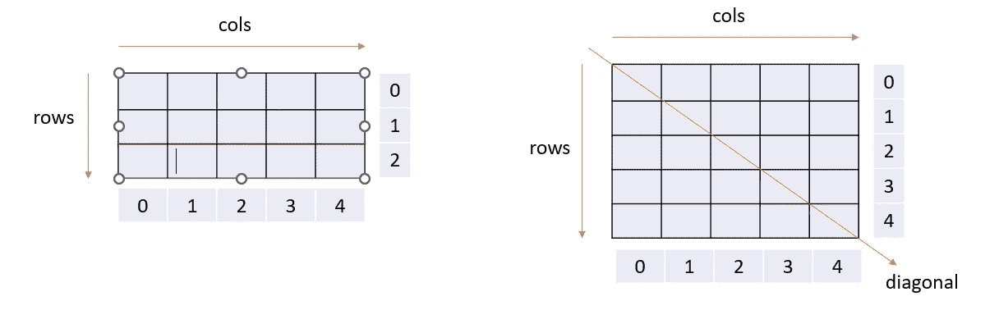
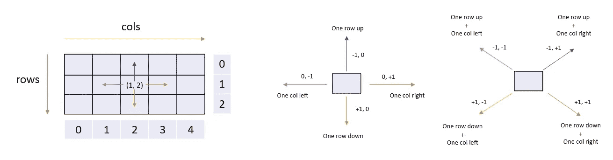
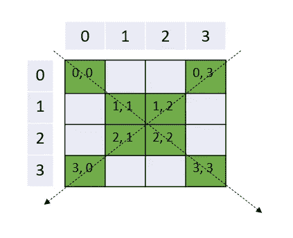
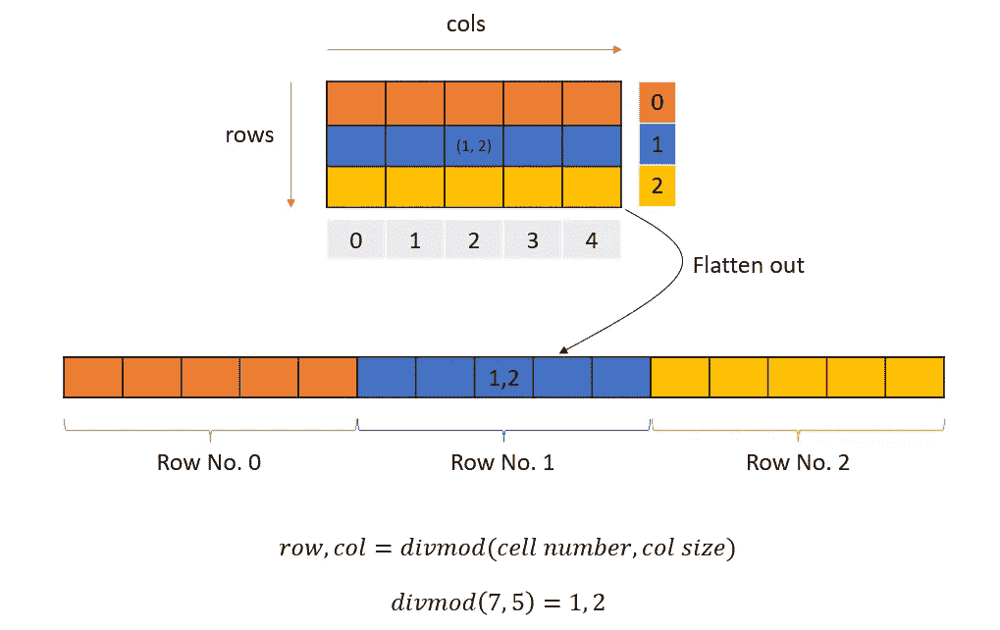
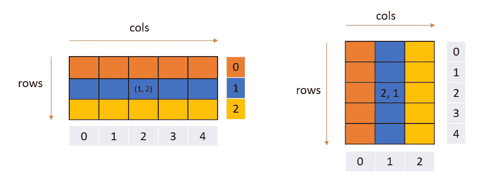
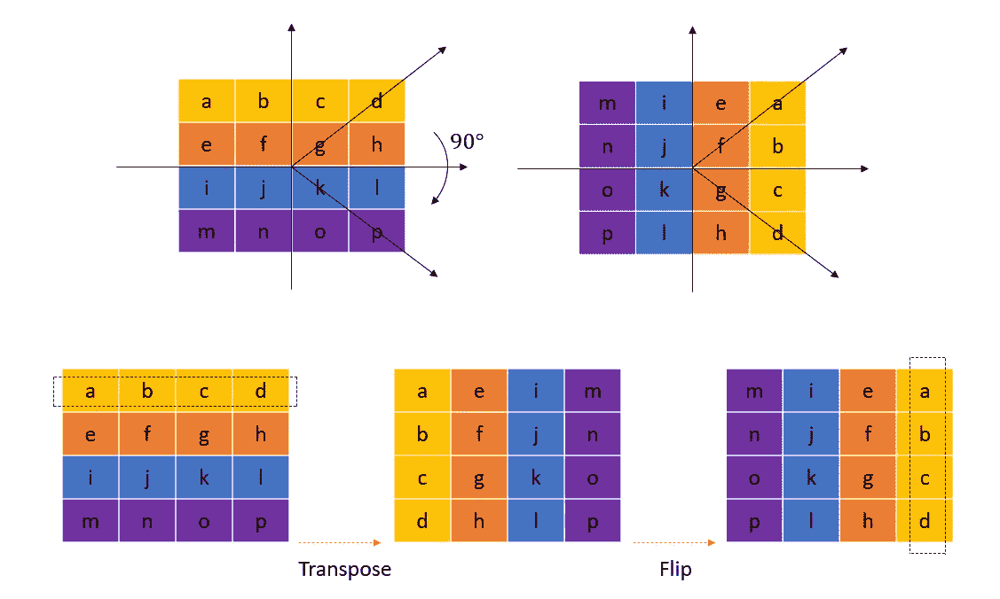

# 在 Python 中使用矩阵 Cheatsheet

> 原文：<https://blog.devgenius.io/working-with-matrix-in-python-cheatsheet-2654835d9dc7?source=collection_archive---------2----------------------->


照片由[弗拉多·帕诺维奇](https://unsplash.com/@vlado?utm_source=unsplash&utm_medium=referral&utm_content=creditCopyText)在 [Unsplash](https://unsplash.com/s/photos/matrix?utm_source=unsplash&utm_medium=referral&utm_content=creditCopyText) 上拍摄

理解矩阵运算。

矩阵是一个二维数组。矩阵通常用来表示一个图(邻接矩阵)或动态编程状态。矩阵也用于模拟游戏，如井字游戏、数独、纵横字谜、战舰等。

我们可以用 python 生成一个全零的 m * n 矩阵，如下所示:

`matrix = [[0 for _ in range(n)] for _ in range(m)]`

## 矩阵的遍历



矩阵属性—行、列、对角线

下面的代码描述了遍历矩阵的逻辑。

```
matrix = [
    ['a', 'b', 'c', 'd'], 
    ['e', 'f', 'g', 'h'], 
    ['i', 'j', 'k', 'l'], 
    ['m', 'n', 'o', 'p']
    ]

m, n = len(matrix), len(matrix[0]) # get matrix size

for i in range(m): # iterate through rows
    print(f"Row No:=====> {i}")
    for j in range(n): # iterate through cols
        print(f"\t Col No {j}")
```

## 按列遍历

```
matrix = [
    [1, 2, 3, 4], 
    [5, 6, 7, 8], 
    [9, 10, 11, 12], 
    [13, 14, 15, 16]
    ]

for col in zip(*matrix):
    print(*col)

# alternative

m, n = len(matrix), len(matrix[0])
for col in range(n):
    for row in range(m):
        print(matrix[row][col], end=' ')
    print()
```

[检查所有行和列中的所有数字是否都存在](https://leetcode.com/problems/check-if-every-row-and-column-contains-all-numbers)

## 遍历像元的邻居



矩阵从一个单元向不同方向移动

下面的代码描述了遍历相邻单元格的代码。

```
matrix = [
    ['a', 'b', 'c', 'd'], 
    ['e', 'f', 'g', 'h'], 
    ['i', 'j', 'k', 'l'], 
    ['m', 'n', 'o', 'p']
    ]

row, col = (1, 2)  # current position
directions = [
    (0, 1), # right
    (1, 1), # right down
    (1, 0), # down
    (1, -1), # down left
    (0, -1), # left
    (-1, -1), # left up
    (-1, 0), # up
    (-1, 1) # right, up
    ]
print(f"Current cell: {matrix[row][col]}")

for dx, dy in directions:
    new_row, new_col = row + dx, col + dy
    if 0 <= new_row < m and 0<=new_col<n: # boundary check
        print(f"New Pos {(new_row, new_col)}: {matrix[new_row][new_col]}")
```

[矩阵中的最大局部值](https://leetcode.com/problems/largest-local-values-in-a-matrix)
[二进制矩阵中的特殊位置](https://leetcode.com/problems/special-positions-in-a-binary-matrix)
[矩阵中的幸运数字](https://leetcode.com/problems/lucky-numbers-in-a-matrix)
[图像更平滑](https://leetcode.com/problems/image-smoother)

## 矩阵的对角单元



对角遍历

矩阵中的对角元素满足以下两个约束之一

`1\. i == j 2\. j == n-i-1`

```
matrix = [
    [1, 2, 3, 4], 
    [5, 6, 7, 8], 
    [9, 10, 11, 12], 
    [13, 14, 15, 16]
    ]

m, n = len(matrix), len(matrix[0])
for i in range(m):
    for j in range(n):
        if j == i or j == n-i-1:
            print(matrix[i][j])
```

[X 矩阵](https://leetcode.com/problems/check-if-matrix-is-x-matrix/)

## 最大的魔方

一个`k x k` **幻方**是一个填充了整数的`k x k`网格，使得每行总和、每列总和以及两个对角线总和**都等于**。魔方**中的整数不必是不同的**。每一个`1 x 1`格子都是一个**魔方**。

给定一个`m x n`整数`grid`，返回*在此网格*内可以找到的 ***最大魔方*** *的***(即边长* `k` *)。**

```
*class Solution:
    def largestMagicSquare(self, grid: List[List[int]]) -> int:
        m, n = len(grid), len(grid[0])
        size = min(m, n)
        for k in range(size, 0, -1):
            for i in range(m-k+1):
                for j in range(n-k+1):
                    if self.is_magic_square(grid, i, j, k):
                        return k

    def is_magic_square(self, grid, x, y, k):
        diag_sum, anti_diag_sum  = 0, 0
        for i in range(k):
            diag_sum += grid[x+i][y+i]
            anti_diag_sum += grid[x+i][y+k-i-1]
        if diag_sum != anti_diag_sum:
            return False

        for i in range(k):
            row_sum = sum(grid[x+i][y:y+k])
            if row_sum != diag_sum:
                return False
            col_sum = sum((grid[x+j][y+i] for j in range(k)))
            if col_sum != diag_sum:
                return False
        return True*
```

*注意:上述解决方案可以通过使用前缀 sum 进行优化。因为这个博客是关于矩阵的，所以我把它留在这里。阅读我的另一篇解释前缀总和的博客。*

## *对列表进行模运算以生成矩阵*

**

*矩阵扁平化*

*以下代码描述了从展平矩阵创建 m * n 维矩阵的代码。*

```
*flattened = [1, 2, 3, 4, 5, 6, 7, 8, 9, 10, 11, 12, 13, 14, 15]
print(f"Flattened :\n{flattened}")

m, n = 3, 5

matrix = [['' for _ in range(n)] for _ in range(m)]

for idx, val in enumerate(flattened):
    row, col = divmod(idx, n)
    matrix[row][col] = val

print(f"Matrix:\n{matrix}")*
```

*[将 1D 转换为 2D 阵列](https://leetcode.com/problems/convert-1d-array-into-2d-array)*

## *螺旋矩阵*

*给定一个`m x n` `matrix`，按照螺旋顺序返回 `matrix` *的所有元素*。***

```
*class Solution:
    def generateMatrix(self, n: int) -> List[List[int]]:
        res = [[0]*n  for i in range(n)]
        top, bottom, left, right = 0, n-1, 0, n-1
        move=1
        elem = 1

        while left <= right and top <= bottom:
            if move==1:
                for i in range(left, right+1):
                    res[top][i] = elem
                    elem += 1
                top += 1

            elif move==2:
                for i in range(top, bottom + 1):
                    res[i][right] = elem
                    elem += 1
                right -= 1
            elif move==3:
                for i in range(right, left-1, -1):
                    res[bottom][i] = elem
                    elem += 1
                bottom -= 1
            else:
                for i in range(bottom, top-1, -1):
                    res[i][left] = elem
                    elem += 1
                left += 1;
            move += 1;

            move=move%4

        return res*
```

## *转置矩阵*

*矩阵的转置是通过将矩阵的行交换成列或者将列交换成行来实现的。*

**

*矩阵转置*

*下面的代码描述了转置矩阵的逻辑。*

```
*matrix = [
    ['a', 'b', 'c', 'd'], 
    ['e', 'f', 'g', 'h'], 
    ['i', 'j', 'k', 'l'], 
    ['m', 'n', 'o', 'p']
    ]

print(f"Current Matrix:\n{matrix}")

transpose = []

for row in zip(*matrix):
    transpose.append(list(row))

print(f"Transposed Matrix:\n{transpose}")*
```

## *顺时针旋转矩阵 90 度*

**

*下面的代码描述了顺时针旋转矩阵 90 度的逻辑。为此，我们转置并沿着转置矩阵的中间翻转列值。*

```
*matrix = [
    ['a', 'b', 'c', 'd'], 
    ['e', 'f', 'g', 'h'], 
    ['i', 'j', 'k', 'l'], 
    ['m', 'n', 'o', 'p']
    ]

print(f"Current Matrix:\n{matrix}")

transpose = []

for row in zip(*matrix):
    transpose.append(list(row))

print(f"Transposed Matrix:\n{transpose}")

m, n = len(transpose), len(transpose[0])

for i in range(m):
    for j in range(n//2):
        transpose[i][j], transpose[i][n-j-1] = transpose[i][n-j-1], transpose[i][j]

print(f"Flipped Matrix:\n{transpose}")*
```

*[检查是否可以通过旋转获得矩阵](https://leetcode.com/problems/determine-whether-matrix-can-be-obtained-by-rotation)*

## *最左边至少有一个 1 的列*

***按行排序的二进制矩阵**意味着所有元素都是`0`或`1`，矩阵的每一行都按非降序排序。*

*给定一个**行排序的二进制矩阵** `binaryMatrix`，返回*最左边* ***列*** *的索引(0 索引)，其中*为 1。如果这样的索引不存在，返回`-1`。*

*用不到一维的乘积解决这个问题。*

```
*class Solution:
    def leftMostColumnWithOne(self, binaryMatrix: 'BinaryMatrix') -> int:
        rows, cols = binaryMatrix.dimensions()

        current_row = 0
        current_col = cols - 1

        while current_row < rows and current_col >= 0:
            if binaryMatrix.get(current_row, current_col) == 0:
                current_row += 1
            else:
                current_col -= 1

        return current_col + 1 if current_col != cols - 1 else -1*
```

*[车可用的捕获](https://leetcode.com/problems/available-captures-for-rook)*

*在一个`8 x 8`棋盘上，有**正好一个**白车`'R'`和一些白象`'B'`，黑卒`'p'`，以及空方格`'.'`。*

*当车移动时，它选择四个基本方向中的一个(北、东、南或西)，然后朝那个方向移动，直到它选择停止，到达棋盘边缘，抓住一个黑色棋子，或被一个白色主教阻挡。如果一辆车在它的回合中可以抓住一个兵，那么它被认为是在攻击一个兵。白车可用的**数量**是白车正在**攻击**的兵的数量。*

*返回*白车*可用的 *数量的* ***。****

```
*class Solution:
    def numRookCaptures(self, board: List[List[str]]) -> int:
        for i in range(8):
            for j in range(8):
                if board[i][j] == 'R':
                    rook_x, rook_y = i, j
        res = 0
        for dx, dy in [(1, 0), (0, 1), (-1, 0), (0, -1)]:
            x, y = rook_x + dx, rook_y + dy
            while 0 <= x < 8 and 0 <= y < 8:
                if board[x][y] == 'p': 
                    res += 1
                if board[x][y] != '.': 
                    break
                x, y = x + dx, y + dy
        return res*
```

*[三维形状的表面积](https://leetcode.com/problems/surface-area-of-3d-shapes)*

*给你一个`n x n` `grid`，在那里你放置了一些`1 x 1 x 1`立方体。每个值`v = grid[i][j]`代表放置在单元格`(i, j)`顶部的`v`立方体塔。*

*放置这些立方体后，您决定将任何直接相邻的立方体相互粘合，形成几个不规则的 3D 形状。*

*返回*最终形状的总表面积*。*

***注:**每个形状的底面计入其表面积。*

```
*class Solution:
    def surfaceArea(self, grid: List[List[int]]) -> int:
        l = len(grid)
        area = 0
        for row in range(l):
            for col in range(l):
                if grid[row][col]:
                    area += (grid[row][col]*4) +2 
                if row:
                    area -= min(grid[row][col],grid[row-1][col])*2 
                if col:
                    area -= min(grid[row][col],grid[row][col-1])*2 
        return area*
```

## *合计到目标的子矩阵的数量*

*给定一个`matrix`和一个`target`，返回总和为 target 的非空子矩阵的数量。*

*子矩阵`x1, y1, x2, y2`是具有`x1 <= x <= x2`和`y1 <= y <= y2`的所有单元`matrix[x][y]`的集合。*

*如果两个子矩阵`(x1, y1, x2, y2)`和`(x1', y1', x2', y2')`具有不同的坐标，则它们是不同的:例如，如果`x1 != x1'`。*

```
*from collections import defaultdict
class Solution:
    def numSubmatrixSumTarget(self, matrix: List[List[int]], target: int) -> int:
        r, c = len(matrix), len(matrix[0])

        ps = [[0] * (c + 1) for _ in range(r + 1)]
        for i in range(1, r + 1):
            for j in range(1, c + 1):
                ps[i][j] = ps[i - 1][j] + ps[i][j - 1] - ps[i - 1][j - 1] + matrix[i - 1][j - 1]

        count = 0

        for r1 in range(1, r + 1):
            for r2 in range(r1, r + 1):
                h = defaultdict(int)
                h[0] = 1

                for col in range(1, c + 1):
                    curr_sum = ps[r2][col] - ps[r1 - 1][col]
                    count += h[curr_sum - target]
                    h[curr_sum] += 1
        return count*
```

## *矩阵要验证的拐角情况:*

*   *空矩阵。检查所有数组的长度都不是 0*
*   *1 x 1 矩阵*
*   *只有一行或一列的矩阵*

*编码快乐！！*