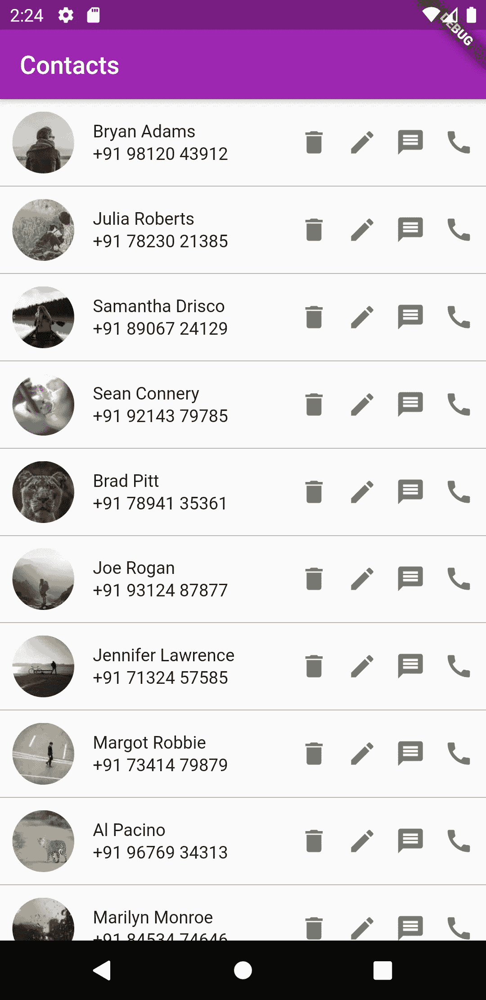

# 与提供者合作:第 1 部分

> 原文：<https://blog.devgenius.io/working-with-providers-part-1-8edb5aa0e169?source=collection_archive---------0----------------------->

## Flutter 中的供应商介绍。


由[路](https://unsplash.com?utm_source=medium&utm_medium=referral)上[车头](https://unsplash.com/@headwayio?utm_source=medium&utm_medium=referral)拍摄

> 注意:我们将在我之前的文章中创建的联系人应用程序项目的基础上进行构建:

[](https://medium.com/dev-genius/understanding-futurebuilder-in-flutter-491501526373) [## 了解颤振中的未来建筑

### 因为您的构建方法不能是异步的

medium.com](https://medium.com/dev-genius/understanding-futurebuilder-in-flutter-491501526373) 

在本文中，我们将讨论 Flutter 中的提供者和状态管理。

[提供者](https://pub.dev/packages/provider)包是用于状态管理的 InheritedWIdget 的包装器。使用 provider，我们可以在小部件树中放置一个状态对象，并使它可以从任何其他后代小部件中访问。 [Provider](https://pub.dev/packages/provider) 也帮助管理状态对象的生命周期，方法是用数据初始化它们，并在它们从 widget 树中删除后进行清理。 [Provider](https://pub.dev/packages/provider) 甚至可以用来实现 BLoC 组件，或者作为[其他](https://flutter.dev/docs/development/data-and-backend/state-mgmt/options)状态管理解决方案的基础！或者它可以简单地用于[依赖注入](https://en.wikipedia.org/wiki/Dependency_injection)，这是一个将数据传递到小部件的时髦术语。

## 添加插件

让我们从添加[提供者](https://pub.dev/packages/provider)插件到我们的 flutter 项目开始。

转到您的 pubspec.yaml 文件并查找 *cupertino_icons* 插件。在此之下，你可以添加你的应用程序需要的任何插件。因此，让我们继续在这里添加提供者包。

```
cupertino_icons: ^1.0.0
provider: ^4.3.2+2
```

完成后，运行 pub get 命令。如果你使用 Android Studio，你会在右上角看到 Pub get 选项。如果您使用 VS 代码，那么如果您保存文件，该命令会自动运行。

## 添加更改通知程序

既然我们已经将提供者包添加到我们的项目中，让我们继续使用它。在我们开始消费数据之前，我们需要实现一个 ChangeNotifier。当我们的联系人列表中添加、更新或删除了某些内容时，它会告诉所有使用这些数据的小部件。

我们在 lib 中创建一个名为 provider 的新文件夹，并在其中创建一个名为 contact-provider.dart 的文件。

```
*import* '../model/contact.dart';
*import* 'package:flutter/material.dart';

*class* ContactProvider *extends* ChangeNotifier {
  List<Contact> _contactList = [];

  List<Contact> *get* contacts {
    *return* [..._contactList];
  }

  *set* contacts(List<Contact> newContacts) {
    _contactList = newContacts;
    notifyListeners();
  }

  *void* addContact(Contact newContact) {
    _contactList.add(newContact);
    notifyListeners();
  }

  *void* removeContact(int index) {
    _contactList.removeAt(index);
    notifyListeners();
  }
}
```

让我们了解一下这里发生了什么。

首先，我们创建我们的 *ContactProvider* 类，并让它扩展 *ChangeNotifier。*这使我们能够访问 *notifyListeners()* 方法，我们将使用该方法来更新应用程序中的数据。

我们有一个私有的联系人列表，可以使用 getter 和 setter 来访问。除此之外，我们还有 *addContact()* 和 *removeContact()* 方法，这些方法非常简单明了。在这些方法中，您将看到我们使用了 *notifyListeners()* 方法，每当添加或删除联系人时，该方法都会更新小部件。

完成后，我们转到 main.dart 文件，将 MaterialApp 包装在一个 *MultiProvider()* 小部件中。在 *MultiProvider* 中，我们声明了我们希望在应用程序中使用的所有提供者的列表。

我们的 main.dart 文件应该是这样的:

```
*import* 'package:contacts_app/provider/contact-provider.dart';
*import* 'package:flutter/material.dart';
*import* 'package:provider/provider.dart';
*import* 'contacts-page.dart';

*void* main() {
  runApp(MyApp());
}

*class* MyApp *extends* StatelessWidget {
  @override
  Widget build(BuildContext context) {
    *return* MultiProvider(
      providers: [
        ChangeNotifierProvider.value(value: ContactProvider()),
      ],
      child: MaterialApp(
        title: 'Flutter Demo',
        theme: ThemeData(
          primarySwatch: Colors.*purple*,
          visualDensity: VisualDensity.*adaptivePlatformDensity*,
        ),
        home: ContactsPage(),
      ),
    );
  }
}
```

## 使用提供程序

现在我们已经设置好了更改监听器，让我们回到 contact-page.dart 文件。我们修改了 *_getContacts()* 方法，以便在获取联系人列表时更新提供者。

```
*void* _getContacts() *async* {
  *await* Future.delayed(Duration(milliseconds: 200));
  ContactProvider contactProvider = Provider.*of*<ContactProvider>(context, listen: *false*);
  contactProvider.contacts = dummyData;
}
```

我们初始化提供者并更新提供者中的联系人。请记住，在初始化提供程序时，请将 listen 参数设置为 false。您只是使用提供程序来访问您的数据，而不是监听更改。

现在我们已经获得了数据，剩下的下一件事就是在我们的 ListView 中使用这些数据。我们在 *_buildListView()* 方法中实现了这一点。

```
Widget _buildListView() {
  *return* Consumer<ContactProvider>(
    builder: (__, model, _) {
      *return* ListView.builder(
        itemBuilder: (_, index) {
          *return* ContactCard(model.contacts[index]);
        },
        itemCount: model.contacts.length,
      );
    },
  );
}
```

我们将 ListView 包装在一个 *Consumer < T > ()* 小部件中，其中的类型是 ContactProvider。消费者构建器函数为我们提供了上下文、模型和子变量。因为我们不需要上下文或子变量，所以我们将它们初始化为丢弃变量。我们关注的主要领域是模型。这为我们提供了用来填充 ListView 的联系人。您可以在下面看到我们联系人列表的用户界面。



联系人列表用户界面

## 包裹

在这篇文章中，我们了解了如何使用提供者、消费者和一些关于变更通知者的信息。我们用它来创建我们的 conacts 应用程序。在下一篇文章中，我们将看看如何添加一个新的联系人，更新一个现有的联系人，以及从我们的联系人列表中删除联系人。

一如既往，如果你喜欢这个，请通过鼓掌和评论让我知道。此外，请随意评论您希望我在下一篇文章中涵盖的主题。在那之前，编码快乐！

你可以在这里查看完整的代码:

[](https://github.com/stef0296/contacts_app) [## stef 0296/联系人 _ 应用程序

### 这个项目是一个 Flutter 应用程序的起点。一些帮助您入门的资源…

github.com](https://github.com/stef0296/contacts_app) 

资源:

1.  [简单的 app 状态管理](https://flutter.dev/docs/development/data-and-backend/state-mgmt/simple)
2.  [仔细查看提供商产品包](https://medium.com/flutter-nyc/a-closer-look-at-the-provider-package-993922d3a5a5)
3.  [了解所有这些颤振供应商](https://medium.com/flutter-community/making-sense-all-of-those-flutter-providers-e842e18f45dd)