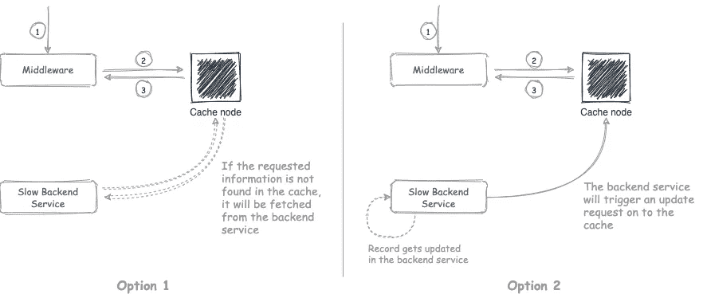
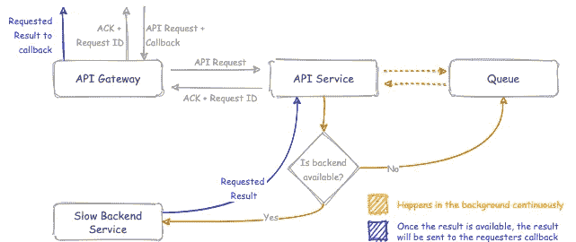
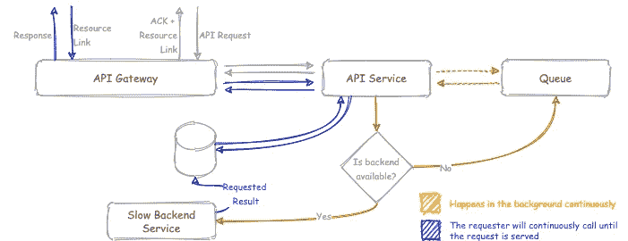
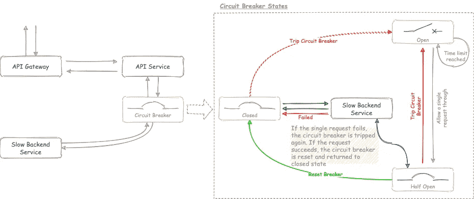

# 使用慢速后端

> 原文：<https://blog.devgenius.io/working-with-slow-backends-d94575ad12d3?source=collection_archive---------5----------------------->

加里·巴特菲尔德在 [Unsplash](https://unsplash.com/?utm_source=unsplash&utm_medium=referral&utm_content=creditCopyText) 上的照片

W 无论何时，当你接受一个与现有后端系统相关的企业中间件任务时，你一定会在盒子里发现一两个插孔。但是，当您遇到一个既不能升级也不能替换的缓慢而关键的软件时，您知道您已经找到了反模式的圣杯。

尽管令人生畏，但也不是没有补救办法。通常，一个欠考虑的设计会使情况变得更糟。我在这里试图提出的是一些设计考虑，如果你曾经遇到过同样不幸的情况，你可以尝试一下。

## 我们到了吗？—响应缓存

在分析后端服务收到的流量时，您可能会注意到一些重复的查询请求，这些请求用于检查某些东西的状态。例如，如果您采用客户服务后端，可能会有检查客户是否活跃的请求？或者顾客的忠诚度类型。现在，这些信息不会经常改变。这些类型的请求非常适合缓存。
首先，我们可以考虑两种设置缓存的方式。第一个选项是最简单的，它不依赖于后端服务。当缓存节点被请求它没有的信息时，它将从慢速后端获取这些信息，更新缓存并将其返回给请求者。
第二个选项是无论后端数据何时更新，缓存都会更新。这需要与后端服务集成，后端服务应该能够调用缓存节点上的 API，或者应该具有可以被处理以提取所需信息的日志。
当然，理想的解决方案是这两个选项的混合，但是很少有理想的解决方案。

## 我能捎个口信吗？使用回调和资源链接

有一点你将会明白，生活中的每一件事都有其相关的优先级，API 调用也不例外。并非所有的 API 调用都需要立即得到服务。有时，确认 API 调用并提供一种稍后跟踪服务状态的方法是最好的做法。虽然回调是主动的，而资源链接是被动的，但回调和资源链接都可以用来实现相同的目标。它们都有其固有的优点和缺点。
回调是在服务器上注册的客户端 URL。API 服务会确认客户端的请求，但不会立即响应所请求的信息。API 服务等待，直到慢速后端服务可用，并处理请求的信息，然后将其推送到回调 URL。

使用回调

资源链接是由服务为服务器端创建的资源提供的书签。资源链接与回调之间的主要区别在于，客户端需要调用资源链接来检查请求的操作是否完成。

使用资源链接

这两个选项都基于异步消息传递的概念。

## 可预测的故障—断路器

断路器模式得名于，你猜对了，一个断路器！。你家的断路器基于一个热磁条工作，该热磁条被设计成在某一点失效，保护你的家免受电涌的影响。这种设计原则被称为可预测故障。

你家里的断路器的主要好处是保护你的家免受突然的电涌。然而，断路器模式略有不同。首先，您可以根据延迟模式来决定断路器的可预测故障。通常，在决定故障点时，需要考虑两个参数，即失败请求的数量和延迟阈值。为了便于论证，假设延迟阈值为 5000ms，失败计数为 3。这意味着，如果 3 个请求的响应时间超过 5000 毫秒，断路器将跳闸。另一个参数是超时时间。当超时时间到达时，断路器将让一个请求通过，并检查后端是否有响应。如果是这样，它将重置断路器或再次使其跳闸。

想象一下，没有断路器，后端服务没有响应或很慢。任何传入的请求都必须等待 5000 毫秒才能知道请求已经超时。这最终会导致资源枯竭，堵塞系统。断路器的作用是提供一种快速故障和可预测故障的方法。
有时候，如果你还能守住要塞，失去一两个前哨站也没关系。

缓慢的后端系统经常被误解为野兽，有点像食人魔。他们速度慢或不可用的原因通常是他们的业务关键。这些系统收到的请求数量超过了它们所能处理的数量，导致这些系统运行缓慢或不可用。我在这里提出的解决方案基于两个因素。第一，减少到达后端的请求数量。第二，避免在后端服务已经超负荷的时候加载它(避免高峰时间)。虽然你可能无法摆脱这头野兽，但你可能会学会与它共处。