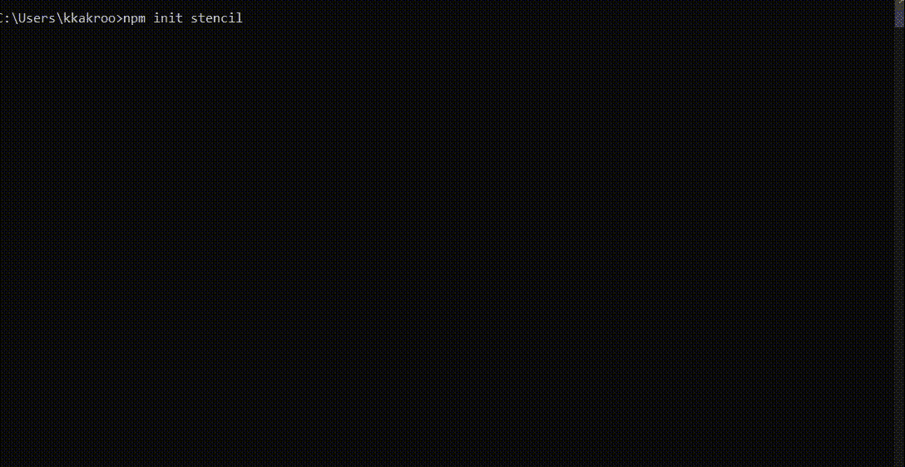
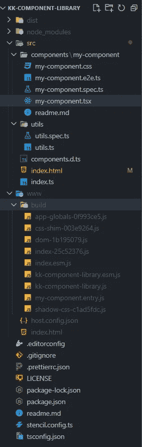
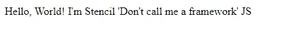
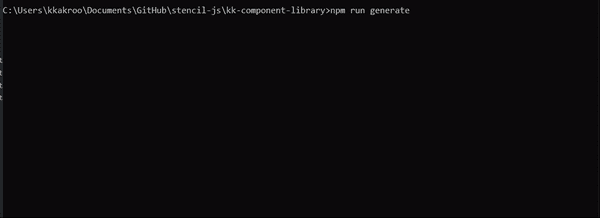
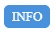

# 使用模板 JS

> 原文：<https://blog.devgenius.io/working-with-stenciljs-a4d75f7b1131?source=collection_archive---------1----------------------->

StencilJS 如何简化 Web 组件的使用


在上一篇文章中，我们了解了什么是 web 组件，以及像 StencilJS 这样的工具链的需求是什么。

[](https://medium.com/@kkakroo/what-are-web-components-cbfdf08c35a9) [## 什么是 Web 组件

### 什么是 Web 组件以及如何开始使用它们。

medium.com](https://medium.com/@kkakroo/what-are-web-components-cbfdf08c35a9) 

在本文中，我们将看到 Stencil 提供了什么，以及我们如何开始使用它。

> Stencil 是一个工具链，用于构建可重用、可扩展的设计系统。生成运行在每个浏览器上的小型、超快的、100%基于标准的 Web 组件。

## 什么是模板

它是一个帮助我们构建 Web 组件的编译器，它将多个框架的最佳概念整合到一个简单的构建时工具中。

它是由 Ionic 框架团队创建的，让 web 兼容开箱即用，以更快地构建跨多个框架工作的组件。

它有很多惊人的功能，但我最喜欢的三个是

*   虚拟 Dom- DOM 操作是昂贵的。
*   JSX-简单直观，非常容易上手。
*   打字稿——必须在编译时抓住它们(^-^).)

Stencil 提供了一个不错的开发人员体验，包括一个 cli、实时重载和一个内置在编译器中的开发服务器。

## 探索模具 CLI

为了创建一个模板项目，我们使用下面的命令

```
npm init stencil
```



使用模具 CLI

我们现在将继续使用组件库，并将选择第三个选项。

它生成如下所示的项目结构。我们将浏览项目结构，并试图理解它是如何组织的。



`src`文件夹包含`components`，它有一个默认生成的样本组件`my-component`。我们稍后将详细讨论它。

`utils`文件夹中有`util.ts`文件，这只是一个展示我们如何为多个组件提供通用功能的例子。

`components.d.ts`拥有这个项目中所有组件的类型声明。这个文件是自动生成的。

`index.html`用于测试我们已经创建的 web 组件，而`index.ts`是入口点。

`www`包含`build`文件夹，其中包含所有组件的`esm.js`和`js`包

`stencil.config.ts`是一个重要的文件，让我们与编译器交互，调整它生成的输出，进行框架集成等等。它不需要任何更新，除非我们试图做一些具体的事情。

我们通过运行来运行解决方案

```
npm run start
```

这会运行项目，我们会得到如下的默认输出



这是从`index.html`文件渲染的

由于第 8 行*中的模块导入，`my-component`被注册为 web 组件。*

因此，如果我们使用这个`js`文件作为导入，我们就可以使用这些 web 组件，而不用考虑框架，并且我们每次都会有一致的行为。

你可以尝试自己添加下面的`src`标签到任何项目，并使用`my-component`标签。

样品反应项目消耗`my-component`可以在这里找到[。](https://codesandbox.io/s/stencil-web-component-with-react-ujfjz)

这有一个非常强大的应用程序，因为`js`文件不是消费项目的一部分，可以从外部更新，从而利用这些 web 组件对项目进行零部署更新。

像 [single-spa](https://single-spa.js.org/) (使用 System.js)和[module Federation](https://webpack.js.org/concepts/module-federation/)(web pack 的一个特性)这样的技术正在通过远程模块解决微前端开发的方法。

我们也可以创建一个模板项目的 npm 包，如果我们愿意的话，就这样使用它。

## 创建自定义组件

现在我们将创建一个样本徽章组件`kk-badge`，并尝试理解模板必须提供什么。

我们通过运行命令来实现这一点。

```
npm run generate
```



模板组件看起来像是多个框架的混合。我们有 angular 常见的`decorators`和 React 用的`JSX`。

在第 3 行，我们可以看到装饰器声明了一个新的 web 组件。

*第 12 行*用`@Prop()` decorator 定义了一个属性，它声明了一个暴露的属性/特性。道具的任何变化都会触发重新渲染。默认情况下，道具是不可变的。

`@State()`是声明组件内部状态的装饰器。状态的变化也会触发重新渲染。

`Host`是模板公开的虚拟组件，用于设置元素的属性。

`<slot>`用于渲染特定位置的动态子对象。在这里，我们可以通过`<kk-badge type='info'>Info</kk-badge>`使用这个槽，它将文本*信息*呈现在徽章内。



kk-徽章渲染

通过使用 [this](https://quirky-babbage-abdccd.netlify.app/kk-component-library/kk-component-library.esm.js) 作为带有`type="module"`的`script`标签的 src，自己尝试一下。这里可以找到工作示例[。](https://codesandbox.io/s/badge-consume-x5myu?file=/index.html)

它们有组件生命周期方法，通过这些方法，我们可以在组件渲染/重新渲染的不同阶段执行不同的操作。

Stencil 还为组件提供了一个 API 来发出事件，并使用`Event()`和`Listen()`装饰器来监听它们。

## 框架绑定

这些 web 组件可以在具有不同框架的现有应用程序中使用，但是在使用 web 组件时有一定的限制。

你可以在这里阅读更多关于这个[的内容](https://custom-elements-everywhere.com/)

这些问题可以通过模板中的*框架绑定*来解决，它创建了特定于框架的包装器。

你可以一次创建你的组件，然后(在一些配置之后)stencil 会生成特定于框架的库，这些库可以帮助用户享受所有的特性。

在下一篇文章中，我们将看看框架绑定如何在模板中工作。

[](/react-wrappers-with-stenciljs-6b574500f6f6) [## 用 StencilJS 反应包装器

### 我们如何从模板组件库中自动创建 react 包装器包？

blog.devgenius.io](/react-wrappers-with-stenciljs-6b574500f6f6) 

希望你喜欢这篇文章。如有任何建议或问题，可在[*LinkedIn*](https://www.linkedin.com/in/kkakroo/)*与我联系或在下方评论。*