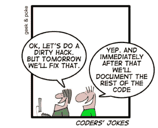

# 处理技术债务(PM 视角)

> 原文：<https://blog.devgenius.io/working-with-technical-debt-a-pm-perspective-679341f45065?source=collection_archive---------15----------------------->

# 发生什么事了？

最近事情不太顺利。

你和你的团队已经有几个月没有成功完成冲刺了，没有留下任何罚单。简单的功能或微小的改变似乎比他们应该花费的时间要长，每个人似乎都低估了他们做事情所需要的时间。团队的速度持续下降，尽管每个人似乎都在额外工作以达到冲刺目标。除此之外，错误不断出现，你修复得越多，就有越多的错误出现。制定任何一种时间表似乎都是不可能的，如果一直这样下去，你可以肯定地说，你不会达到项目的最后期限。

项目不能按时完成可能有很多原因，但如果情况听起来有点像上面的情况，你可能会面临:**高技术债务的情况。**

# 为什么技术债这么吓人？

嗯，它的名字就是:**它是债务**，如果它累积起来，你可能会*花费你所有的资源来偿还债务，而不是产生商业价值*。

我就不说这些技术细节了。重要的是要知道**技术债务在任何项目中都是正常的，甚至是有用的**。每当你需要快速的结果，你“走捷径”，你创造了一点点债务。有时，你会希望在截止日期前快速得到结果，让用户测试某个功能，或者只是为了向利益相关者展示你完成了工作并建立了一些信任。只要你尽早偿还债务(重写代码),这不是问题。现在快速的结果意味着以后更多的工作，所以要注意什么时候你选择快速，什么时候你花时间来解决问题。

但是**你怎么知道你有技术债务的问题**并且你应该开始担心它？好吧，我已经在我的第一段中给出了这样一个项目的提示，让我把一些要点放在前面，这样更容易理解:

*   乍一看似乎很容易的功能或变化最终会比预期花费更多的时间。
*   **速度**比平时小或者到处都是(有些短跑速度低，其他短跑速度恢复正常)尽管短跑之间变化不大；
*   **版本变得越来越 bug**你花在 bug 上的时间越多(任何超过 20%的部分都应该引起关注),出现的 bug 就越多；
*   你的测试人员有时似乎不知所措，突然**每个人都开始做测试**以确保在发布之前所有的 bug 都被“捕获”；
*   有时候，看起来你花了更多的时间去修理东西，而不是去开发。
*   **估算**(即使是简单的估算)也很难得到正确的结果，即使你增加了缓冲并考虑到了最坏的情况；
*   尽管人们似乎比平时工作得更多**期限**要么没有被满足，要么当他们满足时，是因为一些超人的努力；

如果这些都适用，那么你可能有一个问题需要解决。如果只有其中一些适用，或者适用程度较低(例如，不是所有的版本都有问题，但有 1/2 或 1/3 有问题)，那么也许你正处于边缘，你需要做出决定**——现在支付还是以后支付更多。**

# 所以，你在处理技术债务

你是怎么走到这一步的并不重要。它刚刚发生，现在，你在这里:你的时间表是一团乱麻，发布变得紧张，团队士气低落。

首先**让我们看看从你同事的角度看这是什么样子**。

技术债务使得编码慢了很多，因为有些地方你需要小心处理，以免引起更多的问题。通常这意味着代码写得很差，如果我们在谈论一个大项目，团队中可能没有人知道这段代码到底是做什么的。某些方面的改变需要在 10 个不同的地方完成，每当一个 bug 出现，你不确定是什么引起的，需要花很多时间去调查。通常开发人员知道这些高技术债务区域在项目中的什么地方，并且倾向于避免它们。从事一项需要他们修改代码的任务会导致**沮丧** (" *哦，这将永远持续下去"*)和**焦虑** (" *我必须格外小心，谁知道我会破坏什么*)。这相当于玩叠衣服，但是如果塔倒了，那么你不仅要清理一切，把碎片重新拼起来，而且你是在碎片着火的时候做这件事的**。**

**为了确保叠木塔不会倒塌，每当有变化时，团队中的每个人都要进行额外的测试。每个人，尤其是团队中的测试人员，都**感受到不让任何 bug 投入生产的压力**。这使得任务比正常情况下花费更长的时间，开发人员变成了“*鸭带程序员”*——试图按时交付，但又拼命地在幕后将所有事情都联系在一起。**

# **我该怎么做？**

**首先，我必须告诉你，我说谎了。还记得几段前我说过，你是如何来到这里的并不重要吗？嗯，我撒谎了，是的，因为你如何来到这里告诉了你如何出去。**

**高技术债务可能有许多原因:**

*   **有时这不是你的错——这是一个老项目，你和你的团队以这种方式“继承”了它，或者利益相关者只是在知道风险的情况下决定举债，因为他们需要快速的结果。**
*   **其他时候，错误在中间——不断变化的规格和优先级意味着您必须灵活和适应，但是，您从未尝试面对利益相关者并解释所有这些快节奏的变化将影响项目的长期质量。**
*   **有时这完全是你的错——你低估了需要完成的工作，团队中有许多初级程序员，为了跟上你最初的估计，你选择了更快的结果而不是好的质量。或者，也许你只是没有把重点放在好的工程方法论上，比如代码审查。**

## **让我们从团队开始。**

**我认为处理这件事的最好方法是**诚实**。只是把它放在那里:“伙计们，这就是我们所面临的…我可以看到你很沮丧，相信我，我也是…让我们看看我们需要做些什么来改变这种情况。”**

*   **与你的团队和**开一个专门讨论技术债务的会议，就如何解决这种情况集思广益**。试着理解你是如何到达那里的，并找出可以改变的事情。不责怪任何人也很重要。从这样一种心态开始讨论，即每个人都尽了最大努力，给出了他们在特定时刻拥有的知识和信息。**
*   ****采用好的工作方法** **并坚持下去**(单元测试、代码审查甚至同行编程都可以)。还记得约翰·伍登说过的话吗:“如果你没有时间把它做好，你什么时候会有时间再做一遍呢？”。所以从一开始就开始努力做好事情(或者至少从现在开始)。**
*   ****做一面“技术债”墙**贴上你知道需要重构的区域或功能的便利贴。开始将这些一个一个地包括在你的 sprints 中，同时仍然向你的利益相关者交付商业价值。这也将增加一种新的拥有感，因为每个人都想扔掉墙上的便利贴。**

## **利益相关者呢？**

**嗯，就像任何其他问题一样，除非你和他们交谈，否则它不会得到解决。对项目的状态要诚实，并向他们解释技术债务的概念。**如果利益相关者不知道技术债务的概念，他们会奖励快速运输而不是质量**。一旦他们意识到快速是有代价的，他们可能会开始有不同的想法。**

****

**你很可能会面对**三种利益相关者**，结果将取决于你与他们的关系:**

*   ****Nr.1 >** *那些故意做出增加技术债务的决策的人*(“我们下个月需要这个大功能”)。你必须向他们证明，虽然他们看起来很快就能得到结果，但从长远来看，这会给他们带来沉重的打击，而且在冲刺阶段改变规格也没有用。实际上，你必须让他们相信你需要慢一点，否则一切都会崩溃。你可能会发现他们不信任你(“直到现在都很好。如果我们也做这件小事，它就不会崩溃。不要担心，只需专注于交付。”)所以你会需要数据来证明你的观点。**
*   ****Nr。2 *>*** *在不知道风险的情况下做出这些决定的人*(“优先级改变了，我们下周需要这个”)*。尤其是当你为了取悦他们，在没有解决潜在问题的情况下尽快开始工作的时候。也许如果你告诉他们或确保他们了解风险，他们会意识到这并不重要或紧急，事情会有所不同。根据情况有多糟糕，以及你尝试(或没有尝试)警告他们的程度，你可能会面临**缺乏信任**(“这是你的错，你从没告诉我们会发生这种事。”)或者**你可能会获得一些信任**(“谢谢你让我们意识到这一点。那么，你建议我们做什么？”).***
*   ****3*>****那些完全不知道你正在努力赶上最后期限，而且质量因为那个而下降的人*。他们没有改变最初的计划，但是你低估了需要完成的工作，结果你自己也开始负债。这可能是最困难的情况，因为你在解释事情进展缓慢的原因时，试图不失去利益相关者的信任。**

**不管是什么情况，你都需要进行一次谈话，并介绍情况。根据情况和你的利益相关者类型(1 号、2 号或 3 号)，你必须为对话做不同的准备。以下是一些有用的信息:**

*   **花在开发上的**时间与花在修复 bug**上的**时间的比率(如果你认为你有技术债务的问题，但你还没有跟踪这个问题，你应该这样做)。开发带来价值，bug 修复没有。如果你的团队浪费了 30%的时间来寻找和修复 bug，那么你就没有在 30%的时间里交付价值(将这转化为金钱以获得更大的影响)。(适用于 1 号)****
*   ****燃尽图和速度图**显示项目当前状态下完成的工作量。(适用于 1 号)**
*   **对团队状态的简短**描述。这里的目标是让他们明白，如果团队感到沮丧或筋疲力尽，那么你将无法交付质量或数量。(适用于 1 号和 2 号)****
*   **需要重构的**领域列表**和**如果不重构，业务的潜在风险**。这个想法是让利益相关者意识到，如果在这些领域出了问题，他们的整个业务可能会受到影响(销售下降，差评等)。).(适用于 1 号和 2 号)**
*   ****差点让它上线并可能对业务产生重大影响的错误示例**。举一个真实的例子(“上个月我们有一个 bug，让你无法介绍你的信用卡细节，如果你的物品有折扣的话”)会让他们更加注意。(对于 1 号和 2 号项目，甚至 3 号项目，如果你表现出你已经意识到这些问题并正在努力解决的话，那就更好了)**
*   ****关于为了提高质量可以做出的改变的计划**(例如，在接下来的 6 个 sprint 中，你如何在每个 sprint 中包含一个需要重构的区域，同时仍然交付商业价值)。(适用于 2 号和 3 号)**
*   ****更新的时间表**显示了里程碑需要如何改变，以便开发新功能并同时处理技术债务。(适用于 2 号和 3 号)**
*   **团队内部发现的其他**解决方案的详细信息**以及这将如何帮助减少错误和提高质量(例如，在每个 sprint 与开发人员召开两个小时的技术会议，讨论新功能以及在开始编码之前如何实现它们)。(适用于 3 号)**
*   **你需要从他们那里得到什么的清单。它可能是任何事情，从停止新功能直到你偿还一些债务，将一些截止日期稍微推迟一点，或者在团队中增加另一个开发人员。确保你注意到他们和你的需求，并找到适合两者的解决方案。(所有人都需要)**

# **现在你已经没有技术债务了！**

**我希望事情能这么简单。你现在应该做的是问自己— **“下一步是什么？”。**你是否有问题需要马上处理，或者这只是你应该考虑的事情，确保它不会在未来发生？**

**在离开之前，我要提醒你一件事:**技术债务并不总是坏事，你只需要控制住它。****

**哦，这里有一句话我认为很好地概括了这个想法:**

> **“首次交付代码就像负债一样。**一点点债务加速发展**只要通过重写一份文件迅速偿还……**当债务得不到偿还时，危险就出现了。**花在不太正确的代码上的每一分钟都算作债务的**利息。**在未整合实现的债务负担下，整个工程组织可能会停滞不前。—沃德·坎宁安**