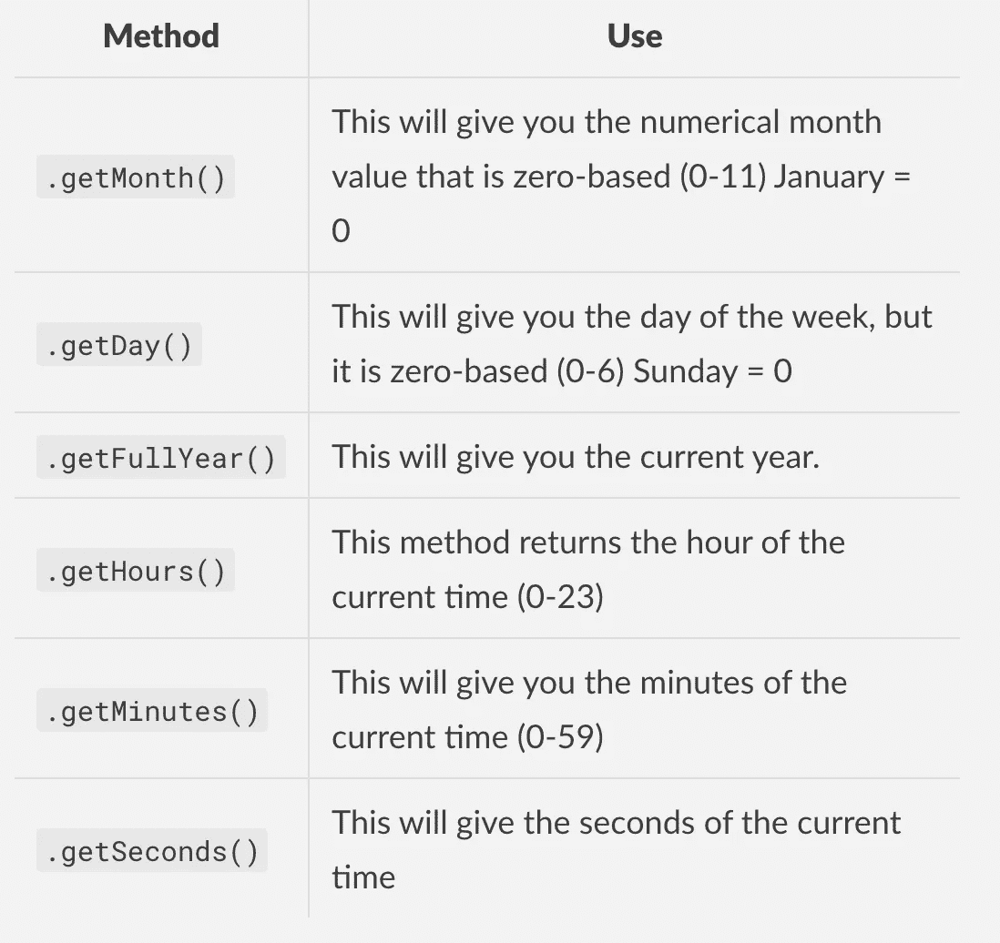

# 在 JavaScript 中使用日期对象

> 原文：<https://blog.devgenius.io/working-with-the-date-object-in-javascript-126a3a6285f8?source=collection_archive---------32----------------------->

[埃里克·罗斯梅尔](https://unsplash.com/@erothermel?utm_source=unsplash&utm_medium=referral&utm_content=creditCopyText)在[号航天飞机](https://unsplash.com/s/photos/calendar?utm_source=unsplash&utm_medium=referral&utm_content=creditCopyText)上拍摄的照片

# 介绍

在 JavaScript 中，您可能会发现自己想要在项目中使用日期。一种不用手动输入当前日期和时间的方法是使用 JavaScript 内置的日期构造函数。

首先，让我们看看下面的例子:

为了创建一个新的日期对象，当使用构造函数创建一个新的对象时，我们必须使用`new`关键字。我们将它存储在一个名为`newDate`的变量中。正如您所看到的，单词 **Date** 也是大写的，这向我们表明:

*   因为它是一个构造函数，所以它必须大写才能工作。JS 是一种区分大小写的语言。

如果您不在新关键字后大写日期，尝试查看控制台中会发生什么。

# 方法

日期对象有一些非常有用的方法，您可以在创建对象后使用。我将在一个表格中列出其中一些对您可能有用的选项:

# 结论

这是您开始使用日期对象的方式。我也在下面链接了一些有用的资源。我希望这有所帮助！

# 资源

[MDN](https://developer.mozilla.org/en-US/docs/Web/JavaScript/Reference/Global_Objects/Date)

[W3 学校](https://www.w3schools.com/jsref/jsref_obj_date.asp)