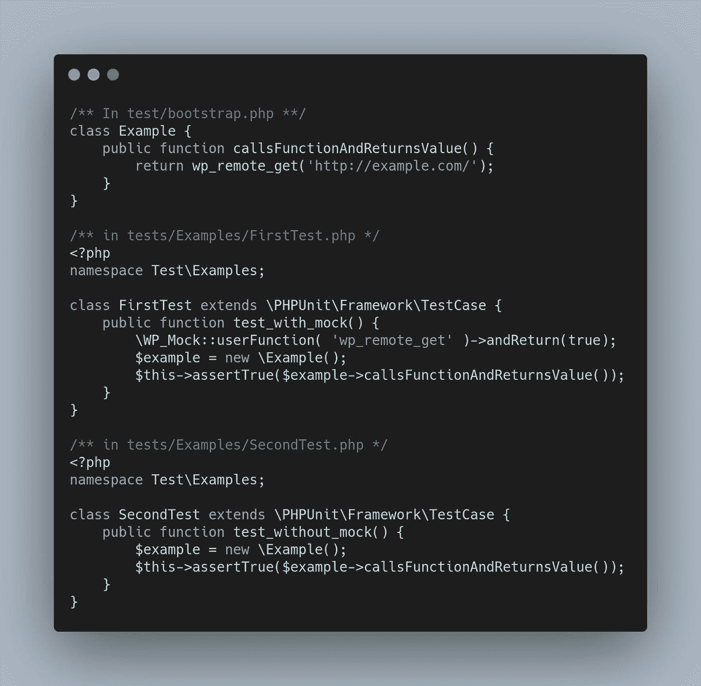

# WP_Mock 还是脑猴？WordPress 的嘲讽库哪个比较好？

> 原文：<https://blog.devgenius.io/wp-mock-or-brain-monkey-which-is-the-better-mocking-library-for-wordpress-48fd89f321fd?source=collection_archive---------2----------------------->

[李中清](https://unsplash.com/@picsbyjameslee?utm_source=medium&utm_medium=referral)在 [Unsplash](https://unsplash.com?utm_source=medium&utm_medium=referral) 上拍照

让我们先说清楚:我将使用脑猴向前推进。如果你想知道为什么，请继续阅读。

# 什么是嘲讽库？

如果你不知道什么是嘲讽库，你可能没有做足够的测试。在此不做过多的详细介绍，我在此寻求解决的具体用例是为 WordPress 插件创建一个测试套件，它不需要启动整个 WordPress 应用程序。

这两个库都允许你“模仿”WordPress 的功能，这允许你在一个封闭的环境中测试你自己的代码。因此，你不用依赖于在整个 WordPress 核心中运行你的代码，而是孤立地测试你的代码，并且你确信如果有任何错误不是你的代码造成的。

# 那么，这两者之间如何抉择呢？

我很幸运，因为我在一个新项目刚开始时就想到了这个问题。因此，我的决策过程很简单:我安装了这两个软件，并开始对它们进行测试。

> 注意:如果你这样做，确保你将那些用 WP_Mock 创建的测试和那些用 Brain Monkey 创建的测试分组。那是因为用 WP_Mock 模拟的方法不能被 Brain Monkey 重新模拟，反之亦然。

# 名声

在选择这样的框架时，我首先考虑的是声誉。在这方面，WP_Mock 显然是赢家。他们享有很高的声誉，并且有一群经验丰富的开发人员作为后盾，这些开发人员在社区中很受信任— [10up](https://10up.com/) 。

脑猴更新，但有一些伟大的评论。它由 Giuseppe mazza pica 维护，这是另一个成功的例子，因为唯一的维护者有时会阻碍开发。

# 焦点/用法

WP 模拟仅限于此。严格来说，它是 PHPUnit 和 WordPress 的模仿库。如果我要使用它，我只能在 WordPress 项目中使用它，并且只有当我继续使用 PHPUnit 作为我的测试框架时。

这没什么大不了的，因为我可能会继续做这两件事。也就是说，我也在 WordPress 之外做开发，所以能够在我所有的项目中继续使用我知道的框架会很好。

Brain Monkey 也主要专注于 WordPress，但它并不局限于 WordPress。

在这两种情况下，都依赖于幕后的嘲弄，这意味着在任何非 WordPress 项目中直接使用嘲弄。所以对于这种情况，我会给两者相等的分数。

# 功能

这是我改用脑猴的地方。

关于测试最重要的事情之一是在测试之间保持一致的状态。一个测试不应该改变任何其他测试。嘲讽框架的问题在于，在完成我们要求的工作过程中，它必须操纵全局状态。

我什么意思？当你模仿一个函数时，这个函数从不存在变成存在。你不能让它回到不存在的状态。(有很多方法，但我不想深入探讨，因为大多数方法都涉及对 PHPUnit 执行方式的根本性改变。)

我最初遇到这个问题是在我上面提到的情况下。如果我在 WP_mock 和 Brain Monkey 中为相同的函数创建一个 Mock，我会得到一个致命的错误。函数已经定义。

这是有道理的，但是我之后开始测试的是对你的测试的影响。

下面我们来举个例子:

在这种情况下，您会看到我将这段代码严格限制在\WP_Mock 方法中，这是任何文件中唯一的模拟调用。

当我们一起运行这些测试时，两个测试都通过了。这意味着 SecondTest 也返回 true。

如果我们向运行`\WP_Mock::tearDown()`的 FirstTest 添加一个 tearDown 方法，我们将会以第二个测试失败而告终，但是失败是因为它不能断言`null is equal to true`。

那是什么意思？这意味着`wp_remote_get`保持定义。除此之外，一旦我们运行 tearDown，它开始返回一个缺省的 null 值。如果与 null 是有效返回值的 WordPress 方法一起使用，这将很快成为一个问题。

当我们运行完全相同的代码，但是用 WP_Mock 替换 Brain Monkey，记住要包含 Brain Monkey 的拆卸代码时，我们通过了第一个测试，但是第二个测试没有通过。

和 WP_Mock 一模一样吧？

不对。

在这种情况下，第二个测试失败，并显示以下错误:`"wp_remote_get" is not defined nor mocked in this test.`这比默认的空值有用得多。

# 为什么这样更好？

我前面提到过这一点，但是 null 对于某些方法来说是一个有效的返回值。正因为如此，将被拆除的模拟函数默认为空意味着我们将它们默认为有效状态。

大脑猴采取了不同的方法。它没有将它们默认为有效状态，而是将它们默认为“已定义，但不是真正定义”的状态，其中引用在内存中，但库模拟未定义的状态。

并且未定义的*是模拟*的有效状态。

# 最后

因此，这就是为什么我将使用大脑猴，而不是 WP 模拟我的项目前进。WP Mock 仍然是一个很棒的框架，如果我发现 Brain Monkey 的一些问题现在还不明显，我可能会使用它。

但是现在，我更喜欢 Brain Monkey 的 API，以及它处理分解方法的方式。为此，我将使用大脑猴。

如果你对这篇文章感兴趣，你会爱上我的 Twitter 上的技术意识流。 [*头那边，给我跟着*](https://twitter.com/n00bJackleCity) *。你不会失望的。*