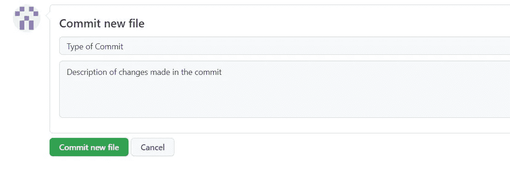
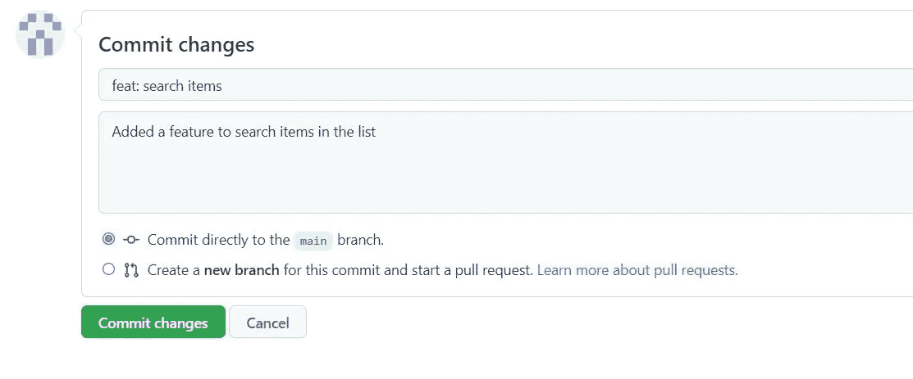

# 写一条很棒的提交消息！

> 原文：<https://blog.devgenius.io/write-a-great-commit-message-74944ac638dd?source=collection_archive---------0----------------------->

一个好的提交消息有助于每个工作/查看项目的人。

[https://unsplash.com/photos/UT8LMo-wlyk](https://unsplash.com/photos/UT8LMo-wlyk)

因为最伟大的 [**开源节**](https://hacktoberfest.digitalocean.com/) 已经开始了所以我决定写一些与开源有关的东西。所以在这篇文章中，我将写关于我们如何能写一个好的提交消息，因为这个提交消息帮助我们以及其他开发人员容易地查看或审查或浏览我们的存储库而没有任何麻烦。

唯一的前提是了解 git 和 Github。如果你还不知道，我强烈建议你学习它们。你可以在这里找到初学者教程。

现在让我们从什么是提交消息开始。

提交消息描述了我们对存储库所做的更改。因此，提交消息应该非常仔细地编写，因为它不仅对参与您项目的合作者非常重要，而且对我们自己也非常有用，可以跟踪我们在存储库中所做的更改，如果我们编写了正确的提交消息，我们就不会在搜索正确的提交阶段时遇到困难。

我通常使用以下格式编写提交消息:

Git 提交消息

**提交类型**:指定我们在那个特定的提交中到底更改或添加了什么。
通常有 7 种不同的类型，它们如下:

1.  专长:它指的是我们增加的新功能
2.  修复:如果我们正在修复任何错误
3.  重构:如果我们正在重构代码
4.  测试:如果我们添加了任何与测试相关的东西
5.  杂务:用于更新构建任务、配置等。
6.  文档:如果我们正在处理文档
7.  风格:如果我们改变或添加任何与项目风格相关的东西。

**描述**:在这里，我们可以写下在特定提交中我们到底做了什么。

例如，如果我向我的项目添加一个新特性，我将编写下面的提交消息，

> 专长:搜索物品
> 增加了在列表中搜索物品的功能

提交消息

有些人还在提交信息中使用表情符号。如果你想加入表情符号，一定要查看 [gitmoji](https://gitmoji.dev/) ，在那里你可以搜索适合特定提交类型的不同表情符号。