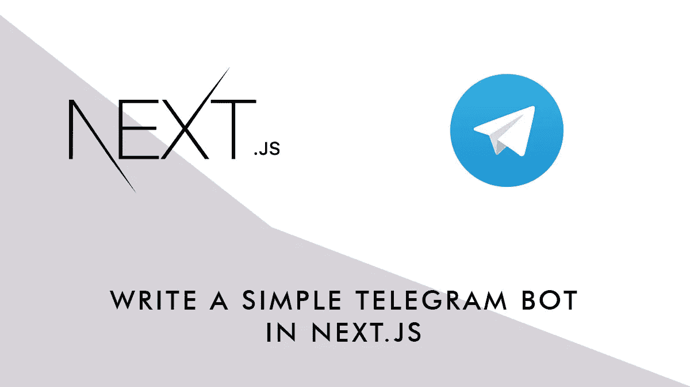
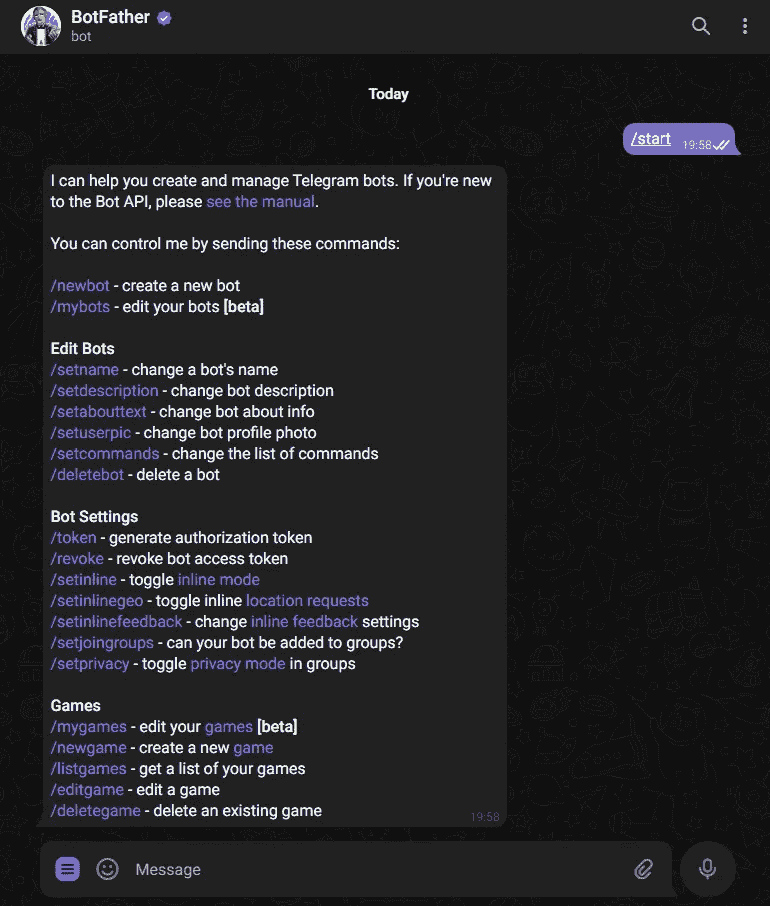
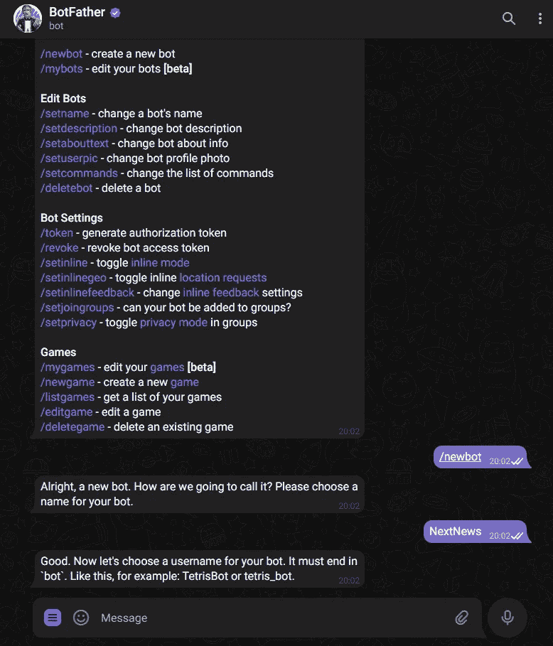
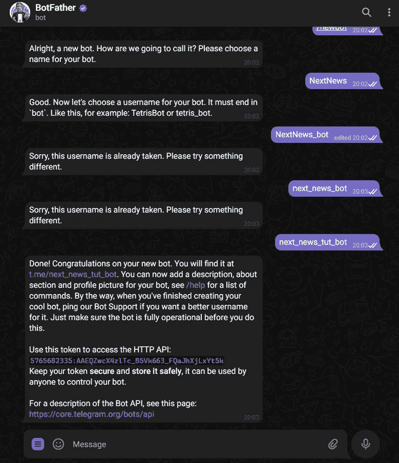
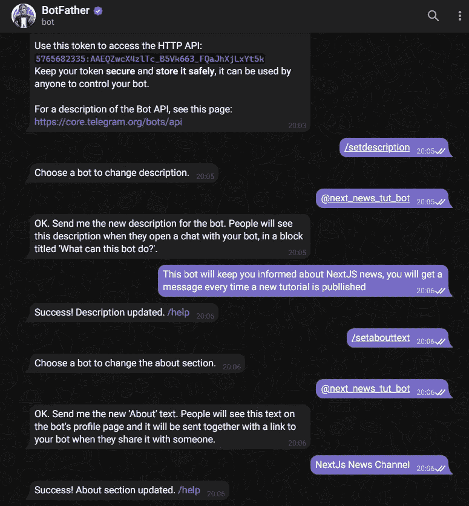
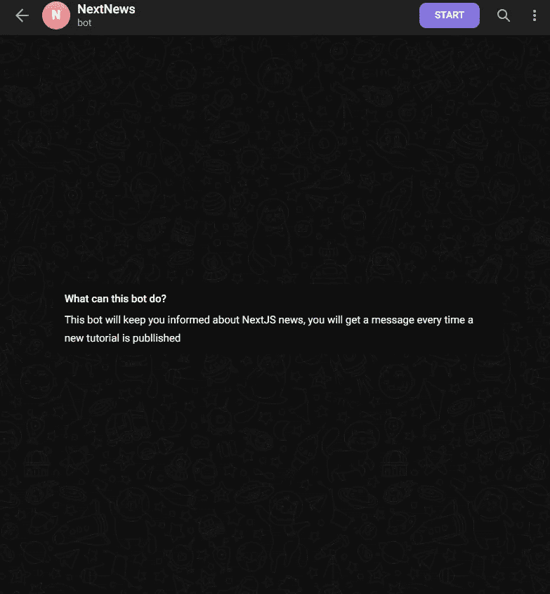
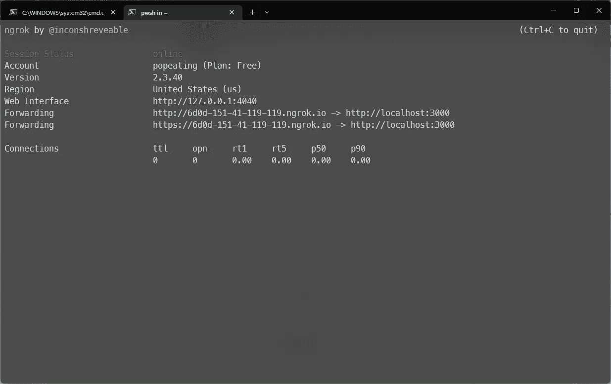
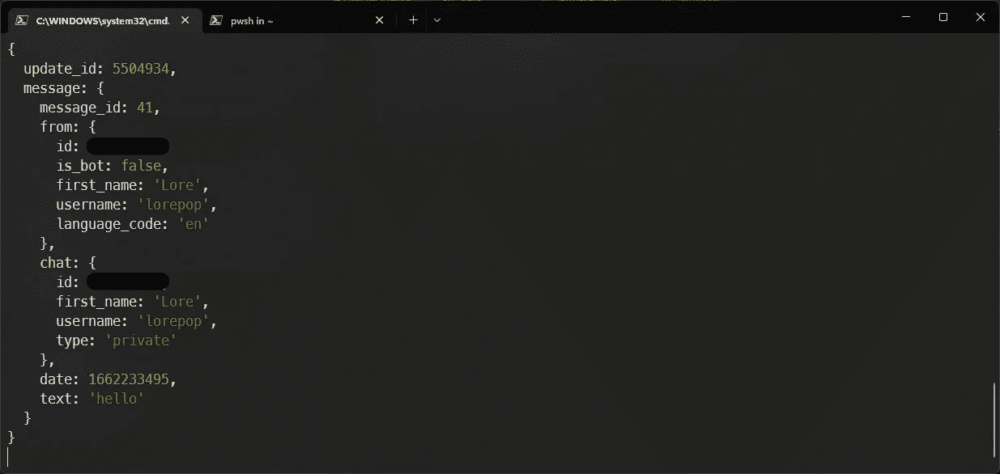

# 用 Next.js 写一个简单的电报机器人

> 原文：<https://blog.devgenius.io/write-a-simple-telegram-bot-in-next-js-b49379e77163?source=collection_archive---------0----------------------->



机器人是运行在 Telegram 内部的第三方应用程序。用户可以通过向机器人发送信息和命令来与它们互动。您可以通过使用 webhook 和 HTTPS 请求来读取和发送消息来控制您的 Bot-API。

## 我们将建造什么

在本教程中，我们将编写一个基本的，但功能齐全的电报机器人，回复用户的互动。我们将从创建 Bot 本身开始，然后我们将实现 Next.js API 路由，并将它连接到 Telegram API，这样它将侦听用户消息并对它们做出反应。

## 先决条件

要跟进，您需要:

*   一个电报帐户(需要建立一个机器人并测试它)
*   Next.js API 路线的基本知识
*   ngrok 需要一个“真正的”URL 地址，以便在本地开发时连接 Telegram API

# 创建机器人

首先，我们需要创建自己的 Bot:
使用电报客户端(我在【https://web.telegram.org】T4 使用 web 客户端)，打开与用户的聊天**Bot 父亲:**



发送命令`**/newbot**`，通过选择名称和用户名开始创建过程(用户名应该是唯一的，因此您可能需要更多尝试):



一旦成功，BotFather 将向您发送打开与 bot 聊天的链接和一个令牌，您将使用该令牌与 Telegram API 进行通信(保持该令牌的安全和隐藏)。
此时，您可以选择添加更多信息、个人资料图片等，在我们的示例中，我们添加了描述和关于文本:



如果你打开一个与你新创建的机器人的聊天，你会看到类似这样的东西



# 创建网页挂钩

有几种方法可以让 Telegram 与你的应用程序交互，最基本的是通过一个 Webhook:你创建一个 API 并将它的 URL 连接到 Telegram

## 设置 Next.js 应用程序

使用以下内容创建新的 Next.js 应用程序:

```
**npx create-next-app telegram-bot**
```

然后进入文件夹`telegram-bot`并添加文件. env.local，如下所示:

```
**NEXT_TELEGRAM_TOKEN=<YOUR_TELEGRAM_TOKEN>**
```

创建文件`**/pages/api/tlg.js**`,并在其中添加以下基本结构:

使用以下命令启动开发服务器:

```
**npm run dev**
```

## 运行 ngrok

运行 ngrok 获取一个可以从 Internet 访问的地址，使用:

```
**ngrok http 3000**
```

并记下 HTTPS 的转发地址:



## 连接网钩

在浏览器中添加以下 URL:

```
**https://api.telegram.org/bot<YOUR_TELEGRAM_TOKEN>/setWebhook?url=<YOUR_HTTPS_URL>/api/tlg**
```

并点击*回车*，您应该会得到一条类似如下的消息:

```
**{**“ok”: **true**,”result”: **true**,”description”: “Webhook was set”**}**
```

这意味着每次用户向您的 bot 发送消息时，该消息都会被转发到该 URL，以便调用您的 API。

## 测试消息

打开一个与你的机器人聊天并启动它(你将自动发送/start 命令)，然后发送一条消息(例如 *hello* )并检查你的控制台，你将看到 API 收到这条消息以及其他信息:



## 对命令做出反应

要让 API 对命令做出反应(例如回复发送命令的用户),修改`**tlg.js**`文件如下:

在这种情况下，我们使用电报 API 的一个最基本的方法( *sendMessage* )，我们简单地用一个静态消息回复一个请求(当然不是很有用)

# 下一步是什么

使用机器人有无限的可能性；例如，你可以监听一个`/subscribe`命令，当收到命令时，你可以将用户 id 存储在某个数据库中，然后每当你更新博客时，你可以自动向订阅用户发送通知。或者你可以让你的用户订阅单个主题(可以使用内嵌按钮【https://core.telegram.org/bots/api#inlinekeyboardmarkup】的[来选择)。你也可以接受付款(](https://core.telegram.org/bots/api#inlinekeyboardmarkup)[https://core.telegram.org/bots/payments](https://core.telegram.org/bots/payments))，创建游戏等等。