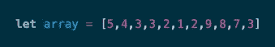
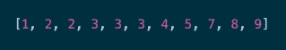
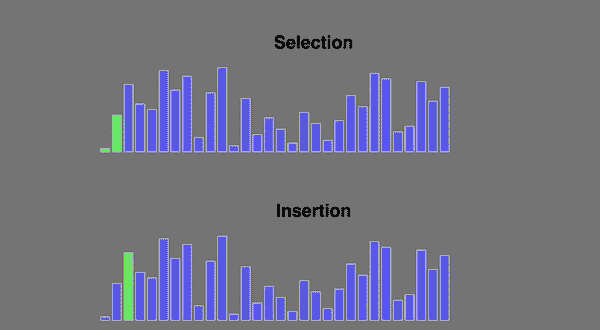
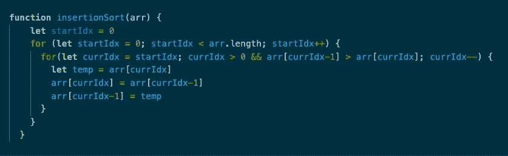
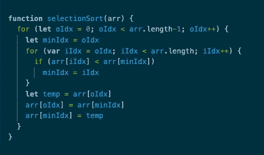
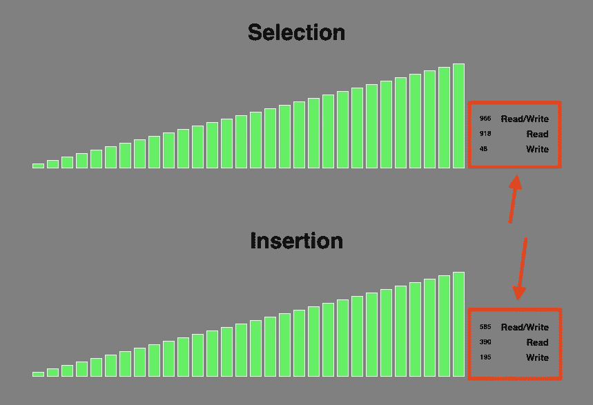
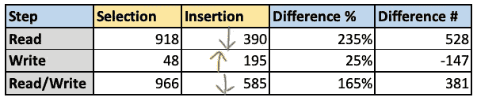
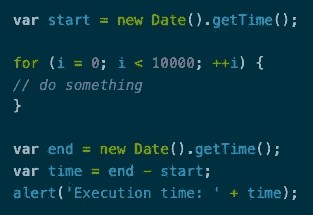
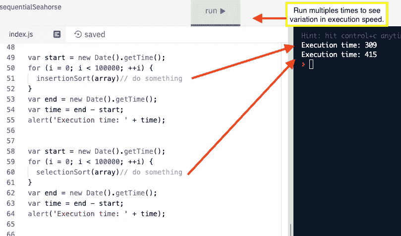

# 用 JavaScript 编写和测量高效函数:节省您的时间和金钱

> 原文：<https://blog.devgenius.io/write-and-measure-efficient-functions-in-javascript-saving-you-time-and-money-48c5a9666146?source=collection_archive---------9----------------------->

卡尔·海尔达尔在 [Unsplash](https://unsplash.com?utm_source=medium&utm_medium=referral) 上拍摄的照片

以一种可以工作的方式编写代码是一回事，但是让它以最有效的方式工作是另一回事。

在我的职业生涯中，最让我沮丧的一点是，组织的流程效率低下，并且缺乏工具来更好地完成工作。吸引我从事软件工程的一件事是构建可以自动化琐碎任务的东西，这样人们就可以专注于真正重要的工作*。*

*今天，我决定仔细研究几个 JavaScript 函数，以及一个效率较低的函数如何与一个效率更高的方法进行比较。*

# *排序数组算法*

*无论是在图书馆整理书籍，在数据库中组织联系人，还是准备财务报告，我们都必须对事物进行排序，以便更容易找到、计算、查看和做出决策。*

*如果你有一个这样的数组:*

**

*您需要对元素进行排序，如下所示:*

**

*忽略了我们可以使用**。sort()** 在这里，如果我们想写出一个函数来完成这个任务，我们可以考虑将这个函数写成一个 [**选择排序**](https://en.wikipedia.org/wiki/Selection_sort) 或 [**插入排序**](https://en.wikipedia.org/wiki/Insertion_sort) 。*

*请参见下面的 gif，了解两种排序算法选项的可视化效果。*

*第一个是我们所说的**选择排序**。对于集合中的每一项，在数组的未排序部分找到最小的项，并将其与当前项交换。*

*第二个是我们所说的**插入排序**。对于集合中的每一项，我们检查前一项是否大于当前项。如果大于，则当前项不在原位:将其与前一项交换。然后重复这个过程，直到该项目在适当的位置。然后才移动到集合中的下一个项目。*

**

*图片来源:熨斗学校*

*下面是**插入排序**函数的样子:*

**

*这就是**选择排序**函数的样子:*

**

*这两个函数可能看起来非常相似，但最终结果很重要——特别是对于较大的数据集、更复杂的算法以及重复数千或数百万次的情况。*

*完成各自的排序算法后，结果如下:*

**

*把这些数字放大一点，我们可以看到选择排序多花了 381 步，比插入排序多了 65%。然而，尽管插入排序的读取步骤要少得多，但它的写入步骤几乎是插入排序的四倍。*

**

*如果我们假设写和读花费相同的时间和精力，我们可以得出结论，插入排序在这里是更有效的选择。然而，如果写作实际上比阅读花费更多的时间，那么它可能是一个更接近的匹配。*

*如果你一直看 gif 直到最后，你会看到插入排序确实首先结束，但是不是很多。*

# *我们如何确认每个的执行时间？*

*虽然有许多方法可以做到这一点，但我发现一种快速有效的方法是记录函数执行前后的时间，并使用这两个时间之间的差异来估计函数完成的速度。*

*很简单，对吧？代码如下:*

**

*我在 Repl.it 中运行了这两个函数，结果如下。同样，插入排序仍然更快，但只比 T2 快了几毫秒。*

*乘以数千或数百万个运行周期，再考虑到更大的数据集，时间会越来越长。*

**

## ***重要提示:***

*   ***选择排序**可能在较小的数据集上工作得更快，但是随着数据集变大，插入排序会更有效。*
*   *这只是 ***的一个例子*** 你可以快速检查两个函数之间的执行次数。**每次运行的执行时间结果会有所不同。**为了更准确地估计执行时间，您需要运行多次，然后取这些运行的平均值。*

# *为什么这很重要？*

*   *对于网站和移动应用程序，缓慢的加载时间会导致**客户流失**、**注意力分散**、以及**糟糕的用户体验**。*
*   *对于雇主来说，低效的流程会导致**工资分配的浪费**，**周转时间的缓慢**，以及**注意力从更重要的任务上转移***
*   *对于产品制造商来说，缓慢的流程会导致**生产瓶颈**和**更高的单位成本***

# *你可以改进哪些职能或流程？*

*这是分析一个非常简单的 JavaScript 函数的一个小例子。你认为还有哪些功能得到了改进？在职场上呢？有没有你希望自动化或更快完成的琐碎任务？*