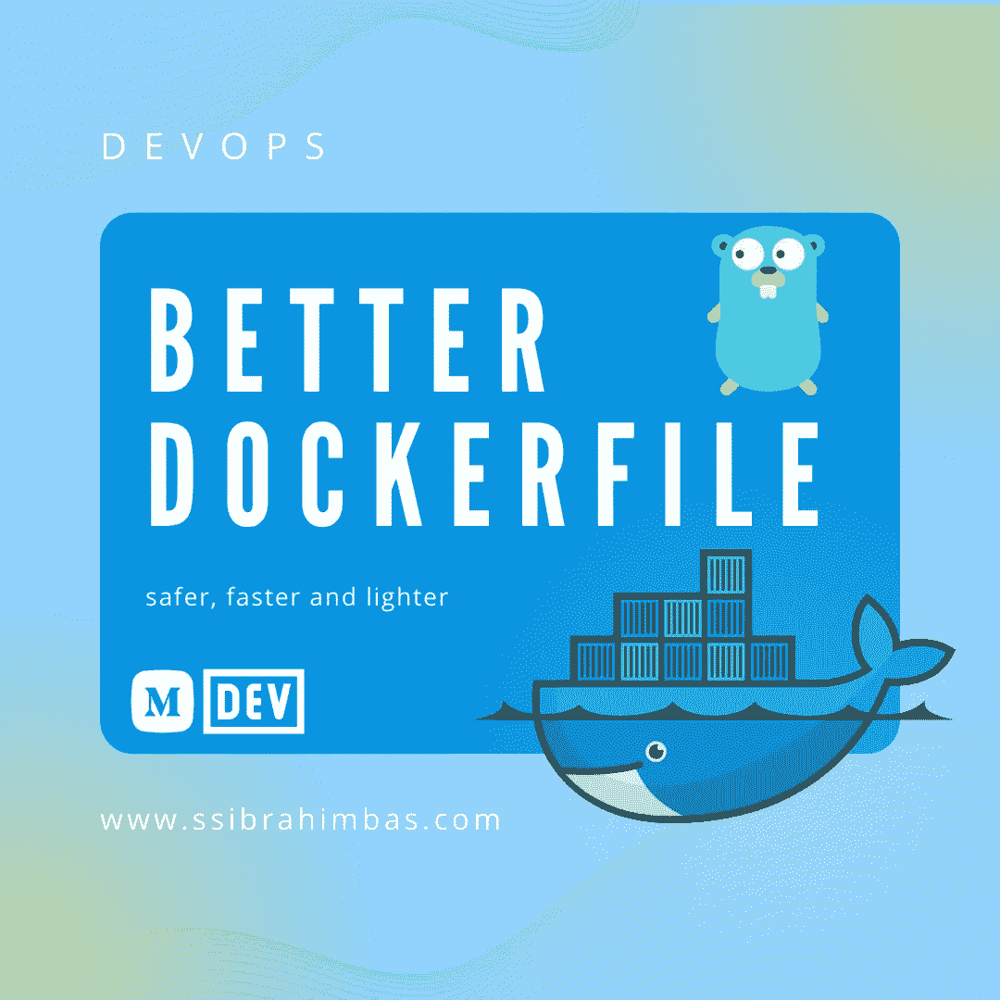
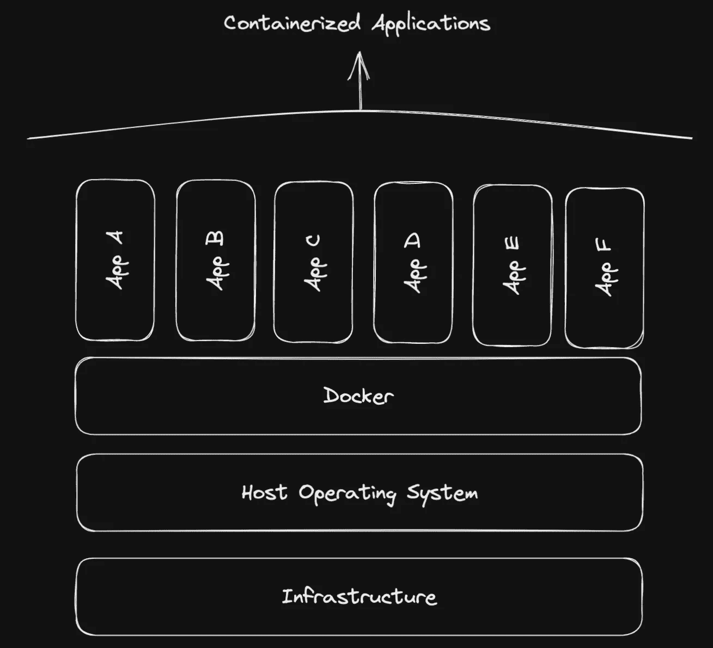
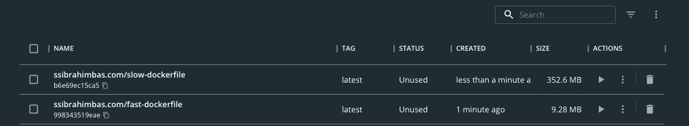

# 写更好的 Dockerfile

> 原文：<https://blog.devgenius.io/write-better-dockerfile-f134ce7a5128?source=collection_archive---------1----------------------->

循序渐进和逻辑

今天我将讨论如何编写一个更安全、构建更快、容量更少并且第一次运行更快的 Dockerfile。

但在这之前，我会一步一步地讨论为什么我们需要它。



文章封面

# 为什么我们需要一个文档？

Docker 是一个容器化工具，它允许我们创建一个包含所有必要依赖项的容器来运行我们的应用程序。

## 什么是容器？

容器是在主机上运行的虚拟机。它是一个比虚拟机更轻的虚拟机，因为它没有完整的操作系统，只有运行我们的应用程序所必需的依赖项。



什么是容器？

## 集装箱有什么？

该容器具有运行我们的应用程序所必需的依赖关系。它可以是数据库、web 服务器、编程语言等。

更多关于容器:[什么是容器？](https://www.docker.com/resources/what-container)

# 什么是 Dockerfile？

Dockerfile 是一个文件，它包含构建将用于创建容器的映像的指令。

## 什么是码头工人形象？

图像是一个模板，包含运行我们的应用程序所需的所有依赖项。

实际上它是容器的快照。

# 如何写一个基本的 Dockerfile？

在这一节中，我们将看到如何创建一个简单的 Dockerfile 文件。

## 第一步:使用基本图像

我们需要做的第一件事是选择一个基础图像。基础图像是将用于创建容器的图像。

## 第二步:复制文件

下一步是将文件复制到容器中。将要复制的文件是将用于运行应用程序的文件。

## 步骤 3:安装依赖项

下一步是安装依赖项。依赖项是将用于运行应用程序的依赖项。

## 步骤 4:暴露端口

下一步是暴露端口。端口是将用于运行应用程序的端口。

## 步骤 5:运行应用程序

下一步是运行应用程序。

## 例子

```
# Use a base image
FROM golang:1.19-alpine

# Copy the files
COPY . /app

# Install the dependencies
RUN go mod download

# Expose the port
EXPOSE 8080

# Run the application
CMD ["go", "run", "main.go"]
```

## 我们在这里做了什么？

我们创建了一个 Dockerfile，它将`golang:1.19-alpine`映像作为基础映像，复制文件，安装依赖项，暴露端口 8080 并运行应用程序。

事实上，我们在这里创建的应用程序从来都不是生产的首选环境。

因为这里 golang 是作为运行时运行的。然而，golang 是一种可以为我们提供可执行程序的语言。如果我们生产一个可执行程序，事情会变得更安全更快。

# 如何写一个 Dockerfile 或 Production？

在这一节中，我们将关注一个比上一节更好的例子。

## 第一步:使用基本图像

我们需要做的第一件事是选择一个基础图像。基础图像是将用于创建容器的图像。

## 第二步:复制文件

下一步是将文件复制到容器中。将要复制的文件是将用于运行应用程序的文件。

## 步骤 3:安装依赖项

下一步是安装依赖项。依赖项是将用于运行应用程序的依赖项。

## 步骤 4:构建应用程序

下一步是构建应用程序。

## 步骤 5:暴露端口

下一步是暴露端口。端口是将用于运行应用程序的端口。

## 步骤 6:运行应用程序

下一步是运行应用程序。

## 例子

```
FROM golang:1.19-alpine

# Copy the files
COPY . /app

# Install the dependencies
RUN go mod download

# Build the application
RUN go build -o main .

# Expose the port
EXPOSE 8080

# Run the application
CMD ["./main"]
```

## 我们在这里做了什么？

我们创建了一个 Dockerfile，它使用`golang:1.19-alpine`映像作为基础映像，复制文件，安装依赖项，构建应用程序，公开端口 8080 并运行应用程序。

实际上，这种方法在生产中也有人使用。然而，这还不够。

因为这里我们用 golang 创建了一个可执行文件，当我们的容器运行时，我们执行这个可执行文件。但是 golang 继续与我们的容器共存。此外，随着项目的增长，我们可能不需要在产品中包含各种文件。所以我们有更好的方法。

# 如何写出更好的 Dockerfile？

在这一节中，我们将学习如何创建一个 docker 文件来创建一个真正安全、快速和轻量级的 docker 容器。

## 第一步:使用基本图像

我们需要做的第一件事是选择一个基础图像。基础图像是将用于创建容器的图像。

## 步骤 2:使用多阶段构建

多阶段构建是一种允许我们创建具有多个阶段的 Dockerfile 文件的技术。每个阶段都是一个 Dockerfile 文件，将用于创建容器。最后一个阶段将用于创建运行应用程序的容器。

## 步骤 3:使用一个. dockerignore 文件

`.dockerignore`文件是一个包含在构建映像时将被忽略的文件和文件夹的文件。

## 例子

```
# Use a smaller base image
FROM golang:1.19-alpine AS builder

# Copy the files
COPY . /app

# Install the dependencies
RUN go mod download

# Build the application
RUN go build -o main .

# Use a smaller base image
FROM alpine:3.14 AS runner

# Copy the files
COPY --from=builder /app/main /app/main

# Expose the port
EXPOSE 8080

# Run the application
CMD ["./app/main"]
```

## 我们在这里做了什么？

我们创建了一个 Dockerfile，它使用`golang:1.19-alpine`映像作为基础映像，复制文件，安装依赖项，构建应用程序，使用`alpine:3.14`映像作为基础映像，复制文件，暴露端口 8080 并运行应用程序。

# 如何建立和运行映像？

在本节中，我们将看到如何使用我们创建的 Docker 文件创建和运行 Docker 映像。

## 步骤 1:构建图像

我们需要做的第一件事是建立形象。该图像是将用于创建容器的图像。

## 步骤 2:运行容器

下一步是运行容器。容器是将用于运行应用程序的容器。

## 例子

```
# Build the image
docker build -t go-docker .

# Run the container
docker run -p 8080:8080 go-docker
```

# 怎么分辨是快是轻？

在这一节中，我们将学习如何通过 Docker 文件的改变来判断我们是否真的改变了 Docker 中的某些东西。

## 步骤 1:检查图像的大小

我们需要做的第一件事是检查图像的大小。图像的大小是将用于创建容器的图像的大小。

## 第二步:检查容器的大小

下一步是检查容器的大小。容器的大小是将用于运行应用程序的容器的大小。

## 步骤 3:检查构建映像所需的时间

下一步是检查构建映像所需的时间。构建映像所需的时间就是构建将用于创建容器的映像所需的时间。

## 步骤 4:检查运行容器所需的时间

下一步是检查运行容器所需的时间。运行容器所需的时间就是运行将用于运行应用程序的容器所需的时间。

## 例子

```
# Check the size of the image
docker images

# Check the size of the container
docker ps -s

# Check the time it takes to build the image
docker build -t ssibrahimbas.com/fast-dockerfile .

# Check the time it takes to run the container
docker run -p 8080:8080 ssibrahimbas.com/fast-dockerfile
```

# 我的结果

在本节中

## 步骤 1:检查图像的大小

```
REPOSITORY   TAG       IMAGE ID       CREATED          SIZE
ssibrahimbas.com/fast-dockerfile    latest    1b1b1b1b1b1b   1 second ago     9.28MB
```

## 第二步:检查容器的大小

```
CONTAINER ID   IMAGE     COMMAND                  CREATED          STATUS          PORTS                    NAMES
1b1b1b1b1b1b   ssibrahimbas.com/fast-dockerfile "./app/main"              1 second ago     Up 1 second
```

## 步骤 3:检查构建映像所需的时间

```
[+] Building 0.5
```

## 步骤 4:检查运行容器所需的时间

```
[+] Building 0.
```



我的结果

# 结论

在本文中，我们学习了如何为生产编写 Dockerfile，如何编写一个更安全、构建更快、体积更小并且第一次运行速度更快的 Dockerfile，如何构建映像，如何运行容器，以及如何判断它是否快速和轻便。