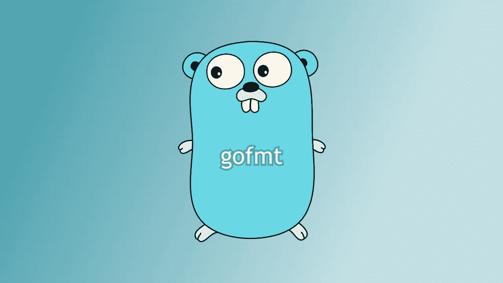

# 使用 gofmt 格式化你的代码，写出更好的 Golang 代码

> 原文：<https://blog.devgenius.io/write-better-golang-code-by-using-gofmt-to-format-your-code-c9a37ad6caba?source=collection_archive---------0----------------------->



如果格式化您的 Go 代码是一个大难题，那么您肯定会对利用这个叫做`gofmt`的工具感兴趣。

根据 [go.dev](https://go.dev/blog/gofmt) 的一项调查，在野外有高达 70%的软件包使用`gofmt`。这个数字非常高，这是一个好迹象，表明您的代码也应该使用它，否则您将是少数。

根据 Go 的博客:

> [Gofmt](https://golang.org/cmd/gofmt/) 是一个自动格式化 Go 源代码的工具。
> 
> Gofmt'd 代码是:
> 
> 更容易**编写**:在进行编程时，永远不要担心小的格式问题，
> 
> 更容易阅读:当所有代码看起来都一样时，你不需要在心里把别人的格式转换成你能理解的东西。
> 
> 更容易**维护**:对源文件的机械改变不会导致文件格式的不相关改变；差异只显示真实的变化。
> 
> **无争议的**:再也不会有关于间距或括号位置的争论了！

简而言之，如果你想要一种简单的方法来格式化你的代码，并且不需要和其他人就代码的格式而不是代码的设计或结构进行风格上的争论，`gofmt`是至关重要的。

要真正使用`gofmt`，有几种方法。

一种方法是在终端中对要格式化的 Go 文件运行命令:

```
gofmt -w yourfile.go
```

顺便说一下，如果你想知道那个`-w`旗是做什么的，让我们看看`gofmt`的文档，看看那里发生了什么:

> -w
> 
> 不要将重新格式化的源打印到标准输出。
> 如果文件的格式与 gofmt 不同，用 gofmt 的版本覆盖它
> 。如果覆盖过程中出现错误，
> 从自动备份中恢复原始文件。

所以基本上，`gofmt`将格式化的文件打印到标准输出(基本上，在您的终端中)。如果您不想看到这种情况——特别是对于非常长的文件——那么您可以使用`-w`标志。另外，`gofmt`将在文件格式化方面胜出，但是如果在覆盖过程中发生了什么，那么原始文件将被恢复。

您也可以使用`go fmt`命令获得与`gofmt`相同的结果:

```
go fmt path/to/your/file
```

此外，当使用`gofmt`处理文件和目录时，还有一些事情。

如果您提供了一个文件，`gofmt`将格式化该文件。

如果您提供一个目录，`gofmt`足够智能，可以格式化该目录中的所有`.go`文件。

你还在等什么？今天就用`gofmt`！

[](https://tremaineeto.medium.com/membership) [## 通过我的推荐链接加入媒体

### 作为一个媒体会员，你的会员费的一部分会给你阅读的作家，你可以完全接触到每一个故事…

tremaineeto.medium.com](https://tremaineeto.medium.com/membership)