# 用 PyCharm 的交互式调试器为 Django 编写更好的测试

> 原文：<https://blog.devgenius.io/write-better-tests-for-django-with-pycharms-interactive-debugger-1e55b49993f2?source=collection_archive---------5----------------------->

## PyCharm 的交互式调试器是如何成为我开发过程中的一个宝贵部分的，它也应该成为你的一部分。


PyCharm 的交互式调试器将帮助您更快地编写更健壮的代码，帮助您理解工作流，并更容易地找到和调试代码中的错误。

在本文中，我们将在 PyCharm 上完成一个基本的 Django 项目的设置。我们将安装`pytest`并向您展示如何将其启用为默认的测试运行程序。最后，我们将向您展示如何使用调试器来查找和修复一些错误，以及如何在您的日常开发工作流程中使用它。最后还有奖金，所以不要走。

如果阅读不适合你，这里还有一个短视频。

# 项目设置

这篇文章中的所有内容都可以用 PyCharm 的社区版来完成，所以请直接从他们的网站上为您的系统下载的免费版本。如果您遵循默认的安装说明，几分钟后您就可以开始使用了。我们显然需要一个项目来合作，我已经有了一个，你可以从 [Github](https://github.com/the-nonlinearity/your-first-django-app/tree/start) 拉。该项目基于[编写你的第一个 Django 应用](https://docs.djangoproject.com/en/3.2/intro/tutorial01/)教程，你可以在他们的网站上找到。如果你是一个初学者或者想温习一些基础知识，我强烈推荐你跟随教程。我还将上传另一篇关于编写和发布你自己的可重用 Django 包的文章。

从克隆来自[库](https://github.com/the-nonlinearity/your-first-django-app/tree/start)的代码开始。现在我们已经准备好了编辑器和代码，让我们开始在 PyCharm 上设置我们的项目。

## 1.打开您的项目

使用顶部导航在 PyCharm 中打开您的项目。


导航到克隆项目的位置，并在新窗口中打开基础项目文件夹。您应该看到以下内容:

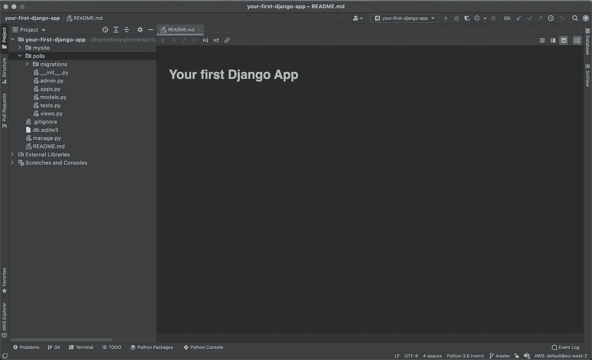

你第一次打开 Django 应用的时候。

随着项目的打开，我们可以开始为我们的项目配置设置。

## 2.创建或使用虚拟环境

默认情况下，PyCharm 将使用您默认拥有的任何 python 解释器，但是您很可能总是希望至少在虚拟环境中运行您的项目。您可以从设置(首选项)窗口直接创建一个或添加一个现有的。

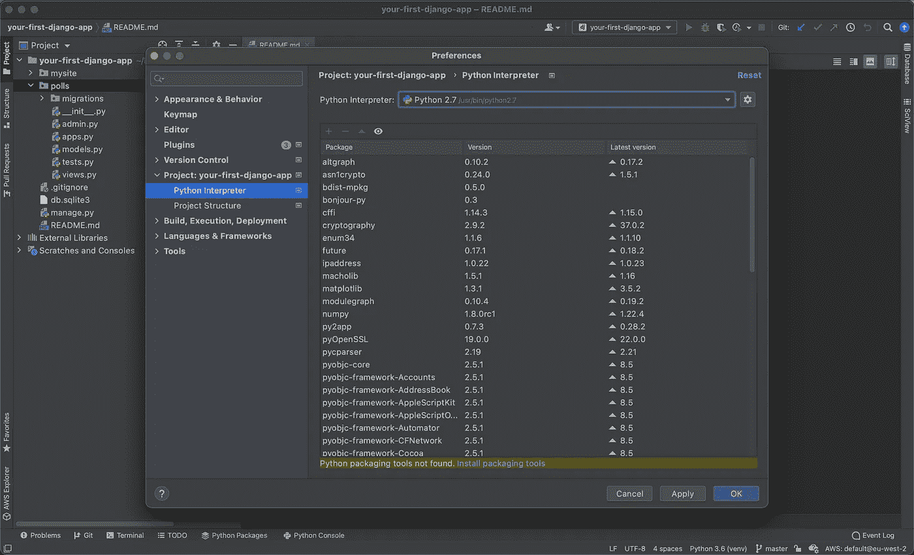

我使用`pyenv`，因此我将添加我在项目设置期间创建的现有环境，但您可以点击右上角的齿轮，创建一个新环境或添加您自己的环境。请注意，您希望将您的 python 解释器更改为`python3`。

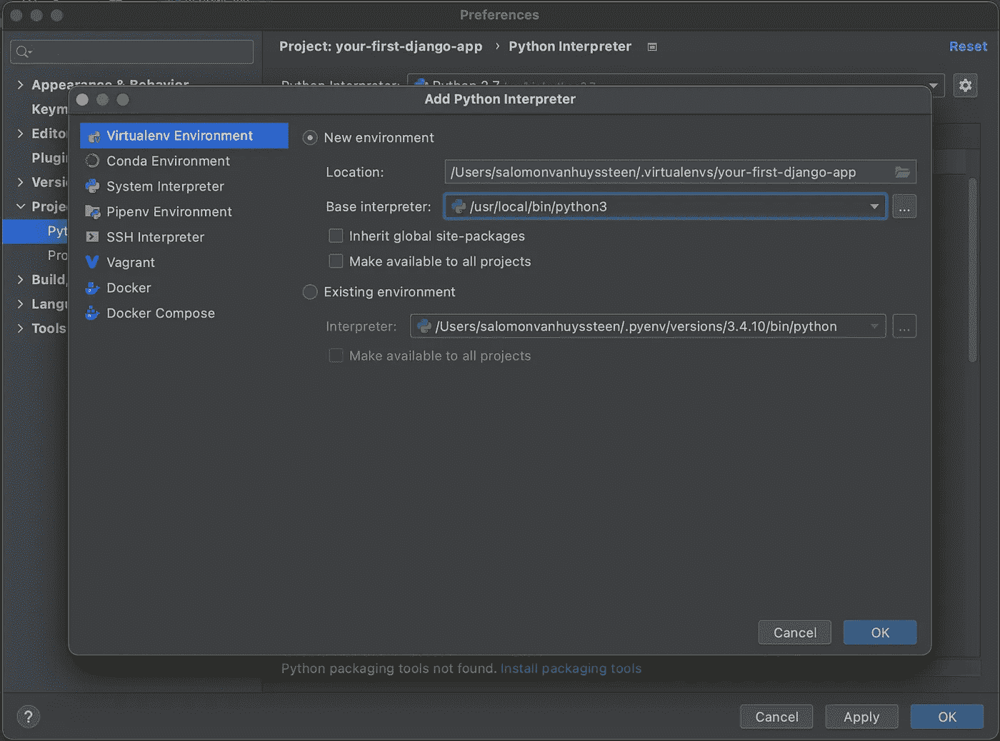

创建了新的虚拟环境后，您现在应该会看到如下内容:

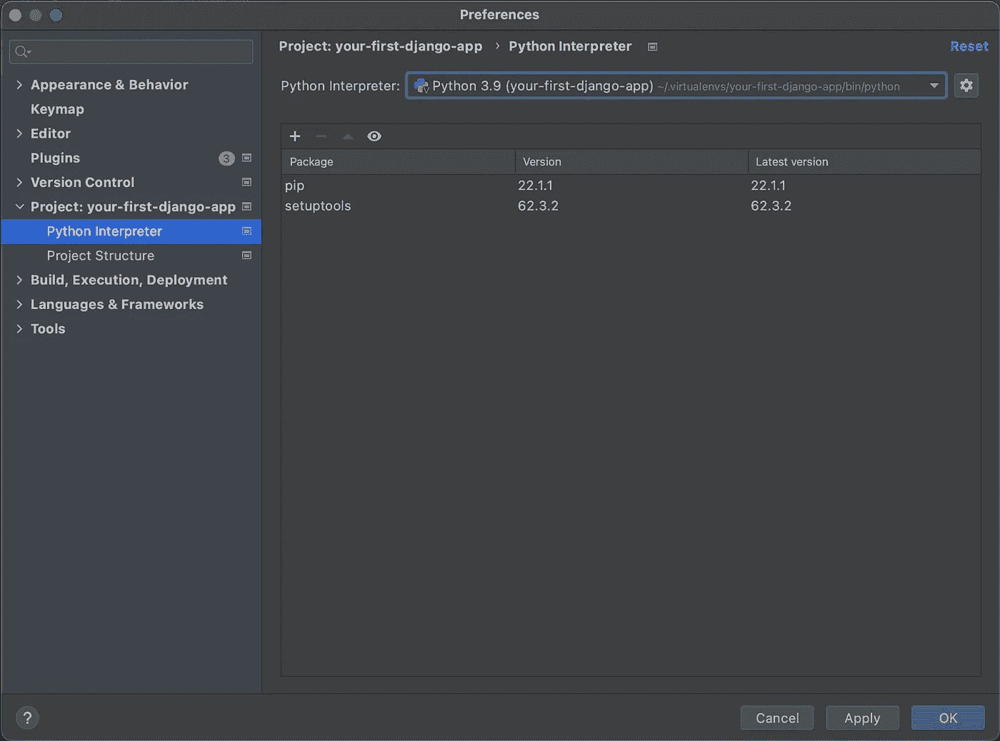

在这里，您将看到默认情况下安装在虚拟环境中的软件包。您会注意到 Django 还没有安装。我们现在会解决这个问题。

用户可以直接从这里安装软件包，也可以从命令行直接在虚拟环境中安装软件包。我们将使用命令行，因为我们还想将我们的包添加到项目的`requirements.txt`文件中，以便跟踪我们将使用的内容。

将下面的`requirements.txt`文件添加到项目的基本目录中。

```
Django==4.0.4
pytest==7.1.2
pytest-django==4.5.2
```

你可以用`pip install -r requirements.txt`来安装需求，它会安装你所有的需求。

## 3.设置测试跑步者

为了使用`pytest`包来运行我们的测试，我们需要再改变一个配置设置。导航到`Tools>Python Integrated Tools`并将默认测试运行器设置为`pytest`。

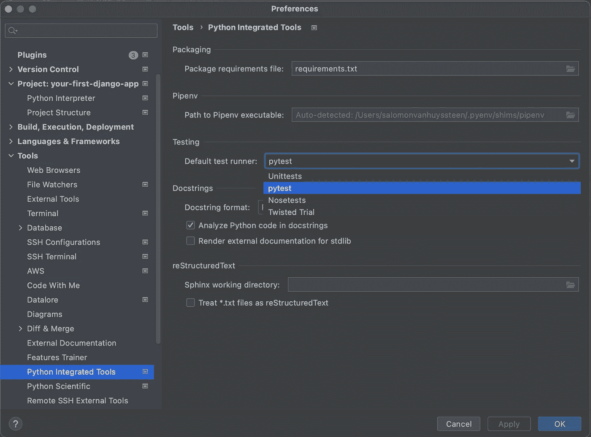

我们还需要告诉`pytest`在哪里可以找到我们的项目设置文件。所以我们将下面的`pytest.ini`文件添加到我们的项目中。

```
[pytest]
DJANGO_SETTINGS_MODULE=mysite.settings
python_files = tests.py test_*.py *_tests.py
```

很好，现在我们已经设置好了项目，我们现在可以开始编写一些代码并使用交互式调试器了。

# 编写我们的第一个测试

在我们做任何进一步的事情之前，我们将以纯 TDD 的方式编写我们的第一个测试用例。将以下代码添加到`polls/tests.py`文件中。

```
from django.test import TestCase
from django.urls import reverse

class IndexViewTests(TestCase):
    def test_index(self):
        *"""
        Test the index page.
        """* response = self.client.get(reverse('polls:index'))
        assert response.status_code == 200
```

现在您将能够在 PyCharm UI 中导航到您的测试，右键单击`test_index`并选择`Run 'pytest for tests.IndexViewTests.test_index'`。这将运行您的单一测试。您可以对测试类或整个`tests.py`文件进行同样的操作。

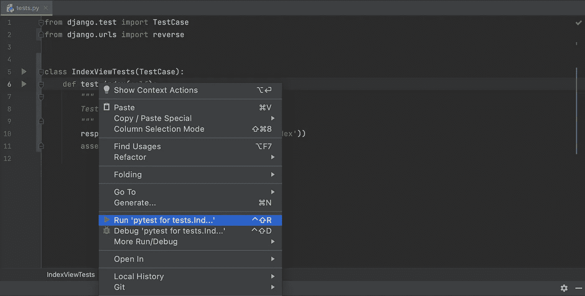

现在，您将看到测试失败，并且在下面的控制台中会有一些输出。

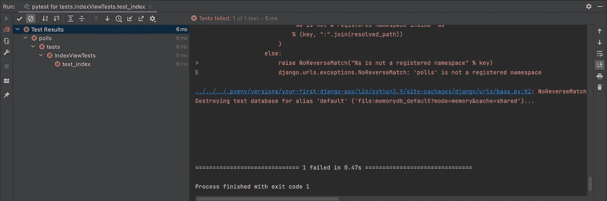

我们现在可以使用我们的错误输出来修复我们的测试。由于我们没有在 Django 中定义视图或 url，我们应该知道这就是为什么我们的测试失败并出现`NoReverseMatch`异常。幸运的是，我们可以通过添加索引页面视图和 url 映射来快速修复这个问题。

```
# polls/views.py **from** **django.http** **import** HttpResponse

**def** index(request):
    response_text = "Hello, world. You're at the polls index."
    **return** HttpResponse(response_text)
```

和投票应用程序 url

```
# polls/urls.py
**from** **django.urls** **import** path

**from** **.** **import** views

app_name = 'polls'
urlpatterns = [
    path('', views.index, name='index'),
]
```

然后将投票应用程序 URL 添加到`mysite/urls.py`中的站点 URL。

```
urlpatterns = [
    path('polls/', include('polls.urls')),
    path('admin/', admin.site.urls),
]
```

您可以使用 PyCharm 中的`alt+return`快捷方式添加 include 导入。将鼠标悬停在缺少的导入上，然后按下`alt+return`，它会提示您是否要添加导入。只要确保选择正确的导入即可。

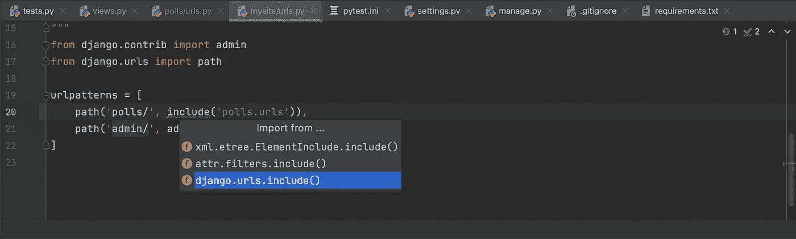

再次运行我们的测试，现在应该通过了。既然我们已经建立了项目并运行了测试，我们可以开始使用 PyCharm 中的交互式调试器了。

# 交互式调试器

我们现在可以使用调试器来检查我们编写的代码。为了使用调试器，我们需要在 PyCharm 的调试模式下运行测试，并且我们希望在代码中添加一个断点。您可以在视图代码中添加断点，方法是单击行号旁边的装订线。

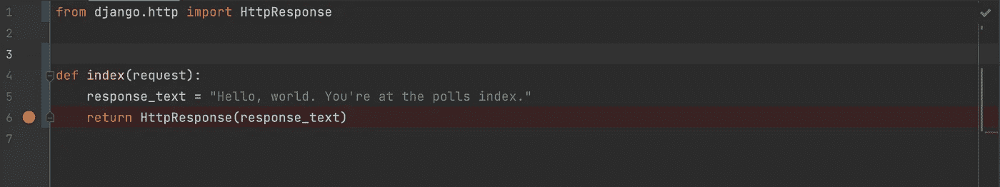

现在使用调试模式运行测试。

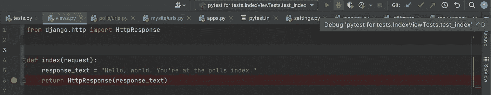

测试现在将在断点处暂停执行。您将看到函数中变量的预览将显示在指向断点的行中。

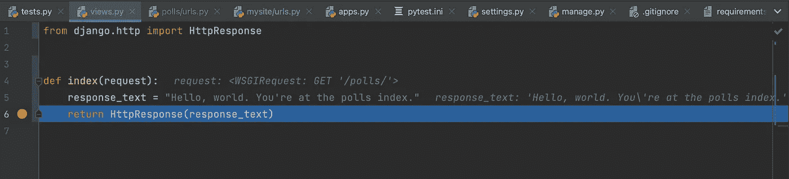

然而，最有价值的是在下面的交互窗口中，您可以在这里进一步检查变量，并使用其他各种可用的执行选项继续执行。在此视图中还可以设置其他配置和视图。我们将在下面讨论这些。

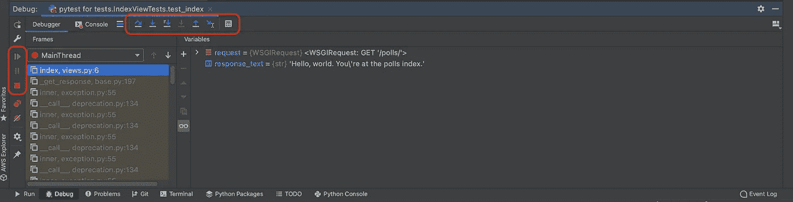

PyCharm 的文档包含了调试时可用的各种功能的大量示例，我将只详细说明我最常用的功能。

1.  **跨过**
2.  **进入我的代码**
3.  **评估表达式**

在我们深入研究这些之前，让我们跳到 Django 教程，这样我们就有一个更好的测试来调试。从存储库中签出第 5 部分标签。

使用我们之前使用的右键单击并运行来运行`test_was_published_recently_with_future_question`测试，我们看到测试如预期的那样失败了。

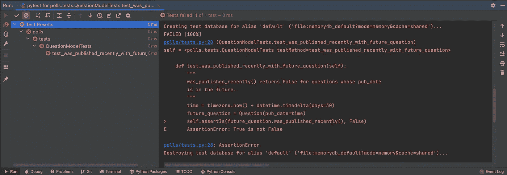

看看测试中会发生什么。

```
**def** test_was_published_recently_with_future_question(self):
    *"""
    was_published_recently() returns False for questions whose pub_date
    is in the future.
    """* time = timezone.now() + datetime.timedelta(days=30)
    future_question = Question(pub_date=time)
    self.**assertIs**(future_question.was_published_recently(), **False**)
```

`test_was_published_recently_with_future_question`创建了一个`Question`实例，它的`pub_date`字段是未来 30 天，使用`assertIs()`方法，它发现它的`was_published_recently()`返回`True`，尽管我们希望它返回`False`。我们现在可以利用我们的交互式调试器来找出到底哪里出错了。

向测试中的第一行添加断点。我们将使用**单步跳过**和**单步进入**动作来查找故障点，并且我们将使用**求值表达式**功能来查看哪里出错了。继续在调试模式下运行测试。你应该在这里结束。

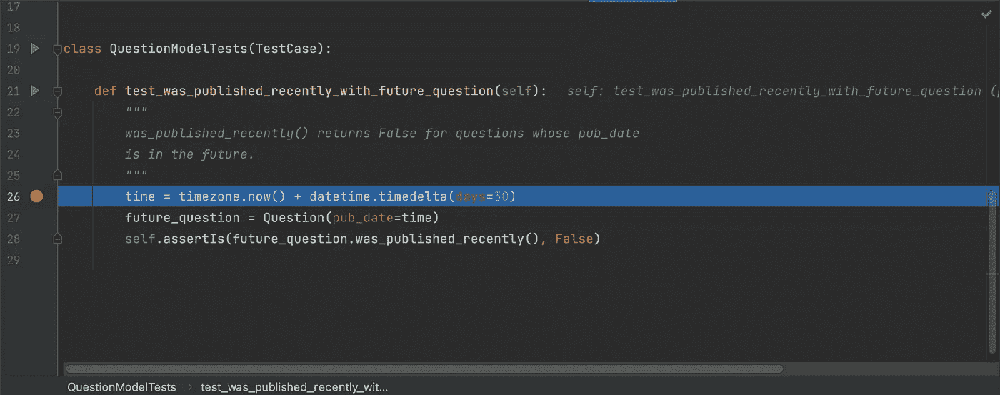

使用**跨过**动作向下移动到 assertIs 语句。你会看到你可以检查你所创建的时间确实是你所期望的，甚至它被正确地设置在你的`future_question`对象上。

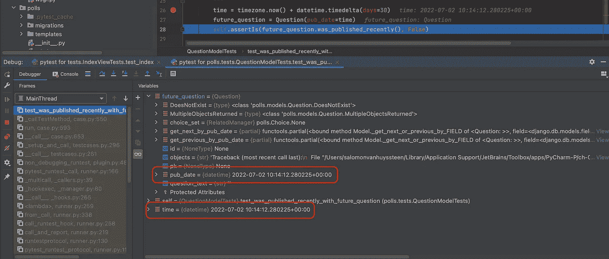

现在我们知道这些都是正确的，我们可以**跳到我的代码**中，看看`was_published_recently()`函数内部发生了什么。你应该发现自己在这里:

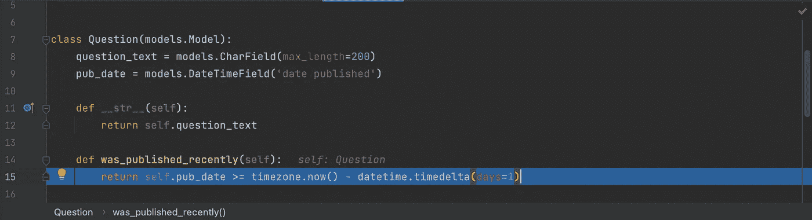

我们现在可以使用求值表达式函数来查找并修复 bug。如果我们在 return 语句上运行 Evaluate 表达式，我们会看到它返回 True，尽管我们预期它是 False。

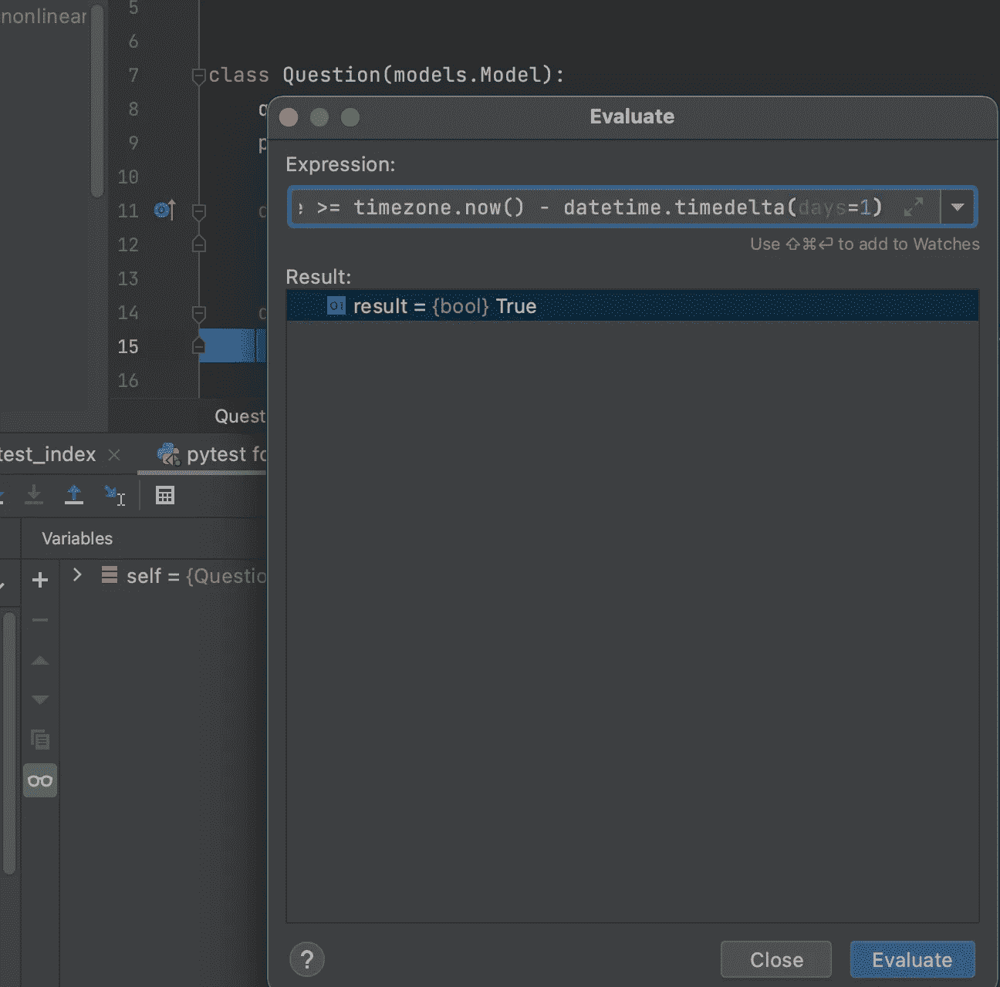

进一步检查我们正在比较的日期，我们看到`pub_date`确实是在未来，但是我们没有从表达式中排除未来日期的帖子。我们需要检查一下`pub_date`是否也小于`now()`。在将它放入代码之前，我们可以在表达式求值中测试它。

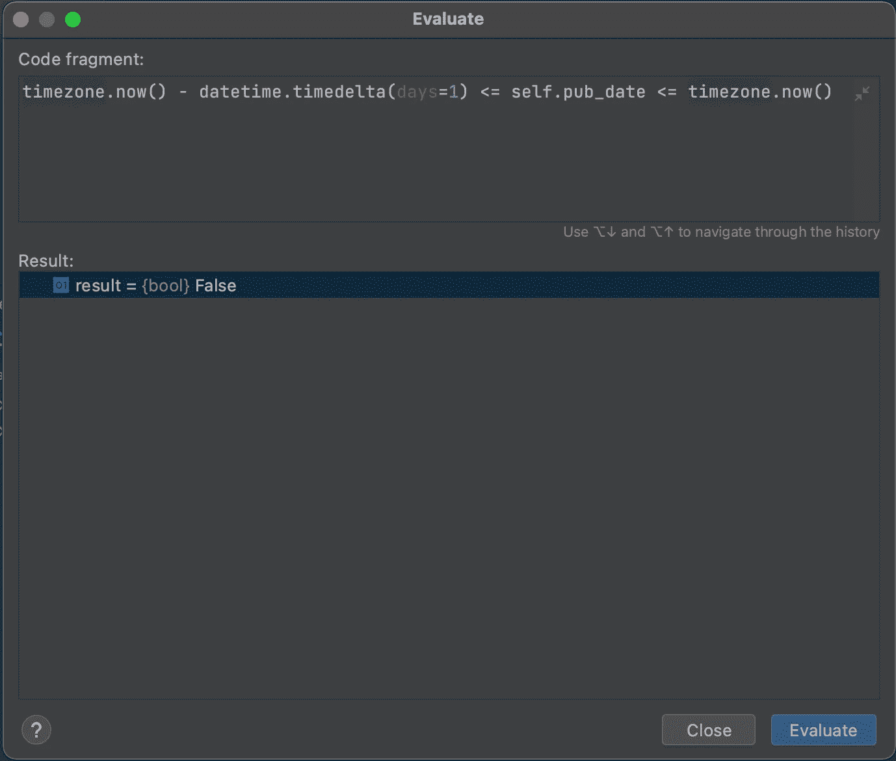

太好了，现在它似乎工作了，我们可以纠正我们的代码并重新运行我们的测试。这一次它正确地通过了。请记住，在调试模式下执行测试期间，您可以随时使用**恢复**、**暂停**和**停止**按钮。

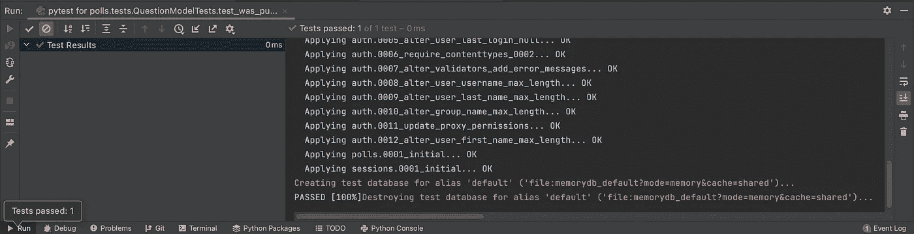

# 结论

希望通过这个简单的例子可以帮助您理解这个过程，并将其应用到您的具体案例中。它确实帮助我更快地发现问题，尤其是在处理我自己没有写或者很久以前写的代码时。使用 **Step into my code** 函数也有助于找到信号中有时会发生事情的地方。

# 奖励无迁移🎉

当您在测试开始之前有许多迁移要运行时，或者当您想要测试一个模型变化而不经历整个迁移过程时，这个`--nomigrations`标志是一个救命稻草。您可以在测试配置中设置此标志:

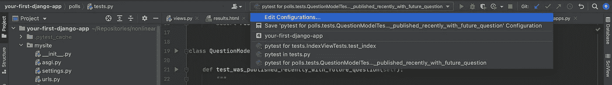

然后在**附加参数**选项中添加`--nomigrations`参数

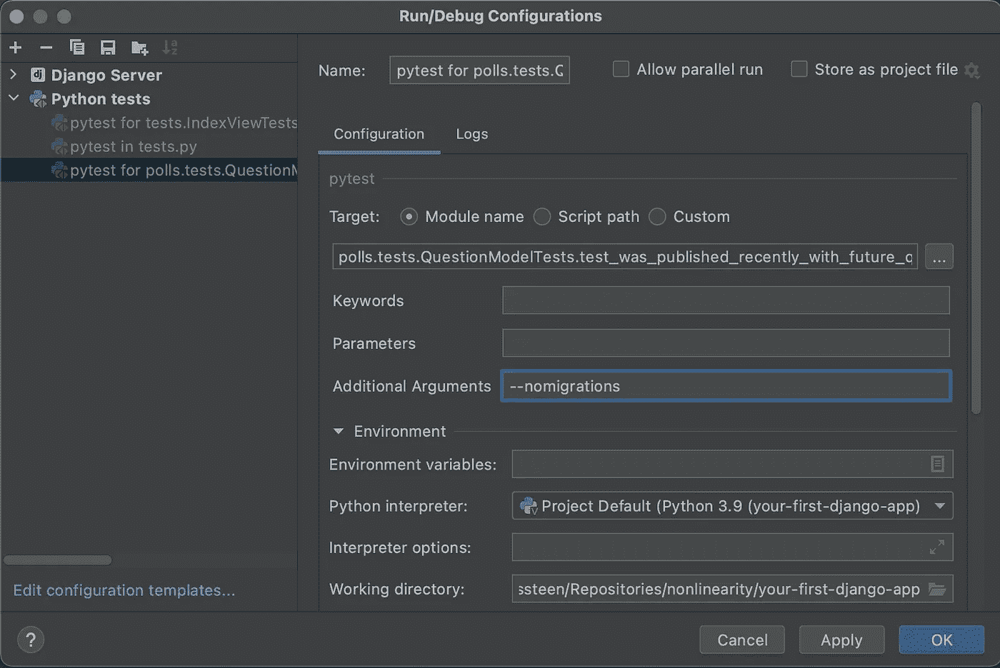

或者您可以将它全局添加到您的`pytest.ini`文件中，但是不要提交这个选项，因为您不希望您的 CI 在不需要进行任何迁移的情况下运行您的测试，然后如果您需要额外的更改，需要回滚或更改它们。

```
[pytest]
DJANGO_SETTINGS_MODULE=mysite.settings
python_files = tests.py test_*.py *_tests.py
addopts = --nomigrations
```

继续向您的问题模型添加一个不可为空的字段，看看您的测试如何运行。

```
**class** Question(models.Model):
    question_text = models.CharField(max_length=200)
    pub_date = models.DateTimeField('date published') published_by = models.ForeignKey(User, on_delete=models.CASCADE)

    **def** __str__(self):
        **return** self.question_text
```

还要更新测试。

```
**def** test_was_published_recently_with_future_question(self):
    *"""
    was_published_recently() returns False for questions whose pub_date
    is in the future.
    """* user = User.objects.create_user('john', 'lennon@thebeatles.com', 'johnpassword')
    time = timezone.now() + datetime.timedelta(days=30)
    future_question = Question(pub_date=time, published_by=user)
    future_question.save()
    self.**assertIs**(future_question.was_published_recently(), **False**)
    self.**assertEqual**(future_question.published_by, user)
```

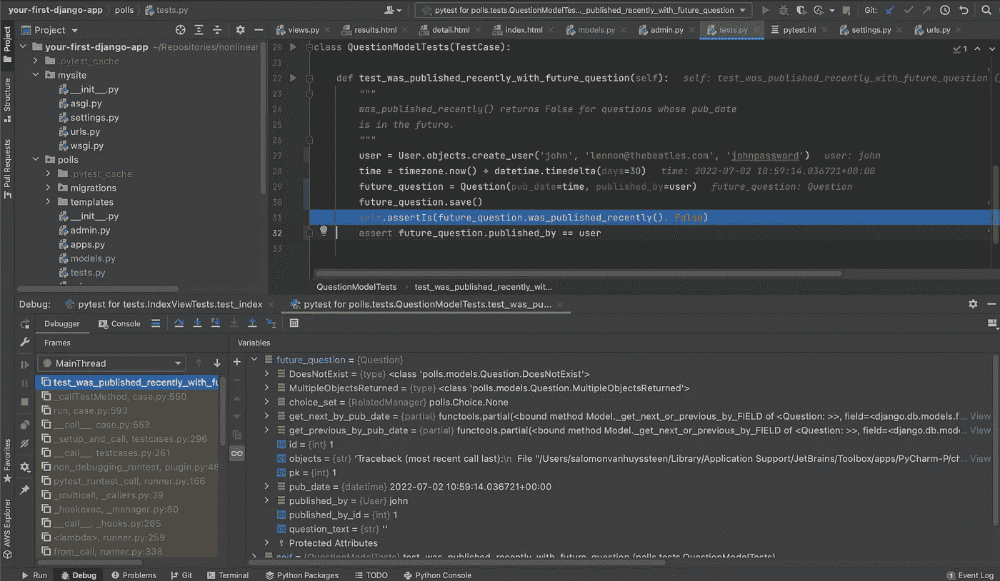

我希望这能帮助你提高效率和代码质量！