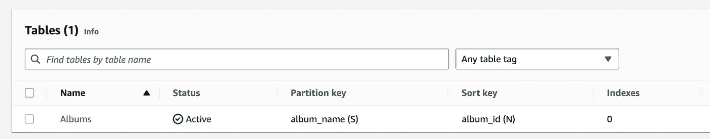
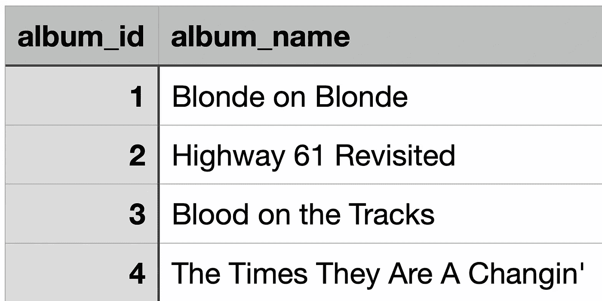
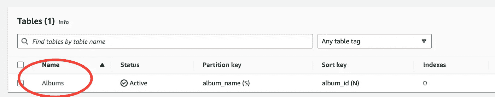
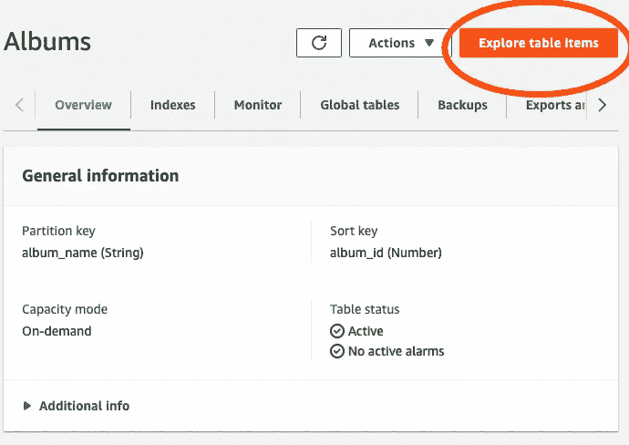
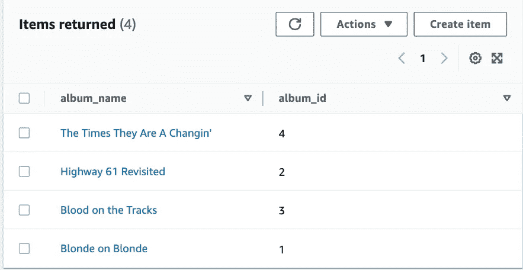

# 使用 awswrangler 和 boto3 将数据写入 DynamoDB

> 原文：<https://blog.devgenius.io/write-data-to-dynamodb-using-awswrangler-and-boto3-d6aad2622389?source=collection_archive---------7----------------------->

文章照片

DynamoDB 是快速、灵活的 **NoSQL** 数据库服务，可实现个位数毫秒级性能。它是完全托管的，无需服务器，可以在任何规模下运行**高性能应用**。

最常见的使用案例:

*   软件应用
*   创建媒体元数据存储
*   提供无缝零售体验
*   规模游戏平台

在这篇文章中，我将向你展示如何使用 Python 库**向 DynamoDB** 写数据。其中之一 [boto3](https://boto3.amazonaws.com/v1/documentation/api/latest/index.html) —是众所周知的 AWS SDK (SDK 代表软件开发工具包)，它使**能够创建、配置和管理 AWS 服务**。我将使用它来创建 DynamoDB 表。

第二个库叫做**AWS rangler**—**AWS 熊猫 SDK。**它可以将 **pandas DataFrame、csv、json 或 parquet** 文件直接写入 **DynamoDB 表或 S3 桶**等等，查看[官方文档](https://aws-sdk-pandas.readthedocs.io/en/stable/api.html)。

## 使用 boto3 创建表格

让我们看看下面的 python 代码:

创建 DynamoDB 表

函数 **create_albums_table** 有一些奇特的地方值得一提和说明:

1.  第 4–8 行:函数采用一个参数— *dyn_resource* s，默认设置为 None。如果第 7 行和第 8 行的语句检查参数 *dyn_resources* 是否为 None，如果是，则使用 boto3 包来**创建 DynamoDB 客户端(DynamoDB 客户端是一个 Python 类，** [**这里的**](https://boto3.amazonaws.com/v1/documentation/api/latest/reference/services/dynamodb.html) **是属于这个类的方法)**
2.  第 12–29 行:**模式是 python 字典**，它包含创建表所需的数据
3.  第 31 行:表的创建(注意字典被**双星号语法**解包)
4.  第 33 行:方法**。wait _ until _ exists()**简单等待，直到表被创建
5.  最后，函数**在第 35 行返回表**

执行函数**后，create_albums_table** 表在 DynamoDB 中创建。为了检查它，你可以去你的 **AWS 管理控制台**并搜索 **DynamoDB** 服务。接下来点击**表格选项卡。**您应该会看到**相册**表格，如下图所示:

DynamoDB 中列出的表格相册

## 使用 awswrangler 写入数据

让我们看看带有相册的示例数据集:

带有相册的数据集示例

我们可以看到上面的数据集包含两列:

*   相册 id —类型:整数
*   相册名称—类型:字符串

数据以 **csv 格式**存储。让我们使用 awswrangler 库，以便直接从 csv 文件将其写入 **DynamoDB。以下 Python 代码支持这样做:**

上面代码中值得一提的是**第 10–13 行:**这里库 awswrangler 用于**将数据从 csv 文件**写入 DynamoDB。

当函数**write _ data _ to _ Albums _ table**被执行时，我们可以验证数据是否已经被写入**相册表**。为此，请遵循以下步骤。

1.进入 **AWS 管理控制台，**再次导航到 **DynamoDB** 服务，点击**表格。**

2.点击表格名称**相册。下面的截屏突出显示了这一点:**

3.您应该会看到**相册**表格的导航仪表板，现在为了浏览表格项目，请单击下面屏幕截图上突出显示的按钮:

4.点击此按钮后，您应该能够在页面的**底部看到下表:**

DynamoDB 中的相册表

## 附加信息

DynamoDB 允许写数据的方法还有**。**

在我写这篇文章的那天——2022 . 12 . 27 awswrangler 包为 DynamoDB 提供了 **6 个方法:**

**delete_items** —删除指定 DynamoDB 表中的所有项目。

**get_table** —获取指定表名的 DynamoDB 表对象。

**put_csv** —将 csv 文件中的所有项目写入 DynamoDB。

**put_df** —将数据帧中的所有项目写入 DynamoDB

**put_items** -将所有项目插入指定的 DynamoDB 表格。本例中的条目是字典列表。

**put _ json**-将 JSON 文件中的所有项目写入 DynamoDB。

这篇文章的代码在这个[报告里](https://github.com/Cloudy17g35/write_data_to_dynamodb)。