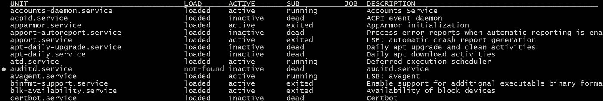

# 在 Linux 中编写 systemD 服务文件(centos 和 ubuntu)

> 原文：<https://blog.devgenius.io/write-systemd-service-file-in-linux-centos-and-ubuntu-6accf1dc1109?source=collection_archive---------3----------------------->

什么是服务…？

各种服务在 Linux 背景下持续运行，比如网络和系统服务。运行在 Linux 上的服务也被称为守护进程，指的是一组在后端工作的进程。


在 **Linux** 中， *Systemctl* 是一个实用程序，负责管理和控制 systemd 系统。 *systemctl* 命令可用于列出 Linux 中的所有**服务**。

一些 *systemctl* 命令的列表:

```
$ systemctl list-units --type=service --all
```



```
$ systemctl list-units --type=service --state=running
```

上面的命令显示了正在运行的服务列表..

```
$ systemctl status cron.service
```


有关更多命令详细信息，请访问:

[https://www . tecmint . com/list-all-running-services-under-systemd-in-Linux/](https://www.tecmint.com/list-all-running-services-under-systemd-in-linux/)

# 在 Linux 中哪里可以找到 Systemd 服务文件

通常主要有两个地方(第三名是 **/lib/systemd/system/** )

我们在哪里可以找到服务文件:

1.  `/etc/systemd/system`中的**/etc/systemd/system/**:-**文件由系统的操作员或管理员手动放置在此，用于非软件包形式的临时软件安装。**
2.  ****/usr/lib/systemd/system/**:-**只包含由包管理器放在那里的 systemd 单元文件(YUM/DNF/RPM/APT/etc)。****

****更多详情请点击链接:[https://UNIX . stack exchange . com/questions/206315/what-the-difference-usr-lib-systemd-system-and-etc-systemd-system](https://unix.stackexchange.com/questions/206315/whats-the-difference-between-usr-lib-systemd-system-and-etc-systemd-system)****

# ****Systemd 服务文件看起来像什么！****

```
**[Unit]
Description=Foo

[Service]
ExecStart=/usr/sbin/foo-daemon

[Install]
WantedBy=multi-user.target**
```

****使用命令创建和附加权限:****

```
**$ sudo touch /etc/systemd/system/foo-daemon.service
$ sudo chmod **664** /etc/systemd/system/foo-daemon.service**
```

****基本控制命令:****

```
**$ sudo systemctl start foo-daemon
$ sudo systemctl stop foo-daemon
$ sudo systemctl restart foo-daemon
$ systemctl status foo-daemon**
```

# ****Systemd 服务文件选项****

****Systemd 服务文件通常由三部分组成。****

****通用配置项在通用`[Unit]`和`[Install]`部分进行配置。****

****服务特定配置选项在`[Service]`部分进行配置。****

****我们可以通过命令找到更多细节:****

```
**$ **man systemd.unit****[UNIT]** SECTION OPTIONS
       ....Description=
           A human readable name for the unit. This is used by systemd (and other UIs) as the label for the unit, so this string
           should identify....**[INSTALL]** SECTION OPTIONS
       ......Alias=
           A space-separated list of additional names this unit shall be installed under. The names listed here must have the same
           suffix (i.e. type)...**
```

******对于服务部分:******

```
**$ **man systemd.service****OPTIONS**
       Service files must include a "[Service]" section, which carries information about the service and the process it supervises.
      ...Type=
           Configures the process start-up type for this service unit. One of simple, exec, forking, oneshot, dbus, notify or idle:•   If set to si......**
```

# ****创建我们自己的服务文件****

****为了演示，将创建服务文件“ **node_server.service** ，并使用已经创建的“ **mongodb.service** ”，它是在 linux 机器上安装 **mongodb** 数据库软件后自动创建的。****

# ****mongodb.service****

```
**Description=MongoDB Database Server
Documentation=[https://docs.mongodb.org/manual](https://docs.mongodb.org/manual)
After=network-online.target
Wants=network-online.target[Service]
User=mongodb
Group=mongodb
EnvironmentFile=-/etc/default/mongod
ExecStart=/usr/bin/mongod --config /etc/mongod.conf
PIDFile=/var/run/mongodb/mongod.pid
# file size
LimitFSIZE=infinity
# cpu time
LimitCPU=infinity
# virtual memory size
LimitAS=infinity
# open files
LimitNOFILE=64000
# processes/threads
LimitNPROC=64000
# locked memory
LimitMEMLOCK=infinity
# total threads (user+kernel)
TasksMax=infinity
TasksAccounting=false# Recommended limits for mongod as specified in
# [https://docs.mongodb.com/manual/reference/ulimit/#recommended-ulimit-settings](https://docs.mongodb.com/manual/reference/ulimit/#recommended-ulimit-settings)[Install]
WantedBy=multi-user.target**
```

******启用服务:******

****`$ sudo systemctl enable mongodb.service`****

****安装 **mongodb** 请参考:[https://www . MongoDB . com/docs/manual/tutorial/install-MongoDB-on-Ubuntu/](https://www.mongodb.com/docs/manual/tutorial/install-mongodb-on-ubuntu/)****

# ****node_server.service****

```
**$ sudo touch /etc/systemd/system/**node_server**.service
$ sudo chmod **664** /etc/systemd/system/**node_server**.service**
```

****用于使用指定的**端口**在 **localhost** 运行**节点**服务器，例如在**[**http://localhost:4001/**](http://localhost:4001/)**连接 **mongodb** 数据库并显示**数据库**信息**。**********

****该服务文件中的主要部分是之后的**和**想要的**字段。它清楚地提到它依赖于 **mongodb.service.** 每次我们重启机器 **node_server.service** 总是在 **mongodb.service.** 之后运行******

## ****【服务】标签****

**增加了**类型** = *简单*(根据需要我们也可以使用**通知**或**分叉**)**

**我们也可以指定**用户**和**组**来运行进程。**

**增加了**环境** =" *端口=4001* ，也在 **ExecStart 中调用。**了解更多信息**:**[https://www . freedesktop . org/software/systemd/man/systemd . exec . html # Environment](https://www.freedesktop.org/software/systemd/man/systemd.exec.html#Environment)**

**增加了**ExecStart**=*/usr/bin/node/opt/node _ server/app . js $ { PORT }。*其中/usr/bin/node 代表 nodejs 二进制命令，它将运行带有参数 **${PORT}** 的 **app.js** 脚本**

**还增加了**标准输出**=文件:/opt/node_server/ **输出 _ 日志**。日志和
**标准错误**= file:/opt/node _ server/**error _ log**. log .了解更多信息:[https://www . freedesktop . org/software/systemd/man/systemd . exec . html # standard output =](https://www.freedesktop.org/software/systemd/man/systemd.exec.html#StandardOutput=)**

**也可以为此进程配置 ulimit，check out:[https://www . freedesktop . org/software/systemd/man/systemd . exec . html # Process % 20 properties](https://www.freedesktop.org/software/systemd/man/systemd.exec.html#Process%20Properties)**

**增加了**重启**=总是，当进程意外中断时会重启服务。**

```
**Description**=NodeJs Server
**Documentation**=[https://docs.mongodb.org/manual](https://nodejs.org/en/docs/)
**After**=**mongodb.service**
**Wants**=**mongodb.serivce**[**Service**]
**Type**=simple#User="we can also specify any user by which process will run"
#Group="we can also specify any group"**Environment**="PORT=4001"**ExecStart**=/usr/bin/**node** /opt/node_server/**app.js** ${**PORT**}**StandardOutput**=file:/opt/node_server/**output_log**.log
**StandardError**=file:/opt/node_server/**error_log**.log**Restart**=always[**Install**]
WantedBy=multi-user.target
```

****启动服务:****

```
$ sudo systemctl **start** node_server.service
$ sudo systemctl **status** node_server.servicenode_server.service
 Loaded: loaded (/etc/systemd/system/node_server.service; disabled; vendor preset: enabled)
 Active: active (running) since Sun 2022–06–26 11:08:51 UTC; 12s ago
 Main PID: 1500 (node)
 Tasks: 11 (limit: 2274)
 Memory: 18.1M
 CGroup: /system.slice/node_server.service
 └─1500 /usr/bin/node /opt/node_server/app.js 4001
```

****启用服务:****

```
$ sudo systemctl **enable** node_server.service
```

****重新启动机器:****

```
$ sudo shutdown -r now
```

**重启后，你会看到 **mongodb.service** 和 **node_server.service** 都在运行**

**在 [http://localhost:4001/](http://localhost:4001/)**

****

## **app.js 脚本**

**路径:/opt/node _ server/**app . js****

****运行命令:****

1.  **npm 安装 MongoDB-保存**
2.  **node app.js**

**`$ node app.js 4001
Server is running on [http://localhost:4001](http://localhost:4001)`**

****app.js** 的代码片段:**

```
const http = require("http");
const {MongoClient} = require('mongodb');
const **SERVER_PORT** = process.argv[2] || 4001;const DB_USER="admin";
const DB_PASSWORD="admin@123"
const DB_HOST_NAME="127.0.0.1"
const DB_PORT="27017"
const DATABASE="admin"const **uri** = `mongodb://${**DB_USER**}:${encodeURIComponent(**DB_PASSWORD**)}@${**DB_HOST_NAME**}:${**DB_PORT**}/${**DATABASE**}`;const **client** = new MongoClient(uri);async function startDbConnection(){
 try {
   //Connect to the MongoDB cluster
  await client.connect();} catch (e) {
   console.error(e);
}//start db connection
**startDbConnection();**const **requestListener** = function (req, res) {
   res.setHeader("Content-Type", "text/html");
   res.writeHead(200);
   **sendDbDetails(req,res);**
};async function **sendDbDetails**(req,res){
   let dbDetail = await getDbDetails();
   **res**.end(`<html><body>
            <h1>DB Connection Details</h1>
            <pre style="background-color:#DCDCDC;
            color:#333;">
                **${JSON.stringify(dbDetail,undefined,2)}**
             </pre>
             </body></html>`);
} async function **getDbDetails**(){
    databasesList = await client.db().admin().listDatabases();
    return databasesList.databases;
}const **server** = http.createServer(requestListener);**server**.listen(**SERVER_PORT**, () => {
  console.log(`Server is running on [http://localhost:${SERVER_PORT}`);](http://localhost:${SERVER_PORT}`);)}); **process**.on('SIGTERM', () => {
  **properlyCloseConnection**()
});**process**.on('SIGTINT', () => {
 **properlyCloseConnection**()
});**process**.on("uncaughtException",(e)=>{
  console.log(e);
  **properlyCloseConnection**()
});**process**.on('exit', function () {
  console.log("process is exited..")
});function **properlyCloseConnection**(){
    **client**.close(()=>{
        console.log('DB client closed');
    }); **server**.close(() => {
        console.log('Process terminated');
     });
}
```

**希望这篇文章对在 Linux 中编写服务文件有所帮助。所有代码都在 Linux 操作系统中测试过(Centos 和 Ubuntu)**

**感谢阅读。**