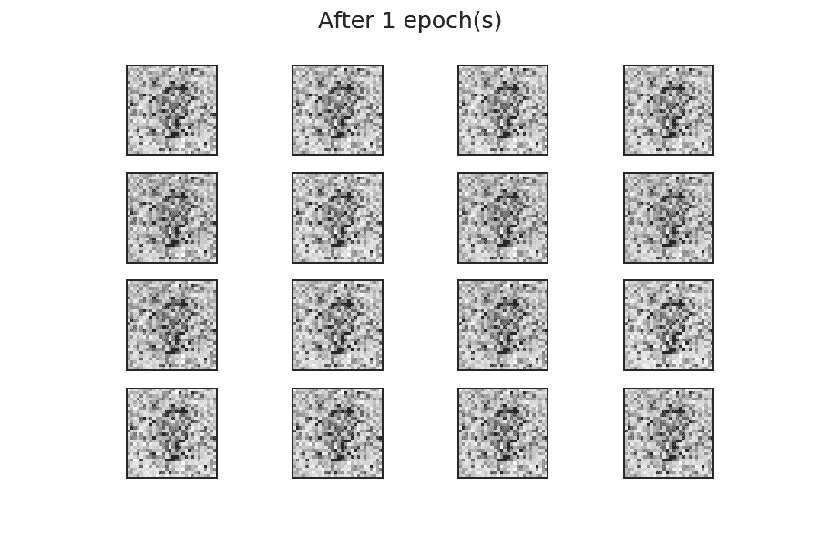
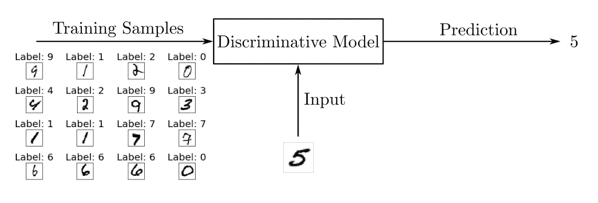
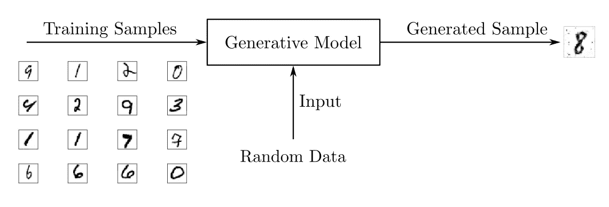
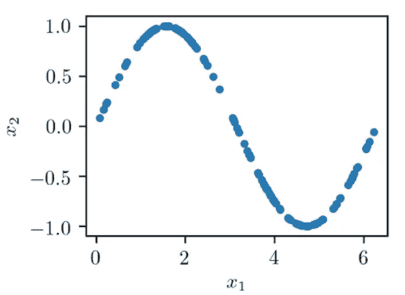
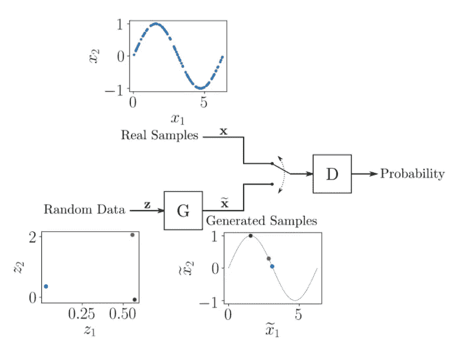
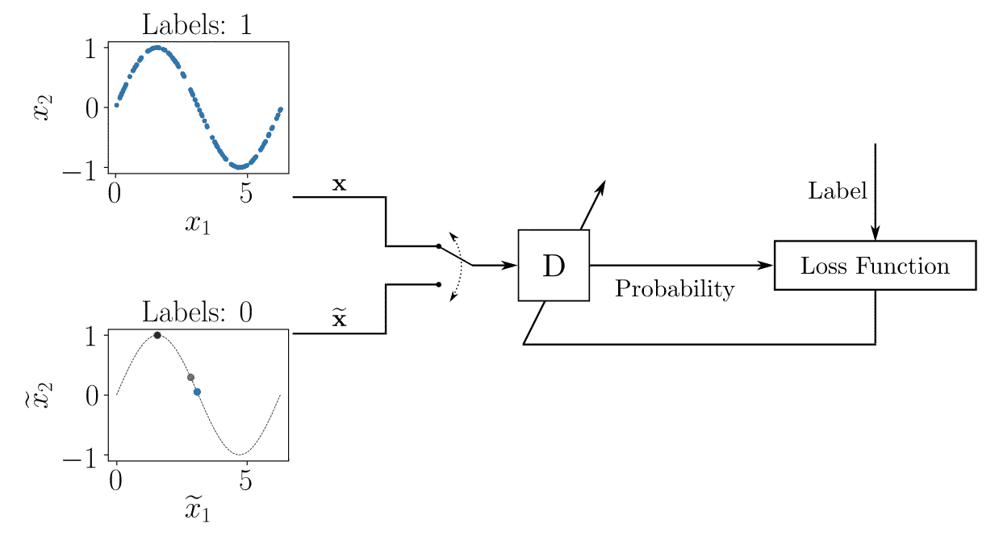
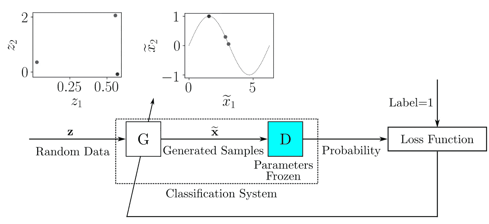
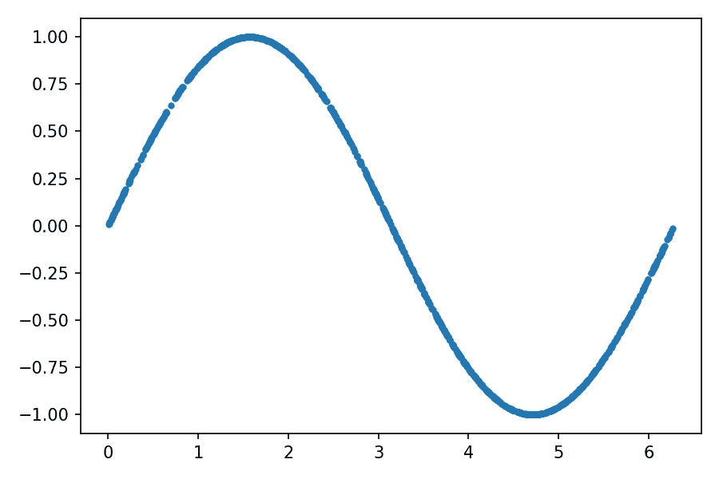
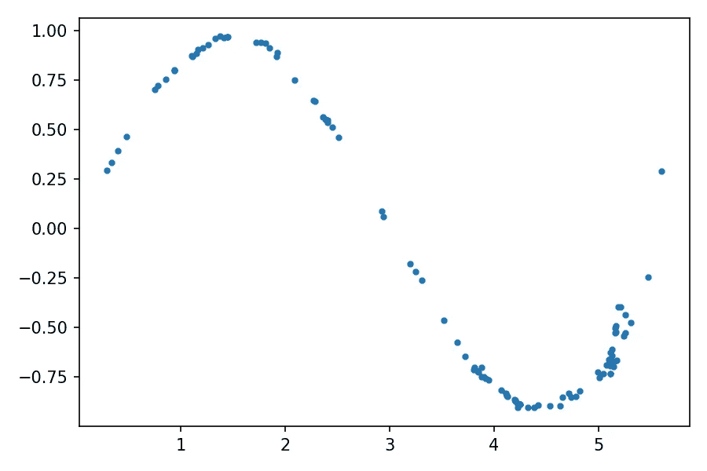
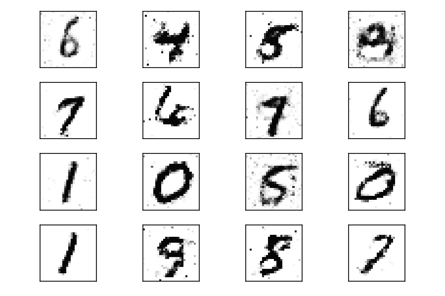

# 在 PyTorch 上写下你的第一个生成性对抗网络模型

> 原文：<https://blog.devgenius.io/write-your-first-generative-adversarial-network-model-on-pytorch-7dc0c7c892c7?source=collection_archive---------2----------------------->

使用使用 PyTorch 深度学习框架实现的两个模型的示例来构建生成式对抗性神经网络(GANs)的详细说明。


照片由 [Hayley Kim 设计](https://unsplash.com/@hayleykimdesign?utm_source=medium&utm_medium=referral)在 [Unsplash](https://unsplash.com?utm_source=medium&utm_medium=referral) 上拍摄

生成对抗网络(缩写为 GAN)是[神经网络](https://ru.wikipedia.org/wiki/%D0%9D%D0%B5%D0%B9%D1%80%D0%BE%D0%BD%D0%BD%D0%B0%D1%8F_%D1%81%D0%B5%D1%82%D1%8C)，可以生成类似于人类的图像、音乐、语音和文本。近年来，gan 已经成为一个活跃的研究课题。脸书人工智能实验室主任杨乐坤称对抗性学习是“过去 10 年中最令人兴奋的机器学习想法”下面我们将探索 gan 如何工作，并使用 PyTorch [深度学习](https://proglib.io/p/dl-frameworks)框架创建两个模型。

# 什么是生成性对抗网络？

[生成式对抗网络](https://ru.wikipedia.org/wiki/%D0%93%D0%B5%D0%BD%D0%B5%D1%80%D0%B0%D1%82%D0%B8%D0%B2%D0%BD%D0%BE-%D1%81%D0%BE%D1%81%D1%82%D1%8F%D0%B7%D0%B0%D1%82%D0%B5%D0%BB%D1%8C%D0%BD%D0%B0%D1%8F_%D1%81%D0%B5%D1%82%D1%8C) (GAN)是一种可以模拟给定数据分布的机器学习模型。该模型最初是由深度学习专家 Ian Goodfellow 及其同事在 2014 年的一篇论文中提出的。



甘学习过程

GANs 由两个神经网络组成，其中一个被训练来生成数据，另一个被训练来区分模拟数据和真实数据(因此模型具有“对抗性”的性质)。生成敌对网络在图像和视频生成方面显示出令人印象深刻的结果:

*   风格转换( [CycleGAN](https://github.com/junyanz/CycleGAN/) ) —一个图像根据其他图像的风格进行转换(例如，一位著名艺术家的绘画)；
*   人脸生成( [StyleGAN](https://en.wikipedia.org/wiki/StyleGAN) )，现实例子在[有，这个人不存在](https://www.thispersondoesnotexist.com/)。

GANs 和其他数据生成结构被称为生成模型，与更广泛研究的判别模型相对。在深入研究 GANs 之前，我们先来看看这两类模型的区别。

# 判别型和生成型机器学习模型的比较

判别模型用于大多数监督的[学习](https://ru.wikipedia.org/wiki/%D0%9E%D0%B1%D1%83%D1%87%D0%B5%D0%BD%D0%B8%D0%B5_%D1%81_%D1%83%D1%87%D0%B8%D1%82%D0%B5%D0%BB%D0%B5%D0%BC)问题，用于[分类](https://ru.wikipedia.org/wiki/%D0%97%D0%B0%D0%B4%D0%B0%D1%87%D0%B0_%D0%BA%D0%BB%D0%B0%D1%81%D1%81%D0%B8%D1%84%D0%B8%D0%BA%D0%B0%D1%86%D0%B8%D0%B8)或[回归](https://ru.wikipedia.org/wiki/%D0%A0%D0%B5%D0%B3%D1%80%D0%B5%D1%81%D1%81%D0%B8%D0%BE%D0%BD%D0%BD%D1%8B%D0%B9_%D0%B0%D0%BD%D0%B0%D0%BB%D0%B8%D0%B7)。作为分类问题的一个例子，假设你想训练[一个手写数字图像识别模型](https://proglib.io/p/neural-network-course)。要做到这一点，我们可以使用一个标记数据集，其中包含手写数字的照片，这些照片与数字本身相关联。

训练被简化为使用特殊算法设置模型的参数，该算法使损失函数最小化。损失函数是估计参数的真实值与其期望值之间的差异的标准。在学习阶段之后，我们可以使用该模型通过将最可能的数字与输入图像进行匹配来对新的(之前未考虑的)手写数字图像进行分类。



判别模型训练方案

判别模型使用训练数据来寻找类之间的边界。找到的边界用于区分新的输入并预测它们的类别。数学上，判别模型研究给定输入 ***x*** 的一个观测 y 的[条件概率](https://ru.wikipedia.org/wiki/%D0%A3%D1%81%D0%BB%D0%BE%D0%B2%D0%BD%D0%B0%D1%8F_%D0%B2%D0%B5%D1%80%D0%BE%D1%8F%D1%82%D0%BD%D0%BE%D1%81%D1%82%D1%8C) ***P (y | x)*** 。

判别模型不仅是神经网络，还有[逻辑回归](https://ru.wikipedia.org/wiki/%D0%9B%D0%BE%D0%B3%D0%B8%D1%81%D1%82%D0%B8%D1%87%D0%B5%D1%81%D0%BA%D0%B0%D1%8F_%D1%80%D0%B5%D0%B3%D1%80%D0%B5%D1%81%D1%81%D0%B8%D1%8F)和[支持向量机(SVM)](https://ru.wikipedia.org/wiki/%D0%9C%D0%B5%D1%82%D0%BE%D0%B4_%D0%BE%D0%BF%D0%BE%D1%80%D0%BD%D1%8B%D1%85_%D0%B2%D0%B5%D0%BA%D1%82%D0%BE%D1%80%D0%BE%D0%B2) 。

虽然判别模型用于监督学习，但生成模型通常使用原始数据集，也就是说，可以被视为一种形式的[无监督学习](https://ru.wikipedia.org/wiki/%D0%9E%D0%B1%D1%83%D1%87%D0%B5%D0%BD%D0%B8%D0%B5_%D0%B1%D0%B5%D0%B7_%D1%83%D1%87%D0%B8%D1%82%D0%B5%D0%BB%D1%8F)。因此，使用手写数字的数据集，你可以训练一个生成模型来生成新的图像。



与判别模型相反，生成模型研究输入数据 ***𝑥*** 的概率函数 ***P (x)*** 的性质。因此，它们不会生成预测，而是生成一个具有类似于训练数据集的属性的新对象。

除了 GAN，还有其他生成架构:

*   [玻尔兹曼机](https://ru.wikipedia.org/wiki/%D0%9C%D0%B0%D1%88%D0%B8%D0%BD%D0%B0_%D0%91%D0%BE%D0%BB%D1%8C%D1%86%D0%BC%D0%B0%D0%BD%D0%B0)
*   [自动编码器](https://ru.wikipedia.org/wiki/%D0%90%D0%B2%D1%82%D0%BE%D0%BA%D0%BE%D0%B4%D0%B8%D1%80%D0%BE%D0%B2%D1%89%D0%B8%D0%BA)
*   [隐马尔可夫模型](https://ru.wikipedia.org/wiki/%D0%A1%D0%BA%D1%80%D1%8B%D1%82%D0%B0%D1%8F_%D0%BC%D0%B0%D1%80%D0%BA%D0%BE%D0%B2%D1%81%D0%BA%D0%B0%D1%8F_%D0%BC%D0%BE%D0%B4%D0%B5%D0%BB%D1%8C)
*   预测序列中下一个单词的模型，如 [GPT-2](https://en.wikipedia.org/wiki/OpenAI#GPT-2)

最近，GANs 因其在视觉内容生成方面令人印象深刻的成果而获得了很多关注。让我们更详细地讨论生成性对抗网络的装置。

# 生成对立神经网络的体系结构

正如我们已经理解的，生成性对抗网络不是一个网络，而是两个网络:一个生成器和一个鉴别器。生成器的作用是基于类似真实数据的真实样本生成数据集。鉴别器被训练来估计样本是从真实数据获得而不是由生成器提供的概率。两个神经网络玩猫捉老鼠:生成器试图欺骗鉴别器，鉴别器试图更好地识别生成的样本。

为了理解 GAN 训练如何工作，考虑一个玩具示例，其数据集由二维样本 ***(x1，x2)*** 组成，其中 ***x1*** 的范围从 ***0*** 到 ***2π*** 和 ***x2=sin(x1)*** 。



x2 对 x1 的依赖性

用于从数据集中生成 ***(x̃1，x̃2)*** 相似点对的 GAN 的一般结构如下图所示。



通用 GAN 结构

生成器接收随机数对 ***(z1，z2)*** 作为输入，对其进行转换，使其类似于真实样本中的示例。神经网络的结构可以是任意的，例如，[多层感知器](https://ru.wikipedia.org/wiki/%D0%9C%D0%BD%D0%BE%D0%B3%D0%BE%D1%81%D0%BB%D0%BE%D0%B9%D0%BD%D1%8B%D0%B9_%D0%BF%D0%B5%D1%80%D1%86%D0%B5%D0%BF%D1%82%D1%80%D0%BE%D0%BD_%D0%A0%D1%83%D0%BC%D0%B5%D0%BB%D1%8C%D1%85%D0%B0%D1%80%D1%82%D0%B0)或[卷积神经网络](https://ru.wikipedia.org/wiki/%D0%A1%D0%B2%D1%91%D1%80%D1%82%D0%BE%D1%87%D0%BD%D0%B0%D1%8F_%D0%BD%D0%B5%D0%B9%D1%80%D0%BE%D0%BD%D0%BD%D0%B0%D1%8F_%D1%81%D0%B5%D1%82%D1%8C)。`G` `G`

鉴别器交替输入来自训练数据集的样本和由生成器提供的模拟样本。鉴别器的作用是评估输入数据属于真实数据集的可能性。也就是说，训练是以这样一种方式进行的，即它给出、接收真实样本，并且对于生成的样本。`D`T3`D`T5`0`

与生成器的情况一样，考虑到输入和输出数据的大小，您可以选择神经网络的任何结构。在这个例子中，输入是 2D，输出是范围从 0 到 1 的标量[。`D`](https://ru.wikipedia.org/wiki/%D0%A1%D0%BA%D0%B0%D0%BB%D1%8F%D1%80%D0%BD%D0%B0%D1%8F_%D0%B2%D0%B5%D0%BB%D0%B8%D1%87%D0%B8%D0%BD%D0%B0)

在数学上，GAN 学习过程由两个玩家的[极小最大游戏组成，其中它适于最小化真实样本和生成样本之间的差异的误差，并且适于最大化出错的概率。`D` `G` `D`](https://ru.wikipedia.org/wiki/%D0%9C%D0%B8%D0%BD%D0%B8%D0%BC%D0%B0%D0%BA%D1%81)

在训练的每个阶段，模型和的参数被更新。为了训练，在每次迭代中，我们用 1 标记真实样本的样本，用 0 标记生成样本的样本。因此，可以使用正常的监督学习方法来更新参数，如图所示。`D` `G` `D` `G` `D`



鉴别器训练过程

对于包含标记的真实样本和生成样本的每批训练数据，我们更新模型参数组`D`，最小化损失函数。参数`D`更新后，我们训练`G`生成更好的样本。在发电机训练期间，该组参数被`D`“冻结”。



发电机学习过程

当它开始生成样本好到“被忽悠”的时候，输出概率趋向于 1——它认为所有样本都属于原始样本。`G` `D` `D`

现在我们知道了 GAN 是如何工作的，我们准备使用 PyTorch 实现我们自己的神经网络。

# 你的第一个生殖对抗网络

作为对生成性对抗网络的第一个实验，我们将使用调和函数实现上面的例子。为了使用这个例子，我们将使用流行的 PyTorch 库，它可以使用[指令](https://pytorch.org/get-started/locally/)来安装。如果你对数据科学非常感兴趣，你可能已经使用过 [Anaconda](https://www.anaconda.com/products/individual) 发行版和 [conda](https://docs.conda.io/projects/conda/en/latest/user-guide/getting-started.html) 包和环境管理系统。请注意，该环境使安装过程更加容易。

使用安装 PyTorch，首先创建一个环境并激活它:`conda`

```
$ conda create --name gan
$ conda activate gan
```

这就创建了一个名为`gan`的环境`conda`。在创建的环境中，您可以安装必要的软件包:

```
$ conda install -c pytorch pytorch=1.4.0
$ conda install matplotlib jupyter
```

由于 PyTorch 是一个活跃的开发环境，API 可能会在新版本中发生变化。1.4.0 版的代码示例已经过验证。

我们将使用`matplotlib`来处理图形。

使用 Jupyter Notebook 时，需要注册环境，这样就可以使用这个环境作为内核来创建笔记本。为此，在激活的环境中，运行以下命令:`conda gan` `gan`

```
$ python -m ipykernel install --user --name gan
```

让我们从导入所需的库开始:

这里我们导入 PyTorch ( `torc`)库。为了更简洁的处理，我们从库中单独导入组件。内置库只需要获取常量的值，上面提到的工具是用来构建依赖关系的。`nn` `math` `pi` `matplotlib`

好的做法是暂时保护随机数生成器，以便可以在另一台机器上重复该实验。要在 PyTorch 中实现这一点，请运行以下代码:

我们使用`111`号来初始化随机数发生器。我们需要一个生成器来设置神经网络的初始权重。尽管实验具有随机性，但其过程将是可重复的。

# 为 GAN 训练准备数据

训练集由数对 ***(x1，x2)*** —使得 ***x2*** 对应于 ***x1*** 的 ***x1* 的正弦值，范围从***0****2π***。训练数据可以通过以下方式获得:****

这里我们编译一个 1024 对 ***(x1，x2)*** 的训练数据集。然后我们用零初始化——一个 1024 行 2 列的矩阵。`train_data`

第一列填充从 ***0*** 到 ***2π*** 范围内的随机值。我们将第二列的值计算为第一列的正弦值。`train_data`

然后，我们正式需要一个标签数组，并将其传递给 PyTorch 数据加载器。由于 GAN 实现了无监督学习，标签可以是任何东西。`train_labels`

最后，我们从和中创建一个元组列表。`train_data` `train_labels` `train_set`

让我们通过绘制每个点 ***(x1，x2)*** 来显示用于训练的数据:



建设成果

让我们创建一个名为`train_loader`的数据加载器，它将混洗来自`train_set`的数据，返回用于训练神经网络的 32 个样本(`batch_size`)的数据包:

数据准备好了，现在你需要创建鉴别器和 GAN 神经网络。

# GAN 鉴频器实现

在 PyTorch 中，神经网络模型由从类继承的类表示。如果你是面向对象编程的新手，文章[“Python 中面向对象编程(OOP)的介绍”](https://proglib.io/p/vvedenie-v-obektno-orientirovannoe-programmirovanie-oop-na-python-2020-07-23)将足以理解正在发生的事情。`nn.Module`

鉴别器是二维输入一维输出模型。它从真实数据或生成器中获取样本，并提供样本来自真实训练数据的概率。下面的代码显示了如何创建一个鉴别器类。

使用标准的类方法来建立神经网络模型。在这个方法中，我们首先调用来运行继承类的相应方法。一个[多层感知器被](https://ru.wikipedia.org/wiki/%D0%9C%D0%BD%D0%BE%D0%B3%D0%BE%D1%81%D0%BB%D0%BE%D0%B9%D0%BD%D1%8B%D0%B9_%D0%BF%D0%B5%D1%80%D1%86%D0%B5%D0%BF%D1%82%D1%80%D0%BE%D0%BD_%D0%A0%D1%83%D0%BC%D0%B5%D0%BB%D1%8C%D1%85%D0%B0%D1%80%D1%82%D0%B0)用作神经网络的架构。它的结构是用。该模型有以下特点:`__init__()` `super().__init__()` `__init__()` `nn.Module` `nn.Sequential()`

*   二维入口；
*   第一隐含层由 256 个神经元组成，具有[a](https://ru.wikipedia.org/wiki/%D0%A4%D1%83%D0%BD%D0%BA%D1%86%D0%B8%D1%8F_%D0%B0%D0%BA%D1%82%D0%B8%D0%B2%D0%B0%D1%86%D0%B8%D0%B8)ReLU激活函数；
*   在随后的层中，神经元的数量减少到 128 和 64。输出具有 s 形激活函数，其特征是表示概率(`Sigmoid`)；
*   为了避免过拟合，在第一、第二和第三隐藏层之后，丢弃一部分神经元(`Dropout`)。

为了方便推断，还在类中创建了一个方法。这里对应于模型的输入。在这个实现中，输出是通过将输入输入到我们定义的模型中而获得的，没有经过预处理。`forward()` `x` `x`

声明鉴别器类后，创建它的一个实例:

```
discriminator = Discriminator()
```

# GAN 发生器实现

在生成式对抗网络中，生成器是一种模型，它从隐藏变量的[空间中获取一些样本作为输入，这些样本类似于训练集中的数据。在我们的例子中，这是一个 2D 输入模型，它将接收随机点 ***(z1，z2)*** ，以及一个 2D 输出，它产生看起来像来自训练数据的点的点 ***(x̃1，x̃2)*** 。](https://ru.wikipedia.org/wiki/%D0%A1%D0%BA%D1%80%D1%8B%D1%82%D0%B0%D1%8F_%D0%BF%D0%B5%D1%80%D0%B5%D0%BC%D0%B5%D0%BD%D0%BD%D0%B0%D1%8F)

该实现类似于我们为鉴别器编写的内容。首先需要创建一个继承自的类，然后定义神经网络的架构，最后创建对象的实例:`Generator` `nn.Module` `Generator`

该发生器包括具有 16 和 32 个神经元的两个隐藏层，具有 ReLU 激活函数，并且在输出处包括具有线性激活函数的两个神经元的层。因此，输出将由范围从***—∞***到 ***+ ∞*** 的两个元素组成，它们将代表 ***(x̃1，x̃2)*** 。也就是说，最初我们不对生成器施加任何限制——它必须“自己学习一切”

现在我们已经定义了鉴别器和生成器的模型，我们准备开始训练。

# 训练 GAN 模型

在训练模型之前，您需要配置将在训练过程中使用的参数:

这是怎么回事:

1.  我们设置学习率，我们将使用它来调整网络权重。`lr`
2.  我们设置历元的数量，这决定了使用整个数据集重复训练过程的次数。`num_epochs`
3.  对于变量，我们指定[逻辑损失函数](https://ru.wikipedia.org/wiki/%D0%9F%D0%B5%D1%80%D0%B5%D0%BA%D1%80%D1%91%D1%81%D1%82%D0%BD%D0%B0%D1%8F_%D1%8D%D0%BD%D1%82%D1%80%D0%BE%D0%BF%D0%B8%D1%8F)(二元交叉熵)的函数。这是我们将用来训练模型的损失函数。它既适用于训练鉴别器(其任务简化为二进制分类),也适用于生成器，因为它将其输出提供给鉴别器的输入。`loss_function` `BCELoss()`

PyTorch 中更新权重(训练模型)的规则是在一个模块中实现的。我们将使用 [Adam 的](https://ru.wikipedia.org/wiki/%D0%A1%D1%82%D0%BE%D1%85%D0%B0%D1%81%D1%82%D0%B8%D1%87%D0%B5%D1%81%D0%BA%D0%B8%D0%B9_%D0%B3%D1%80%D0%B0%D0%B4%D0%B8%D0%B5%D0%BD%D1%82%D0%BD%D1%8B%D0%B9_%D1%81%D0%BF%D1%83%D1%81%D0%BA#Adam)随机梯度下降算法来训练鉴别器和生成器模型。要创建优化器，运行下面的代码:`torch.optim` `torch.optim`

最后，有必要实现一个训练循环，其中训练样本的样本被馈送到模型输入，并且它们的权重被更新，从而最小化损失函数:

这里，在每次训练迭代中，我们更新鉴别器和生成器参数。正如通常对神经网络所做的那样，训练过程由两个嵌套循环组成:外部循环用于训练时期，内部循环用于每个时期内的数据包。在内部循环中，一切都从准备用于训练鉴别器的数据开始:

*   我们从数据加载器中获取当前批次的真实样本，并将它们赋给一个变量。请注意，数组维度中的第一个维度的元素数量等于。这是 PyTorch 中组织数据的标准方式，其中每个张量行代表包中的一个样本。`real_samples`
*   用于为真实样本创建值为 1 的标签，并将标签分配给变量。`torch.ones()` `real_samples_labels`
*   我们通过存储随机数据来生成样本，然后将这些数据传递给生成器进行接收。我们对生成的样本的标签使用零，这些样本存储在`latent_space_samples` `generate_samples` `torch.zeros()` `generate_samples_labels`中
*   仍然需要将真实的和生成的样本和标签合并，并分别保存在和`all_samples` `all_samples_labels`中

在下一个模块中，我们训练鉴别器:

*   在 PyTorch 中，在训练的每一步清除梯度值是很重要的。我们使用方法`zero_grad()`来完成这项工作
*   我们使用训练数据`all_samples`计算鉴频器的输出
*   使用输出和标签`output_discriminator` `all_samples_labels`计算损失函数值
*   用`loss_discriminator.backward()`计算梯度以更新权重
*   通过调用`optimizer_discriminator.step()`找到更新的鉴别器权重
*   我们为训练发电机准备数据。我们使用两列来匹配发生器输入端的 2D 数据。`latent_space_samples` `batch_size`

我们训练发电机:

*   我们使用该方法来清理梯度。`zero_grad()`
*   我们将其传递给生成器，并将其输出保存到`latent_space_samples` `generate_samples`
*   我们将生成器输出传递给鉴别器并保存其输出，该输出将被用作整个模型的输出。`output_discriminator_generated`
*   使用存储在中的分类系统的输出和等于 1 的标签来计算损失函数。`output_discriminator_generated` `real_samples_labels`
*   计算梯度和更新生成器权重。记住，当我们训练发电机时，我们保持鉴别器重量不变。

最后，在循环的最后几行中，在每第十个时期结束时输出鉴别器和发电机损耗函数值。

# 检查 GAN 生成的样本

生成性对抗网络被设计成生成数据。因此，在训练过程完成后，我们可以调用生成器来获取新数据:

让我们绘制生成的数据，并检查它与训练数据有多相似。在为生成的样本绘制图表之前，您需要应用方法`detach()`从 PyTorch 计算图表中获取必要的数据:



构建生成的数据集的结果

生成数据的分布与真实数据非常相似，即原始正弦。学习进化的动画可以[看这里](https://files.realpython.com/media/fig_gan_x1x2.69b1d6021da8.gif)。

在训练过程的开始，生成数据的分布与真实数据有很大不同。但是随着它的学习，生成器学习真实的数据分布，就好像适应它一样。

既然我们已经实现了生成性对抗网络的第一个模型，我们可以继续讨论一个更实际的生成图像的例子。

# GAN 手写数字发生器

在下面的例子中，我们将使用 GAN 来生成手写数字的图像。为此，我们将使用手写数字的 [MNIST 数据集](https://ru.wikipedia.org/wiki/MNIST_(%D0%B1%D0%B0%D0%B7%D0%B0_%D0%B4%D0%B0%D0%BD%D0%BD%D1%8B%D1%85))来训练模型。该标准数据集包含在包`torchvision`中

首先，在激活的环境中，需要安装:`gan` `torchvision`

```
$ conda install -c pytorch torchvision=0.5.0
```

同样，这里我们指定了特定的版本，就像我们对 PyTorch 所做的那样，以确保代码示例能够运行。`torchvision`

我们从导入所需的库开始:

除了我们之前导入的库之外，我们还需要转换存储在图像文件中的信息。`torchvision` `torchvision.transforms`

因为在这个例子中训练集包括图像，所以模型将更复杂，训练将花费更长的时间。在中央处理器( [CPU](https://ru.wikipedia.org/wiki/%D0%A6%D0%B5%D0%BD%D1%82%D1%80%D0%B0%D0%BB%D1%8C%D0%BD%D1%8B%D0%B9_%D0%BF%D1%80%D0%BE%D1%86%D0%B5%D1%81%D1%81%D0%BE%D1%80) )中训练时，一个历元大约需要两分钟。大约需要 50 个历元才能得到可接受的结果，因此使用处理器的总训练时间大约为 100 分钟。

图形处理单元( [GPU](https://ru.wikipedia.org/wiki/%D0%93%D1%80%D0%B0%D1%84%D0%B8%D1%87%D0%B5%D1%81%D0%BA%D0%B8%D0%B9_%D0%BF%D1%80%D0%BE%D1%86%D0%B5%D1%81%D1%81%D0%BE%D1%80) )可用于减少训练时间。

为了使代码不管计算机的特征如何都能工作，让我们创建一个指向中央处理器或图形处理器(如果有的话)的对象:`device`

环境已配置好，让我们准备一个数据集进行训练。

# 准备 MNIST 数据集

MNIST 数据集由手写数字 0 到 9 的图像组成。这些图像是灰度图像，尺寸为 **28 × 28 像素**。要在 PyTorch 中使用它们，您需要做一些转换。为此，我们定义了加载数据时使用的函数:`transform`

该功能有两个部分:

1.  `transforms.ToTensor()`将数据转换成 PyTorch 张量。
2.  `transforms.Normalize()`转换一系列张量系数。

原始系数由从 0 到 1 的函数范围给出。因为图像具有黑色背景，所以大多数系数是 0。`transforms.ToTensor()`

该函数将系数的取值范围改为`transforms.Normalize()` ***[ - 1，1]【1，1】***，从原赔率中减去 0.5，结果除以 0.5。该变换将输入样本中的元素数量减少到零。这有助于训练模型。

我们现在可以通过调用:`torchvision.datasets.MNIST`来加载训练数据

参数可确保首次运行代码时，MNIST 数据集将被加载并保存在参数中指定的当前目录中。`download = True` `root`

我们创建了，这样我们就可以像以前一样创建数据加载器:`train_set`

让我们使用`matplotlib`对数据进行选择性绘图。非常适合作为调色板`cmap = gray_r`。数字将以白底黑字显示:

如您所见，数据集包含不同笔迹的数字。随着 GAN 学习数据的分布，它也生成具有不同手写风格的数字。

我们已经准备好了训练数据，我们可以实现鉴别器和生成器模型。

# 鉴别器和生成器实现

在这种情况下，鉴别器是一个多层感知器神经网络，它取一幅 **28 × 28 像素**的图像，求出该图像属于真实训练数据的概率。

为了将图像系数引入感知器神经网络，有必要对其进行矢量化，以便神经网络接收由 784 个系数组成的向量( **28 × 28 = 784** )。

矢量化发生在方法的第一行——调用转换输入张量的形式。初始张量形式`forward()` `x.view()` **𝑥** ，其中 32 为批量大小。变换后，形式`**32 × 1 × 28 × 28**` 𝑥x 变得相等，每一行代表训练集的图像系数。`**32 × 784**`

要使用 GPU 运行鉴别器模型，您需要实例化它，并使用方法将它与设备对象相关联:`to()`

```
discriminator = Discriminator().to(device=device)
```

生成器将创建比前一个示例更复杂的数据。因此，有必要增加用于初始化的输入数据的大小。这里我们使用一个 100 维的输入和输出，有 784 个系数。结果被组织成一个代表图像的 **28x28 张量**。

输出系数必须在-1 到 1 的范围内。因此，在发生器的输出端，我们使用双曲线激活函数。在最后一行中，我们实例化了生成器，并将其与设备对象相关联。`Tanh()`

剩下的只是训练模型。

# 模特培训

要训练模型，您需要定义训练参数和优化器:

与前面的例子相比，我们降低了学习率。要缩短训练时间，请将时期数设置为 50。

学习循环类似于我们在前面的例子中使用的循环:

# 检查生成的 GAN 样本

让我们生成一些“手写数字”的样本。为此，我们向生成器传递一组初始随机数:

要构建生成的样本，您需要将数据移回中央处理器，如果它是在 GPU 上处理的。为此，只需调用方法`cpu()`。和以前一样，在绘制数据之前，您需要调用方法`detach()`:

输出应该是类似于训练数据的数字。



生成图像的结果

经过五十代的学习，有几个数字，好像是人手写的。训练时间越长(时期越多)，结果越好。与前面的例子一样，您可以通过使用输入的固定张量并在每个时期结束时将其馈送给生成器来可视化训练的演变(训练演变的[动画](https://files.realpython.com/media/fig_gan_mnist.5d8784a85944.gif))。

在训练过程的开始，生成的图像是完全随机的。随着它的学习，生成器学习真实数据的分布，并且在大约二十个时期之后，一些生成的数字图像已经类似于真实数据。


# 结论

恭喜你！你已经学会了如何实现你自己的生成性对抗网络。我们首先构建了一个玩具示例来理解 GAN 的结构，然后研究了一个从可用样本数据生成图像的网络。

尽管 GAN 主题很复杂，但像 PyTorch 这样的机器学习框架使实现变得非常容易。