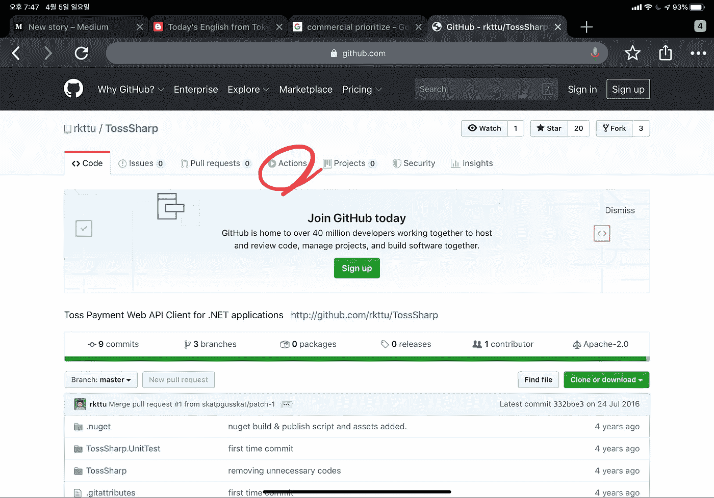
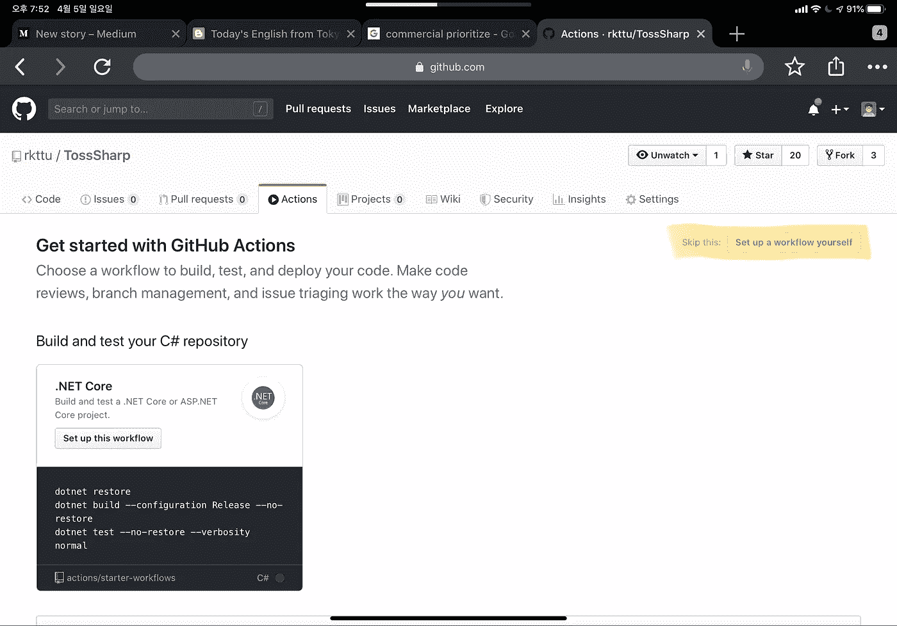
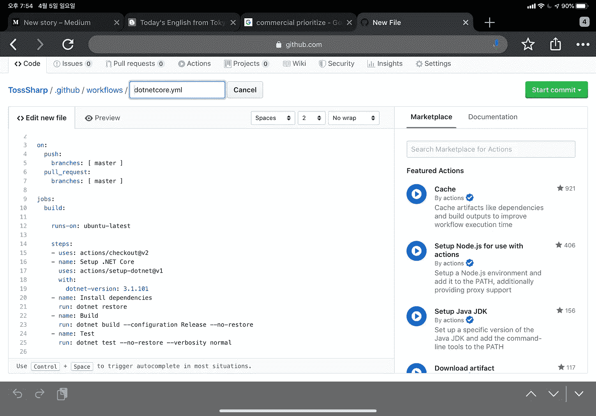

# 编写用于构建 Windows 应用程序的 GitHub 操作工作流

> 原文：<https://blog.devgenius.io/write-your-github-actions-workflow-for-build-windows-application-94e5a989f477?source=collection_archive---------0----------------------->


[Kid Circus](https://unsplash.com/@kidcircus?utm_source=unsplash&utm_medium=referral&utm_content=creditCopyText) 在 [Unsplash](https://unsplash.com/s/photos/action?utm_source=unsplash&utm_medium=referral&utm_content=creditCopyText) 拍摄的照片

微软接手 GitHub 后，很多功能都比以前先进了。不仅释放了现有的存储库配额，而且对于许多想要自动化各种工作流的开发人员和团队来说，还有一个迷人的特性。

但是你知道 GitHub 也为所有用户提供了成熟的 Windows CI 特性吗？同样，重点是，对于“Windows 开发者”来说，它是“成熟的”和“稳定的”

如果您使用 Visual Studio 在 Windows 中开发您的应用程序，由于其特殊的配置，您可能会遇到持续集成平台的问题。此外，正如您已经知道的，整个构建系统是一个庞大而复杂的组件集。这使得构建服务器即使在成功构建之后也很难维护。

但是 GitHub 向所有 GitHub 用户甚至是自由层用户提供了成熟的 Windows CI 服务器，其中已经包含了最新版本的 Visual Studio 和 Docker for Windows。

在这篇文章中，我为你简单介绍一下 GitHub Actions 的工作流程。

# 如何使用 GitHub 操作工作流

您需要创建一个 GitHub 帐户，并将您的源代码提交到 GitHub 存储库中。你担心你的作品暴露在外面吗？别担心。你可以用一个私有的 Git 存储库私下推送你的源代码，第一次不需要额外的成本。因此您可以将 GitHub 作为您的主要源代码库。

创建 GitHub 库后，您可以在顶部菜单中找到 Actions 选项卡。



动作菜单在顶部菜单列表中。

您可以使用此菜单快速创建新的 GitHub 操作工作流程。GitHub 会根据代码分析结果自动为您推荐最佳的工作流模板。如果您的构建工作流并不复杂，或者只是想进行测试，那么您可以简单地选择建议的工作流。如果没有，您可以通过单击“自行设置工作流”按钮来创建您的自定义工作流。



GitHub 会自动为这个 Git 库推荐最佳模板。

然后，您可以看到一个专门的工作流编辑器。工作流文件的扩展名为 YML，保存在上。存储库中的 github/workflows 目录。这个编辑器提供了一些基本的自动完成和语法验证特性，在右边，您可以浏览市场和文档。

编写完第一个管道代码后，您可以单击“开始提交”按钮将此工作流添加到您的主分支中。



当您尝试在 web 上编辑工作流 YML 文件时，工作流编辑器会自动打开。

推送提交后，如果工作流符合条件，工作流将立即启动。

# 如何使用基于 Windows 的工作流

让我们深入工作流 YAML 代码。我向您展示了一个使用 Windows VM 和 Visual Studio 2019 Enterprise 的示例代码。当我推送一个名称以“v”开头的标签时，就会触发此工作流。

```
name: Win32Sample GitHub Releaseon:
  push:
    tags:
      - 'v*'jobs:
  create_release:
    name: Create GitHub Release
    runs-on: windows-2019 steps:
      - name: Install 7Zip PowerShell Module
        shell: powershell
        run: Install-Module 7Zip4PowerShell -Force -Verbose - uses: actions/checkout@v2

      - name: Build Binary
        shell: cmd
        run: call .\Build.cmd - name: Build Artifact
        shell: cmd
        run: call .\ArtifactBuild.cmd - name: Create Release
        id: create_release
        uses: actions/create-release@latest
        env:
          GITHUB_TOKEN: ${{ secrets.GITHUB_TOKEN }}
        with:
          tag_name: ${{ github.ref }}
          release_name: Release ${{ github.ref }}
          body: |
            Automated Release by GitHub Action CI
          draft: false
          prerelease: true - name: Upload Release Asset (x64)
        id: upload-release-asset-x64
        uses: actions/upload-release-asset@v1
        env:
          GITHUB_TOKEN: ${{ secrets.GITHUB_TOKEN }}
        with:
          upload_url: ${{ steps.create_release.outputs.upload_url }}
          asset_path: ./SampleX64.ZIP
          asset_name: SampleX64.ZIP
          asset_content_type: application/zip - name: Upload Release Asset (x86)
        id: upload-release-asset-x86
        uses: actions/upload-release-asset@v1
        env:
          GITHUB_TOKEN: ${{ secrets.GITHUB_TOKEN }}
        with:
          upload_url: ${{ steps.create_release.outputs.upload_url }}
          asset_path: ./SampleX86.ZIP
          asset_name: SampleX86.ZIP
          asset_content_type: application/zip
```

整个步骤与父作业捆绑在一起，该作业指定所有步骤都应在 win-2019 上运行，这意味着 Windows Server 2019。但这是 CI 系统；这不是一个干净的普通虚拟机。该虚拟机具有许多 Windows 构建工作负载的总体要求，并且在不断改进。

我一步一步地解释在这个工作流中使用的脚本。

*   我使用了第三方存档工具 7-zip，以避免与 macOS 内置存档应用程序的兼容性问题。如您所见，您可以根据需要安装您的定制 PowerShell 模块，因为此工作流允许修改构建服务器。
*   接下来，检查源代码的当前分支。
*   接下来，调用可能包含现有解决方案的复杂构建过程的构建脚本。在这个例子中，我使用了一个简单的 DOS 风格的批处理文件，但是您也可以使用您的构建脚本或应用程序。
*   接下来，调用一个构建脚本，创建一个打包的归档文件，作为 GitHub 版本发布。
*   接下来，创建一个与这个新标签相关联的发布。
*   然后为这个版本上传两个资产文件。

为了完整起见，我还附上了在这个工作流中使用的两个示例批处理文件。

## Build.cmd 文件

```
[@echo](http://twitter.com/echo) off
pushd "%~dp0"if exist Debug rd /s /q Debug
if exist Release rd /s /q Release
if exist x64 rd /s /q x64"%programfiles(x86)%\Microsoft Visual Studio\2019\Enterprise\MSBuild\Current\Bin\msbuild.exe" /p:Configuration=Release /p:Platform=x64"%programfiles(x86)%\Microsoft Visual Studio\2019\Enterprise\MSBuild\Current\Bin\msbuild.exe" /p:Configuration=Release /p:Platform=x86:exit
popd
[@echo](http://twitter.com/echo) on
```

## ArtifactBuild.cmd 文件

```
[@echo](http://twitter.com/echo) off
pushd "%~dp0"powershell Compress-7Zip "Release" -ArchiveFileName "SampleX86.zip" -Format Zippowershell Compress-7Zip "x64\Release" -ArchiveFileName "SampleX64.zip" -Format Zip:exit
popd
[@echo](http://twitter.com/echo) on
```

因此，您可以通过调用 Visual Studio 2019 企业版中的 msbuild.exe 来构建您的解决方案。挺有意思的吧？

此外，如您所见，脚本的所有行看起来都很简单。每一个动作，你都可以使用你喜欢的 shell 脚本代码，或者你可以毫不费力地从社区中浏览和导入现有的动作模块。

# 更高级的方法

由微软 Azure 支持的 GitHub Actions 中的所有 CI 服务器(macOS 除外)和 [GitHub 利用标准的 DS2 v2 实例](https://help.github.com/en/actions/reference/virtual-environments-for-github-hosted-runners)。这很遗憾，因为如果使用 v3 实例，GitHub workflow 还可以处理更复杂的场景，如 WSL v2 和 Hyper-V 隔离容器，这需要嵌套虚拟化。但取而代之的是，基于 MSYS2 的混合 Linux 构建环境正在路上。请参考[这个拉动请求](https://github.com/actions/virtual-environments/pull/632)。

如果你想看看 GitHub Action runner 软件，你可以浏览资源库'【https://github.com/actions/runner】T4【T5 .】有趣的是，runner 的几乎全部代码都是由 C#和。网芯。

此外，如果您不满意 GitHub runner VM 的默认配置，您可以在您的房间、服务器机架或其他云环境(如 AWS、GCP 或任何您想要的环境)中构建您的 runner。您可以阅读本指南来构建您独特的构建环境。

此外，如果您担心价格，self runner 配置可以帮助您节省预算。但在此之前，请仔细考虑定价率。通常，金钱远比你宝贵的时间和精力便宜，在我看来。😘

[](https://www.buymeacoffee.com/rkttu)