# 将您的消息直接从云发布/订阅写到 BigQuery

> 原文：<https://blog.devgenius.io/write-your-messages-directly-from-cloud-pub-sub-to-bigquery-ece76c2b676a?source=collection_archive---------5----------------------->

最近，谷歌云宣布了新的云发布/订阅选项(新的交付类型)。通过这种方式，我们能够将流消息写入大查询，而不需要管道(但它仍然有其局限性)。

如果你有预加载转换或数据处理需求，谷歌仍然推荐数据流。

在开始这个项目之前，有件事我想提醒你。此交付类型目前支持两种数据类型。字符串和字节。所有目标 BigQuery 表都需要数据字段。您可以从[【大查询订阅】](https://cloud.google.com/pubsub/docs/bigquery)查看详情

到 BigQuery 的云发布/订阅

# **场景**

在这个项目中，我们有这样一幅图像。

我们将转换图像 base64 格式，然后发布到发布/订阅主题。然后，我们将它直接登陆到 BigQuery，中间不使用任何其他服务。

稍后我们将到达 BigQuery 表，在查询数据和解码数据(图像的字节格式)之后，我们将到达原始图像。所以让我们更深入地研究一下。

# 启用发布/订阅服务

首先，我们需要启用发布/订阅服务。您可以遵循此路径并启用发布/订阅服务。

API 和服务>库>搜索(发布/订阅) >选择>云发布/订阅 API

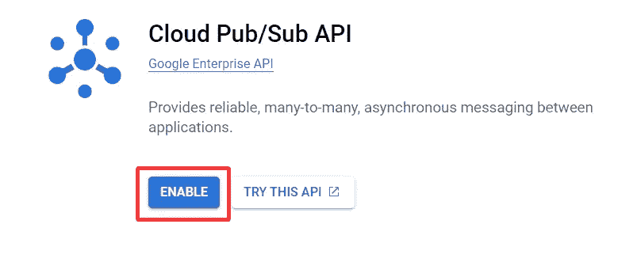

启用发布/订阅服务

# 创建发布/订阅主题

我们这样创建发布/订阅主题。发布/订阅>主题

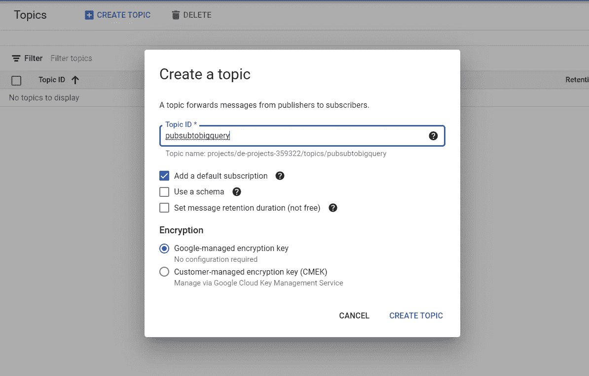

创建发布/订阅主题

# 创建订阅

在上一步中，我们创建了一个订阅，在订阅中，我们收听我们创建的主题的传入消息。为此，我们将遵循以下步骤。

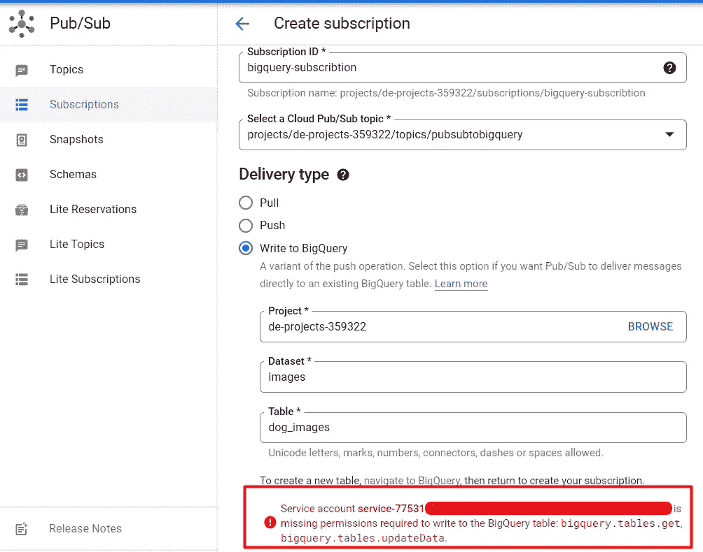

创建订阅

***我们这里有个问题。*** 问题表示我们无法写入选定的 BigQuery 表。要解决这个问题，请遵循以下步骤。

## **1。选择数据集，然后点击共享**

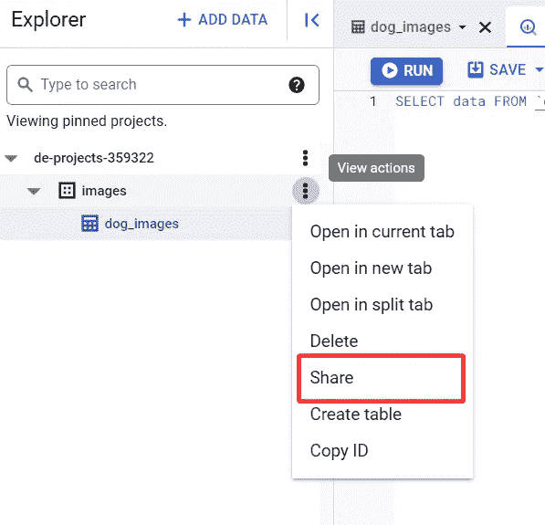

## 2.添加新主体

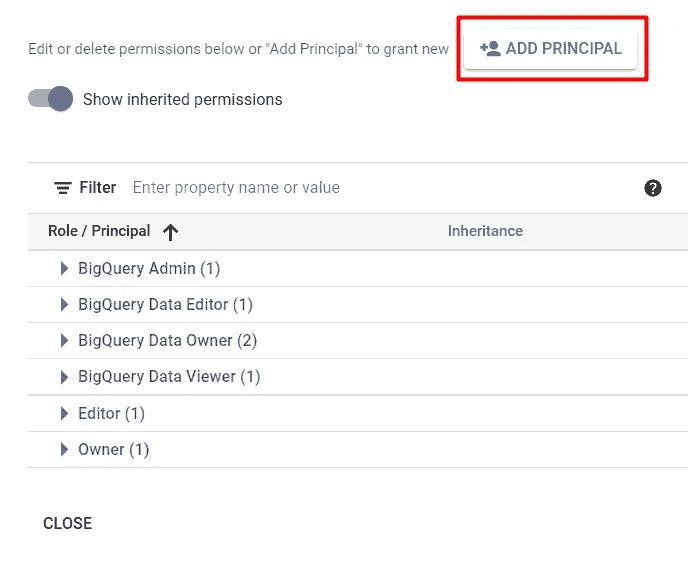

## 3.添加我们想要访问的服务帐户。

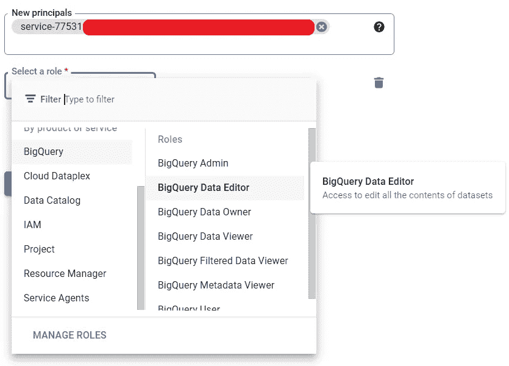

这些设置现在对我们来说刚刚好，我们可以在这些步骤之后创建订阅。

# **创建发布/订阅服务证书密钥**

我们需要证书密钥来发布和访问发布/订阅主题。为此，请遵循以下步骤。

## 正在创建服务帐户

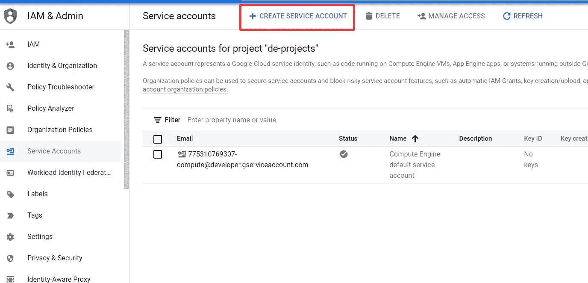

## 设置服务帐户详细信息

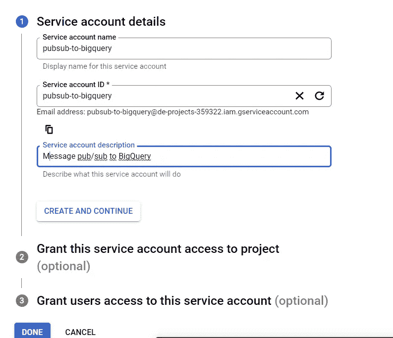

## 设置服务帐户权限

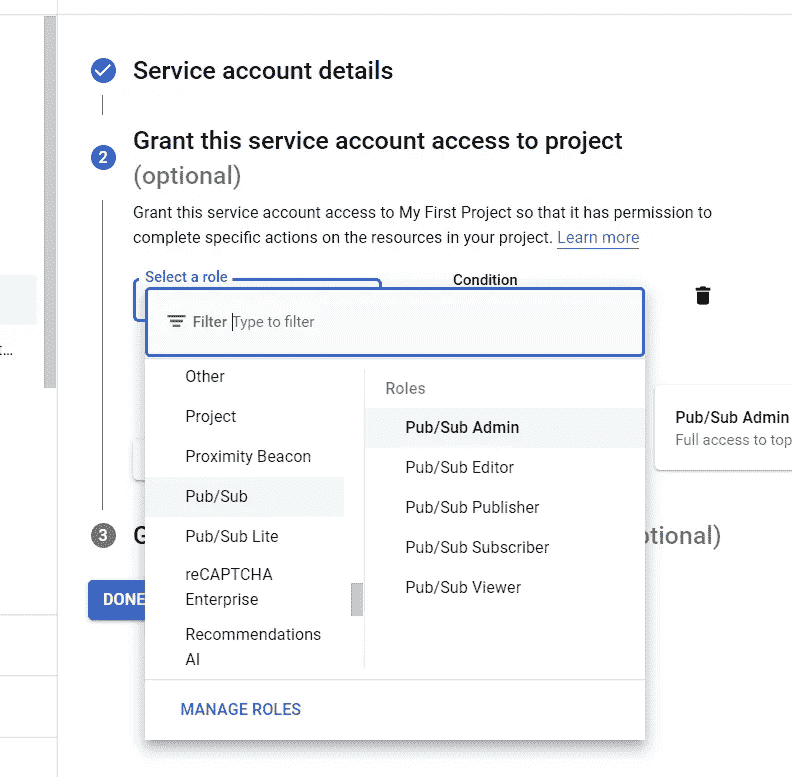

## 最终访问凭证密钥

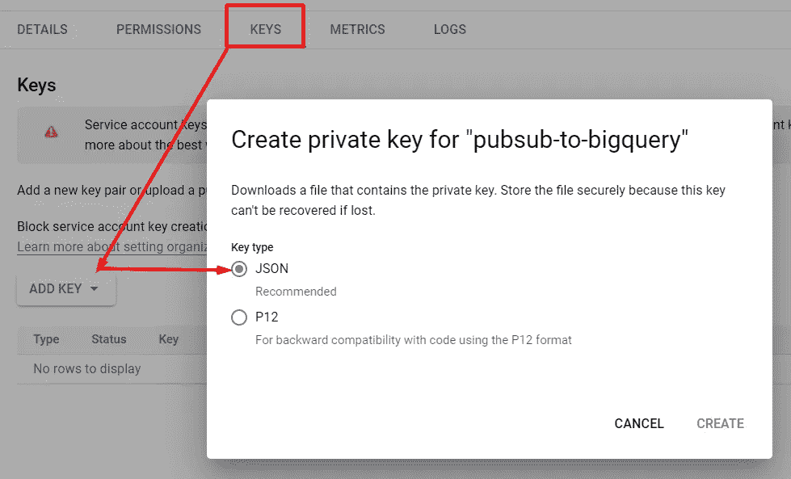

# 将消息发布到发布/订阅主题

我有一个如下的 python 代码。这段代码为发布/订阅主题创建了一个发布者客户端。然后我们再将图片 **base64** 格式( ***编码*** )。
而且我们会发布 base64 格式的数据到题目里。

如果一切正常，让我们运行代码。

**检查数据到达**

***TA-DAA！*** 。base64(编码)格式的数据已成功到达。

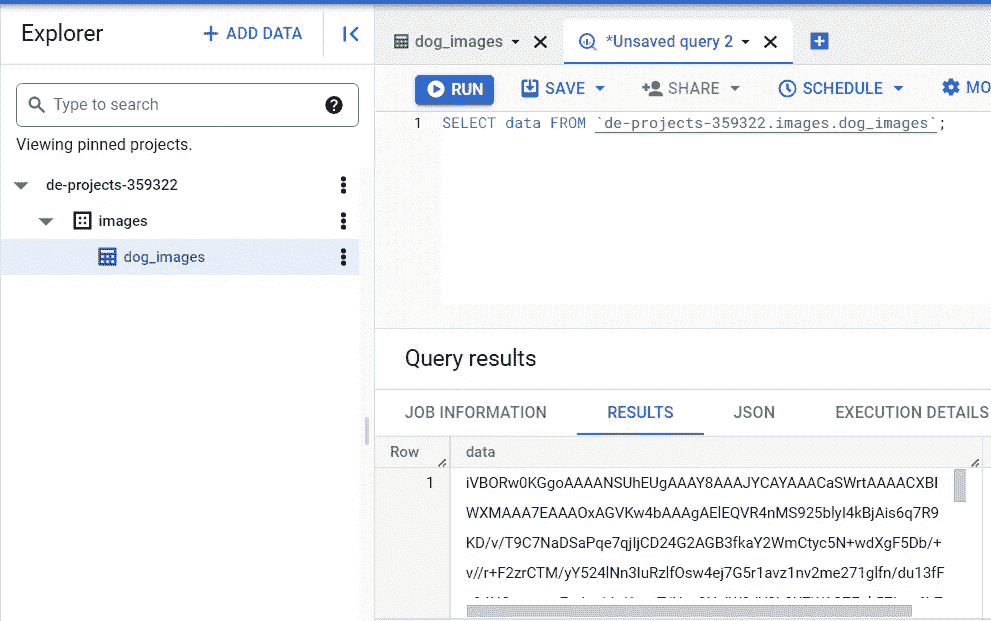

## 从 BigQuery 获取数据并访问图像

在从 BigQuery 获取数据之前，我们需要访问(**为 BigQuery 创建新凭证**)我前面提到的 BigQuery 凭证(发布/订阅凭证)。

下面我只展示角色分配部分，其余都一样。

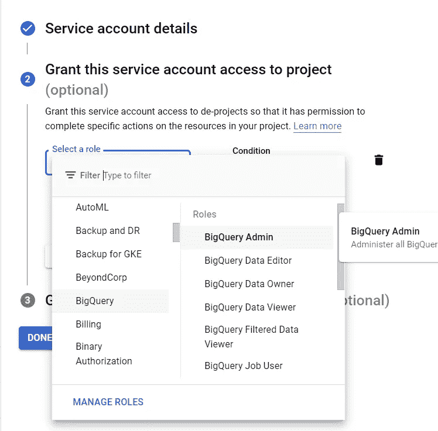

在这里的代码中，在我们创建了一个 BigQuery 客户端并查询了相关的表之后，我们再次 ***解码(将数据 base64 转换为原始图像)*** 查询到的数据。

然后运行代码。

是的，我们成功地做到了。 [🥳](https://emojipedia.org/partying-face/) 🎉🎈

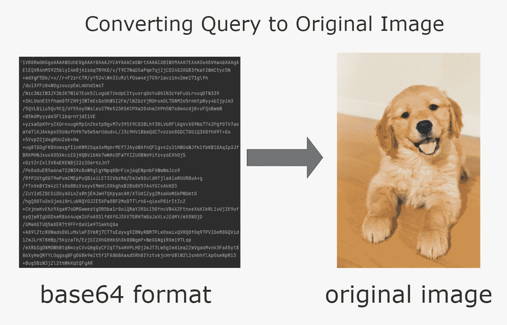

在其他疯狂的项目中再见。祝你今天开心！玩的开心！

## Github 资源库:

 [## GitHub-TugrulGokce/Cloud-Pub-Sub-To-big query

### 此时您不能执行该操作。您已使用另一个标签页或窗口登录。您已在另一个选项卡中注销，或者…

github.com](https://github.com/TugrulGokce/Cloud-Pub-Sub-To-BigQuery)