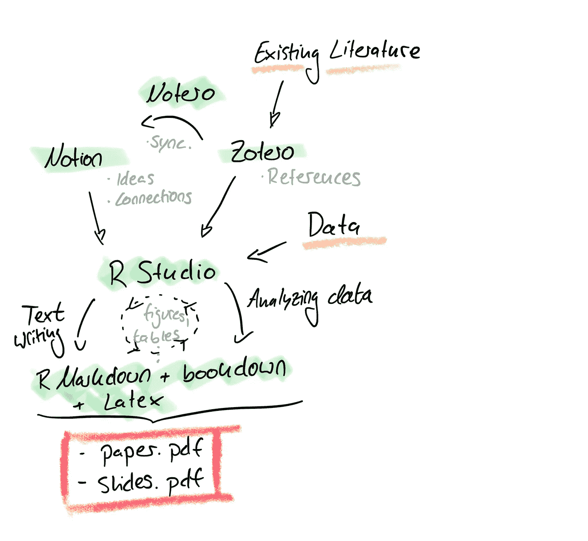

# 3 个框架合二为一——用 R Studio 撰写您的下一篇论文！

> 原文：<https://blog.devgenius.io/write-your-whole-paper-in-r-it-is-better-77e1843f0c09?source=collection_archive---------2----------------------->

我在我的个人数据科学博客[ds-econ.com](https://www.ds-econ.com/2022/03/05/03_te_r_for_research/)上发表了这篇文章的早期版本。

> 在这里，我将向您展示我目前在学习中撰写研究论文的工作流程。这是一种提出一致且简单的设置的方法，它将一个项目的文献和数据相关方面编织在一起。
> 更详细地说，这种方法试图将最初的文献回顾和笔记(`Notion`)、参考文献的收集(`Zotero`)以及所有必要的数据分析和写作(`R Studio`)联系起来。在`R Markdown`和`bookdown`的帮助下，我们将这三条线索结合成一篇研究论文和演示幻灯片。

## r 工作室

`R`通过`R Markdown`、`knitr`和`bookdown`与写作过程无缝集成，让你的论文写作更连贯、更高效。

让我们考虑这个过程中的一个典型问题:在最后的校对中，你发现在你最重要的图的 x 轴标签上有一个打印错误。如果你用“Word”写论文，并使用软件包进行分析(如 R、Stata、SPSS、Matlab……)，你会面临一些痛苦的步骤:

1.  重新运行您的分析脚本
2.  调整您的绘图代码
3.  将新的(*希望*正确)图导出为图像文件
4.  将图像复制并粘贴到 Word 中
5.  摆弄你的文字编辑器，直到你得到正确的格式
6.  (在墙上打一个整体，因为新图像弄乱了你的整个文档)

在这里，`R Markdown`可以提供很大的帮助:它允许你将你的分析代码和你论文的文本组织成一个文件。需要重命名 x 轴标签吗？没问题。只需在绘图代码中直接调整标签，然后编译代码即可。

更好的是:如果你编写自己的绘图函数，你也可以通过改变*一个*函数来调整*所有绘图*的配色方案。这不仅效率更高，而且比自己手动调整每个图更连贯，更不容易出错。此外，`R Studio 1.4`增加了一个“可视化编辑器”，使得编辑更加初学者友好。

为了让`R Markdown`适合学术论文的写作，我使用了`bookdown`和一个定制的项目模板，这个模板来自露西·达戈斯蒂诺·麦高恩的精彩博文:[“一年论文”](https://livefreeordichotomize.com/2018/09/14/one-year-to-dissertate/)。模板的格式是基于 Latex 的，因此您可以简单地将当前 Latex 序言中的参数导入到`bookdown`项目中。

麦高恩的模板可以在这里找到[，我对它的推导可以在这里](https://github.com/LucyMcGowan/dissertation-toolkit)[找到](https://github.com/finnoh/R_thesis_template)(我的版本增加了对`Beamer`幻灯片的扩展)。

## 佐特罗

我在佐特罗收藏我的文学图书馆。这是一个开源软件，可以让你轻松地建立自己的研究论文数据库。虽然有许多其他软件包允许你这样做，但 Zotero 直接与 R Studio 集成。

你将能够自动引用 R 中的任何论文，这些论文被存档在你的 Zotero 数据库中。我更喜欢使用论文的 DOI，以便轻松地将其导入 Zotero——在 90%的情况下，这足以生成相应论文的完整参考。

## 概念

对于创造性的笔记，我使用概念。基本上就是一个有着华丽 UI 的笔记 app 而已。与其他笔记软件相比，connections 的优势在于，它可以让你快速链接想法，并在你收集的内容之间建立联系。

观念与上面提到的软件，即 Zotero，整合得很好。非常方便的社区插件 [Notero](https://github.com/dvanoni/notero#example-notion-databases) 将您的 Zotero 数据库与 idea 中的指定页面同步，从而可以轻松地对您的文献做大量笔记。一定要访问他们的 GitHub，因为他们也为此提供了一个很好的概念模板！

用概念做聪明的笔记有无限的可能性:连接不同的研究论文，总结他们的发现，比较表格中的论文，或者创建一个看板来跟踪你的阅读进度。这种结构促进了创造力，降低了丢失笔记的风险。

## 大局

下面，我试图想象这个设置背后的大致想法。请注意，现有文献和您的数据是“唯一”的两个外部输入。你的智力工作(主要)发生在观念中，而你在 r 中进行你的数据分析。整个机制的核心事实上是`R Markdown`因为它将所有这些不同的预处理步骤联系到一个 paper.pdf 或 slides.pdf。

## 我学到的其他一些东西

*   大量搜索文献，然后下载论文并将其 doi 传递给 Zotero。如果你想出一个文件命名惯例，这将有所帮助。对我来说，我使用:“{第一作者} _ {年}”。同样，对于相应的 bibtex 密钥，我使用:{第一作者} {年}。这有助于不丢失文件和各自的引文。
*   利用像[【https://elicit.org/search】](https://elicit.org/search)和[这样的网站，它们雇佣人工智能来帮助你找到你要找的文献。](https://www.researchrabbit.ai)
*   在概念中做笔记，并使用“高级模板”中提供的属性字段，这样您就可以在表格中一目了然地显示信息。将文件相互链接，如果它们相互引用，或者如果您看到它们之间的联系。
*   如果你的电脑有“听写”功能，那就用它来听写你的第一份草稿。编辑比从头开始更容易，因此先在页面上“说点什么”。