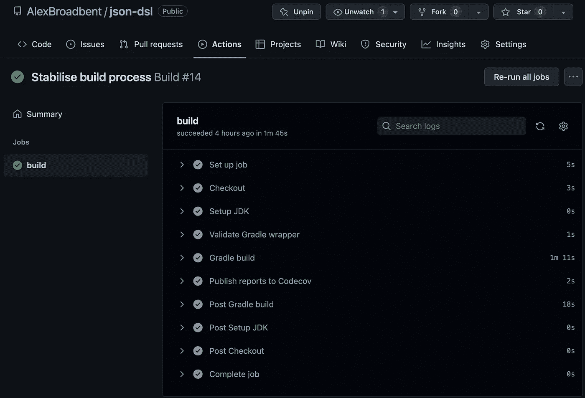

# Kotlin 中的简单 JSON 和类型安全生成器 DSL

> 原文：<https://blog.devgenius.io/writing-a-dsl-in-kotlin-42a9029b93a6?source=collection_archive---------5----------------------->

## 履行

## 简化 Jackson 和 Gson 语法

*更新:项目已迁移到新的域，并包含 Gson 支持*

在 2019 年学习了 Kotlin 中的[类型安全构建器之后，我想创建一种特定于领域的语言(DSL)，以避免不得不使用 Jackson 中相当繁琐的创建模式。写了太多遍之后，我感觉自己像是建筑师鲍勃。](https://kotlinlang.org/docs/type-safe-builders.html)


马克·波特顿在 [Unsplash](https://unsplash.com?utm_source=medium&utm_medium=referral) 上的照片

## 领域特定语言(DSL)

如果您以前没有见过类型安全生成器，它是一种以半声明方式构建复杂层次数据结构的方法。Kotlin 的 HTML 就是一个很好的例子。这给出了类似于以下内容的领域特定语言(DSL ):

```
**fun** result() = html {
  head {
    title {+**"XML encoding with Kotlin"**}
  }
  body {
    h1 {+**"Kotlin DSL"**}
    p  {
      +"Here is "
      a("https://kotlinlang.org") { +"official Kotlin site" }}
  }
}
```

如果你以前使用过 HTML，这可能看起来有点奇怪，但也很熟悉，在 Kotlin 中，我们有表示为关键字的函数，这些函数几乎是从`<html>...</html>`到`html { ... }`的事务。

## Maven/Gradle 导入

```
implementation("com.abroadbent:jackson-dsl:0.2.0")
implementation("com.abroadbent:gson-dsl:0.2.0")<dependency>
  <groupId>com.abroadbent</groupId>
  <artifactId>jackson-dsl</artifcatId>
  <version>0.2.0
</dependency>
<dependency>
  <groupId>com.abroadbent</groupId>
  <artifactId>gson-dsl</artifcatId>
  <version>0.2.0
</dependency>
```

## JSON DSL 语法

使用 Kotlin DSL，我们有操作符用于`array`和`object`以及原语创建(通过`string`、`int`、`long`、`double`和`boolean`函数)，我们可以使用`put`构建对象，使用`add`构建数组。

一旦在`array`或`object`的上下文中，原语函数将期望在`array`中有一个值，在`object`中有一个键/值对。这加强了 DSL 的类型安全方面，因为您将无法创建不转换成 Jackson JSON 库的东西。

这导致一个简单的语法，例如:

```
val cat = object {
  put("name", "Princess")
  put("breed", "British Shorthair")
  put("age", 3)
  put("healthy", true)
  array("hobbies") {
    add("sleeping")
    add("eating")
    add("purring")
  }
}
```

## 例子

假设我们想要创建(相当荒谬的)JSON 对象:

```
{ 
  "one": 171,
  "two": [
    false,
    {
      "three": "bar"
    }
  ],
  "four": {
    "five": 1.83
  }
}
```

使用 Jackson builder，我们通过以下方式创建它:

```
val json = mapper.createObjectNode()
  .put("one", 171)
  .set<ObjectNode>(
    "two", mapper.createArrayNode()
      .add(false)
      .add(
        mapper.createObjectNode()
          .put("three", "bar")
      )
    )
  .set<ObjectNode>(
    "four", mapper.createObjectNode()
      .put("five", 1.83)
  )
```

这感觉相当混乱和难以阅读。使用 DSL，通过以下方式创建相同的 JSON 对象:

```
val json = `object` **{** put("one", 171)
    array("two") **{** add(false)
        obj **{** put("three", "bar")
        **}
    }
    `**object`("four") **{** put("five", 1.83)
    **}
}**
```

这在结构上更接近原始的 JSON 对象，避免了必须使用`createObjectNode`和`createArrayNode`的问题，我们也不需要使用 Jackson 的`set<ObjectNode>`的类型安全措施。

## 履行

使用`@DslMarker`创建一个新的注释来创建构建器，该注释将定义 DSL。在我们的例子中，我们创建了一个名为`@JsonMarker`的注释。

我们创建了一个抽象类`JacksonElement`,用`@JsonMarker`标注来表示它是 DSL 语言对象。我们有两个`JacksonElement`的实现，分别是`JacksonObject`和`JacksonArray`，它们分别是 Jackson 对象和数组的表示。我们在`JacksonObject`中定义的任何东西都将在`object { … }`范围内被允许，在`JacksonArray`中定义的任何东西都将在`array { … }`范围内被允许。

对于`hashCode`、`equals`和`toString`功能，在`JacksonObject`和`JacksonArray`之间有一个公共接口。但是`JacksonObject`中改变元素的函数提供了一个`key`值来存储对象中的值，而`JacksonArray`只存储值。因此，`JacksonObject`将原始字符串函数定义为`fun put(key: String, value: String)`，而`JacksonArray`将其定义为`fun add(value: String)`。

对于 Gson 来说，这完全相同，只是使用了名为`GsonElement`、`GsonObject`和`GsonArray`的类。

API 的设计是有意简化的，使用 DSL 语言，您可以用最少的努力构建嵌套的对象和数组。由于这个项目是为了对 Kotlin 中的类型安全构建器进行采样而创建的，所以它只是解决了一个重复使用 Jackson 的`ObjectMapper`类的`createObjectNode`和`createArrayNode`函数的问题。

## 警告

由于`"object"`是 Kotlin 中的保留关键字，为了创建一个对象，需要在单词``object` { … }`两边加上反勾(```)，或者别名`obj { … }`可用。

## CI 管道

该项目使用 Github Actions，这在我创建该项目时也是相对较新的。这个配置文件在`.github/workflows/build.yml`目录下以便设置构建步骤。

```
name: Build
on: [ push ]
jobs:
  build:
    runs-on: macos-latest
    steps:
      - name: Checkout
        uses: actions/checkout@v3
      - name: Setup JDK
        uses: actions/setup-java@v3
        with:
          distribution: temurin
          java-version: 11
      - name: Validate Gradle wrapper
        uses: gradle/wrapper-validation-action@v1
      - name: Gradle build
        uses: gradle/gradle-build-action@v2
        with:
          arguments: build
      - name: Publish reports to Codecov
        uses: codecov/codecov-action@v3
```

该构建将在最新版本的 MacOS 上的 Github 中的任何 push 或 pull 请求上运行。第一步`actions/checkout@v3`将源代码下载到机器上，第二步`actions/setup-java@v3`将设置 Java 版本 11 的 Eclipse Temurin 版本。

`gradle/wrapper-validation-action`和`gradle/gradle-build-action` 步骤负责运行构建和测试阶段，然后运行我们的 Jacoco 覆盖报告。`codecov/codecov-action@v3`的最后一步将把覆盖报告推送到 code，这意味着您可以在 [CodeCov](https://app.codecov.io/gh/AlexBroadbent/json-dsl) 上看到完整的报告。



GitHub 构建工作流成功运行

## 结论

希望这篇文章表明，用 Kotlin 编写 DSL 减少了使用第三方库时的重复和复杂性。你可以随意地在 Github 上创建这个库，通过`implementation("com.abroadbent:jackson-dsl:0.2.0")`或`implementation("com.abroadbent:gson-dsl:0.2.0")`来使用 DSL 或者在你自己的项目中使用它

## **源代码**

[https://github.com/AlexBroadbent/json-dsl](https://github.com/AlexBroadbent/json-dsl/)

## **代码覆盖率**

[https://app.codecov.io/gh/AlexBroadbent/jackson-dsl](https://app.codecov.io/gh/AlexBroadbent/jackson-dsl)

## **Maven 中央神器**

[https://search . maven . org/artifact/com . abroad bent/Jackson-DSL/0 . 2 . 0/jar](https://search.maven.org/artifact/com.abroadbent/jackson-dsl/0.2.0/jar)

[https://search . maven . org/artifact/com . abroad bent/gson-DSL/0 . 2 . 0/jar](https://search.maven.org/artifact/com.abroadbent/gson-dsl/0.2.0/jar)