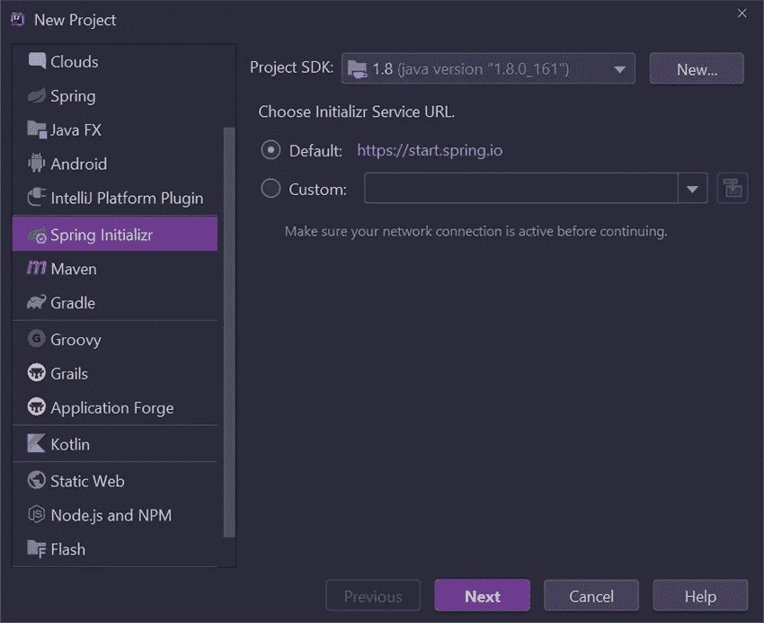
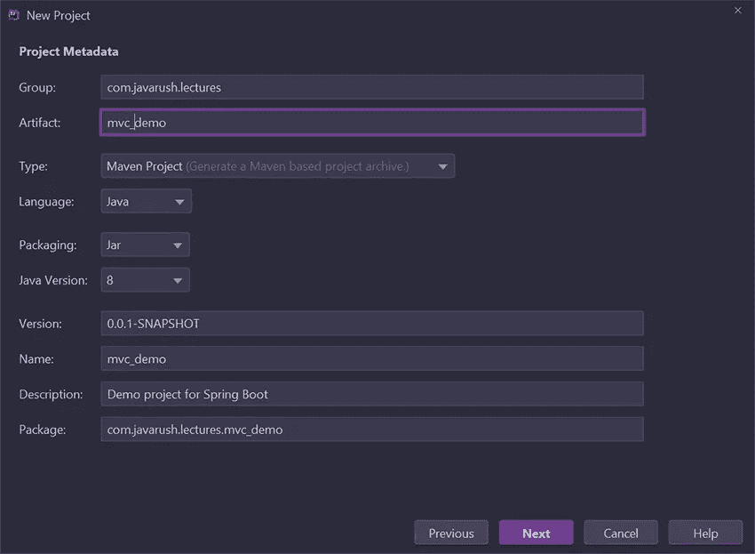
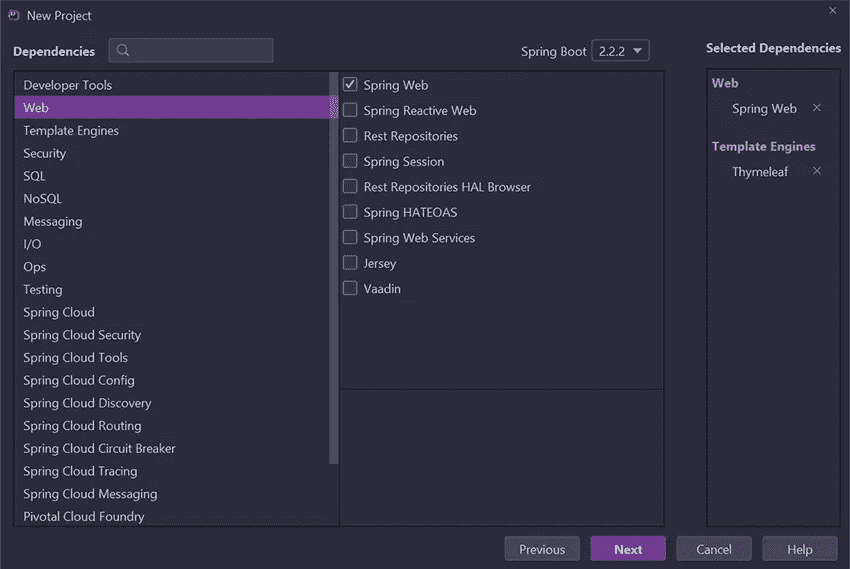
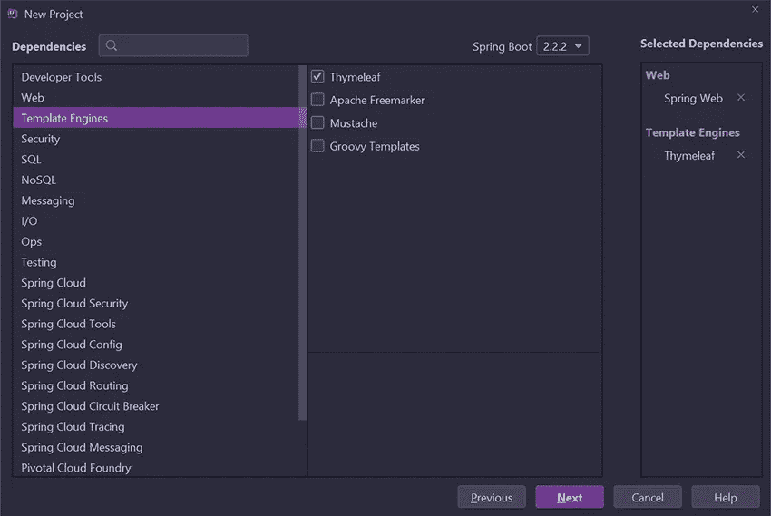
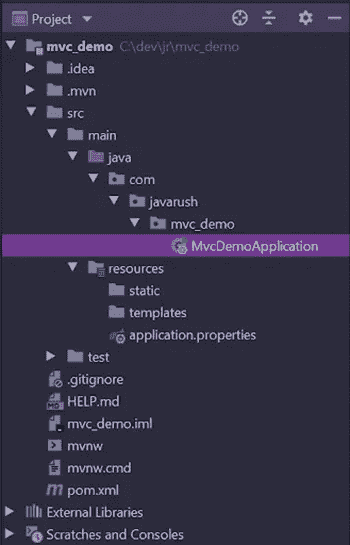
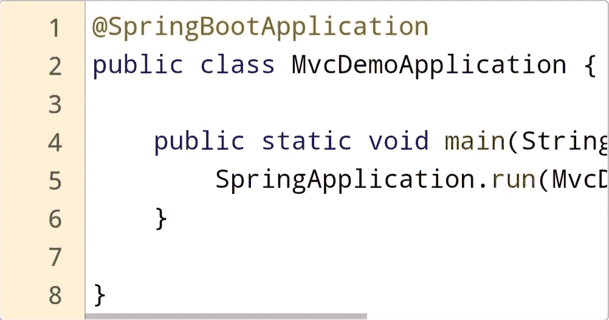
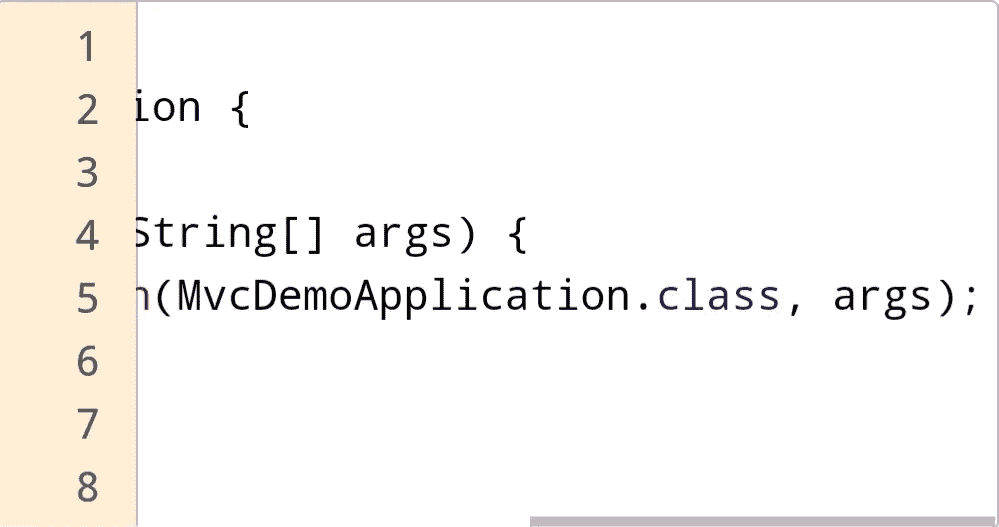
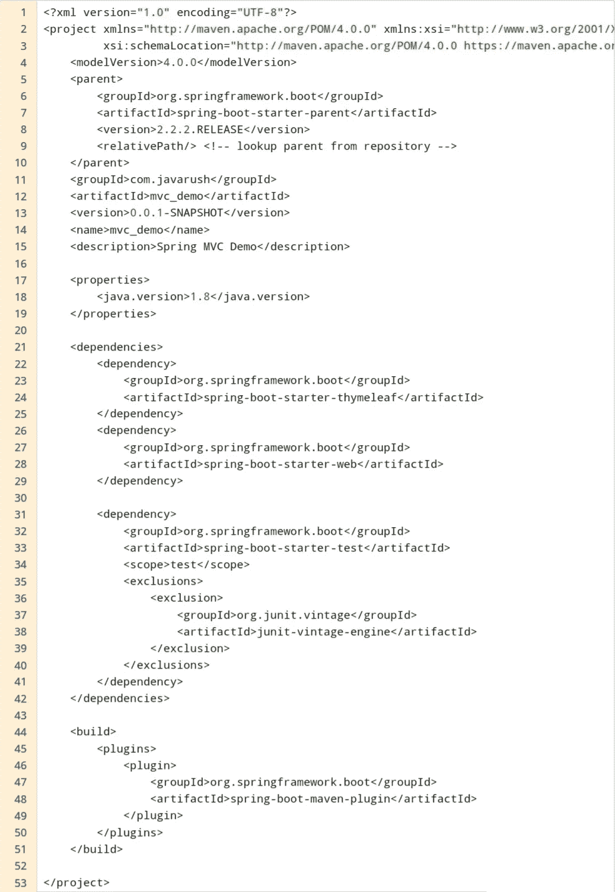
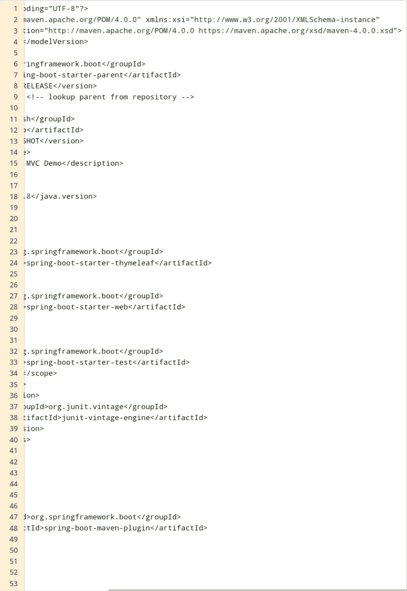

# 在弹簧靴上写一个小应用程序。Java 语言(一种计算机语言，尤用于创建网站)

> 原文：<https://blog.devgenius.io/writing-a-small-application-on-a-spring-boot-java-3c92f869321a?source=collection_archive---------9----------------------->

让我们以 Spring-MVC 为例，分解一个 MVC 实现的最简单的例子。为此，我们将在 spring-boot 上编写一个小的 Hello World 应用程序。

为了让你能自己做，我会给你一步一步的指导。首先，我们将编写一个小应用程序，然后我们将它拆开。

**步骤 1:在 IntelliJ IDEA 中创建一个 spring-boot 应用程序**

使用文件->新建->项目…创建新项目。

在打开的窗口中，在左侧菜单中，选择 Spring Initializr，选择 Project SDK，将 Initializr 服务 URL 选项保留为默认值。

按下一步按钮。

在下一个窗口中，我们需要选择项目的参数。我们将有一个 Maven 项目。选择类型— Maven 项目，填写组和工件。

单击下一步按钮。

在下一个窗口中，您需要选择我们将使用的 Spring 框架的组件。我们只需要两个:

Spring Web，一个允许我们创建 Web 应用程序的组件。这个组件包括 Spring MVC。

百里香叶——所谓的模板引擎。允许我们将数据从 Java 转移到 HTML 页面的东西。

bdb

在下一个窗口中，选择项目在文件系统中的名称和位置:

按下完成按钮。

项目已创建。我们有以下项目结构:

这里我们对两个文件感兴趣:

pom.xml —部署描述符。它允许我们快速、轻松地将不同框架中的库导入到我们的项目中，并且我们可以在其中配置应用程序的构建。我们的应用程序是使用 Maven 构建的，pom.xml 是这个构建系统的配置文件。

Java 类是 MvcDemoApplication。这是我们应用程序的主类，我们将从它开始我们的 spring-boot 项目。要启动它，只需运行这个类中的 main 方法。

下面是这个类和 pom.xml 文件的代码:

MVC demo 应用程序:

pom.xml:

**第二步:创建网页**

我们的应用程序将非常简单。我们将有一个主页——index.html，在里面我们将有一个链接到问候页面——greeting.html。在问候页面上，我们将显示一个问候。让我们实现通过 url 参数将问候语的名称传递给 greeting.html 页面的可能性。

创建我们的应用程序的主页——index . html:

现在创建 greeting.html 页面:

这里从非典型的 for html 页面可以看到标签:

标签 **p** 的 **th** 属性是百里香模板引擎的一个工具。多亏了它，标签 **p** 的值将是文本“Hello”，+变量 **name** 的值，我们将从 Java 代码中设置它。

**步骤 3:创建控制器**

在 mvc_demo 包中创建一个 controller 包，我们将在其中创建我们的控制器 HelloWorldController:

一方面代码很少，但另一方面却有很多事情在进行。开始解析吧。

@Controller 注释—表示这个类是一个控制器。Spring 中的控制器处理对特定地址的 HTTP 请求。

我们的类有一个方法，helloWorldController，它被标注为注释—@ request mapping(value = "/greeting ")。这个注释告诉我们，这个方法处理对/greeting 地址的 HTTP GET 请求。换句话说，如果有人转到/greeting 地址，就会触发这个方法。

此方法返回一个字符串。根据 Spring-MVC，控制器方法应该返回视图名。接下来，Spring 将查找具有该名称的 html 文件，并将其作为对 HTTP 请求的响应返回。正如您所看到的，我们的方法返回了我们之前创建的 web 页面的名称——greeting。

我们的方法有两个参数。让我们来看看它们:

参数 1:
@RequestParam(name = "name "，required = false，defaultValue = "World ")字符串名称。@RequestParam 注释说明字符串名称参数是一个 url 参数。注释说 url 中的这个参数是可选的(required = false)；如果不存在，字符串名称参数的值将是 World (defaultValue = "World ")，但如果存在，url 中的此参数将被命名为 name (name = "name ")。

参数二:
第二个参数是模型 Model。这个参数是一些模型。这个模型在内部由各种属性组成。每个属性都有一个名称和值。类似于键值对。有了这个参数，我们可以将数据从 Java 代码传递到 html 页面。或者，用 MVC 的术语来说，我们可以将数据从模型传递到视图。

最后一行留下来算。我们将数据从 Java 传输到 html 或者从模型传输到视图的方式。该方法体包含以下代码行:

model.addAttribute("name "，名称)；

这里，我们创建一个名为 name 的新属性，并将 name 参数的值赋给它。回想一下，不久前我们还在讨论标签:

我们说过标签 p 的值是文本“Hello”，加上变量名的值，这是我们从 Java 代码中设置的。

这是我们用该行设置的值

model.addAttribute("name "，名称)；

**第四步。跑**

要运行，我们需要运行 MvcDemoApplication 类中的 main 方法:

在启动日志中，我们将看到我们的 web 应用程序在端口 8080 上启动:

这意味着我们可以通过浏览器进入页面: [http://localhost:8080](http://localhost:8080) :

这里我们看到了 index.html 页。让我们跟随链接进入 greetin:

这个转变触发了我们的控制器。我们没有通过 URL 传递任何参数，因此，如注释中所述，name 属性采用默认值 World。

现在让我们尝试通过 url 传递参数:

一切都按计划进行。现在尝试跟踪 name 变量的路径:

1.用户通过 url 传递了参数 name = Amigo ->的值。

2.控制器处理了我们的动作，接受了变量名并设置了一个模型属性，名称和接受的值是-->。

3.这些数据从模型到视图，到 greeting.html 页面，显示给用户。