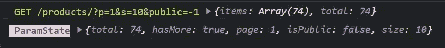
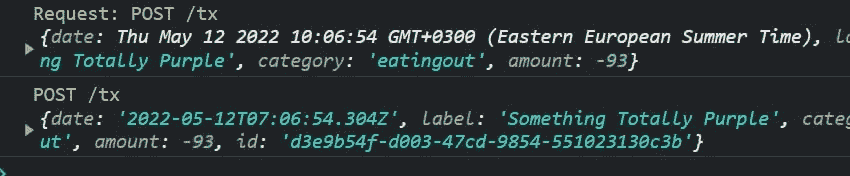
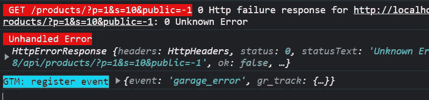
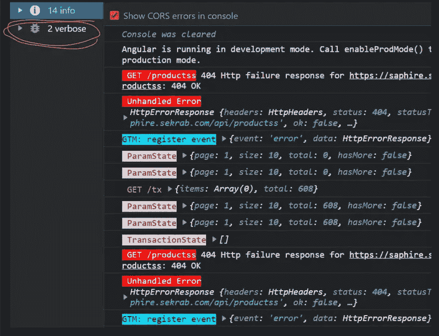

# 为 console.log 编写包装器以更好地控制 Angular，第二部分

> 原文：<https://blog.devgenius.io/writing-a-wrapper-for-console-log-for-better-control-in-angular-part-ii-5b09b65af2c5?source=collection_archive---------7----------------------->

## 驯服控制台


接着是我们的[控制台包装器](https://garage.sekrab.com/posts/writing-a-wrapper-for-console-log-for-better-control-in-javascript-part-i)，在本文中，我将专门在 Angular 应用程序中使用它。该记录在`RxJS`管道和错误记录中很有用。

首先，我们将脚本添加到**资产**中，并在`typings.d.ts`中声明它(如前文中所述)。

```
{
 "projects": {
   "main": {
     "architect": {
       "build": {
         "options": {
           "scripts": [
             // add the script however you wish
              {
                "input": "src/assets/js/console.js",
                "bundleName": "script"
              }
            ]
         }
       }
     }
   }
 }
}
```

这在 SSR 运行时，会在服务器端出错，我们稍后会修复它。

> *最终项目在*[*stack blitz*](https://stackblitz.com/edit/angular-console-wrapper?file=src/app/core/rxjsops.ts)上

# 角度误差处理

Angular 中的默认错误处理程序记录未处理的错误。我们可以用自己的[错误处理程序](https://angular.io/api/core/ErrorHandler)(在根应用程序模块中提供)覆盖它:

```
@Injectable()
export class OurErrorHandler implements ErrorHandler {
    handleError(error: any) {
      _debug(error, 'Unhandled Error', 'e');
    }
}
```

# 与 RxJS 一起使用

我们可以创建一个[自定义操作符](https://medium.com/javascript-everyday/rxjs-custom-operators-f8b9aeab9631),在管道中输出消息:

```
export const debug = (message: string, type?: string): MonoTypeOperatorFunction<any>  => {
  return pipe(
    tap(nextValue => {
       _debug(nextValue, message, type);
    })
  );
};// this is used with observables like this
obs$.pipe(
  debug('obs value')
);
```

在之前一篇关于 Angular 中基于 [RxJS 的状态管理的文章中，我们有一个 state 的基类。我们可以用 debug 语句来更新它，以记录所有的状态进度。在`StateService`:](https://garage.sekrab.com/posts/rxjs-based-angular-state-management)

```
export class StateService<T>  {
 protected stateList: BehaviorSubject<T[]> = new BehaviorSubject([]);
 stateList$: Observable<T[]> = this.stateList
    .asObservable()
    // pipe to debug the constructor used, like ParamState, or TransactionState
    .pipe(debug(this.constructor.name));
}
```

现在，任何状态更新都将记录在控制台中。

# Http 拦截器

在 devTools 调试中，会记录网络失败的尝试，显示完整的 URL，但不会记录成功的尝试。让我们将调试操作符添加到`HttpInterceptor`中，以我们喜欢的方式记录所有数据，*这是必须的方式*😉

> ***【方法】【网址】【响应正文】***

```
@Injectable()
export class OurInterceptor implements HttpInterceptor {
  intercept(req: HttpRequest<any>, next: HttpHandler): Observable<HttpEvent<any>> { // adjust req if needed
    return next
      .handle(req)
      .pipe(
        // pipe with req information, method, and url with params
        debug(`${req.method} ${req.urlWithParams}`, 'p')
      )
    }
}
```

让我们重写调试操作符来处理以下内容:

*   如果`nextValue`是`HttpResponse`类型，我们需要记录**主体**。
*   我们还需要过滤掉`Sent`类型的无用值。那是一个在每个 http 响应之前设置的事件，没有什么价值，在其他可观察到的地方是`undefined`。

```
export const debug = (message: string, type?: string): MonoTypeOperatorFunction<any>  => {
     return pipe(
        tap(nextValue => {
            let value = nextValue; if (nextValue instanceof HttpResponse) {
                // value is the body
                value = nextValue.body;
            }
            // just filter out the sent event
            if (nextValue && <any>nextValue.type !== HttpEventType.Sent){
                _debug(value, message, type);
            } })
    );
};
```

现在我的日志看起来像这样



在发生`PUT`或`POST`事件的情况下，我们还可以在 Http 拦截器中记录请求`body`:

```
@Injectable()
export class OurInterceptor implements HttpInterceptor {
  intercept(
    req: HttpRequest<any>,
    next: HttpHandler
  ): Observable<HttpEvent<any>> { // log request body, prefix to distinguish or create a new console type
    if (req.body) {
      _debug(req.body, `Request: ${req.method} ${req.urlWithParams}`, 'p');
    } return next.handle(adjustedReq).pipe(
     //...
    );
  }
}
```

日志看起来像这样



让我们更上一层楼。让我使用`tap`扩展回调来记录 Http 错误，就像这样:

```
export const debug = (message: string, type?: string): MonoTypeOperatorFunction<any> => {
  return pipe(
    tap({
      next: (nextValue) => {
        let value = nextValue; if (nextValue instanceof HttpResponse) {
          // value is the body
          value = nextValue.body;
        }
        // just filter out the sent event
        if (nextValue && <any>nextValue.type !== HttpEventType.Sent) {
          _debug(value, message, type);
        }
      },
      error: (error) => {
        // in error, log erros, check for pecific type of http response errors
        let value = error;
        if (error instanceof HttpErrorResponse) {
          value = `${error.status} ${error.message}`;
        }
        _debug(value, message, 'e');
      },
    })
  );
};
```

在向您展示日志之前，我回到了我们上周构建的 [GTM 角度服务](https://garage.sekrab.com/posts/gtm-tracking-service-in-angular)，并且添加了一个`_debug`语句:

```
// GTM service updated from a previous post
export class GtmTracking {
  // ...
  public static RegisterEvent(track: IGtmTrack, extra?: any): void {
    let data = {
      event: track.event, gr_track: {
        source: track.source,
        ...extra
      }
    };
    // add a special type of log here
    _debug(data, 'register event', 'gtm');
    this.Push(data)
  } public static SetValues(values: any): void {
    let data = {
      gr_values: { ...values }
    };
    // and here:
    _debug(data, 'Set GA value', 'gtm');
    this.Push(data);
  }
}
```

在`ErrorService`中，我们调用了 **GTM 注册事件**，所以现在我们得到了一个看起来不错的控制台日志:



错误对象可以进一步增强，但那是不同的主题，不同的文章。

# 控制台过滤视图

我的`console.log`错误而不是`console.error`错误是有原因的，那就是；把控制台过滤成 **info** 消息，**忘记切换回所有消息的坏习惯。**注意力持续时间不断缩短。这样我们就不会错过错误，退休后我们也能享受一些理智。

`_attn`是为了**取代通常的 console.log** 而特意创建的，调用`_attn`的输出显示在控制台**详细日志**下，它们看起来很亮，亮到足以让我们记得在构建之前删除它们。但是，如果我们未能删除它们，没关系，它们无论如何都不会在生产中显示。

这会影响性能吗？不是在 99%的应用中(99%就像是说世界的一半，不是一个真实的统计数据)。



# 服务器平台日志

使用的脚本是添加到 build 中的 JavaScript，并在`index.html`中注入。这是故意的，因为我不希望每次使用时都使用**`**import**`**。这种方法还有另外一个好处。首先，让我们修复服务器平台不运行的问题，因为那些方法在 **NodeJS** 中不存在。这是通过在 NodeJS `global`对象中定义这些函数来实现的。NodeJS **express 服务器**应该包含以下内容****

```
// fix NodeJs server running SSR
global._debug = function (o, message, type) {
  if(process.env.NODE_ENV !== 'production') {
    console.log(message, o);
  }
};
global._attn = function (o, message) {
 if(process.env.NODE_ENV !== 'production') {
    console.log(message, o);
  }
}
```

**现在，我们可以在构建之后、部署之前在服务器上显示消息。**打开或关闭，无需重建**。语境为王，分离是新女王。**

**谢谢你读到这里。如果我玩错了牌，请告诉我。**

# **资源**

*   **[角度 Http 指南](https://angular.io/guide/http#intercepting-requests-and-responses)**
*   **[StackBlitz 应用程序(查看开发工具控制台)](https://angular-console-wrapper.stackblitz.io/)**

**也发表在 [Sekrab 车库](https://garage.sekrab.com/posts/writing-a-wrapper-for-console-log-for-better-control-in-angular-part-ii)**

## **控制台系列**

*   **[为 console.log 编写一个包装器以更好地控制 JavaScript，第一部分](https://medium.com/@aayyash/writing-a-wrapper-for-console-log-for-better-control-in-javascript-part-i-9bbd238fb9ad)**
*   **[为 console.log 编写一个包装器以更好地控制 Angular，第二部分](/writing-a-wrapper-for-console-log-for-better-control-in-angular-part-ii-5b09b65af2c5)**
*   **[捕捉和处理角度误差](https://medium.com/@aayyash/catching-and-handling-errors-in-angular-3ac6b95853ba)**
*   **[用 toast 消息捕获并显示 UI 错误](/catching-and-displaying-ui-errors-with-toast-messages-in-angular-db06f2605a6d)**
*   **[自动隐藏有角度的祝酒辞](https://medium.com/@aayyash/auto-hiding-a-toast-message-in-angular-54f886ad6129)**