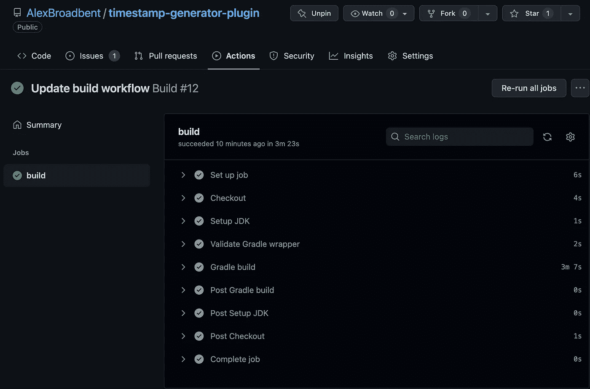
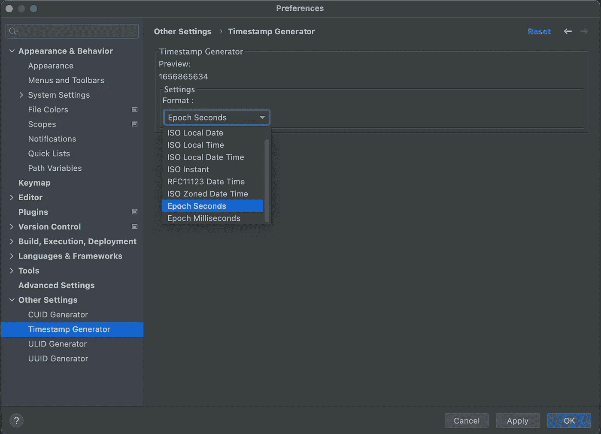

# 编写用于插入时间戳的 IntelliJ 插件

> 原文：<https://blog.devgenius.io/writing-an-intellij-plugin-for-inserting-timestamps-2cbe6f09b4f8?source=collection_archive---------18----------------------->

## 履行

## 体力劳动略少

## 问题是

在编写大量涉及基于时间的函数的测试时，我厌倦了手动写出完整的时间戳，我复制并粘贴时间戳，然后更改 1 或 2 个数字，使它们对于测试用例是唯一的。这变成了一个重复的任务，因为太频繁地点击复制和粘贴而使我的手指紧张。

所有的开发者都会在某个时候面临这个问题，最好的词是“辛苦”(这是我在自由贸易的经理给我指出的，是从谷歌 SRE 的书中杜撰出来的)。这是一个重复的任务，不需要任何新的思维过程，而是需要手动步骤来遵循。

照片由[埃琳娜·鲁梅](https://unsplash.com/@roum?utm_source=medium&utm_medium=referral)在 [Unsplash](https://unsplash.com?utm_source=medium&utm_medium=referral) 上拍摄

## 解决方案

JetBrains 提供了许多非常有用的插件，它们可以在所有不同的 ide 上工作，我还使用了一个非常流行的插件来生成 UUIDs，它是由 léo Millon 开发的，它给了我灵感来解决另一个文本生成问题。

IntelliJ SDK 有[动作方法](https://plugins.jetbrains.com/docs/intellij/basic-action-system.html)，它们被扩展用于将文本插入剪贴板或光标处的文本编辑器。插件的其余部分只是通过创建一个具有可配置格式的新时间戳值来促进文本插入。

设置页面允许用户从标准 ISO 或 Java 格式(ISO 8601、即时、本地日期、本地时间、本地日期时间、区域日期时间、RFC 1123)或纪元秒/毫秒之一更改时间戳的格式。

## IDEA Gradle 插件

gradle 插件 [com.jetbrains.intellij](https://plugins.jetbrains.com/docs/intellij/tools-gradle-intellij-plugin.html) 应用了构建 intellij 插件所需的所有方法。这是你定义版本和平台(IDEA，WebStorm，PyCharm 等)的地方。)是插件的目标。

插件还通过`runIde`任务引入了一些任务，您将使用这些任务在测试 IDE 环境中构建和运行插件。为`AnAction`创建一个扩展类将被 IDE 选中，并且任何在`actionPerformed`方法中的代码都将被运行。

在这个操作中，我们将替换任何突出显示的文本，或者在编辑器中插入插入符号的位置插入时间戳。这意味着我们必须检查突出显示的文本，并计算出我们的文本将被插入的位置，然后更新插入符号以放置在插入文本的末尾。IntelliJ 插件给了我们一个`Document`类，它为所有这些需求提供了方法。

## 构建管道

存储库使用 GitHub 动作来构建插件，并运行测试来验证构建是干净的。GitHub 不处理任何部署，它只是一个验证插件是否处于良好状态的地方。

构建和测试插件的 GitHub 动作

我使用的[工作流](https://github.com/AlexBroadbent/timestamp-generator-plugin/blob/master/.github/workflows/build.yml)在我的项目中是相当标准的，其中我使用`actions/checkout`下拉代码，`actions/setup-java`设置 JDK(我目前正在构建版本 11)，`gradle/wrapper-validation-action`在存储库中设置 gradle 包装器，然后`gradle/gradle-build-action`运行构建参数。这就构成了构建代码并对其运行所有测试。

IntelliJ 插件有一个`publishPlugin`任务，用于签名并向 JetBrains 推送最新版本。

## 设置菜单

设置菜单是使用[老学校 Swing 库](https://www.jetbrains.com/help/idea/components-of-the-gui-designer.html)编写的，带有布局的. form 文件和`SettingsForm`中逻辑的支持类。表单中的组件在`createUIComponents`方法中初始化，该方法加载格式组合框(下拉菜单)，而`loadSettings`处理将格式组合框设置为当前在设置中配置的值。有一个`updatePreviewLabel`方法，它在每次选择新格式时提供对预览标签的更改，以向用户显示时间戳将如何被格式化。

插件的设置页面

## 结论

为你的 IDE 设置正确的插件绝对有很大的价值。它减少了编写代码所需的时间。因此，为 IDE 构建一个插件会让开发人员的体验更加丰富。

JetBrains 有关于如何为 IntelliJ 构建插件的很棒的文档，我很高兴能编写一个新的插件，它将利用新的 [Kotlin DSL UI](https://plugins.jetbrains.com/docs/intellij/kotlin-ui-dsl-version-2.html) 。

源代码:【https://github.com/AlexBroadbent/timestamp-generator-plugin 