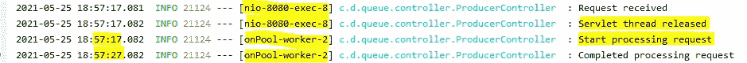

# 用 JAVA 编写异步非阻塞 Rest API。

> 原文：<https://blog.devgenius.io/writing-asynchronous-non-blocking-rest-api-using-java-a9ec54ecb243?source=collection_archive---------1----------------------->

## 处理大流量，提高应用程序性能和响应能力

图片来源—[www.pexels.com](http://www.pexels.com)

在来自客户端的 API 调用期间，服务器创建并分配该请求的线程。该线程等待并被指定，直到请求被提供给该客户端。
每个服务器可以打开有限数量的线程，如果该数量超过，那么新的客户端请求将存储在该服务器的请求队列中。
对于 Tomcat 服务器，它的默认线程数`maxThreads` 是 200，代表在任何给定时间允许运行的最大并发线程数。
还有其他指标`maxConnections`，表示服务器将接受和处理的并发连接的总数。任何额外的传入连接将被放置在队列中，直到有线程可用。`NIO/NIO2`模式的默认值是 10000，`APR/Native`是 8192。

另一个指标是`acceptCount`，它表示当没有可用的工作线程时，可以在操作系统级别的队列中等待的 TCP 请求的最大数量。默认值为 100。

对于一个高流量的应用程序，如果一个请求需要很长时间，或者需要很长时间来服务，就会产生很大的问题。为了克服这个线程管理问题，我们可以使用异步编程。

根据[visualstudiomagazine.com](https://visualstudiomagazine.com/articles/2011/03/24/wccsp_asynchronous-programming.aspx#:~:text=Asynchronous%20programming%20is%20a%20means,its%20completion%2C%20failure%20or%20progress.)，异步编程的定义是

> 异步编程是并行编程的一种方式，其中一个工作单元独立于主应用程序线程运行，并通知调用线程其完成、失败或进度。

# 同步应用程序如何产生问题？

对于同步应用程序，在请求过程中会产生什么问题？让我们来解决这个问题。下面是请求流程:

*   请求通过一个监听端口到达 tomcat 服务器。Tomcat 服务器有其内部服务器配置，如`maxThreads`、`maxConnections`等。如果服务器当前超过了最大线程值，那么请求将在队列中等待。
*   现在，服务器将该请求传递给应用程序，这意味着服务器为该请求分配一个新线程，并将该请求传递给应用程序。该线程一直等待，直到请求得到满足。
*   如果 API 花费了很长时间，那么该线程将等待它的响应。这里，tomcat 拥有 bt 默认 200 个线程，因此它一次最多可以服务 200 个请求。在这种情况下，客户端在 API 调用期间将面临严重的延迟。

今天我们将讨论如何使用`CompletableFuture`来编写异步 REST API，以使 tomcat 自由地克服线程溢出问题？

要了解术语`CompletableFuture`的详细内容，您可以查看[这篇文章](/details-implementation-of-java-asynchronous-programming-using-completable-future-949826bac6f3)

# `CompletableFuture`用于异步编程

为了解决这个问题，您可以使用。`CompletableFuture`。

我们在这里做什么？我们正在做以下事情:

*   简单端点是一个简单的`GET`方法，它的返回类型是`CompletableFuture<String>`
*   在处理请求的过程中，它只是调用了方法`processRequest`，其中只有一个`Thread.sleep`持续了 10s。
*   这两种方法都有一个进入和退出日志。

从 browser/postman 调用端点后，它会在 10 秒后发送一个响应。下面给出了这个 API 调用的日志。

图片来源—作者

这里，

*   日志的第一行和第二行显示在`nio-8080-exec-8`螺纹下。它还显示收到的请求和释放的 servlet 线程。这个线程来自非阻塞 IO，来自嵌入式服务器。
*   从日志的前 2 行可以看出，它是在执行`CompletableFuture`部分下的`processRequest`方法部分之前释放的。
*   日志的最后两行用于`CompletableFuture`零件。它正在处理`onPool-worker-2`下的线程。这意味着它与 tomcat 线程是分开的，而这个线程来自 Spring。`ForkJoinPool`。

# 思想的总结

*   Tomcat 服务器在收到客户端的调用后将请求传递给应用程序。
*   应用程序通过`CompletableFuture`将该任务分配给另一个线程。这个线程负责执行这个分配的任务，并通过 tomcat 连接响应客户端。
*   应用程序立即释放 tomcat 分配的线程。这个被释放的线程将返回到 tomcat 线程池，并准备好服务新的 API 请求。
*   有了这种机制，tomcat 现在可以处理大流量。
*   我们可以通过修改 tomcat `server.xml`文件来接受更多的请求。

我们可以微调`server.xml`文件，使其能够处理大量的传入流量。这种微调是基于我们的服务器资源，如处理器能力、内核数量、RAM 等。

代码致谢—作者

# 最后的想法

为了减少服务器线程等待时间，您可以应用异步 API。此外，您可以尝试延迟结果或 Spring WebFlux。

要写一个安全的 REST API，你可以看看这篇文章。