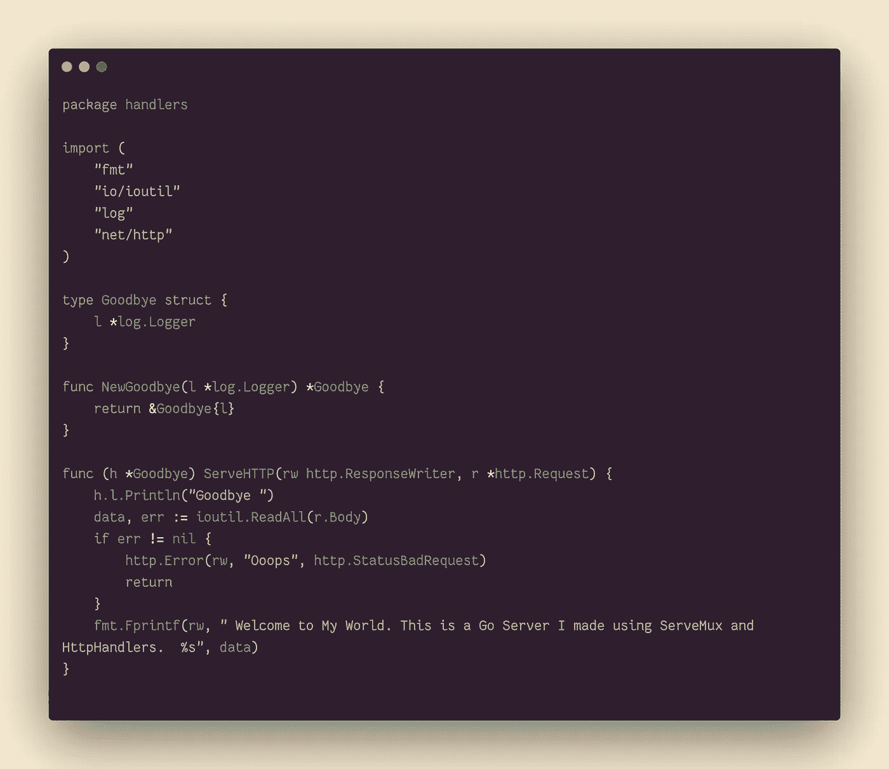
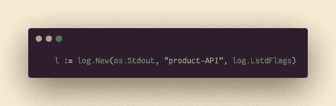
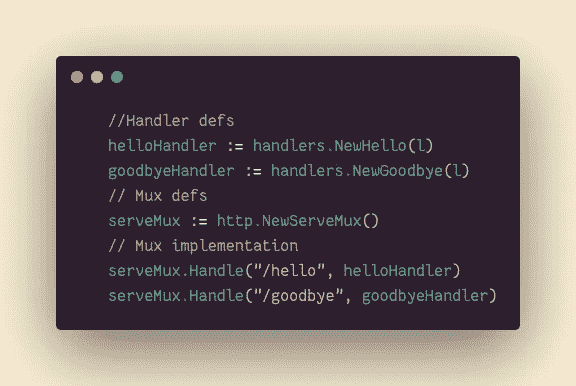
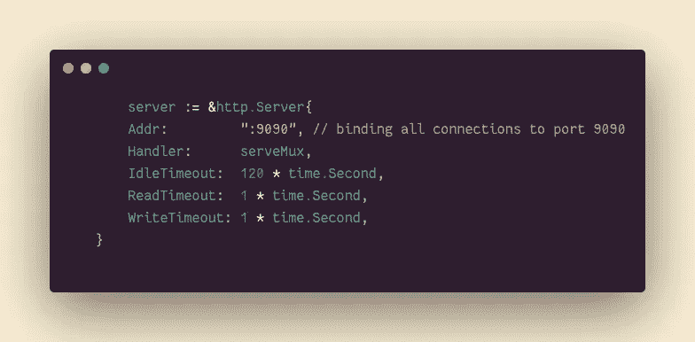
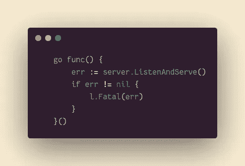
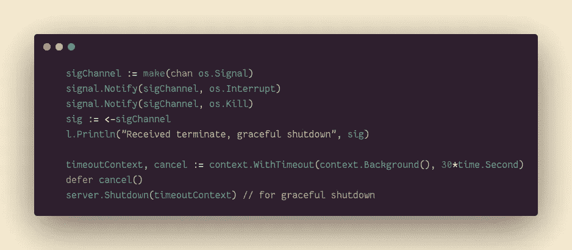

# 作为优秀的 Golang 公民编写定制的 HTTP 服务器

> 原文：<https://blog.devgenius.io/writing-custom-http-servers-as-good-goolang-citizens-ea6b2ebfc05f?source=collection_archive---------1----------------------->

src:[https://dev . to/bmpickford/basic-go-http-server-with-postgres-og3](https://dev.to/bmpickford/basic-go-http-server-with-postgres-og3)

**</>**

不，我不会谈论编写简单的 ListenAndServe。我将讨论一种可测试的、可伸缩的、更安全的方法来在 Go 中编写服务器。

我的目标是使用 Golang 提供给我们的最佳实践来编写代码。这将包括处理可能的 DDoS(分布式拒绝服务)攻击，使用尽可能少的资源来启动服务器，考虑到连接实际上是有代价的，以及优雅地处理连接关闭。

让我们开始吧。

**</>**

不管当前代码库有多小，我们都不希望用不相关的内容填充主函数。为此，我将在一个单独的包中创建我的处理程序，以备后用。

这是${IP}的一个基本处理程序:${PORT}/${ **PATH** }在请求到达这个路径时解析请求，在我的例子中是 *localhost:9090/goodbye。*

我打算使用 NewServeMux，并避免使用 HandleFunc，原因我稍后会解释。所以我需要定义处理程序并将它们绑定到路径。为此，我需要使用一个接口来定义解析器结构和期望的行为。请注意，尽管这个结构稍微强大了一点，但它仍然不能胜任更复杂的请求。但是我们正在一点一点地实现这个目标。

我引入我的日志记录器，并将其设置为我的 struct 的字段，使用我刚刚创建的接口创建句柄结构，并定义处理程序的角色。

注意 ServeHTTP 接受 ResponseWriter(在我的例子中是 rw 类型)和*httpRequest，后者是 r 类型。

错误处理后，我可以庆祝我解锁的新权力。有什么值得庆祝的，tho？

我们可以传播这个模型来创建一个新的处理程序。除此之外，它的可测试性更强，您不必使用 MITM 或 curl 手动进行测试。最后，它是可扩展的。

**<使用处理程序/ >**

假设我有多个不同端点的处理程序。我如何将它们与我的服务器结合在一起？让我们回到 main.go 文件开始。

首先，我设置我的日志记录器 l，并传递要写入的日志的目的地、将出现在新日志开头的前缀以及定义日志属性的标志。因为我假设这以后会发展成一个 API，所以现在我将使用前缀 product-API。

是时候使用我们的处理程序了:

我有 NewHello 和 NewGoodbye 处理程序，它们将 log 作为参数。NewServeMux 实际上是一个分配并返回新 ServeMux 的函数。另一方面，ServeMux 是一个包含已过滤或未导出字段的结构。

关于什么是 ServeMux，amazing Go 文档提供了很好的解释:

erveMux 是一个 HTTP 请求多路复用器。它将每个传入请求的 URL 与注册模式列表进行匹配，并调用与 URL 最匹配的模式的处理程序。

所以基本上一个 NewServeRemux 将帮助我产生一个自定义的 HandleFunc，**，这是一种 ServeMux。**

更多信息请参考 [Go 文档](https://pkg.go.dev/net/http)

在这里，我希望我的定制 ServeMux 处理给定的路径和处理程序。

**<我也想要我的定制服务器/ >**

想象一个场景，其中传入的请求实际上阻塞了服务器，服务器被拒绝服务。这不一定是由于恶意行为者而发生的。您的微系统组件可能会影响服务器，或者有时您需要调整每个请求的时间。

我们来处理这件事，不要被 DDoS 攻击。

我保持了相对较短的读写超时，因为目前我的服务器无论如何都不提供太多服务。但是随着即将到来的代码库加载，我可以测试并找到最佳点。IdleTimeout 也是如此，它限制服务器端的保持活动连接在被重用之前保持空闲的时间。(*[https://blog . gopheracademy . com/advent-2016/exposure-go-on-the-internet/](https://blog.gopheracademy.com/advent-2016/exposing-go-on-the-internet/))

**<更多控制，更安全/ >**

当然，我将使用我的服务器实例来监听和服务，但是如果我删除服务器实例并调用它，它可能会阻塞正在进行的进程。

因此，我需要找到一种方法来初始化它，同时允许我的程序同时运行**、**并且是轻量级的。我应该怎么做呢？

我将包装我的服务器实例并将其转换成一个 ***Goroutine*** ，同时我可以监听其他信号并对其做出反应。

那就行了。

我也需要关闭我的服务器。但是我不想在交易过程中进行，比如说在下载过程中。我也不想永远保持这种联系。我将如何控制它？换句话说，我将如何优雅地处理连接终止？

当然，我将使用关机，以便不中断任何活动的连接。Shutdown 首先检查所有打开的侦听器，然后检查空闲的侦听器，然后无限期地等待连接返回空闲状态，以便也关闭它们。

为了完成所有这些，它需要知道上下文，这是 Shutdown 方法的参数。因此，创建操作系统系统调用以及创建要使用的上下文的最后一步。

语境。WithTimeout 返回上下文和函数，并接受上下文和超时持续时间。如果期望的功能在超时前完成，我需要通过释放它们来重新收集资源。因此使用了延迟功能。

现在我可以优雅地将我的 timeoutContext 传递给 Shutdown 方法来优雅地关闭我的服务器。

**<为什么这么头疼，tho？/ >**

首先，它是安全可靠的。我们通过为编码预留几分钟的时间，避免了许多可能的麻烦。

其次，它更容易操作。设想一个场景，您需要水平扩展您的请求处理。不可避免地需要进行代码拆分。但是现在，我主动行动，提前思考构建代码库。

第三，它更强大。我可以添加很多额外的肌肉，调整 golang 提供的所有功能，而不是选择非常基本的请求和响应处理。

最后，也可能是目前最不重要的，它是优雅的。它知道如何在控制流边缘采取行动。

在即将到来的{在此输入日期/时间:)中，我将扩展代码库，添加测试和更多功能。

一如既往，感谢您的阅读！请随时在 [LinkedIn](https://www.linkedin.com/in/myavuzyagis/) 或通过[电子邮件](mailto:mehmetyavuzyagis@gmail.com)联系我。