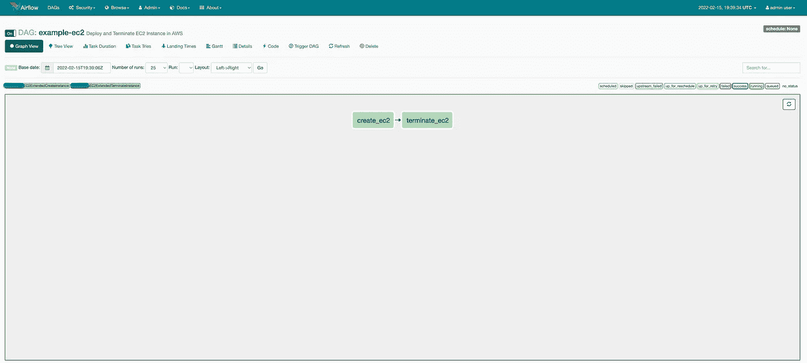
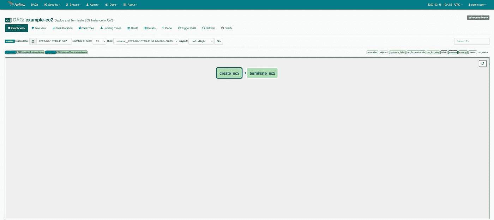
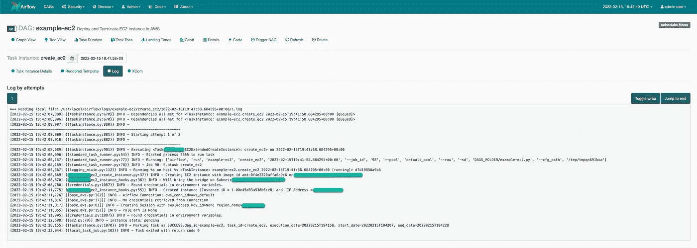
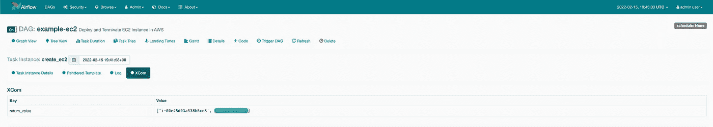
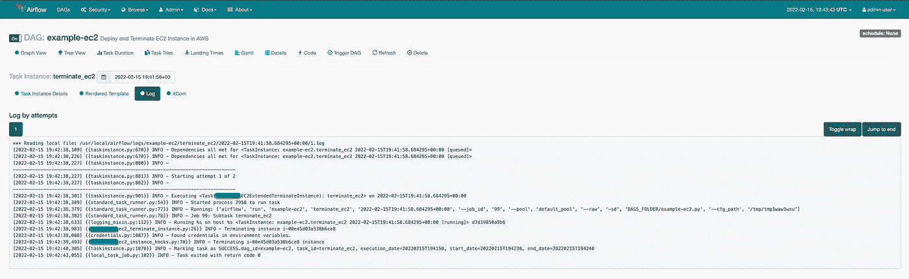

# 为 MWAA 编写自定义操作符和钩子

> 原文：<https://blog.devgenius.io/writing-custom-operators-and-hooks-for-mwaa-c8a1b6052553?source=collection_archive---------3----------------------->


[图片](https://unsplash.com/photos/IuGarrkgf10)由[站在 Unsplash 上的](https://unsplash.com/@standsome)工作生活方式

最近，我一直在研究 **MWAA** 又名**亚马逊管理的 Apache Airflow 工作流。**为了使用亚马逊服务，我们使用 **Airflow 亚马逊提供商** `*apache-airflow-backport-providers-amazon*==2021.3.3`，这为我们提供了具有以下功能的`EC2 Operator`和`EC2 Hooks`:

*   **EC2 startinstanceoperator**帮助我们**启动**一个 **EC2** **实例**，因为**实例 id** 是已知的。

```
*from* airflow.providers.amazon.aws.operators.ec2_start_instance *import* EC2StartInstanceOperator
```

*   **EC2 stoinstanceoperator**帮助我们**停止**一个 **EC2** **实例**给定**实例 id** 已知。

```
*from* airflow.providers.amazon.aws.operators.ec2_stop_instance *import* EC2StopInstanceOperator
```

以上操作员使用 **EC2Hook** ，遵循以下三种方法:

```
*from* airflow.providers.amazon.aws.hooks.ec2 *import* EC2Hook
```

1.  **get_instance，**以 **instance-id** 为参数，返回 [ec2。该实例 id 的实例](https://boto3.amazonaws.com/v1/documentation/api/latest/reference/services/ec2.html#EC2.Instance)对象。

2. **get_instance_state，**以 **instance-id** 为自变量，返回**状态**。

3. **wait_for_state，**以 **instance-id** 为自变量，等待所需状态激活。

对于我们的用例，我们需要基于提供的一些参数旋转**EC2**实例的能力，目前还不支持。因此，我们决定编写自己的 C **自定义操作符**来实现这一点。

**MWAA** (亚马逊管理的阿帕奇气流工作流 **)** 能够通过 **S3 桶**导入**定制插件**。这些**插件**可以以 **zip** 文件格式上传到 S3 桶，并且 **S3 URL** 可以在创建 **MWAA 集群**时使用，或者稍后从**亚马逊 MWAA 服务页面**更新。**插件**目录需要采用以下格式:

```
└── plugins
    ├── __init__.py
    ├── hooks
    │   ├── __init__.py
    │   └── ec2_extended_instance_hooks.py
    ├── operators
    │   ├── __init__.py
    │   ├── ec2_extended_create_instance.py
    │   └── ec2_extended_terminate_instance.py
    ├── ec2_extended_plugin.py
    └── sensors
       └── __init__.py
```

*   `__init__.py`确保 **MWAA** 包含**插件**目录中的文件夹及其内容。
*   **插件**目录下的`hooks` 文件夹应该包含**自定义钩子**。
*   **插件**目录下的`operators` 文件夹应该包含**自定义操作符**。
*   **插件**目录下的`sensors` 文件夹应该包含**自定义传感器**。
*   **插件**目录中的`ec2_extended_plugin.py`是**自定义操作器/挂钩/传感器**的定义。从`airflow.plugins_manager`导入`AirflowPlugin`以继承插件功能。

```
*from* airflow.plugins_manager *import* AirflowPlugin
*from* hooks.ec2_extended_instance_hooks *import* *
*from* operators.ec2_extended_create_instance *import* *
*from* operators.ec2_extended_terminate_instance *import* *

*class* EC2ExtendedPlugins(AirflowPlugin):
    name = 'ec2_extended_plugins'
    hooks = [EC2ExtendedHooks]
    operators = [EC2ExtendedCreateInstance,
EC2ExtendedTerminateInstance]
```

再说说`hooks`。钩子是你可能需要的`Operator Class`的**方法**的集合。所以我们的`ec2_extended_instance_hooks.py`包含以下内容:

```
*import* logging
*import* boto3
*from* airflow.exceptions *import* AirflowException
*from* airflow.hooks.base_hook *import* BaseHook
*from* airflow.providers.amazon.aws.hooks.ec2 *import* EC2Hook
*from* typing *import* List, Set, Dict, Tuple, Optional
*from* botocore.exceptions *import* ClientError

*class* EC2ExtendedHooks(EC2Hook):
    *def* __init__(*self*,
                 *args,
                 **kwargs):
        super(EC2ExtendedHooks, *self*).__init__(resource_type="ec2", *args, **kwargs)
        *self*.instance = *None

    # noinspection PyMethodMayBeStatic
    def* create_instance(*self*,
                        subnet_id: str,
                        security_group_ids: List[str],
                        image_id: str,
                        instance_type: str,
                        region_name: str,
                        key_name: str,
                        tags: List[Dict[str, str]],
                        iam_instance_profile: Optional[Dict[str, str]] = *None*,
                        user_data: Optional[str] = "",
                        min_count: Optional[int] = 1,
                        max_count: Optional[int] = 1,
                        ):
        *if* iam_instance_profile *is None*:
            iam_instance_profile = {}
        *if* subnet_id *is None*:
            *raise* AirflowException("Required parameter missing %s", subnet_id)
        *try*:
            logging.info("Will spin the EC2 Instance on %s", subnet_id)
            ec2 = boto3.resource('ec2', region_name=region_name)
            instance = ec2.create_instances(
                ImageId=image_id,
                InstanceType=instance_type,
                KeyName=key_name,
                SubnetId=subnet_id,
                MinCount=min_count,
                MaxCount=max_count,
                UserData=user_data,
                IamInstanceProfile=iam_instance_profile,
                TagSpecifications=[
                    {
                        'ResourceType': 'instance',
                        'Tags': tags
                    }
                ],
                SecurityGroupIds=security_group_ids)[0]
            logging.info("Created instance [Instance iD = %s] and [IP Address = %s]", instance.id,
                         instance.private_ip_address)
        *except* ClientError:
            logging.exception("Couldn't create instance with image %s, on subnet %s.", image_id, subnet_id)
            *raise
        else*:
            *return* instance

    *# noinspection PyMethodMayBeStatic
    def* terminate_instance(*self*, instance_id: str, region_name: str):
        instance_id = instance_id
        region_name = region_name
        *if* instance_id *is None*:
            *raise* AirflowException("instance id is required for termination, no instance id provided")
        *try*:
            ec2 = boto3.resource('ec2', region_name=region_name)
            logging.info("Terminating %s instance", instance_id)
            instance = ec2.Instance(instance_id)
            instance.terminate()
        *except* ClientError:
            logging.exception("Couldn't Terminating instance %s", instance_id)
            *raise*
```

`EC2ExtendedHooks`包含 2 种方法:

*   `create_instance`
*   `terminate_instance`

基于提供给`methods`的`arguments`，它们将执行较低级别的任务。

对于`Operator`，我有 2 个文件:

*   `ec2_extended_create_instance.py`
*   `ec2_extended_terminate_instance.py`

顾名思义，一个用于**创建 EC2 实例**，另一个用于**终止 EC2 实例**。

**创建 EC2 实例:**

`ec2_extended_create_instance.py`是`EC2ExtendedCreateInstance`类的定义，它收集参数作为`dag’s`任务的一部分。

```
*from* typing *import* List, Dict, Optional
*from* airflow.models *import* BaseOperator
*from* airflow.utils.decorators *import* apply_defaults
*from* airflow.providers.amazon.aws.hooks.ec2 *import* EC2Hook
*from* hooks.ec2_extended_instance_hooks *import* EC2ExtendedHooks

*class* EC2ExtendedCreateInstance(BaseOperator):
    template_fields = ["subnet_id", "security_group_ids", "image_id", "instance_type", "key_name", "region_name"]
    ui_color = "#ace1af"
    ui_fgcolor = "#00563f"

    @apply_defaults
    *def* __init__(*self*, subnet_id: str, security_group_ids: List[str], image_id: str, instance_type: str, key_name: str,
                 tags: List[Dict[str, str]], min_count: Optional[int] = 1, max_count: Optional[int] = 1,
                 aws_conn_id: str = "aws_default", region_name: Optional[str] = *None*, check_interval: float = 15,
                 **kwargs):
        super(EC2ExtendedCreateInstance, *self*).__init__(**kwargs)
        *self*.subnet_id = subnet_id
        *self*.security_group_ids = security_group_ids
        *self*.image_id = image_id
        *self*.instance_type = instance_type
        *self*.security_group_ids = security_group_ids
        *self*.key_name = key_name
        *self*.tags = tags
        *self*.max_count = max_count
        *self*.min_count = min_count
        *self*.aws_conn_id = aws_conn_id
        *self*.region_name = region_name
        *self*.check_interval = check_interval

    *def* execute(*self*, context: 'Context'):
        EC2Instance = EC2ExtendedHooks(
            aws_conn_id=*self*.aws_conn_id,
            region_name=*self*.region_name
        )
        *self*.log.info("Creating EC2 instance with image id %s on subnet %s", *self*.image_id, *self*.subnet_id)
        instance = EC2Instance.create_instance(
            subnet_id=*self*.subnet_id,
            security_group_ids=*self*.security_group_ids,
            image_id=*self*.image_id,
            instance_type=*self*.instance_type,
            key_name=*self*.key_name,
            region_name=*self*.region_name,
            tags=*self*.tags,
            min_count=*self*.min_count,
            max_count=*self*.max_count
        )

        ec2_hook = EC2Hook(aws_conn_id=*self*.aws_conn_id, region_name=*self*.region_name)
        ec2_hook.wait_for_state(
            instance_id=instance.id,
            target_state="running",
            check_interval=*self*.check_interval,
        )
        *return* instance.id, instance.private_ip_address
```

`EC2ExtendedCreateInstance`继承`BaseOperator`。导入`EC2ExtendedHooks`使用`create_instance`方法创建 **EC2 实例**，导入`EC2Hook`使用`wait_for_state`方法检查实例是否处于**运行**状态。

**终止 EC2 实例:**

`ec2_extended_terminate_instance.py`是定义`EC2ExtendedTerminateInstance`类，它收集参数作为`dag’s`任务的一部分，并从`EC2ExtendedHooks`导入`terminate_instance`方法以终止 **EC2 实例**。

```
*from* typing *import* List, Dict, Optional
*from* airflow.models *import* BaseOperator
*from* airflow.utils.decorators *import* apply_defaults
*from* airflow.providers.amazon.aws.hooks.ec2 *import* EC2Hook
*from* hooks.ec2_extended_instance_hooks *import* EC2ExtendedHooks

*class* EC2ExtendedTerminateInstance(BaseOperator):
    template_fields = ["instance_id", "region_name"]
    ui_color = "#ace1af"
    ui_fgcolor = "#00563f"

    @apply_defaults
    *def* __init__(*self*, instance_id: str, aws_conn_id: str = "aws_default", region_name: Optional[str] = *None*, check_interval: float = 15, **kwargs):
        super(EC2ExtendedTerminateInstance, *self*).__init__(**kwargs)
        *self*.instance_id = instance_id
        *self*.aws_conn_id = aws_conn_id
        *self*.region_name = region_name
        *self*.check_interval = check_interval

    *def* execute(*self*, context: 'Context'):
        EC2Instance = EC2ExtendedHooks(
            aws_conn_id=*self*.aws_conn_id,
            region_name=*self*.region_name
        )
        *self*.log.info("Terminating instance %s", *self*.instance_id)
        EC2Instance.terminate_instance(*self*.instance_id, *self*.region_name)
```

最后，实际的`dag`代码:

```
*import* os
*from* datetime *import* timedelta, datetime
*from* airflow *import* DAG
*from* airflow.models *import* Variable
*from* airflow.utils.dates *import* days_ago
*from* operators.ec2_extended_create_instance *import* EC2ExtendedCreateInstance
*from* operators.ec2_extended_terminate_instance *import* EC2ExtendedTerminateInstance

DEFAULT_ARGS = {
    'owner': 'airflow',
    'depends_on_past': *False*,
    'email': ['airflow@example.com'],
    'email_on_failure': *False*,
    'email_on_retry': *False*,
    'start_date': datetime.now() - timedelta(minutes=20),
    'retries': 1,
    'retry_delay': timedelta(minutes=5),
    'provide_context': *True*,
}

DAG_ID = os.path.basename(__file__).replace(".py", "")

security_group_ids = ["sg-00112233445566", "sg-567380011234"]
subnet = "subnet-0p9oui4th1"

*with* DAG(
        dag_id=DAG_ID,
        description="Deploy and Terminate EC2 Instance in AWS",
        default_args=DEFAULT_ARGS,
        dagrun_timeout=timedelta(hours=2),
        start_date=days_ago(1),
        schedule_interval=*None*,
        tags=["EC2Extended", "ec2", "CustomOperators"],
) *as* dag:
    create_ec2 = EC2ExtendedCreateInstance(
        subnet_id=subnet,
        security_group_ids=security_group_ids,
        image_id='ami-123456789101112',
        instance_type='t2.medium',
        key_name='some-key.pem',
        tags=[{"Key": "name", "Value": "AutoDeployed via MWAA Pipeline"}],
        aws_conn_id='aws_default',
        region_name='us-east-1',
        task_id='create_ec2',
    )

    terminate_ec2 = EC2ExtendedTerminateInstance(
        instance_id="{{ task_instance.xcom_pull('create_ec2', dag_id=DAG_ID, key='return_value')[0] }}",
        region_name='us-east-1',
        task_id='terminate_ec2',
    )

create_ec2 >> terminate_ec2
```

**需要注意的几件事:**

*   `EC2ExtendedCreateInstance`有类似`template_fields = ["subnet_id", "security_group_ids", "image_id", "instance_type", "key_name", "region_name"]`的模板字段。因此，这些参数可以使用 Airflow Jinja 模板进行模板化。
*   `EC2ExtendedCreateInstance`也返回`instance.id, instance.private_ip_address`，它将被存储在 [Airflow XCom](https://airflow.apache.org/docs/apache-airflow/stable/concepts/xcoms.html) 中，并且在将来需要的时候使用 [xcom_pull](https://airflow.apache.org/docs/apache-airflow/stable/_api/airflow/models/taskinstance/index.html#airflow.models.taskinstance.TaskInstance.xcom_pull) 。返回值存储为一个**键/值**对**。**因为我们没有使用 [xcom_push](https://airflow.apache.org/docs/apache-airflow/stable/_api/airflow/models/taskinstance/index.html#airflow.models.taskinstance.TaskInstance.xcom_push) 机制来推送值，所以默认情况下，Airflow 将返回值存储在**键名** : `return_value.`下

*注:*请阅读[气流 XCom](https://airflow.apache.org/docs/apache-airflow/stable/concepts/xcoms.html) ，用于在**Dag、Task** 等之间共享数据。

*   `EC2ExtendedTerminateInstance`使用带有`key=’return_value’`的 Airflow Jinja 模板，从前面的任务`create_ec2`中获取值。为了提取**实例 id** ，它正在获取`[0]`元素。

从 Airflow UI 看，它是这样的:

**活动 Dag 视图**



使用自定义运算符的活动 Dag

**任务一成功完成**



**气流日志**



**气流 XCOM 商店**



**终止成功完成**



`dag`顺利完成。它能够使用我们创建的**自定义操作符**和**钩子**来创建和销毁一个 **EC2 实例**。