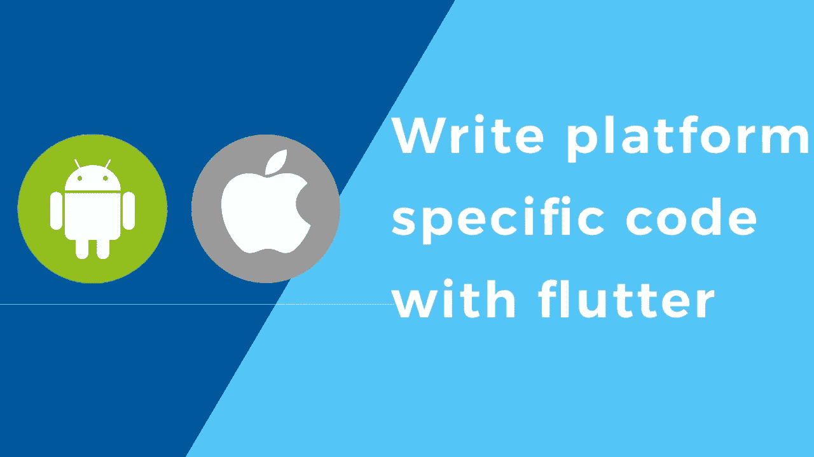
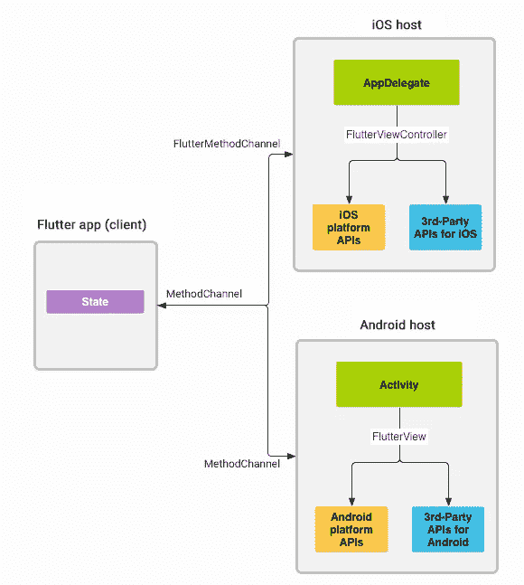
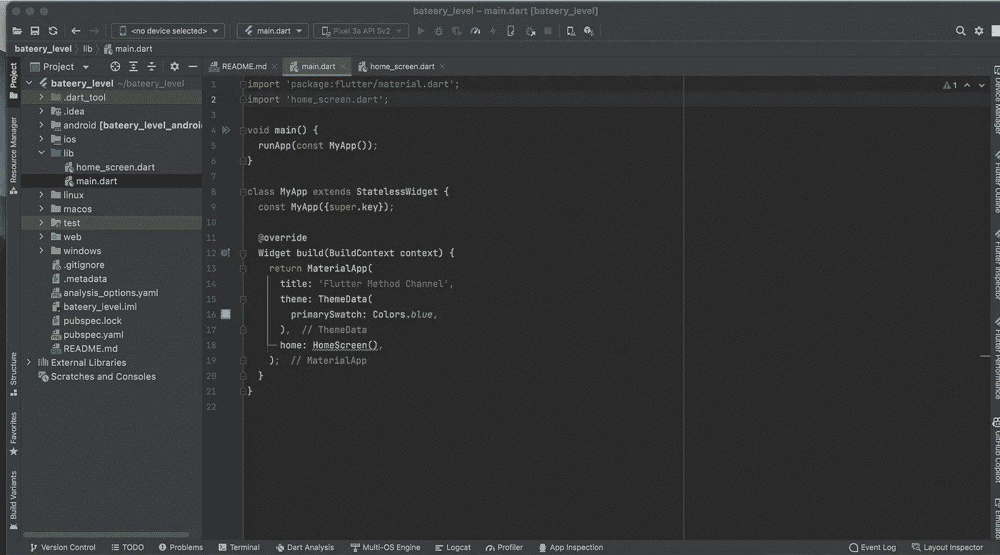
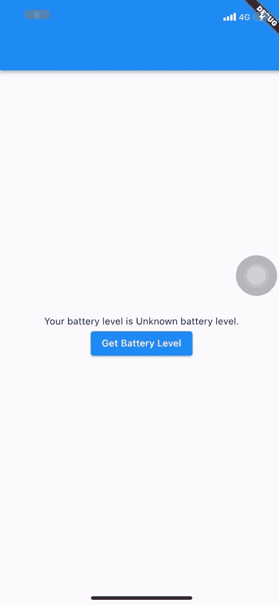

# 在 Flutter App 中编写定制的平台特定代码[方法通道]

> 原文：<https://blog.devgenius.io/writing-custom-platform-specific-code-in-flutter-app-method-channel-a4c49bf3f4f2?source=collection_archive---------4----------------------->

了解如何编写自定义平台代码，并在 flutter app 内连接它



> Flutter 使用了一个灵活的系统，允许您以一种直接使用这些 API 的语言调用特定于平台的 API:

*   Android 上的 Kotlin 或 Java
*   iOS 上的 Swift 或 Objective-C
*   Windows 上的 C++
*   macOS 上的目标 C
*   Linux 上的 c

下面的解释来自官方文件，用来解释方法通道是如何工作的



> 我还将在官方文档中解释如何获取当前设备的电池电量，以提供更多关于它如何工作的背景信息

# 首先，使用您喜欢的 IDE 创建一个 Flutter 应用程序

清除 Flutter Starter app 并创建一个新的 dart 文件 **home_screen.dart**



在你的 **home_screen.dart** 中创建一个新的 statefull 小部件，现在返回一个 scafolld

```
import 'package:flutter/material.dart';

class HomeScreen extends StatefulWidget {
  const HomeScreen({Key? key}) : super(key: key);

  @override
  State<HomeScreen> createState() => _HomeScreenState();
}

class _HomeScreenState extends State<HomeScreen> {
  @override
  Widget build(BuildContext context) {
    return Scaffold();
  }
}
```

然后导入这些库

```
import 'dart:async';
import 'package:flutter/material.dart';
import 'package:flutter/services.dart';
```

如你所知，与 platfrom 的交流是以一种**异步**的方式进行的，所以我们将在这个应用上做**未来**

在您的状态中创建一个字符串

```
String _batteryLevel = 'Unknown battery level.';
```

您的代码现在应该如下所示

```
import 'package:flutter/material.dart';
import 'dart:async';
import 'package:flutter/material.dart';
import 'package:flutter/services.dart';

class HomeScreen extends StatefulWidget {
  const HomeScreen({Key? key}) : super(key: key);

  @override
  State<HomeScreen> createState() => _HomeScreenState();
}

class _HomeScreenState extends State<HomeScreen> {
  String _batteryLevel = 'Unknown battery level.';

  @override
  Widget build(BuildContext context) {
    return Scaffold();
  }
}
```

然后在您的状态中创建一个未来的异步函数 getBatteryLevel

```
Future<void> _getBatteryLevel() async {
  String batteryLevel;
  try {
    final int result = await platform.invokeMethod('getBatteryLevel');
    batteryLevel = 'Battery level at $result % .';
  } on PlatformException catch (e) {
    batteryLevel = "Failed to get battery level: '${e.message}'.";
  }

  setState(() {
    _batteryLevel = batteryLevel;
  });
}
```

> 现在你会注意到平台中的一个错误，因为我们还没有定义它
> 
> 在我们声明它之前，我们需要知道方法通道必须有一个唯一的域供两端通信，所以它是常量不可变的
> 
> 返回到您的状态并删除 methodChannel 对象

```
static const platform = MethodChannel('mediumExplain/battery');
```

然后，我们需要添加一些简单的用户界面来获取电池电量

用以下代码替换您的构建方法

```
@override
Widget build(BuildContext context) {
  return Scaffold(
    appBar: AppBar(),
    body: Column(
      children: [
        Text('Your battery level is ${_batteryLevel}'),
        ElevatedButton(
          onPressed: _getBatteryLevel,
          child: const Text('Get Battery Level'),
        ),
      ],
    ),
  );
}
```

> 现在是 android 的原生部分，

# Android 配置 Kotlin

打开您的 android 应用程序目录

*   **>app->src->main->kot Lin->main activity . kt**
*   添加那些导入

```
import io.flutter.embedding.android.FlutterActivity
import io.flutter.embedding.engine.FlutterEngine
import io.flutter.plugin.common.MethodChannel
import androidx.annotation.NonNull
import android.content.Context
import android.content.ContextWrapper
import android.content.Intent
import android.content.IntentFilter
import android.os.BatteryManager
import android.os.Build.VERSION
import android.os.Build.VERSION_CODES
```

> 这些是 android 的本地库，用于联系电池电量的 api

然后添加这个变量，和我们在 flutter 应用程序中创建的一样

```
class MainActivity: FlutterActivity() {
  private val CHANNEL = "mediumExplain/battery"
```

然后忽略这个函数，让它保持原样

```
override fun configureFlutterEngine(@NonNull flutterEngine: FlutterEngine) {
    super.configureFlutterEngine(flutterEngine)
    MethodChannel(flutterEngine.dartExecutor.binaryMessenger, CHANNEL).setMethodCallHandler {
      call, result ->
      // This method is invoked on the main thread.
      // TODO
    }
  }
```

然后在它之后添加这个方法，它将得到电池的百分比，并重新发送到我们的渠道

```
 private fun getBatteryLevel(): Int {
    val batteryLevel: Int
    if (VERSION.SDK_INT >= VERSION_CODES.LOLLIPOP) {
      val batteryManager = getSystemService(Context.BATTERY_SERVICE) as BatteryManager
      batteryLevel = batteryManager.getIntProperty(BatteryManager.BATTERY_PROPERTY_CAPACITY)
    } else {
      val intent = ContextWrapper(applicationContext).registerReceiver(null, IntentFilter(Intent.ACTION_BATTERY_CHANGED))
      batteryLevel = intent!!.getIntExtra(BatteryManager.EXTRA_LEVEL, -1) * 100 / intent.getIntExtra(BatteryManager.EXTRA_SCALE, -1)
    }

    return batteryLevel
  }
```

> 注意:这些与 flutter 无关，这是一个 android 原生 kotlin 代码，你一定不知道，你也可以从 android 或 ios 调用任何 api，即使你不知道原生代码，你可以在 stackoverflow 上搜索以找到你需要的相关内容。你只需要知道在这些代码之间建立一个通道

现在你的整个代码应该看起来像这样

```
package com.example.bateery_level

import io.flutter.embedding.android.FlutterActivity
import io.flutter.embedding.engine.FlutterEngine
import io.flutter.plugin.common.MethodChannel
import androidx.annotation.NonNull
import android.content.Context
import android.content.ContextWrapper
import android.content.Intent
import android.content.IntentFilter
import android.os.BatteryManager
import android.os.Build.VERSION
import android.os.Build.VERSION_CODES

class MainActivity: FlutterActivity() {
    private  val CHANNEL ="mediumExplain/battery"

    override fun configureFlutterEngine(@NonNull flutterEngine: FlutterEngine) {
        super.configureFlutterEngine(flutterEngine)
        MethodChannel(flutterEngine.dartExecutor.binaryMessenger, CHANNEL).setMethodCallHandler {
            // This method is invoked on the main thread.
                call, result ->
            if (call.method == "getBatteryLevel") {
                val batteryLevel = getBatteryLevel()

                if (batteryLevel != -1) {
                    result.success(batteryLevel)
                } else {
                    result.error("UNAVAILABLE", "Battery level not available.", null)
                }
            } else {
                result.notImplemented()
            }
        }

    }
    private fun getBatteryLevel(): Int {
        val batteryLevel: Int
        if (VERSION.SDK_INT >= VERSION_CODES.LOLLIPOP) {
            val batteryManager = getSystemService(Context.BATTERY_SERVICE) as BatteryManager
            batteryLevel = batteryManager.getIntProperty(BatteryManager.BATTERY_PROPERTY_CAPACITY)
        } else {
            val intent = ContextWrapper(applicationContext).registerReceiver(null, IntentFilter(Intent.ACTION_BATTERY_CHANGED))
            batteryLevel = intent!!.getIntExtra(BatteryManager.EXTRA_LEVEL, -1) * 100 / intent.getIntExtra(BatteryManager.EXTRA_SCALE, -1)
        }

        return batteryLevel
    }

}
```

现在回到你的 flutter 应用程序并运行它

> 下一步是 ios 配置，如果您在 windows 设备上运行，请跳过

# IOS 配置

打开 Xcode 中的 ios 文件夹

然后在 runner 目录下打开 AppDelegate.swift

在**方法**中添加这两行

```
let controller : FlutterViewController = window?.rootViewController as! FlutterViewController
    let batteryChannel = FlutterMethodChannel(name: "mediumExplain/battery",
                                              binaryMessenger: controller.binaryMessenger)
```

然后加上这个

```
 batteryChannel.setMethodCallHandler({
        (call: FlutterMethodCall, result: @escaping FlutterResult) -> Void in

          guard call.method == "getBatteryLevel" else {
            result(FlutterMethodNotImplemented)
            return
          }
          self.receiveBatteryLevel(result: result)
      })
```

然后在文件的底部添加这个函数

```
private func receiveBatteryLevel(result: FlutterResult) {
  let device = UIDevice.current
  device.isBatteryMonitoringEnabled = true
  if device.batteryState == UIDevice.BatteryState.unknown {
    result(FlutterError(code: "UNAVAILABLE",
                        message: "Battery level not available.",
                        details: nil))
  } else {
    result(Int(device.batteryLevel * 100))
  }
}
```

现在你的整个文件应该看起来

```
import UIKit
import Flutter

@UIApplicationMain
@objc class AppDelegate: FlutterAppDelegate {
  override func application(
    _ application: UIApplication,
    didFinishLaunchingWithOptions launchOptions: [UIApplication.LaunchOptionsKey: Any]?
  ) -> Bool {
      let controller : FlutterViewController = window?.rootViewController as! FlutterViewController
       let batteryChannel = FlutterMethodChannel(name: "mediumExplain/battery",
                                                 binaryMessenger: controller.binaryMessenger)
      batteryChannel.setMethodCallHandler({
        (call: FlutterMethodCall, result: @escaping FlutterResult) -> Void in

          guard call.method == "getBatteryLevel" else {
            result(FlutterMethodNotImplemented)
            return
          }
          self.receiveBatteryLevel(result: result)
      })
    GeneratedPluginRegistrant.register(with: self)
    return super.application(application, didFinishLaunchingWithOptions: launchOptions)
  }
    private func receiveBatteryLevel(result: FlutterResult) {
      let device = UIDevice.current
      device.isBatteryMonitoringEnabled = true
      if device.batteryState == UIDevice.BatteryState.unknown {
        result(FlutterError(code: "UNAVAILABLE",
                            message: "Battery level not available.",
                            details: nil))
      } else {
        result(Int(device.batteryLevel * 100))
      }
    }
} 
```

然后从真实的 ios 设备而不是模拟机上运行应用程序



# GitHub 知识库

[https://github.com/mohaberabi/flutter_method_channel](https://github.com/mohaberabi/flutter_method_channel)

感谢阅读，如果它有助于为我鼓掌