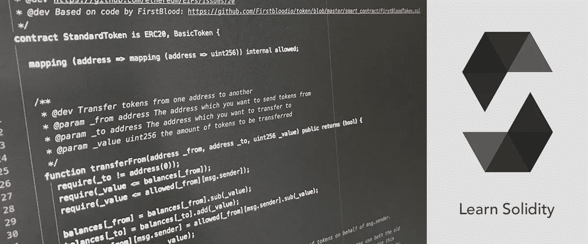

# 编写 DApps 和令牌:在可靠性中提升编程技能

> 原文：<https://blog.devgenius.io/writing-dapps-and-tokens-levelling-up-programming-skills-in-solidity-1b4b3408254d?source=collection_archive---------8----------------------->

许多潜在应用中的一个可以用以太坊来编写。向下滚动以了解更多信息。

以太坊是众所周知的，用于创建公共区块链应用程序。更重要的是，尽管竞争激烈，他们仍主导着市场。在这里，我将告诉你我是如何决定写 6 个 dApps，另一个写在不同令牌标准上的不同令牌，以及几个 ERC-20 令牌来磨练我的技能。

## 1-在 YouTube 上寻找教学视频

在 solidity 中学习透彻的数据类型在以太坊中没有用。因此，我决定通过观看不同频道发布的 YouTube 教学视频来免费磨练我的技能。为了给出关于我如何找到它们的建议，我只是专门查看了长教程，以及在哪里构建了不止一个以太坊 dApp，并提供了不同的功能来了解每个 dApp。更重要的是，在构建了一定数量的 dApps 后，我将创建一个 ERC-20 令牌来进一步练习可靠性并发布我的项目。

## 2-制定一个你将如何配合教学视频的计划

因为它们真的是很长的教程，你可能需要把程序分成几天，并每天都遵循它们，以确保你走在正确的轨道上。更有甚者，一些教师可能会把一天分成不同的章节，以使对主题的理解更容易接受。所以，建立一个计划并坚持完成它，对任何编程语言都有帮助，包括以太坊。

## 3-在某些平台上发布您的项目

你已经完成了你的个人项目，现在做什么？他们会白去吗？当然不是，在某些平台上，你可以发布你的软件项目，让人们招募你。即使你是一个自学成才的程序员，更多的工作场所不再需要学位。他们一般会寻找技能，除非工作场所真的很传统。

## 4-坚持下去，不断提高你的技能

尽管区块链发展领域是一个相当新的和蓬勃发展的领域，你需要在多个平台上有很高的技能才能找到工作并在你的领域取得成功。此外，一旦你在以太坊和其他区块链平台上变得有经验和熟练，你就可以从程序员升级到软件项目顾问，如果你学习统计学，还可以将你的区块链技能与其他学科相结合。

*根据你的说法，你将如何提升你的稳固性技能？请在下面的评论中分享你的想法和经历。*