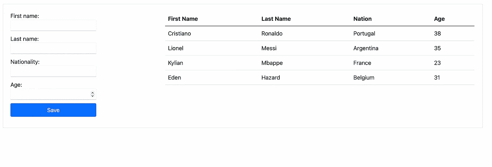
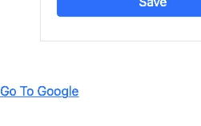
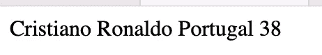
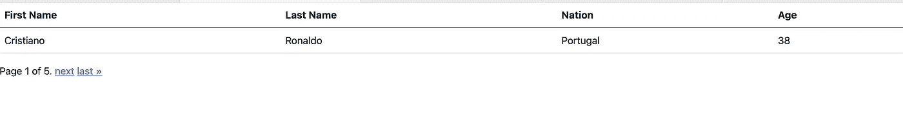
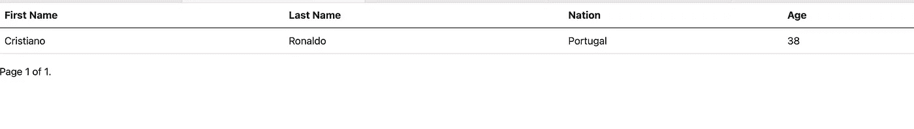
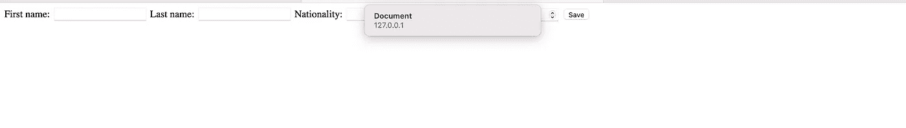
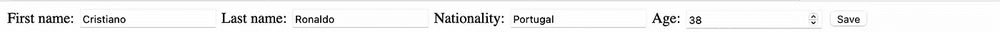

# 编写 Django 视图

> 原文：<https://blog.devgenius.io/writing-django-views-8835ff4c7166?source=collection_archive---------5----------------------->

## Django 观点解释


保罗·斯科鲁普斯卡斯在 [Unsplash](https://unsplash.com/s/photos/view?utm_source=unsplash&utm_medium=referral&utm_content=creditCopyText) 上的照片

Django 使用 MVT(模型-视图-模板)设计模式。视图部分可以定义为一个函数或一个类。它的工作只是接收 web 请求并返回 web 响应。

你可以在这里找到演示的示例代码[。我们只有一个名为 *home* 的应用程序。它有一个模型；*玩家*。](https://github.com/okanyenigun/django-view-example)

```
#models.py

from django.db import models

class Player(models.Model):

    first_name = models.CharField(max_length=100)
    last_name = models.CharField(max_length=100)
    nationality = models.CharField(max_length=100)
    age = models.IntegerField()

    def __str__(self):
        return self.last_name
```

```
#forms.py

from django.forms import ModelForm
from home.models import Player

class PlayerForm(ModelForm):
    class Meta:
        model = Player
        fields = '__all__'
```

首先，我们的页面上有一个表单和一个显示数据的表格。



# 基于功能的视图

首先，我们在 *urls.py* 中创建 URL。*首页*是查看功能。它接受请求。操作完成后，它发送请求和要发送的数据，并呈现页面。

```
#urls.py

from django.contrib import admin
from django.urls import path
import home.views as hv

urlpatterns = [
    path('admin/', admin.site.urls),
    path('', hv.home, name='home'),
]
```

```
#views.py

from django.shortcuts import render
from home.forms import PlayerForm
from home.models import Player

def home(request):
    form = PlayerForm()
    players = Player.objects.all()
    if request.method == "POST":
        form = PlayerForm(request.POST)
        if form.is_valid():
            form.save()
    return render(request, './templates/home.html', 
                  {'form':form, 'players':players})
```

在这里，我们首先创建一个表单，然后获取模型记录。 *home* 函数可以包含任何类型的请求。如果传入的请求是 POST 类型，我们在条件语句中处理它。例如，在我们的例子中，表单来自 POST 请求。我们在 *post* 条件下处理它。

基于函数的视图还是基于类的视图？两者都可以完成相同的任务。

基于函数的视图更直接。你把所有东西都放进一个函数里。基于类的有抽象性。因此，你需要先了解这些结构。

通用的基于类的视图有模板。超越这一点可能会很困难。基于功能的视图可能更容易定制。

然而，争论哪个更好是没有意义的。这取决于任务或项目，可能会根据个人喜好而有所不同。最好两者都懂，需要什么都能用。

# 基于类的视图

我这边在讨论(？)以上是赞成基于类的视图，我发现这样更模块化。基于类的视图通过继承促进代码重用。唯一能想到的缺点就是由于抽象而无法完全掌握的感觉。但是一旦你学会了，这个问题就消失了(这就是我们在这里的原因)。

在基于类的视图中，为每个 HTTP 请求类型定义了一个单独的方法。如果我们用类类型视图重复上面的例子:

```
#urls.py

urlpatterns = [
    path('admin/', admin.site.urls),
    # path('', hv.home, name='home'),
    path('', hv.HomeView.as_view(), name='home'),
]
```

在 URL 中，我们将 *as_view* 方法用于基于类的视图。

```
#views.py

from django.views import View

class HomeView(View):

    def get(self, request):
        form = PlayerForm()
        players = Player.objects.all()
        return render(request, './templates/home.html', {'form':form, 'players':players})

    def post(self, request):
        form = PlayerForm(request.POST)
        if form.is_valid():
            form.save()
        return redirect('home')
```

我们将上述操作分为*获取*和*发布*。更加模块化的结构。

Django 有几个内置的通用视图类。

## 模板视图

我们可以使用 *TemplateView 的*来显示静态页面，或者只使用 GET 方法的页面(例如，“关于我们”页面)。我们不打算在此页面上有任何用户交互。

**HTML:** 只是一个空的、静态的“关于”页面

```
<!DOCTYPE html>
<html lang="en">
  <head>
    <meta charset="UTF-8" />
    <meta http-equiv="X-UA-Compatible" content="IE=edge" />
    <meta name="viewport" content="width=device-width, initial-scale=1.0" />
    <title>About</title>
  </head>
  <body>
    <div>About me</div>
    <div>{{header}}</div>
  </body>
</html> 
```

我们可以通过两种方式设置*模板视图*。首先，我们可以在*URL . py*中定义它:

```
#urls.py

from django.contrib import admin
from django.urls import path
from django.views.generic import TemplateView

urlpatterns = [
    path('admin/', admin.site.urls),
    path('about/', TemplateView.as_view(template_name='about.html',
                                        extra_context={'header': 'Something'}))
]
```

在 URL 路由部分直接定义了*模板视图*。在 *as_view* 方法中，我传递了 HTML 文件名和参数。

另一种方法是通过继承*模板视图*来定义视图对象。

```
#views.py

from django.views.generic.base import TemplateView

class AboutView(TemplateView):

    template_name = "about.html"

    def get_context_data(self, **kwargs):
        context = super().get_context_data(**kwargs)
        context["header"] = "Something"
        return context
```

*TemplateView* 类继承了三个内置的 Django 类: *TemplateResponseMixin、ContextMixin、*和 *View* 。因此，我们可以使用这些父类的方法。我们可以通过 *get_context_data* 方法进行数据传输。

```
#urls.py

from django.contrib import admin
from django.urls import path
from django.views.generic import TemplateView
import home.views as hv

urlpatterns = [
    path('admin/', admin.site.urls),
    path('about/', hv.AboutView.as_view()),
]
```

## 重定向视图

顾名思义，它用于重定向目的。

在继续之前，我们首先从项目自己的*URL . py*文件中获取 URL 定义，并使其具有应用特定性。为此，让我们在家庭应用程序中创建一个新的*URL . py*文件。

```
#home/urls.py

from django.contrib import admin
from django.urls import path
from django.views.generic import TemplateView, RedirectView
import home.views as hv

urlpatterns = [
    path('admin/', admin.site.urls),
    path('', hv.HomeView.as_view(), name='home'),
    path("redirect/",RedirectView.as_view(url='https://www.google.com/?client=safari'), 
                                          name='redirect-to-google')
]
```

我在 *urlpatterns* 中定义了一个*重定向视图*，并向其发送了一个 URL 地址。我还给了它一个名字，这样我们就可以叫它的名字了。

```
#urls.py (in the project)

from django.contrib import admin
from django.urls import path, include

urlpatterns = [
    path('admin/', admin.site.urls),
    path('',include(('home.urls', 'home'), namespace='home'))
]
```

HTML:我在主页的底部放置了一个*和一个*标签。我们使用*首页*命名空间来到达*重定向到谷歌。*

```
<a href=""> Go To Google</a>
```



当我们点击这个链接时，它会进入谷歌。

或者，我们可以创建一个继承 *RedirectView* 的视图类。这使我们能够确定重定向操作期间将发生的情况。

首先，让我们创建*predirectview*类，它继承了*reddirectview*类。我们通过声明父 *RedirectView* 类的 *pattern_name* 变量来定义要去哪里。它将重定向至*关于*命名空间。

在重定向之前，该类将运行 *get_redirect_url* 方法。因此，我们可以在重定向之前自定义行为。例如，我们可以记录一些东西，或者向数据库发送一些数据，等等。

```
#views.py

class PreRedirectView(RedirectView):

    pattern_name = 'home:about'

    def get_redirect_url(self, *args, **kwargs):
        print("Customize here")
        return super().get_redirect_url(*args, **kwargs)
```

让我们相应地更新 urls.py。

```
#urls.py

from django.contrib import admin
from django.urls import path
from django.views.generic import TemplateView, RedirectView
import home.views as hv

urlpatterns = [
    path('admin/', admin.site.urls),
    path('about/', hv.AboutView.as_view(),name='about'),
    path('redirect/', hv.PreRedirectView.as_view(), name='redirect'),
    path('', hv.HomeView.as_view(), name='home'),

]
```

**HTML**

```
<a href=""> Go To About</a>
```

当我们点击链接时，它会在重定向之前运行*prerectorview*类中的 *get_redirect_url* 方法。因此，在重定向之前，您会看到它将打印“在此处自定义”。

## DetailView

我们使用 *DetailView 的*来呈现单个实例的细节。例如，您在一个页面上有一个对象列表，用户单击其中一个对象，它会将您带到该单独的页面。

它必须在对象的主键或 slug 上调用。通常，此视图不用于包含表单的页面。

```
#urls.py

urlpatterns = [
    path('admin/', admin.site.urls),
    path('about/', hv.AboutView.as_view(),name='about'),
    path('redirect/', hv.PreRedirectView.as_view(), name='redirect'),
    path('', hv.HomeView.as_view(), name='home'),

    path('<int:pk>/',hv.PlayerDetailView.as_view(), name='detail'),

]
```

在这个例子中，我使用了主键，但是你也可以使用 slugs。

```
#views.py

from django.views.generic.detail import DetailView
from django.shortcuts import get_object_or_404

class PlayerDetailView(DetailView):

    template_name='detail.html'
    #queryset = Player.objects.all()

    def get_object(self):
        idx = self.kwargs.get("pk")
        return get_object_or_404(Player, id=idx)
```

我们再次声明*模板名*。并且我们覆盖父类的 *get_object* 方法来定制行为。我们通过给 *get_object_or_404* 方法提供主键来获得相应的模型记录。

此外，我们可以通过定义 queryset 来限制显示的项目数量。默认行为是选择所有记录，但我们可以根据需要进行过滤。

```
#detail.hmtl

 <body>
    {{object.first_name}} {{object.last_name}} {{object.nationality}}
    {{object.age}}
  </body>
```

所以，如果我输入: [http://127.0.0.1:8000/1/](http://127.0.0.1:8000/1/)



detail.html

只需几行代码，我们就创建了一个视图，可以在其中查看列表中任何记录的详细信息。

## 列表视图

通用 ListView 设计用于显示对象列表。它提供了轻松分页的能力。这种通用视图也不太适合拥有表单或记录条目。它更适合显示和列出数据。

首先，添加一个 URL 到 *urls.py:* 中的 *urlpatterns*

```
#urls.py

path('lists/', hv.PlayerListView.as_view(), name="player-list"),
```

我们指定想要使用的模型和想要显示数据的模板。在幕后，Django 查询数据并将其输出到模板上。

```
class PlayerListView(ListView):

    model = Player 
    template_name = "lists.html" 
```

超文本标记语言

```
<table class="table">
  <thead>
    <tr>
      <th scope="col">First Name</th>
      <th scope="col">Last Name</th>
      <th scope="col">Nation</th>
      <th scope="col">Age</th>
    </tr>
  </thead>
  <tbody>
    
    <tr>
      <td>{{player.first_name}}</td>
      <td>{{player.last_name}}</td>
      <td>{{player.nationality}}</td>
      <td>{{player.age}}</td>
    </tr>
    
  </tbody>
</table>
```

*object_list* 是 *ListView 的*数据的默认关键字。我们可以通过声明 context_object_name 变量来改变它。

```
class PlayerListView(ListView):

    model = Player 
    template_name = "lists.html"  
    context_object_name = "Players"
```

```

  <tr>
    <td>{{player.first_name}}</td>
    <td>{{player.last_name}}</td>
    <td>{{player.nationality}}</td>
    <td>{{player.age}}</td>
  </tr>
  
```

**分页**

我们可以用 *paginate_by* 变量决定显示多少条记录。

```
class PlayerListView(ListView):

    model = Player 
    template_name = "lists.html"  
    context_object_name = "Players"
    paginate_by = 1
```

让我们使用 Django 文档中的通用代码进行分页。这样，在表格的底部有分页，我们可以来回移动。

```
<body>
    <div>
      <table class="table">
        <thead>
          <tr>
            <th scope="col">First Name</th>
            <th scope="col">Last Name</th>
            <th scope="col">Nation</th>
            <th scope="col">Age</th>
          </tr>
        </thead>
        <tbody>
          
          <tr>
            <td>{{player.first_name}}</td>
            <td>{{player.last_name}}</td>
            <td>{{player.nationality}}</td>
            <td>{{player.age}}</td>
          </tr>
          
        </tbody>
      </table>
    </div>
    <div class="pagination">
      <span class="step-links">
        
        <a href="?page=1">&laquo; first</a>
        <a href="?page={{ page_obj.previous_page_number }}">previous</a>
        

        <span class="current">
          Page {{ page_obj.number }} of {{ page_obj.paginator.num_pages }}.
        </span>

        
        <a href="?page={{ page_obj.next_page_number }}">next</a>
        <a href="?page={{ page_obj.paginator.num_pages }}">last &raquo;</a>
        
      </span>
    </div>
  </body>
```



页码

实现分页的简单方法。

正如我们在 DetailView 中所做的那样，我们可以从头定义 queryset，并确定将处理哪些记录。这是一种有效的方法，但是我们也可以使用另一种方法来过滤记录。get_queryset 方法将被覆盖。

```
class PlayerListView(ListView):

    model = Player 
    template_name = "lists.html"  
    context_object_name = "Players"
    paginate_by = 1

    def get_queryset(self):
        queryset = Player.objects.filter(first_name="Lionel")
        return queryset
```

我们也可以创建这个实例作为一个单独的类。这一次它将接受国籍作为参数。

```
#urls.py

#add this
path('lists/<str:nationality>', hv.NationView.as_view(), name="nation"),
```

筛选查询集。

```
#views.py

class NationView(ListView):
    model = Player 
    template_name = "lists.html"  
    context_object_name = "Players"
    paginate_by = 1

    def get_queryset(self):
        queryset = Player.objects.filter(nationality=self.kwargs.get("nationality"))
        return queryset
```

[http://127 . 0 . 0 . 1:8000/lists/葡萄牙](http://127.0.0.1:8000/lists/Portugal)



## 表单视图

到目前为止，我们一直在查看显示数据的通用视图。现在让我们看看数据编辑是怎么回事。

顾名思义，我们使用*表单视图*来显示表单。我们通常不使用*表单视图*来保存新数据。对此有一个单独的通用视图。我们使用 *FormView* 主要是为了执行一个动作，比如发送一封电子邮件。当然，如果需要，它也可以用来保存新数据。

```
#views.py

from django.views.generic.edit import FormView

class AddView(FormView):
    template_name = "add_player.html"
    form_class = PlayerForm
    success_url = '/'

    def form_valid(self, form):
        form.save()
        return super().form_valid(form)
```

我们设置了 *template_name* ，表单，以及操作完成时将要重定向的 URL。通过覆盖 *form_valid* 方法，我们可以定制表单验证过程。

```
#urls.py

path('add/', hv.AddView.as_view(), name='add'),
```

```
<div class="main-frame">
  <form method="POST">
    
    <div class="left-frame">
      {{form.as_table}}
      <button name="submit" type="submit" class="btn btn-primary">
        Save
      </button>
    </div>
  </form>
</div>
```



add_player.html

## 创建视图

这是一个非常具体的通用视图。我们使用 *CreateView* 来显示创建新记录的表单。

```
from django.views.generic.edit import CreateView

class CreatePlayerView(CreateView):
    model = Player
    template_name = "add_player.html"
    form_class = PlayerForm
    success_url = '/'
```

我们不需要在 *CreateView* 中使用表单验证。除此之外，它的结构与 *FormView* 类似。

## 更新视图

它继承了与 CreateView 相同的类和混合。所以，它们是相似的。我们更喜欢用 *UpdateView* 来检索特定的数据并更新它。

首先，我们需要一个新的网址。

```
path('<int:pk>/edit',hv.EditPlayerView.as_view(), name='edit'),
```

观点:

```
class EditPlayerView(UpdateView):
    model = Player
    template_name = "add_player.html"
    form_class = PlayerForm
    success_url = '/'
```



目前就这些。感谢阅读。如果你有任何意见或建议或异议，请随时写信给我。

# 阅读更多内容…

[](https://awstip.com/discovering-django-forms-dc4b4d9970d9) [## 发现 Django 表单

### 在 Django 中使用表单

awstip.com](https://awstip.com/discovering-django-forms-dc4b4d9970d9) [](https://levelup.gitconnected.com/restful-django-django-rest-framework-8b62bed31dd8) [## RESTful Django — Django REST 框架

### 让我们开发一个 RESTful Django 项目

levelup.gitconnected.com](https://levelup.gitconnected.com/restful-django-django-rest-framework-8b62bed31dd8) [](https://faun.pub/learn-django-signals-79c5e67134b0) [## 学习姜戈信号

### 解释 Django 信号

faun.pub](https://faun.pub/learn-django-signals-79c5e67134b0) [](https://python.plainenglish.io/learn-django-models-9826d8743a78) [## 学习 Django 模型

### 关于姜戈模特的一切

python .平原英语. io](https://python.plainenglish.io/learn-django-models-9826d8743a78) 

# 来源

[https://docs.djangoproject.com/en/4.1/topics/http/urls/](https://docs.djangoproject.com/en/4.1/topics/http/urls/)

[https://docs.djangoproject.com/en/4.1/topics/http/views/](https://docs.djangoproject.com/en/4.1/topics/http/views/)

[https://docs . django project . com/en/4.1/topics/class-based-views/](https://docs.djangoproject.com/en/4.1/topics/class-based-views/)

[https://www.youtube.com/watch?v=GxA2I-n8NR8&list = plol rq 9 pn 6 CAX nb 9 efzj 6 LFY 29 nzkkmmxt](https://www.youtube.com/watch?v=GxA2I-n8NR8&list=PLOLrQ9Pn6caxNb9eFZJ6LfY29nZkKmmXT)

[https://www.youtube.com/watch?v=RE0HlKch_3U](https://www.youtube.com/watch?v=RE0HlKch_3U)