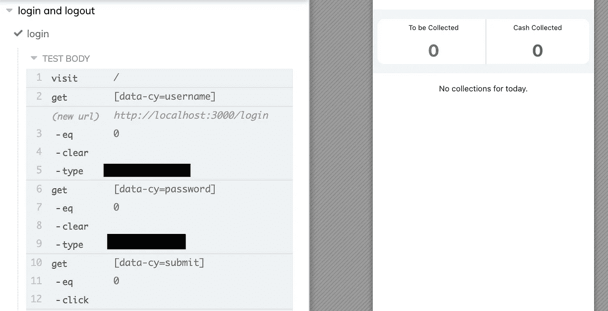

# 用 Cypress 编写 React 应用的 e2e 测试

> 原文：<https://blog.devgenius.io/writing-e2e-tests-for-react-apps-in-cypress-47bf9d232d2?source=collection_archive---------1----------------------->


自动化测试

软件测试在软件开发过程中起着至关重要的作用。我喜欢伟大的亚里士多德下面的这句话，它适用于现代世界中作为软件开发人员的我们。

> “品质不是一种行为，而是一种习惯”——亚里士多德

忽视测试是一个常见的问题，作为开发人员，我们需要有意识地克服它。在这篇文章中，我将给你一个关于 Cypress 的简要概述，这是一个超级快速和直观的端到端测试 web 应用程序的方法。但是在我们学习 Cypress 之前，我们需要理解端到端测试到底是什么。

# 什么是端到端测试？

端到端测试用于测试应用程序的整个流程。端到端测试的目标是像最终用户一样与应用程序进行交互。手工端到端测试仍然在几个开发团队中实施。这意味着，QAs 和开发人员必须手动点击应用程序并测试其流程。正如您所预料的，这需要花费大量的时间，并且容易出错。我们可能很容易错过测试某些工作流程，并有未被发现的错误。

自动化端到端测试，通过模拟真实的用户场景，从头到尾测试一个应用程序。

良好的自动化端到端测试的好处包括:

*   在早期捕捉 bug
*   节省花费在手动测试上的时间
*   高质量软件

# 柏树是什么？

Cypress 是一个快速、简单、可靠的端到端测试框架，适用于在您的浏览器上运行的任何东西。 [Cypress](https://docs.cypress.io/guides/overview/why-cypress) 开源，用 JavaScript 编写。传统上，端到端测试通常更慢，更昂贵。有了 Cypress，端到端的测试体验有了显著的改善。

Cypress 提供了完整的端到端测试体验，可以测试在浏览器上运行的任何东西

柏树的好处:

*   更快的
*   简单设置
*   易于编写和运行测试
*   总的来说，开发团队编写端到端测试的成本更低。

Cypress 提供了一些很棒的功能，比如时间旅行调试，自动等待，还有截图和视频。

# Cypress 设置

使用 Cypress 进行设置非常简单。要将 Cypress 集成到您的项目中，您可以使用下面的命令安装它。根据你是使用 *npm* 还是 *yarn* 你可以使用任何一个命令来安装。

```
npm install cypress --save-dev
or
yarn add cypress --dev
```

在 VS 代码上，有一个很棒的 Cypress 插件，名为 [Cypress Snippets](https://marketplace.visualstudio.com/items?itemName=andrew-codes.cypress-snippets) 。确保安装它，并且它可以在 VS 代码中为您的 Cypress 代码提供代码片段。

默认情况下，如果您在现有项目中集成 Cypress，它会在主 **cypress** 文件夹中生成子文件夹。文件夹结构如下图所示，包含夹具、集成、插件和支持的文件夹。


柏树文件夹结构

集成文件夹是您添加 Cypress 测试文件的地方。您会注意到 integration 文件夹有两个子文件夹，它们基本上是 cypress 提供给您参考的示例测试。

接下来，您会注意到项目根目录下的 Cypress.json 文件。您可以在这里为 cypress 添加全局配置。我已经设置了一个基本 url 属性并排除了示例测试文件夹。


Cypress 配置

Cypress 建议我们使用“data-cy”属性来定位元素。所以我们基本上添加了一个函数，它将根据元素的属性“data-cy”来获取元素。我已经在我的 React 应用程序中添加了这些属性，如下所示。


数据周期属性

在编写测试之前，我将添加一个自定义命令，这将为我们节省大量时间。在支持文件夹中，您会发现一个名为“commands.js”的文件。添加以下内容。

```
Cypress.Commands.add('getByTestId', function (id, index = 0) {
       cy.get(`[data-cy=${id}]`).eq(index);
});
```

“get”命令获取具有此属性的元素数组。因此，通过提供默认索引，我确保总是获取第一个元素，以防万一，同时如果需要，还可以获取另一个具有不同索引的元素。

# 编写您的第一个 e2e 测试

我已经在 localhost: 3000 上运行了一个 React 应用程序，它具有登录和注销功能。因此，让我们编写一个 e2e 测试来访问本地主机，登录然后注销。在集成文件夹中，创建一个扩展名为“. spec.js”的规范文件。我把它命名为“登录和注销. spec.js”。

```
/// <reference types="cypress" /> describe('login and logout', () => {
   it('login', () => {
   cy.visit('/');
   cy.getByTestId('username').type('user123');
   cy.getByTestId('password').type('pass123');
   cy.getByTestId('submit').click();
   });
});
```

注意，测试使用了像*这样的关键字来描述*和 *it。从其他测试框架来看，这些可能对你来说也很熟悉。它们来自另一个流行的测试框架 [Mocha](https://mochajs.org/) 。所有 Cypress 命令都以 *cy 开头。*后跟命令的名称。然后在你的终端中，运行“npx cypress open”来打开 Cypress GUI。这里你会看到你写的所有测试。点击任何人开始跑步。*


柏桂

您将会注意到 Cypress 测试运行的速度有多快，并且您还可以看到 Cypress 如何像真实用户一样与应用程序进行交互。在左侧，您可以看到正在执行的测试以及显示的每个命令和断言，在右侧，您可以看到浏览器打开并运行应用程序。



成功登录

**Cypress 命令是异步的。**理解 Cypress 命令在被调用时不做任何事情，而是将它们自己排队等待以后运行，这一点非常重要。这就是我们说 Cypress 命令是异步的意思。这意味着我们可以模拟 API 调用，而不需要添加任何特殊的东西。现在让我们添加注销测试。

```
/// <reference types="cypress" />describe('login and logout', () => {
it('login', () => {
   cy.visit('/');
   cy.getByTestId('username').type('user123');
   cy.getByTestId('password').type('pass123');
   cy.getByTestId('submit').click();
   });it('logout', () => {
  cy.getByTestId('home')
  .should('exist').then(function (home) {
        home.find('[data-cy=logout]').click();
  });
  cy.url().should('include', '/login');
  });});
```

请注意，我在这里使用了一个断言来确保我们在主页上，即 *cy.getByTestId('home ')。应该(' exist ')。*增加一个*。然后将()*添加到您的命令链中，这将导致使用回调函数解析前面的命令，并将生成的主题作为第一个参数。然后在点击注销按钮后，我们断言 url 包含“/login”以确保我们在登录屏幕上。


成功的 e2e 测试

这**结束了**编写我们的第一个 e2e 测试。当然，我们只是在这里用柏树做了些皮毛。简单就是用更少的输入完成更多的工作。这就是柏树提供的东西。这只是让你熟悉 Cypress 的一个基本介绍。你可以在这里查看所有的命令[。](https://docs.cypress.io/api/commands/find)