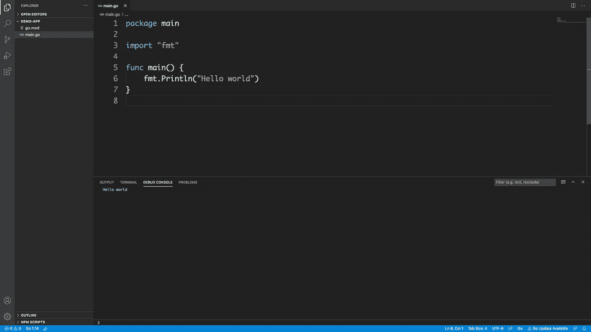
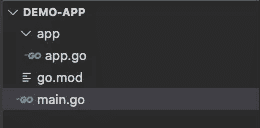
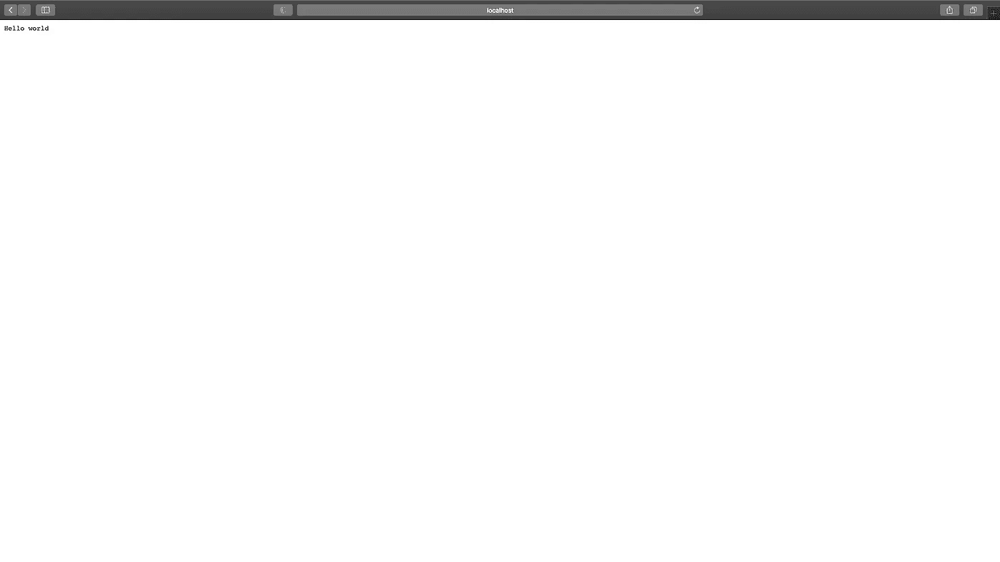

# 编写 First Go 后端应用程序

> 原文：<https://blog.devgenius.io/writing-first-go-backend-application-f57f6a307fb6?source=collection_archive---------6----------------------->


照片由 [Gia Oris](https://unsplash.com/@giabyte?utm_source=medium&utm_medium=referral) 在 [Unsplash](https://unsplash.com?utm_source=medium&utm_medium=referral) 上拍摄

Go 是一种很棒的语言，它有丰富的标准库，内置了与 **Goroutines** 和**通道**的并发性，以便在 **Goroutines 之间进行通信。Go 有利于快速完成工作，因为它配备了所需的资源。Go 编译速度很快，这对开发和调试阶段很有帮助。**

让我们深入研究一些代码(我不会在这里讨论 Go 安装，假设它已经安装了)。

让我们创建一个名为 **demo-app** 的新的空目录，它位于 **$GOPATH/src** ， **cd** 之外，然后在 shell 或 cmd 中运行下面的命令。

```
go mod init example.com/demo
```

这将创建一个 Go [**模块**](https://blog.golang.org/using-go-modules) 。 **go mod init** 创建了一个 **go.mod** 文件。让我们检查一下那个文件的内容。

```
cat go.modmodule example.com/demogo 1.14
```

现在在根目录下创建一个 main.go 文件。这是我们围棋 app 的入口。

```
package mainimport "fmt"func main() { fmt.Println("Hello world")}
```

让我们运行应用程序。这将按预期打印“Hello world”。在 shell 中运行下面的命令来运行应用程序。

```
go run main.go
```



图片由作者提供

让我们创造一些更实际的东西。创建一个包名 app。在里面创建 **app.go** 文件。其中有一个[**handler func**](https://golang.org/pkg/net/http/#HandlerFunc)**写着响应“Hello world”。[**handler func**](https://golang.org/pkg/net/http/#HandlerFunc)**设置有[**servem UX**](https://golang.org/pkg/net/http/#ServeMux)**带图案“/”。******

******更新后的 **main.go** 文件如下。******

****下面是 app 结构。****

********

****图片由作者提供****

****让我们运行应用程序。这一次应用程序将在 [http://localhost:3000/](http://localhost:3000/) 上打印“Hello world”****

********

****图片由作者提供****

****感谢阅读。如果你喜欢这个帖子，请给一些掌声。****