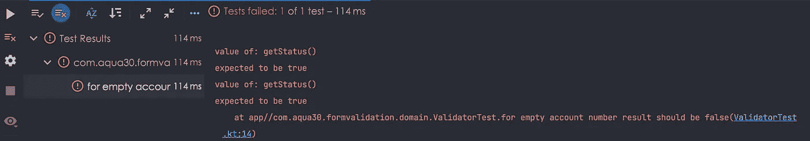

# 用 Android 编写本地测试——测试基础

> 原文：<https://blog.devgenius.io/writing-local-tests-in-android-testing-fundamentals-i-bf8e7e9bfc2c?source=collection_archive---------2----------------------->

## Android 测试教程

## 测试一下才相信！

来源:https://www.clouddefense.ai/

嗯！我们大多数人都知道，我们编写的代码需要进行单元测试，但并不是所有人都遵循这个观念。如果我举我自己的例子，那么我曾经很困惑为什么我们要做单元测试，当我们可以手动地做而不需要写代码的时候。当我开始了解它时，它变得比我想象的更有趣。

> 如果你还没有开始，现在正是时候！

在这篇文章中，我们将探索

1.  单元测试背后的想法？
2.  考什么？
3.  什么是本地测试？
4.  如何构建本地测试？

所以让我们开始回答问题。

## 单元测试背后的思想

假设我们已经编写了一个简单的单页应用程序，我们想测试它是否按预期工作。我们开始手动操作。没问题。一切都好。

现在，我们在应用程序中添加了 10 个新功能，代码库变得更大，功能变得复杂。我们再次开始测试，但这一次，在不同的设备上测试每个可能的用户流并不容易。那我们现在怎么办？

这就是我们进入单元测试世界的地方，它自动化了这个测试过程，并且能够独立地测试代码中的不同单元。这更快、更可靠，并且正确地通知我们用户可能遇到的错误。比方说，如果特性集不断增加，但我们确保为我们的代码库编写足够多的测试用例，那么这也有助于防止回归错误。

所以单元测试的想法是保持你的代码没有 bug 并且健康。

## 考什么？

嗯！这取决于我们项目所需的各种因素和测试类型。但本质上，在任何应用中，我们都应该考虑为

*   查看模型
*   数据层类，例如存储库
*   领域层类，例如用例、交互器
*   助手或实用程序类

我们还应该考虑涵盖不太容易捕捉的边缘情况。根据谷歌文档:

*   使用负数、零和边界条件的数学运算
*   所有可能的网络连接错误。
*   损坏的数据，如格式错误的 JSON。
*   保存到文件时模拟满存储。
*   在进程中间重新创建的对象(如设备旋转时的活动)。

我们还应该考虑为我们的 UI 交互和流程编写测试。

## 什么是本地测试？

Android 中的本地测试是那些可以

*   在不需要实际 android 设备或仿真器的系统上进行测试
*   在 JVM 上运行

本地测试速度更快，因为它们不需要实际的设备部署。我们可以孤立地测试小段代码。特别是对于业务逻辑，这些测试非常有帮助。

本地测试的位置在 ***测试*** 文件夹下，如图所示。

## 如何构建本地测试？

最后，让我们构建一些本地测试。

在 build.gradle 中添加 JUnit 和 Truth 库的依赖项

JUnit 用于单元测试支持。
Truth 是 google 推荐的库。它的代码打字更快，更容易阅读，API 也更简单。

现在考虑我们之前构建的[表单应用程序](https://github.com/aqua30/FormValidation)。让我们为提供验证支持的验证器对象编写本地测试。

看一下验证器对象。

我们看到四种不同的验证函数。让我们从验证账号功能开始。

> 当帐号不为空且超过 5 位数时，验证成功。

这意味着我们可以编写通过测试的测试:

*   一个空帐户，并期望返回结果状态为 False。这个测试应该通过，因为我们期望函数有正确的行为。如果它返回 true，那么测试将会失败，因为这不是我们期望从这个验证器函数得到的正确输出。
*   少于 5 位数的帐户，并期望返回结果状态为 False。这个测试应该通过，因为我们期望函数有正确的行为。如果它返回 true，那么测试将会失败，因为这不是我们期望从这个验证器函数得到的正确输出。

好了，现在我们知道要测试什么了。我们先设置一个测试类。为此，右击类名并点击 ***创建测试。***

这将在 test src 文件夹中创建一个名为 ValidatorTest.kt 的测试类。

第 1 行:我们将这个 ***测试*** 注释放在每个函数上，使其成为一个测试用例。这是从 JUnit 库导入的。

第 2 行:在本地测试中，我们可以通过将函数名放在 **``** 下来提供一个普通的字符串。

第 3 行:我们传递一个空字符串并保存结果。

第 4 行: ***断言*** 是真值库提供的 api，使用它我们说检查结果状态是否为假。如果它真的为假，那么我们的测试用例就通过了，因为这是它从结果状态 ***isFalse()*** 中所期望的。

我们可以通过单击 Run ValidatorTest 来运行它，如下所示。

结果将会是

同样，如果测试失败，它会告诉我们原因，如图所示

当结果为假时，将期望值更改为真

下面是两种情况。从测试用例或者从验证器函数中改变期望，然后进行试验。

输出:

哦耶！！我们成功地编写了测试，并在 24 毫秒内检查了有效性。您可以自己编写其他功能的测试用例，并进行测试。如果你被困在某个地方，请告诉我。

您可以在单元测试分支中签出这段代码。

 [## 单元测试时的 GitHub - aqua30/FormValidation

### 这个示例项目演示了如何在组件和视图模型之间实现清晰和更好的交互。uiState…

github.com](https://github.com/aqua30/FormValidation/tree/unit-testing) 

唷！这将足以作为一个良好的开端。我们将在以后的文章中继续测试。

# 有奖阅读

*   [房间数据库测试](/testing-room-database-with-coroutines-and-flows-testing-fundamentals-iii-5f6c3b9e4c94)
*   [如何在 Android 中查看模型测试](/writing-viewmodel-tests-in-android-testing-fundamentals-ii-5bc44efa4a39)

# 目前就这些了！敬请期待！

与我联系(如果内容对您有帮助),请访问

*   [中等](https://saurabhpant.medium.com/)
*   [GitHub](https://github.com/aqua30)
*   [推特](https://twitter.com/saurabh30pant)
*   [领英](https://www.linkedin.com/in/saurabh-pant-44619057/)

订阅电子邮件，同步了解更多关于 Android/IOS/Backend/Web 的有趣话题。

直到下一次…

干杯！