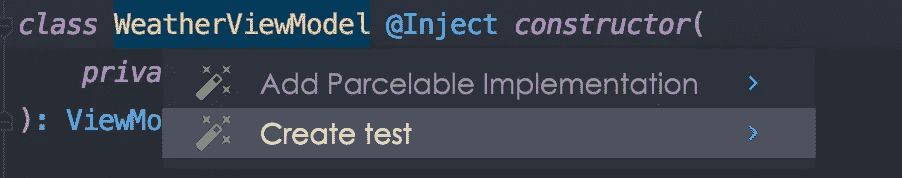

# 用 Android 编写视图模型测试——测试基础

> 原文：<https://blog.devgenius.io/writing-viewmodel-tests-in-android-testing-fundamentals-ii-5bc44efa4a39?source=collection_archive---------1----------------------->

## Android 测试教程

## 不要有压力！只是测试！


来源:Getty Images/iStockphoto

Android 中最常见的用例之一是拥有一个视图模型，在这个模型中我们调用一个 api 并观察它的响应。然后我们处理响应并更新我们的 UI 状态。因为这是一个非常常见的场景，所以对其进行测试也变得至关重要。在这个场景中，我们将看到如何为我们的视图模型编写测试用例。

> 如果你想了解如何在 Android 中设置本地测试，请点击阅读[。](/writing-local-tests-in-android-testing-fundamentals-i-bf8e7e9bfc2c)

## 建立

在本文中，我们将用分支 ***单元测试*** 来引用[domaineardemo](https://github.com/aqua30/WeatherDomainLayerSampleApp/tree/unit-testing)项目。如果我们看看代码中的天气视图模型，它接受一个用例参数，用例处理 api 数据并发出一个类型为 ***的流资源<天气数据>。***

为了简单起见，我省略了 hilt 注释和多个注入的存储库，但是您可以参考项目来找到确切的代码。

好吧！另一个需要注意的要点是，视图模型测试用例最好写在 ***test*** 文件夹下，而不是写在 ***androidTest*** 文件夹下。

现在我们已经知道了设置，接下来右键单击视图模型类名并生成测试类。



现在，首先要知道我们要测试什么。在我们的例子中，我们需要测试这一点

*   对于成功资源，UI 状态下的 ***数据*** 不应为空
*   UI 状态下的 ***数据*** 应该为空&***is loading***应该为真才能加载资源
*   UI 状态下的 ***数据*** 应为空&***hasError***应为真&***Error message***应为错误资源的错误

因此，我们将函数命名如下:

到目前为止一切顺利。现在我们看到我们的用例是一个有一些真实数据流入的接口。但是为了测试我们的视图模型，我们不需要处理这些真实的数据。相反，我们需要一些真实数据的模拟。那么我们该怎么办呢？

## 假用例

嗯！我们将为视图模型创建一个原始用例的伪实现，它将为我们提供传递到流中的内容的控制，因此我们将能够相应地评估我们的 UI 状态。

让我们看看这个假的实现。

> 第 3 行:我们定义了一个流，它将返回与我们最初的用例实现相同的假流。
> 
> 第 5 行:emit suspend 函数将让我们定义我们想要从假流中收集什么。
> 
> 第 7 行:fetch 函数简单地返回我们的假流。

我们现在回到我们的视图模型测试类，这里有两件事情需要注意

1.  在测试中启动协程
2.  评估测试中的流程

为了启动协程，我们需要一个测试协程作用域，我们可以通过添加一个依赖项来提供它

```
testImplementation "org.jetbrains.kotlinx:kotlinx-coroutines-test:1.5.2"
```

然后使用测试协程生成器 ***、运行测试*** 如下

代码非常容易理解。我们只是简单地将假用例传递给视图模型，然后发出一个成功资源。然后我们检查是否在我们的 UI 状态中获得了数据。这是因为在视图模型中，我们将数据存储到成功资源的 UI 状态中。

```
*is* Resource.Success -> {
    _weatherState.value = WeatherScreenState(
        data = resource.data
    )
}
```

到目前为止，如果我们运行这个测试，它将会异常失败

它说主调度程序无法初始化。

> 发生这种情况是因为我们处于测试环境中，包装 Android UI 线程的主调度程序将不可用，因为这些测试是在本地 JVM 而不是 Android 设备上执行的。因此，在启动协程之前，我们需要将 Dispatcher 设置为 Test Dispatcher。

```
Dispatchers.*setMain*(*UnconfinedTestDispatcher*())
```

好吧，那么，让我们解决这个问题，并再次运行测试。


上述测试案例的结果

哇哦。我们成功了。让我们编写其余的测试用例，整个测试类如下所示

我们在 之前的注释 ***下包装了每个测试要完成的公共设置，这将防止代码的重复。到目前为止一切顺利。我们可以运行我们的三个测试，它们都通过了。***

## 奖金:规则

我们知道主调度程序必须切换到测试调度程序来运行我们的测试。同样，我们还可以创建一个规则，在该规则下，我们可以声明将 dispatcher 更改为 test one，并在完成后重置。

要定义的简单规则类。现在，这条规则可以添加到我们的视图模型测试类中，如下所示

```
@get: Rule
*val* dispatcherRule = TestDispatcherRule()
```

而我们的 ***在*** 成立之前现在将被视为

```
@Before
*fun* setUp() {
    fakeWeatherUseCase = FakeWeatherUseCase()
    viewModel = WeatherViewModel(fakeWeatherUseCase)
}
```

其余保持不变，运行所有测试将产生如下结果


Bamn！我们刚刚测试了观察流和更新 UI 状态的视图模型。感觉棒极了。您可以尝试尝试更多的场景，并对它们进行测试，以便对您编写的代码更有信心。

请在以下网址查看完整代码:

[](https://github.com/aqua30/WeatherDomainLayerSampleApp/tree/unit-testing) [## 单元测试时的 GitHub-aqua 30/weatherdomainsersampleapp

### 此时您不能执行该操作。您已使用另一个标签页或窗口登录。您已在另一个选项卡中注销，或者…

github.com](https://github.com/aqua30/WeatherDomainLayerSampleApp/tree/unit-testing) 

# 有奖阅读

*   [房间数据库测试](/testing-room-database-with-coroutines-and-flows-testing-fundamentals-iii-5f6c3b9e4c94)
*   [如何在 Android 中编写本地测试](/writing-viewmodel-tests-in-android-testing-fundamentals-ii-5bc44efa4a39)

# 目前就这些了！敬请期待！

与我联系(如果内容对您有帮助),请访问

*   [中等](https://saurabhpant.medium.com/)
*   [GitHub](https://github.com/aqua30)
*   [推特](https://twitter.com/saurabh30pant)
*   [领英](https://www.linkedin.com/in/saurabh-pant-44619057/)

订阅电子邮件，同步了解更多关于 Android/IOS/Backend/Web 的有趣话题。

直到下一次…

干杯！