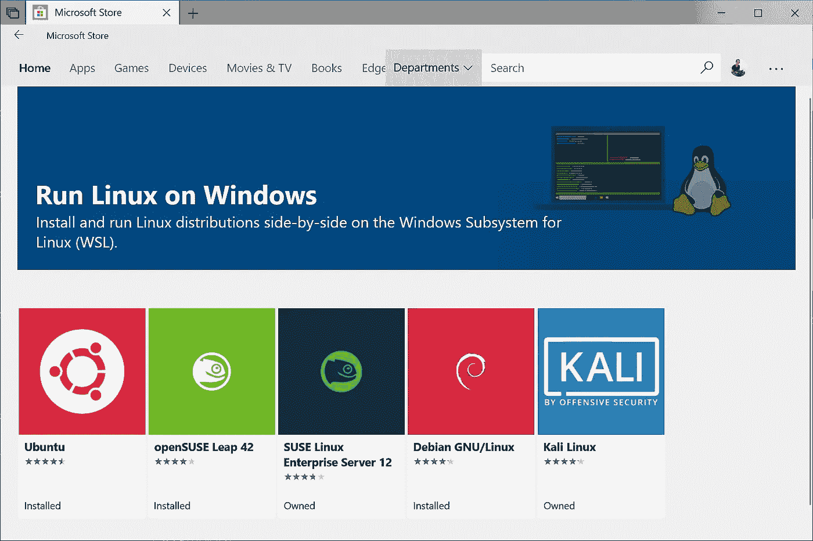

# WSL Ubuntu 升级到 Disco Dingo 20.04

> 原文：<https://blog.devgenius.io/wsl-ubuntu-upgrade-to-disco-dingo-19-04-b4abff20452d?source=collection_archive---------0----------------------->

## 默认情况下，安装 Ubuntu 微软应用程序后，Ubuntu 将安装最新稳定的 Ubuntu LTS 版本



默认情况下，安装 Ubuntu 微软应用程序后，Ubuntu 将安装最新稳定的 Ubuntu LTS 版本。但是，如果你想切换到最新的非 LTS 版本，在这种情况下，19.04 版本的迪斯科丁哥你可以运行以下命令

```
sudo apt-get upgradesudo do-release-upgrade
```

这将要求你在**/etc/update-manager/release-upgrades**更新一个文件，并且**提示=正常**

```
nano /etc/update-manager/release-upgrades 
```

更新提示=正常保存并退出

```
do-release-upgrade
```

这将提示安装最新版本的 Ubuntu，并要求重新启动 WSL，这需要通过 PowerShell 管理模式来完成

```
Restart-Service LxssManager
```

发出以下命令完成安装后，控制台上应该会出现最新的 Ubuntu 版本

```
XXX@DESKTOP-17V4FVN:/home/XXX# lsb_release -a
No LSB modules are available.
Distributor ID: Ubuntu
Description:    Ubuntu 20.04
Release:        20.04
Codename:       Focal Fossa
```