# WTH 是码头工人，我为什么需要它？

> 原文：<https://blog.devgenius.io/wth-is-docker-and-why-do-i-need-it-1f76deb827f9?source=collection_archive---------12----------------------->

如果你曾经在软件团队或任何应用程序开发项目中声称它在我的机器上绝对运行良好，我不明白为什么它在这里不工作，然后重新开始配置。

在许多情况下，这是一个主要的缺点，为了解决这个问题，**码头工人**出现了。

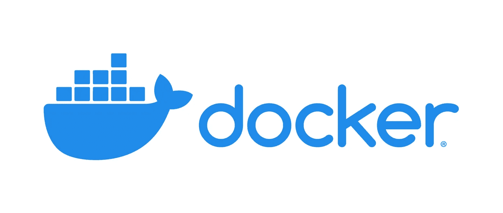

图片由[提供**ondat**](https://www.ondat.io/blog/persistent-storage-containers-stateful-apps-docker)

那么， **Docker** 到底是什么？它是一组平台即服务产品，使用**操作系统级虚拟化**来交付称为容器的软件包中的软件。

因为容器本身有所有需要的库和资源，只有**不需要其他配置**，这使它成为一个巨大的入口，也是你需要它的原因**。**

**在本文中，我们将讨论 docker 的 3 个组件— **Dockerfile、docker image** 、**、以及**容器**。****

****Dockerfile** —这是构建 **docker 形象**的**蓝图**。**

****docker 镜像** —它是运行 docker **容器**的**模板**。**

****容器** —是 **docker-image 的一个运行进程。****

**现在，在这一点上，你可能需要更多关于码头工人**集装箱**和码头工人**图像的**澄清**。****

****Docker image** 是一个只读的惰性模板，附带了部署容器的说明。在 Docker 中，一切基本上都围绕着图像。一个映像由一组文件(或层)组成，这些文件将所有必需的东西打包在一起，例如建立一个完整的功能性容器环境所需的**依赖项、源代码、**和**库**。**

**一个 **Docker 容器**是一个虚拟化的运行时环境，它提供**隔离功能**，用于将应用程序的执行与基础系统分离开来。**

# **Dockerfile 文件**

**这是对提供蓝图的应用程序进行归档的起点，因此我将借助一个例子来讨论这个问题，在这个例子中，我将对一个 FastAPI 应用程序进行归档。**

## ****所用 Dockerfile 概述****

```
**FROM** python:**3.10**

**WORKDIR** /api

**COPY** requirements.txt **./**

**RUN** python3 -m pip install --upgrade **https://storage.googleapis.com/tensorflow/linux/cpu/tensorflow_cpu-2.10.0-cp310-cp310-manylinux_2_17_x86_64.manylinux2014_x86_64.whl** 
**RUN** pip install **-r** requirements.txt

COPY **. .**

**EXPOSE** 8000**:**8000

**CMD** ["uvicorn", "**api:summary_api**", "--host", "0.0.0.0", "--port", "8000"]
```

**让我们把它分成几部分，一个一个地看，**

## **基础图像**

```
**FROM** python:**3**
```

**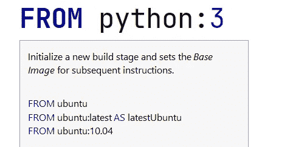**

**由 **JetBrains PyCharm IDE** 提供的解释**

**它是构建图像的**基础图像**，根据它将执行下一个**层**(代码)。**

**本例中是 **python** 。**

## **工作目录**

```
**WORKDIR /**api
```

**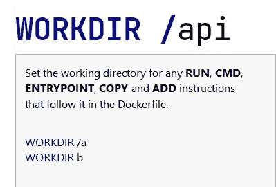**

**由 **JetBrains PyCharm IDE** 提供的解释**

**这是一个工作目录，所有的项目文件和说明，代码等。将被存储。**

**在这个例子中，它是 **api** 。**

## **将文件复制到工作目录**

```
**COPY** requirements.txt .**/**
```

**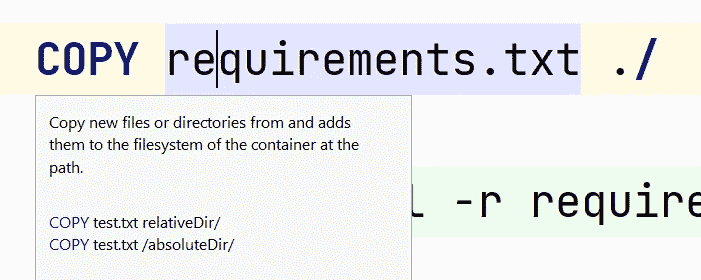**

**由 **JetBrains PyCharm IDE** 提供的解释**

**它用于从项目目录中复制文件和文件夹；在这种情况下， **FastAPI** 将被移动到**容器**文件系统中；它首先获取**要移动的文件/目录路径**，然后获取容器的**路径**。**

**在本例中， **requirements.txt** 文件被移动到 **api/** 目录。**

## **运行命令**

```
**RUN** pip install **-**r requirements.txt
```

**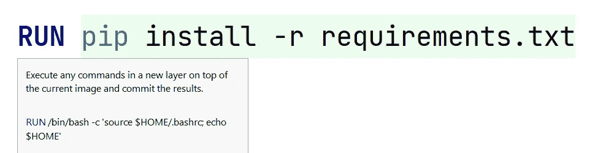**

**由 **JetBrains PyCharm IDE** 提供的解释**

**它用于在一个新层(每个代码行是一个层)上运行命令，这个新层是从基本映像获取的，并提交结果(不像很多人)。**

**在这个例子中，运行 **pip** python 命令，其中**从 requirements.txt 中读取**需求，然后**安装**它们。**

## **将文件复制到工作目录**

```
**COPY** . .
```

**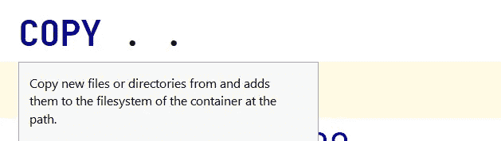**

**由 **JetBrains PyCharm IDE** 提供的解释**

**如前所述，它用于 **Docker 中的**复制**命令。****

**在这个例子中，**所有****新**创建的文件和目录都被**复制**到容器文件系统中。**

## **暴露端口**

```
**EXPOSE** 8000**:**8000
```

**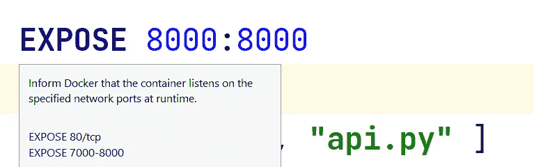**

**由 **JetBrains PyCharm IDE** 提供的解释**

****EXPOSE** 命令在 Docker **容器内使用**指定的协议**暴露一个**特定端口**。****

**在这个例子中，容器被**暴露**到容器连接的特定端口 **8000** 。**

## **命令执行**

```
**CMD** ["uvicorn", "**api:summary_api**", "--host", "0.0.0.0", "--port", "8000"]
```

**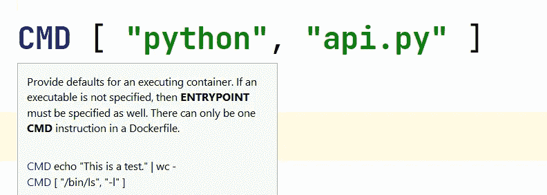**

**由 **JetBrains PyCharm IDE** 提供的解释**

****CMD** 命令用于执行图像中的**命令**。需要注意的是，在一个**卷宗**中只能有**一个**(由于新的人口法，中国的家庭也是如此)。**

**在这个例子中，**uvicon**(ASGI*(异步服务器网关接口)兼容的 web 服务器。它处理来自浏览器或 API 客户端的 web 连接，然后允许 FastAPI 服务于实际的请求。运行*命令，启动端口 **8000 上的**服务器**。****

# **使用 Dockerfile 构建 Docker 映像**

**现在蓝图来了，谁不喜欢蓝图？问问建筑师。**

**但正如老师所说，这将在考试中出现，所以必须说明官方的定义。又来了， **Docker image** 是一个只读模板，它包含一组用于创建可以在 Docker 平台上运行的**容器**的指令。**

**它提供了一种方便的方式来打包应用程序和预配置的服务器环境，您可以将其用于您自己的私人用途或与其他 Docker 用户共享。**

**Docker 图片也是第一次使用 Docker 的人的起点。**

**在下面的例子中，使用 **build** 命令(参见我在那里所做的)和 **-t** (tag)构建 docker 映像，该命令指定了映像的**标签**和 **docker hub 的名称** name(在[https://hub.docker.com/](https://hub.docker.com/)上注册)，后跟映像名称及其在**之后的标签:**在本例中为 **1.0** ，并选择**

****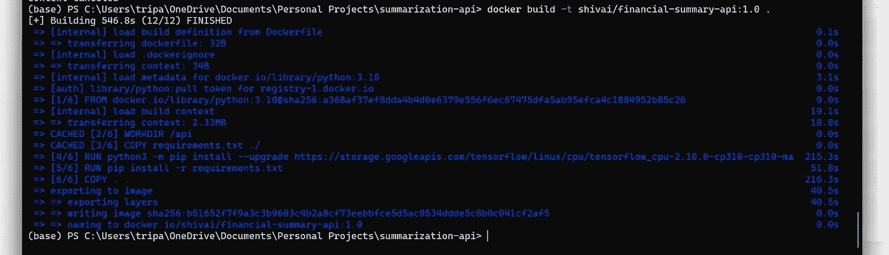****

****建立码头形象****

****现在，在映像构建完成后，应该是**运行** ( duh)，我们使用**运行**命令和 **-p** ( port)来完成，它首先获取将运行**本地**机器中指定端口的端口(本例中为 8000)和**容器**端口(8000 ),之后是 **-i** ( image ),它获取**映像名称******

****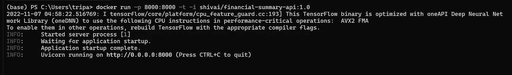****

****运行 Docker 图像****

****我可以在互联网上的其他应用程序中需要这张图像，或者我需要检索它，所以我该怎么办呢我**拉**，但首先我必须**推**，就像投资一样首先你必须投资，然后只有你才能获得回报，因此使用**推**命令，推 tripathiadityaprakash(我的 docker hub 名称)/financial-summary-API(图像名称):1.0(标签)。****

****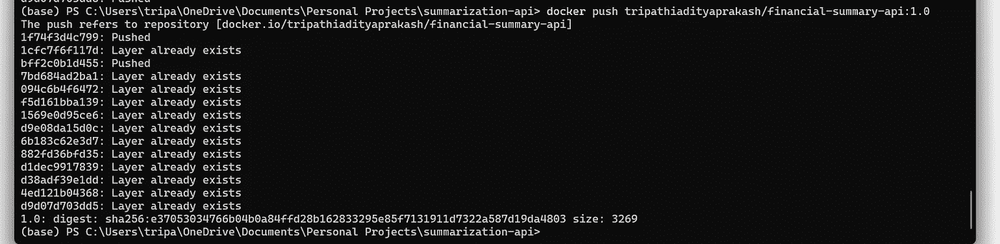****

****将 Docker 图像推送到 **DockerHub******

****现在它被推送了，我可以随时使用跟在**映像名称**后面的 **pull** 命令来拉它。****

# ****Docker 容器(docker-compose)和共享卷****

****使用 Docker **容器**确保软件无论部署在哪里都以同样的方式**运行，因为它的运行时环境是**一致的**。******

**一般来说，Docker 容器是短暂的，只要容器中发出的命令完成，它就会运行。**

**然而，有时应用程序需要共享对数据的访问或在容器被删除后持久化数据，因此，为了这个目的， **docker 卷**被创建，其具有对数据的**持久化**访问。**

```
docker **volume create** --name DataVolume1
```

**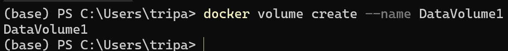**

**Volume 命令创建一个 docker **卷**，其名称在此指定为 **DataVolume1** 。**

```
**--rm** (automatically delete it when we exit)
**-v** (mount new volume, name of volume absolute path to where the  volume should appear inside the container, if it doesn't exist, they've created.)(/path:/path/in/container - mounts host dir /path at /path/in/container , path:/path/in/container - creates a volume named path with no relationship, to host)
**-t** ( terminal)
**-i** ( interact with it)
**--name** (identify the container)
```

**现在运行一个容器并将共享卷(DataVolume1)与 mongo (image)连接起来，并使用 bash 在 bash 命令行中运行。**

****:** /datavolume1(卷应该装入容器的路径)。**

```
docker **run** **-**ti **--**rm **-**v DataVolume1**:**/datavolume1 mongo **bash**
```

**现在来看一下 **docker-compose，**它是用于将多个容器作为单个服务运行的。**

**我们将使用版本 **3** 的合成文件格式。(撰写本文时的最新消息)**

**合成文件是一个定义了**服务**、**网络**和**卷的 **YAML** 文件。****

**每个服务定义都包含一个应用于该服务的每个容器的配置(就像 docker run 的命令行参数)。**

## **使用的 docker-compose 文件概述**

```
version: '3'

services:
  web_app:
    build:
      context: .
      dockerfile: Dockerfile
    image: tripathiadityaprakash/financial-summary-api:1.0
    env_file:
      - .env
    depends_on:
      - db
    ports:
      - "8000:8000"
  db:
    image: mongo
    env_file:
      - .env
```

**让我们把它分成几部分，一个一个地看，**

# **版本**

**指定合成文件的版本。**

**本例中为 **3** 。**

# **服务**

**它指定了容器内部的各种服务。**

**在这个例子中，我为 **MongoDB** 数据库准备了**两个**服务数据库，为我的 web 应用程序准备了一个 **FastAPI** 。**

# **建设**

**在生成时应用的配置选项。**

****上下文**:用于指定 Dockerfile 的路径或 git repo 的 URL。**

****Dockerfile** :这是一个备选的构建备选文件。**

# **图像**

**指定启动容器的图像。**

**在这个例子中，**两个图像**是它们来自 **MongoDB** 数据库服务的 mongo 和用于 web 应用服务的 tripathiadityaprakash/**financial-summary-API**:1.0。**

# **环境文件**

**从文件中添加环境变量。**

**在这个例子中，像 **MONGO_HOST** 这样的环境变量是从**添加的。env** 文件。**

# **依赖于**

**表达服务之间的依赖关系。服务按照**依赖**的顺序启动，如 db 服务**在 web-app 服务**之前启动，停止时**先停止**。**

**Docker 各种**命令**的简明形式如下**

**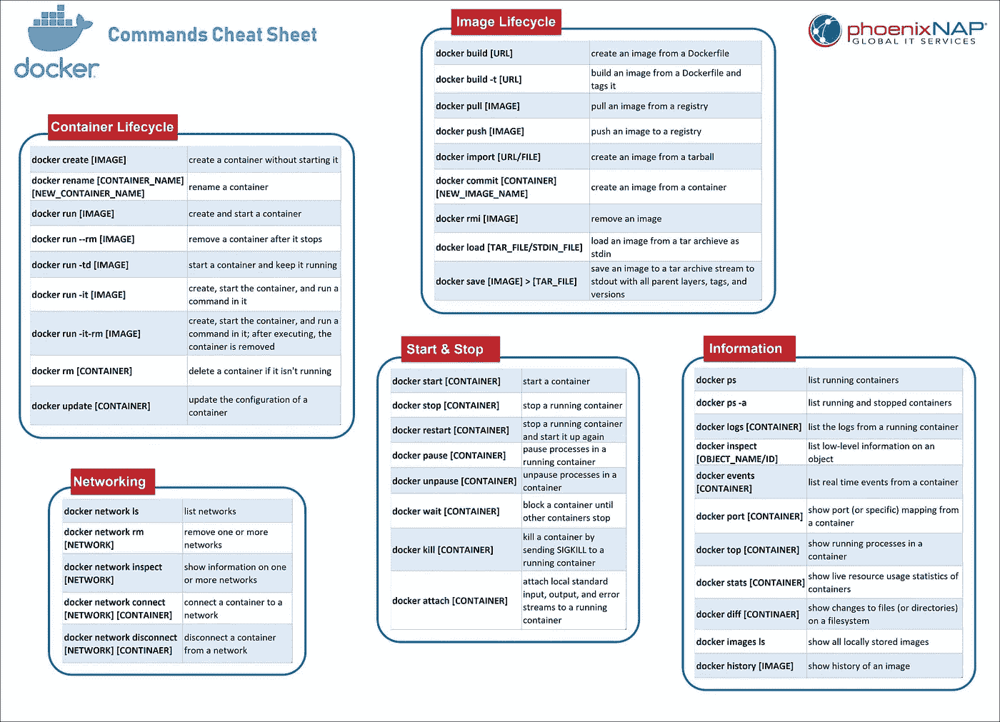**

**cheat sheet Credit[**phoenix nap**](https://phoenixnap.com/kb/list-of-docker-commands-cheat-sheet)**

> *****参考文献*****
> 
> **[https://docs . docker . com/compose/compose-file/compose-file-v3/# depends _ on](https://docs.docker.com/compose/compose-file/compose-file-v3/#depends_on)**
> 
> **[https://phoenix nap . com/kb/list-of-docker-commands-cheat-sheet](https://phoenixnap.com/kb/list-of-docker-commands-cheat-sheet)**

**如果你喜欢这篇文章，跟我来，你也可以做下面的事情。**

**让我们连线上**LinkedIn**:[https://www.linkedin.com/in/tripathiadityaprakash](https://www.linkedin.com/in/tripathiadityaprakash)**

**或者我的**网站**:**

**[https://tripathiaditya.netlify.app/](https://tripathiaditya.netlify.app/)**